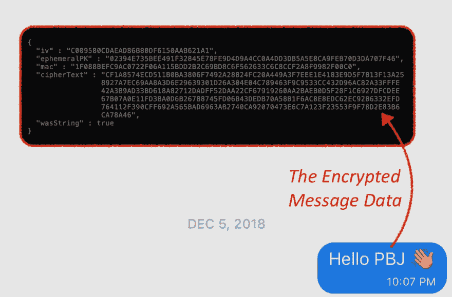

# 我们和 10 万美元的奖金之间还有一件事…

> 原文：<https://dev.to/prabhaav/one-thing-stood-between-us-and-a-100000-prize--3e6p>

[鬼头鬼脑。IM](https://www.stealthy.im) 建立在 Blockstack 之上，block stack 是一个分散的平台，在比特币区块链、椭圆曲线加密和 GAIA(一个分散的存储系统)上提供身份。

2018 年 4 月，Blockstack 发布了 Android 和 iOS 的移动 API，使我们能够为手机构建隐形 IM。天真地，我们认为一切都将开箱即用，但很快意识到至少有一个主要问题。Blockstack 的 iOS API 还不支持椭圆曲线加密功能，如果没有这些功能，手机上的隐形即时消息功能就形同虚设。这是因为隐身的所有个人信息都是加密的，如下图 1.0 所示。

[](https://res.cloudinary.com/practicaldev/image/fetch/s--C28X1JiU--/c_limit%2Cf_auto%2Cfl_progressive%2Cq_auto%2Cw_880/https://cdn-images-1.medium.com/max/1600/1%2ATblhpoVF7QawM27oZm1YUA.png)

Blockstack 的 iOS 平台 API 是在 Swift 中开发的，当时没有任何 Swift 库提供直接兼容的椭圆曲线集成加密系统(ECIES)加密。使用 Blockstack 的 Javascript Web 平台的临时解决方案也是不可能的，因为它使用的节点加密库组件不能在 Blockstack 的 iOS API 的 iOS Javascript 环境中工作。

我们应该等到数据块堆栈团队能够解决这种情况吗？我们为这个决定挣扎了一段时间，但最终被选中参加 [Techcrunch Disrupt 2018](https://techcrunch.com/2018/09/05/stealthy-wants-to-become-the-wechat-of-blockchain-apps) 为我们做出了决定。我们现在必须在 9 月初之前完成我们的移动产品开发，这将获得大量的媒体曝光，并给我们赢得 100，000 美元的机会。我们不能等待一个超出我们控制的解决方案。

几乎没有时间留给 9 月份的 Techcrunch 截止日期。研究 Blockstack ECIES Javascript 实现令人鼓舞——它清晰且相对简单。

## 区块堆叠 / [区块堆叠. js](https://github.com/blockstack/blockstack.js)

### 用于身份、授权和存储的 Blockstack JavaScript 库

<article class="markdown-body entry-content container-lg" itemprop="text">

# block stack . js[](https://circleci.com/gh/blockstack/blockstack.js/tree/master)[](https://www.npmjs.com/package/blockstack)[](https://www.npmjs.com/package/blockstack)[](https://www.npmjs.com/package/blockstack)[](http://slack.blockstack.org/)

注意:如果您正在寻找 Blockstack CLI repo，它已与 [Blockstack Core](https://github.com/blockstack/blockstack-core) 合并。

*   [安装](https://raw.githubusercontent.com/blockstack/blockstack.js/master/#installation)
*   [关于](https://raw.githubusercontent.com/blockstack/blockstack.js/master/#about)
*   [文档](https://raw.githubusercontent.com/blockstack/blockstack.js/master/#documentation)
*   [兼容性](https://raw.githubusercontent.com/blockstack/blockstack.js/master/#compatibility)
*   [投稿](https://raw.githubusercontent.com/blockstack/blockstack.js/master/#contributing)
*   [维护者](https://raw.githubusercontent.com/blockstack/blockstack.js/master/#maintainer)
*   [测试](https://raw.githubusercontent.com/blockstack/blockstack.js/master/#testing)
    *   [在浏览器中测试](https://raw.githubusercontent.com/blockstack/blockstack.js/master/#testing-in-a-browser)
*   [释放](https://raw.githubusercontent.com/blockstack/blockstack.js/master/#releasing)

## 装置

```
$ npm install blockstack 
```

### 将 blockstack.js 与 CDN 一起使用

您可以在不使用包管理器的情况下将`blockstack.js`作为脚本导入。要从 CDN 安全地使用 blockstack.js 的最新发行版，请在您的应用程序中使用以下脚本:

```
<script src="https://unpkg.com/blockstack@21.1.1/dist/blockstack.js" integrity="sha384-6xJImnB5DnmALzT1/h3Fg0Ub3ihjiFe3GJAaIBg2ogoaVb3bcu/mUq0hU+McdrA2" crossorigin="anonymous"></script>
```

*注意:这是作为独立(UMD)库捆绑的脚本，面向 ES6 (ECMAScript 2015)。*

## 关于

Blockstack JS 是一个用于配置文件/身份、认证和存储的库。

该库的身份验证部分可用于:

1.  创建身份验证请求
2.  创建身份验证响应

该库的配置文件/身份部分可用于:

1.  将 JSON 概要文件转换成加密签名的令牌
2.  恢复一个 JSON…

</article>

[View on GitHub](https://github.com/blockstack/blockstack.js)

值得一提的是，隐身公司的两位创始人都不是密码学专家——事实上，这对我们俩来说都是相对较新的东西。最初，似乎有可能在 iOS 上使用苹果自己的加密功能。Blockstack 的 ECIES 密码术以比特币流行的 SECP256K1 曲线为中心，苹果的图书馆支持这条曲线和[椭圆曲线密码术](https://en.bitcoin.it/wiki/Secp256k1)的某些方面。

然而，花了很多时间试图将用户的 Blockstack 公钥和私钥转换成正确的数据结构，以便与苹果的库一起工作。这个过程涉及反复试验和阅读苹果的开发者论坛和堆栈溢出——很大程度上是因为一些无所不包的错误消息，没有给出多少关于哪里出错的指示。最终，在阅读了苹果开发者论坛的常驻专家 Quinn“The Eskimo”的几篇帖子后，我们决定向他寻求帮助。总而言之，他基本上是说[“阅读苹果的代码”——这是个不错的建议](https://forums.developer.apple.com/message/316794#316794)。

在几天的时间里没有取得什么进展，克服了一小部分密码学学习曲线，并将公钥放入正确的苹果数据结构之后，是时候尝试一些别的东西了。对苹果系统和 Blockstack one 的进一步比较似乎证实了这一点，因为似乎会有更多的挑战。

这就是我们打破创业基本规则的时候。多年来，我们告诉朋友们永远不要加入用 C++工作的创业公司。不是反对这种语言，它只是需要高度的技巧，并且需要更长的时间来开发解决方案。然而，使用 C++有一个很好的理由:Crypto++库 T1。

Crypto++是一个免费的 C++加密库，有很多文档和例子。它维护得很好，甚至还有一个论坛，你可以在那里寻求支持。然而，Crypto++真正有趣的是原作者:

戴伟是一名计算机工程师，以比特币前身“b-money”的创造者和 Crypto++库的开发者而闻名。

他的 [b-money](http://www.weidai.com/bmoney.txt) 论文为比特币奠定了基础——1998 年**！工作证明、集体簿记和使用加密散列的认证都被描述。这篇论文在中本聪最初的比特币白皮书中被引用。**

 **有了更清晰的文档和一些有用的示例代码，我们创建了一个测试平台，使用桌面版本的 Stealthy 和一个原型 ECIES 解决方案使用 Crypto++。学习曲线的大部分是在熟悉数据类型和基本加密原理(即解压缩压缩密钥、导出共享密钥，以及将我们从 Blockstack ECIES 实现中理解的内容映射到 Crypto++论坛和文档中找到的示例)。

这花了大约四天的时间，但是现在我们已经有了一个原型，它可以和我们的桌面秘密版本交互地加密和解密数据。剩下的挑战是将这些加密方法植入隐形的 iOS 产品中。

[https://www.youtube.com/embed/fzOg9siQhps](https://www.youtube.com/embed/fzOg9siQhps)

这有点混乱，因为 Swift 和 Objective C 不直接允许您导入 C++代码。你必须用目标 C++来包装 C++。然后，可以从 Objective C 调用 Objective C++。然后，可以从 Objective C 导出 Objective c++，以反应隐形模式中使用的本机 JSX / Javascript 可调用函数。下图 2.0 说明了这种情况:

[](https://res.cloudinary.com/practicaldev/image/fetch/s--YPSD4Sne--/c_limit%2Cf_auto%2Cfl_progressive%2Cq_auto%2Cw_880/https://cdn-images-1.medium.com/max/1600/1%2AwrwMKkEknMlAoOu4Mk1adw.png)

我们的 Blockstack 兼容 Crypto++ ECIES 实现的 Github 存储库可以在这里找到:

## /[物种加密](https://github.com/stealthyinc/ECIES-Encryption)

### ECIES 密码在 SECP1256K1 曲线上的 Crypto++实现

<article class="markdown-body entry-content container-lg" itemprop="text">

# ECIES-加密

ECIES 密码在 SECP1256K1 曲线上的 Crypto++实现

</article>

[View on GitHub](https://github.com/stealthyinc/ECIES-Encryption)

虽然现在我们有了更多的经验，有许多事情我们可能会做得不同，但这项工作让我们在 Techcrunch Disrupt 2018 上发布了我们的移动产品。它允许我们的用户在我们的 iOS、Android 和桌面版本之间无缝、安全地发送和接收消息。

展望未来，我们希望从 Crypto++维护者那里得到关于我们实现的反馈，可能会提供一个完整的 ECIES 实现示例。

特别感谢维护和记录 Crypto++的人们。这是一个很棒的项目，我们发现它非常有用。**