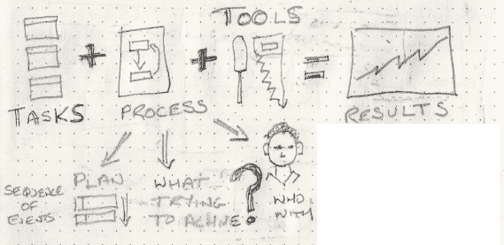

# 生活不是排练

> 原文：<https://dev.to/mark_nicol/life-is-not-a-rehearsal-18ab>

这些笔记是我在过去几年中参加的几门不同的时间管理课程的汇总。

## 时间管理不是关于时间

第一位有点元。很少有时间管理是关于时间的。它远不止是管理有助于您取得成果的三个组成部分:

**任务**是实际需要做的事情。管理它们就是要有一个系统来记录它们，理解它们，并在必要时把它们分解成更小的部分。

**流程**是你如何将任务从未开始转移到正在完成。管理流程分为:

*   **目标是什么**。我怎么知道什么时候结束。时间和质量限制是什么？
*   **要完成这项任务，这里必须发生的一系列事件**是什么？
*   **我需要谁的帮助**来完成这项工作？

设定具体的、可衡量的目标，或者协商时间表，是你可以用来管理*目标*的事情。创建一个计划，或者一个流程图，或者写一些测试，这些都是你可以用来帮助完成*事件序列*的事情。安排一些时间和同事在一起可能是【T4 的帮助】的一部分。

工具是完成任务的方式。所以学习编辑器快捷方式，安装 linter，自动化测试都是管理工具的方法。我没有衡量标准或确凿的证据来支持下一条经验法则，但是对可重用工具的任何投资很少会被浪费。当然，如果一项工作你已经做了两次，那么至少在这项工作通常花费的时间上投资优化工具是值得的。

**结果**应该是可衡量的。如果没有，你就不能绘制进度图。记录进步对于保持你自己的动力和决定下一次什么有效，什么可以改进都很重要。结果跟踪就像时间管理的单元测试。

## 我们中断这次广播...

好了，这就是上下文。接下来通常是关于打断。这是我在《注意力》上读到的一些有用的建议，我可能会写另一篇文章。我在这里要说的是，从管理你的生产力的角度来看，有一个区别很重要。

这是我控制范围内的干扰还是我无法控制的事情？

Covey/Eisenhower 网格和 focus 网格都将此作为一个轴，因为处理它们的策略不同。

1.  在你的控制范围内，你的最佳策略是管理它发生的时间和地点，谁参与其中，以及你给予它多少时间和关注。这也是任何自我管理策略的来源，比如关闭应用程序和提醒。这也包括任何你可以为下一次做出改变的工作。

    *   花时间寻找丢失的信息可能会建议改进您的系统。
    *   花在没有回报的过度优化上的时间可能是一个信号，表明你下次想让事情变得简单——或者至少问更多的问题。
    *   返工和快速修复可能会显示出你倾向于犯的那种错误，你想把某些东西放在适当的位置，作为下次检查的依据。
2.  **在你的控制之外**。这可能是因为人员或资源发生了变化。这里的经典场景是一个同事在关键时刻打电话请病假。这也可能是一种危机，如硬件故障。你最好的策略是尽你所能度过难关。你所杂耍的是你所有的*其他*工作发生的时间、地点、方式和人员。

大多数生产力系统关注第一点，因为你在这里做的事情最有影响力。在你能控制的事情上花费时间和注意力意味着你可以设定哪些事情是你优先考虑的。给你最好回报的东西。

### 帕累托原理

许多时间管理建议的下一个共同点是，这种转变不一定会对你的结果产生很大的影响。帕累托原则指出，你 80%的成果来自 20%的努力。你剩下的 20%的成果是你剩下的 80%的努力。

所以，即使你只能控制你 20%的时间和注意力，你也可以给你的结果带来 80%的不同。如果，这是一个棘手的问题，你选择了正确的 20%。

## 事件视界

你越能发现潜在的问题，计划和管理活动就越容易。

*   当事情发生变化或发现问题时，你越提前知道需要发生什么和什么是优先事项，就越容易做出调整。
*   你越了解你想要达到的目标，就越容易在任何时候专注于最佳利用你的时间。
*   如果你在任何类型的团队中工作，你的同事越了解你在哪里，你在做什么，你也越了解他们在哪里，他们在做什么，就越容易应对任何变化。

专注于这些领域中的任何一个，就像是把你能看到和反应的距离推出去。

这可以分为多个“流程”技能领域:

### 影响/团队合作

这不是让你随心所欲或者把你的决定强加给别人。团队合作的一个定义是:

“一个或几个人为了整体利益而做的工作”

这里的目标是确保合适的人在做工作——这可能涉及授权，并确保每个人都理解对他们的期望。因此，清晰的口头和书面沟通，清晰的共同优先事项，以及理解“完成”是什么样子。

最重要的是，它有清晰和公开讨论的空间。互相倾听和尊重。利用团队的全部经验和知识来共同决策。

### 物流

这是关于在正确的时间把人和资源放在正确的地方。其中一部分是关于计划出一系列可行的事件，然后在每一步跟踪它，并根据需要进行调整。这链接到下一个区域

### 明确目的和目标

这归结为两个问题。“我在干什么？”“我为什么要这么做”你的答案越具体，就越容易设定目标，也越容易说服他人帮助你获得你需要的资源或支持。有时你必须问几遍问题才能找到根本原因。

如果你不知道或者找不到任何一个问题的答案，那么很有可能你需要让别人来为你澄清，或者你需要问自己为什么要这样做。

### 一直在进步

无论你在做什么，都有可能做得更好。这里的关键技巧是避免自满，并愿意采纳或适应新的想法。“心如止水”或“心如海绵”经常被用来描述对世界的好奇和开放。固定的模式和惯例可能掩盖了更好的做事方式。任何变得“一切照旧”的事情都可能被自动化，或者被抛弃，或者你可以更上一层楼。

## 开发生产力系统

我在这里学到的大部分东西都是由别人为他们找到工作的方法形成的，比如大卫·艾伦的《成事》(GTD)或者富兰克林·柯维系统。我将试着把这些概括为可以调整以适合你的一般原则。

生产力系统有 5 个一般部分:

1.  一种在你想要或需要工作的时候组织工作的方式。这应该是从未来几个小时到未来几年在不同的细节水平和不同的时间框架水平上可以看到的东西(即某种形式的日历或计划)

2.  **人组织信息的一种方式**。你需要和谁谈？你需要和他们谈论什么事情？你有什么需要他们提供的吗？你如何与他们联系？

3.  **一堆笔记**。一个可引用的位置，包含您正在处理的任何工作项的当前信息。

4.  **一个杂乱的管道**,用于接收输入的信息并将其组织到你的系统中

5.  **定期计划和审查流程**分析每天、每周和每月接下来最重要的工作是什么。这项工作包括什么？你需要谁的帮助？以及何时这样做是有意义的。这还应该包括跟踪已经取得的成绩，哪些进展顺利，以及你希望在下一阶段对工作做出哪些改进。

### 主进度计划

这里的目的是能够将任务添加到特定的时间段、下周的某一天、下个月的某一周或未来 12 个月的某个月。这可以是你想要的高科技或低科技。

重要的是有一个主源。如果其他电子日历需要保持最新，则该信息应该自动推送到主日程表，或者自动从主日程表中取出。

### 沟通策划人

这里的目的是能够与你周围的人进行良好的交谈。为您定期交流的每个人设置一个条目:

*   同行和同事
*   客户
*   您网络中的人
*   家人和朋友
*   你的老板

所有的笔记、联系方式、他们向你要的东西或者你向他们要的东西都会在里面。

### 存放笔记的地方

这将是可索引或可搜索的。(这意味着能够向添加的项目添加标签或关键字是有用的。)

它将是任何参考注释、任何工作项目、项目、计划、更广泛的目标和抱负的最终细节的地方。

如果信息已经存储在另一个位置，为了使其易于管理，存储中的是对原始来源的链接或引用。

### 杂乱的管道

如果这不是一个现有的系统，首先要做的是将所有的部分任务列表，日历，笔记和其他你的工作可能来自的信息来源。堆成一大堆。如果你有电子和物理的信息来源，从所有的物理纸张开始。

我能抛弃它吗？然后直接进垃圾箱。这可能包括:

*   你所有的纸质参考资料都是电子版的。
*   不太可能被再次引用的任何注释或其他内容。
*   任何既不需要回复也不包含任何有用参考信息的邮件。

我可以授权吗？然后你需要制定:

*   谁是完成这项任务的最佳人选。
*   他们打算怎么做，
*   **他们需要你提供什么信息和指导**
*   **什么时候**是和他们讨论的最好时机。

一旦你有了这些答案:

*   在你的人员存储库中为代表创建一些注释，包括可能需要的任何其他信息的参考。
*   在你的时间表中留出一段时间和这个人谈论这件事。如果你不得不在没有面对面接触的情况下处理这件事，要么起草沟通材料，要么在你的日程表中加入起草和发送沟通材料的时间。

如果你不能放弃或委派它，那就意味着你需要用它做一些事情。

如果项目是:

*   要读的东西把它加到阅读堆里，确保在接下来的 24 小时里，你的日程表上有一个阅读时段。

*   **当前工作项**为该工作项创建新的注释或扩展注释。想出下一步行动，如果可能的话，要么直接把它加入你的日程表，要么把笔记(突出显示下一步行动)放进你的计划堆里

*   **请求回复**决定何时以及如何回复，以及是当面回复还是通过其他渠道回复更好。找一个合适的时间进行对话，并在你的日程表上标出时间。在回复之前，检查一下你的人事档案，看看是否还有其他你需要和他们谈的事情可以同时完成。

*   **是需要行动的事情**如果它能在 5 分钟之内完成，那就去做。否则，使用新操作创建或更新相关注释，并将其添加到计划堆中。

*   **是您以后可能需要的信息**将其添加到您的笔记存储中。如果它已经存储在某个可访问且长期存在的地方，则在存储中的适当位置添加一个引用。

所有的物品要么被归档到你系统的某个地方，要么被扔进垃圾箱。当你完成的时候，你的桌子是干净的。冲洗并重复所有的电子收件箱、消息源和信息记录。

一旦所有的东西都在你的系统中，你就可以开始第一次复习了。

### 评审流程

这是任何生产力方法的核心。每天留出一些时间来检查，回顾已经发生的事情，更新和修剪系统，并计划任何新的活动。

*   将你头脑中的任何行动或要做的事情添加到系统中。在时间表中找到一个时间段，写下需要做的事情，如果事情更复杂，记下下一步该做什么，并为此安排一个时间段。记录任何会议的任何对话或后续行动的结果。

*   仔细检查系统，从最高级别开始，一直到第二天的活动计划。

    *   我希望在未来几年或明年实现什么目标。我有关于这些的笔记吗？下一步行动是什么，什么时候是计划它的好时机？写在系统里。在这个阶段，确保它被记录在你的“每月”或“每周”视图中就可以了。
    *   **笔记**检查你所有的“活动”笔记，检查下一步行动是什么，并确保每一项都有一项行动在合适的时间点完成。
    *   检查你所有的沟通计划，看看你是否有什么需要和别人谈的。如果是的话，弄清楚你想在什么时候、什么地方、以什么方式进行对话，或者你打算和他们交流，并把它计划到你的时间表中
    *   **检查接下来的几个月**哪些行动需要更详细地计划或定义。检查时间表中是否计划了任何后续行动。如果任何截止日期或里程碑即将到来，是否有任何行动需要首先完成。
    *   **检查下个月**你想在下个月完成的所有事情都在那个月的周视图或日视图中。
    *   **查看下周**下周的每件事都有明确的下一步行动和时间段吗？
*   **回顾刚刚过去的一天**并将任何未完成的行动移到时间表中的新时间段。对于任何已完成的任务，检查是否有新的下一个任务需要安排。什么进展顺利？有哪些可以改进的地方？是否有任何新的行动或工作项目需要记录。

*   **看 _ 明天**。所有事情都有明确的时间段吗？检查是否有任何冲突。整合或标记任何需要的笔记。突出需要完成的 3 件最重要的事情，确保你一天不要处理超过 9 件。(如果你喜欢区分事情的轻重缓急，那就按重要性给这 9 件事情排序。)

## 坚持下去

最后一条建议是坚持下去。开始时，这感觉像一个真正的 faff，你可能会发现你需要调整任何或所有这些来适应你自己的情况。

我仍然很难做到尽可能有规律地完成这些步骤。然而，特别是当事情变得艰难时，我做得越多，事情就变得越容易。

有一个能让你安心的例行程序，它能捕捉事物并把它们从你的头脑中转移到安全的地方。它释放了大量的精神能量来关注那些真正值得思考的事情，也省去了持续不断的怀疑，即是否有更重要的事情被遗漏了。

像任何常规一样——当你需要的时候，记得生活和享受当下。如果你组织得足够好，当你回来的时候，你的系统仍然会在那里抓住你。