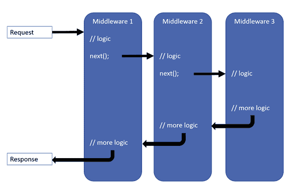

# 第 008 集-中间件-ASP.NET 核心:从 0 到过度杀戮

> 原文：<https://dev.to/joaofbantunes/episode-008---middlewares---aspnet-core-from-0-to-overkill-3da3>

在这一集里，我们来看看 ASP.NET 核心的中间件，如何创建它们并在请求处理管道中使用它们。对于演练，您可以查看下一个视频，但如果您喜欢快速阅读，请跳到书面综合。

[https://www.youtube.com/embed/YU28TJWARg0](https://www.youtube.com/embed/YU28TJWARg0)

整个系列的播放列表是[这里是](https://www.youtube.com/playlist?list=PLN0oN9Azm_MMAjk3nhRnmHdr1l0160Dhs)。

## [T1】简介](#intro)

我们在第四集中简单介绍了中间件，当时我们谈到了`Program`和`Startup`类。在本帖中，我们将重温中间件的话题，并讨论构建中间件的选择。

正如我们所看到的，中间件的基本思想是它们像链一样工作——一个中间件被调用，它可以做一些事情，然后将请求传递给下一个中间件，最后在下一个中间件完成时做一些其他的事情。可能会出现下一个中间件没有被调用的情况，例如在授权中间件中，如果用户没有通过身份验证，它可以立即停止请求，自己返回一个响应。

下面是一个很好的形象来说明行为，来自官方的 [docs](https://docs.microsoft.com/en-us/aspnet/core/fundamentals/middleware/index?view=aspnetcore-2.1) 。

[](https://res.cloudinary.com/practicaldev/image/fetch/s--0jCJWOas--/c_limit%2Cf_auto%2Cfl_progressive%2Cq_auto%2Cw_880/https://thepracticaldev.s3.amazonaws.com/i/bipm4s93oyqqnpwz291o.png)

中间件可以是简单的事情，只是为了丰富请求处理管道——添加一些头、过滤未授权的访问、收集一些指标等——到实现完整的请求处理逻辑——健康检查的端点、提供静态文件、MVC🙂等。

要创建中间件，我们有几个选项可以开始:

*   在内嵌匿名函数中实现逻辑(就像我们在第 4 集看到的例子)
*   在专门的类中实现逻辑

在本帖中，我们将看看用这两种选项实现中间件的一些简单例子。

## app。使用

鉴于我们已经看到了一个简单的中间件在管道中用`app.Use`实现和注册，除了在这里添加代码以供参考之外，就不再赘述了🙂

`Startup.cs`

```
public void Configure(IApplicationBuilder app, IHostingEnvironment env)
{
    //...

    app.Use(async (context, next) =>
    {
        context.Response.OnStarting(() =>
        {
            context.Response.Headers.Add("X-Powered-By", "ASP.NET Core: From 0 to overkill");
            return Task.CompletedTask;
        });

        await next.Invoke();
    });

    //...
} 
```

Enter fullscreen mode Exit fullscreen mode

正如我们所看到的，它注册了一个匿名函数，该函数接收`HttpContext`和`Func`来调用链中的下一个中间件。然后实现，嗯，我们做我们想做的，在这种情况下，它只是添加一个响应头，同时通过调用下一个中间件，让管道的其余部分正常工作。

注意，我们注册中间件的顺序(在`Configure`方法中)定义了它们在处理请求时的运行顺序，所以**顺序与**并不相关。

## app。使用中间件

通过`app.Use`，我们注册了一个基于 lambda 的中间件。要注册一个基于类的中间件，我们可以使用`app.UseMiddleware<T>`扩展方法。

当创建基于类的中间件时，我们有几个选择:

*   基于约定的激活——我们按照约定实现这个类，所有的一切都会自动运行
*   基于工厂的激活——中间件类实现了`IMiddleware`,所以我们得到了更“正常”的体验，就像我们实现了一个继承自`Controller`类的控制器(顺便说一下，这也不是强制性的，我们也可以通过遵循一些约定来实现控制器)

### 基于约定的激活中间件

对于一个基于约定的激活中间件，我们应该遵循一些规则，这样就可以了。一个基本的实现如下所示。

```
public class SampleConventionActivatedMiddleware
{
    private readonly RequestDelegate _next;

    public SampleConventionActivatedMiddleware(RequestDelegate next)
    {
        _next = next;
    }

    public async Task InvokeAsync(HttpContext context)
    {
        // do stuff before the next middleware executes
        await _next(context);
        // do stuff after the next middleware executes
    }
} 
```

Enter fullscreen mode Exit fullscreen mode

构造函数接收一个委托来调用链中的下一个中间件，我们存储它以便在处理请求时使用。

然后我们有一个`InvokeAsync`方法，它获取`HttpContext`作为参数。这可能已经告诉了我们一些事情，乍一看可能并不完全清楚——管道中使用的中间件实例基本上是单例的，因为它是在应用程序启动时构建的。

让我们再来看一个中间件。

```
public class RequestTimingAdHocMiddleware
{
    private readonly RequestDelegate _next;
    private int _requestCounter; 

    public RequestTimingAdHocMiddleware(RequestDelegate next)
    {
        _next = next;
    }

    public async Task InvokeAsync(HttpContext context, ILogger<RequestTimingAdHocMiddleware> logger)
    {
        var watch = Stopwatch.StartNew();
        await _next(context);
        watch.Stop();
        Interlocked.Increment(ref _requestCounter);
        logger.LogWarning("Request {requestNumber} took {requestTime}ms", _requestCounter, watch.ElapsedMilliseconds);
    }
} 
```

Enter fullscreen mode Exit fullscreen mode

正如我们在前面的例子中看到的，中间件实例是单例的，所以如果我们有一些依赖项，而不是像往常一样在构造函数中获得它们，我们在`InvokeAsync`方法中声明我们需要什么，这样它们可以根据请求进行解析。

考虑到这一点，在这种情况下发生的事情是,`_requestCounter`字段将记录在应用程序生命周期内通过中间件的所有请求，因为它是单例的。此外，我们在`InvokeAsync`上注入了一个日志记录器作为依赖项。

样本日志输出:

```
11:38:09 CodingMilitia.PlayBall.GroupManagement.Web.Demo.Middlewares.RequestTimingAdHocMiddleware Warn Request 1 took 1ms
11:38:15 CodingMilitia.PlayBall.GroupManagement.Web.Demo.Middlewares.RequestTimingAdHocMiddleware Warn Request 2 took 0ms
11:38:19 CodingMilitia.PlayBall.GroupManagement.Web.Demo.Middlewares.RequestTimingAdHocMiddleware Warn Request 3 took 0ms 
```

Enter fullscreen mode Exit fullscreen mode

为了让所有这些工作，我们当然需要在请求处理管道中注册中间件:

`Startup.cs`

```
public void Configure(IApplicationBuilder app, IHostingEnvironment env)
{
    //...

    app.UseMiddleware<RequestTimingAdHocMiddleware>();

    //...
} 
```

Enter fullscreen mode Exit fullscreen mode

### 工厂激活中间件

基于类的中间件的另一个选择是实现`IMiddleware`接口。继续我们用于基于约定的方法的例子，我们得到:

```
public class RequestTimingFactoryMiddleware : IMiddleware
{
    private readonly ILogger<RequestTimingFactoryMiddleware> _logger;
    private int _requestCounter; 

    public RequestTimingFactoryMiddleware(ILogger<RequestTimingFactoryMiddleware> logger)
    {
        _logger = logger;
    }

    public async Task InvokeAsync(HttpContext context, RequestDelegate next)
    {
        var watch = Stopwatch.StartNew();
        await next(context);
        watch.Stop();
        Interlocked.Increment(ref _requestCounter);
        _logger.LogWarning("Request {requestNumber} took {requestTime}ms", _requestCounter, watch.ElapsedMilliseconds);
    }
} 
```

Enter fullscreen mode Exit fullscreen mode

马上，我们可以看到一个更传统的类布局，在构造函数和实现接口的`InvokeAsync`方法中注入了依赖关系。

在这种类型的中间件中，生命周期由我们决定，因为我们需要在 DI 中注册它，而不仅仅是像在基于约定的中间件中那样在请求处理管道中注册。

`Startup.cs`

```
public class Startup
{
    //...

    public void ConfigureServices(IServiceCollection services)
    {
        //...

        services.AddTransient<RequestTimingFactoryMiddleware>();

        //...
    }

    //...

    public void Configure(IApplicationBuilder app, IHostingEnvironment env)
    {
        //...

        app.UseMiddleware<RequestTimingFactoryMiddleware>();

        //...
    }
} 
```

Enter fullscreen mode Exit fullscreen mode

在这种情况下，因为该类被注册为瞬态类，所以请求计数器不会在请求之间保持不变，所以我们得到下面的日志输出:

```
11:52:06 CodingMilitia.PlayBall.GroupManagement.Web.Demo.Middlewares.RequestTimingFactoryMiddleware Warn Request 1 took 0ms
11:52:07 CodingMilitia.PlayBall.GroupManagement.Web.Demo.Middlewares.RequestTimingFactoryMiddleware Warn Request 1 took 0ms
11:52:08 CodingMilitia.PlayBall.GroupManagement.Web.Demo.Middlewares.RequestTimingFactoryMiddleware Warn Request 1 took 0ms 
```

Enter fullscreen mode Exit fullscreen mode

## app。奔跑

回到使用匿名函数作为中间件，除了`app.Use`扩展方法，我们还有`app.Run`。基本上是一样的，但是要将一个函数注册为终端中间件，这意味着它不会将请求传递给链中任何跟在它后面的中间件。它基本上和`app.Use`一样，没有调用过`next`参数😛

举例来说，在请求处理管道配置中，我们可以在末尾添加一些内容:

`Startup.cs`

```
public void Configure(IApplicationBuilder app, IHostingEnvironment env)
{
    //...

    app.Run(async (context) =>
    {
        await context.Response.WriteAsync("No middlewares could handle the request");
    });    
} 
```

Enter fullscreen mode Exit fullscreen mode

在这种情况下，如果没有中间件能够完全处理请求，特别是 MVC 中间件，我们会发出一个(非常简单的)响应通知这个事实。

## app。地图和 app。MapWhen

我们可用的另一对有趣的扩展方法是`Map`和`MapWhen`。这些方法允许我们在给定的条件下在请求处理管道中创建分支。

让我们来看一些例子。

### app。地图

`Map`允许我们为给定的路径分支管道。

`Startup.cs`

```
public void Configure(IApplicationBuilder app, IHostingEnvironment env)
{
    //...

    app.Map("/ping", builder =>
    {
        builder.UseMiddleware<RequestTimingFactoryMiddleware>();
        builder.Run(async (context) => { await context.Response.WriteAsync("pong from path"); });
    }); 

    //... 
} 
```

Enter fullscreen mode Exit fullscreen mode

以上面的例子为例，对于对`/ping`的任何请求，不遵循通常的管道，而是使用 lambda 参数中配置的中间件，我们让之前开发的`RequestTimingFactoryMiddleware`执行，加上一个终端中间件以一个简单的消息响应。

### app。MapWhen

`MapWhen`的工作方式与`Map`非常相似，但是我们可以定义其他条件，而不是强制使用路径。为了定义条件，我们提供了一个函数，该函数获取一个`HttpContext`参数并返回一个布尔值，指示是否应该使用分支。

`Startup.cs`

```
public void Configure(IApplicationBuilder app, IHostingEnvironment env)
{
    //...

    app.MapWhen(
        context => context.Request.Headers.ContainsKey("ping"),
        builder =>
        {
            builder.UseMiddleware<RequestTimingAdHocMiddleware>();
            builder.Run(async (context) => { await context.Response.WriteAsync("pong from header"); });
        });

    //... 
} 
```

Enter fullscreen mode Exit fullscreen mode

这个例子与上一个非常相似，但是使用了一个条件来检查是否有一个名为`ping`的请求头。如果头存在，那么使用分支，在这种情况下，使用先前实现的`RequestTimingAdHocMiddleware`,加上另一个终端中间件来输出一个简单的响应消息。

## 其他

这样做是为了快速了解中间件的实现。这很简单，我认为没有什么更复杂的了。要构建更复杂的中间件，我们只需要在设置它们的初始步骤上添加更多的逻辑。

正如我在本系列的其他帖子中所说，与我发布的这些快速浏览相比，官方的[文档](https://docs.microsoft.com/en-us/aspnet/core/fundamentals/middleware/?view=aspnetcore-2.1)很可能会有更多的信息😉。

这个帖子的源码是[这里](https://github.com/AspNetCoreFromZeroToOverkill/GroupManagement/tree/episode008)。

请发送任何反馈，以便我可以改进和调整下一集。

谢谢你的来访，西阿兹！