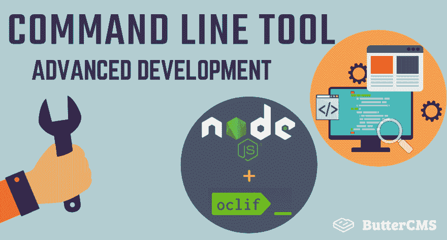
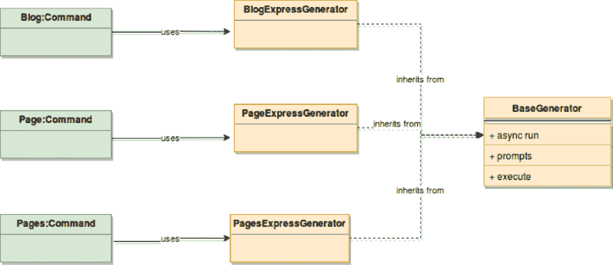

# 使用 JavaScript 和 OClif 开发高级 CLI 工具

> 原文：<https://dev.to/jakelumetta/advanced-cli-tool-development-with-javascript-and-oclif-26ea>

[](https://res.cloudinary.com/practicaldev/image/fetch/s--jVtbq1hH--/c_limit%2Cf_auto%2Cfl_progressive%2Cq_auto%2Cw_880/https://thepracticaldev.s3.amazonaws.com/i/rq8agfkbwerrll2uhruf.png)

在我上一篇文章 的 [中，我使用 OClif 和 Node.js 构建了一个 CLI 工具，允许用户自动生成一个全新的博客，并集成到 ButterCMS 中。在这新的一期中，我将向您展示如何扩展该工具，以便添加一些新的命令并改进现有的命令。](https://dev.to/blog/building-a-command-line-interface-in-javascript-with-oclif)

# **我们在做什么？**

因此，现在的想法是将这个 buttercms-cli 扩展成一个工具，即使你已经生成了你的博客代码，你也可以继续使用它。你看，ButterCMS 不仅仅是一个博客系统，它还允许你 [给你的网站](https://dev.to/blog/new-page-builder-is-smooth-as-butter) 添加额外的页面；比如“关于我们”、“认识我们的团队”等等，而 Butter 可以让你完全按照自己的要求定制这些字段。

为了利用这一点，我将向您展示如何修改上一篇文章 中的 [代码，使其能够在您现有的博客中添加与这些页面的交互。](https://github.com/deleteman/buttercms-cli#buttercms-generate)

本质上，我添加的内容如下:

*   能够将单个页面添加到您的博客中，这将生成正确的路径、正确的控制器以及正确的视图，并根据页面内容的类型，使用正确格式的字段。
*   能够创建一个相同类型的页面列表(更多关于页面类型的信息)。

我想强调的是，我将添加的附加功能是在所有新老命令中支持认证令牌。这将使 CLI 工具能够与 ButterCMS 进行通信，以收集有关您试图创建的页面的信息，甚至将该令牌自动添加到博客的配置文件中，允许您在生成应用程序后立即启动它，而无需更改任何代码。

尽管该工具的内部架构非常简单，但让我来帮您想象一下我们将在本文中介绍的变化范围。下图举例说明了主要组件之间的现有关系:

[](https://res.cloudinary.com/practicaldev/image/fetch/s--hfZpehjr--/c_limit%2Cf_auto%2Cfl_progressive%2Cq_auto%2Cw_880/https://cdn.buttercms.com/5RDoz9s2Ro6dOdcW58md)T4】

正如我提到的，这非常简单，我们有自己的 *博客* 类，它扩展了 OClif 的 *命令* 类，后者又使用了我们的生成器类(讽刺的是，它扩展了 *命令* )。

现在，我们进入如下内容:

[](https://res.cloudinary.com/practicaldev/image/fetch/s--1tBzPgsa--/c_limit%2Cf_auto%2Cfl_progressive%2Cq_auto%2Cw_880/https://cdn.buttercms.com/XIJ3wHmETNqedtCsmHSw)T4】

您会注意到，从某种意义上来说，我们仍然没有改变太多，本质上是使用生成器的命令。也就是说，我们添加了两个新的生成器和一个基类供它们实现。这个新的 BaseGenerator 类将简单地定义每个生成器需要实现的强制方法，并确保它们被实现。最后一点需要通过一个简单的技巧来完成(您马上就会看到)，因为 JavaScript 没有提供接口的概念或类似的强制实现强制方法的结构。

### 最终结果

现在让我们来看看，一旦我们完成了这个命令，您将如何使用它。第一个改变的将是博客生成器，因为它是最容易修改的。下面是它的样子:

```
**`$ buttercms-cli generate:blog --for=express --auth_token=`**
```

这里的变化很小，但是一旦实现，生成的代码就会在配置文件中包含您的令牌，这是当前版本所没有的。

现在，对于大的变化，这是两个新命令的样子:

如果你想给你的博客添加一个新的页面，比如很多网站都有的“关于我们”部分，你可以在 CMS 中创建它，然后，进入你最喜欢的终端，确保你在你的博客的文件夹中(记住，那个博客应该是用 generate:blog 命令创建的，或者至少，遵循相同的文件夹结构，否则这个命令将不起作用),并输入:

```
**`$ buttercms-cli generate:page --for=express --page=about-us --auth-token=`**
```

就是这样！输入后，它会像之前一样要求确认，并创建以下内容:

-您系统中的路线:/about-us

-与该路线相关联的控制器，在 routes 文件夹

下-该视图的 Jade 模板。这就是它有趣的地方，因为 CMS 允许你创建不同类型的字段，模板不会是通用的(稍后会详细介绍)。

注意，对于上面的命令， **- page** 参数获取页面的 API slug，这是您可以从 ButterCMS 的 UI 中轻松获得的，所以现在不要太担心它。

最后，前一版本工具的第三个新增功能是创建页面列表的能力。为了举例说明这一目的，我们假设您正在创建“会见我们的团队”页面，在该页面中，您简要介绍了您的每个团队成员，并将他们每个人链接到一个特定的个人资料页面。通过用 Butter 中的自定义页面类型(比如团队成员页面类型)创建这些单独的页面，您可以简单地使用下面的命令来创建一个列表页面:

```
**`$ buttercms-cli generate:pages --for=express --page_type=team_member --auth_token=`**
```

上述行将创建:

-你的列表页面的路径

-处理请求的控制器

-最后是它的模板视图。在这个特殊的例子中，由于它是一组链接，这个模板将不会被定制(尽管这里没有什么需要定制的)。

### 自定义字段类型

既然我们已经介绍了新特性的外观，那么让我给你一个快速的概述，让你使用当前版本的 UI 在一个新的页面中创建定制的字段类型。

列表基本如下:

简短的文本:非常简单明了，你可以在这个字段中输入一两个简短的句子，它应该在你的页面中显示出来。

**长文**:这里不多解释，就渲染成 p 块。

**所见即所得:如果你以前没有遇到过，这是一个有趣的名字，但它的基本意思是“所见即所得”，它是指这样一个事实，即你将能够可视化地格式化这个字段中的内容(把它想象成一个迷你谷歌文档或文本字段中的 Word)。您输入的内容将在您的页面中格式化呈现。

**引用**:这些只是指向你的站点内其他页面的链接。您可以链接到单个页面或一组页面。根据您选择的字段类型，您将获得一个链接或者一个列表(实际的 ul 列表)。

**Date** :日期字段非常简单，它们将被呈现为 datetime 类型的输入字段，默认值设置为您输入的值。这将创建一个很好的特定于浏览器的交互，当你点击那个字段时，显示一个日历来改变值。

**下拉**:该字段允许您输入多个选项，一旦创建页面，您可以选择其中一个。所选选项将在您的页面中呈现为简单文本。

图像字段:此类字段允许您上传图像文件。遗憾的是，由于 API 在请求页面内容时不提供字段类型，因此在页面上，实际的 URL 将呈现为文本。

**数字**:该字段允许您输入单个数值。一旦呈现，它将显示为简单的文本。

**HTML** :很像 WYSIWYG 字段，这个允许你格式化你输入的内容，但是你可以通过添加 HTML 标签来完成。您在此输入的内容将通过解释 HTML 并显示最终结果呈现在您的页面中。

**Repeater**:Repeater 字段允许你添加前面提到的字段列表(即添加一个短文本字段列表)。无论您如何配置您的列表，它们都将被呈现为一个 ul 元素，每组字段都将被呈现为一个单独的 li 项。**

 **这是您可以添加的所有字段类型的概述，以及我们的 CLI 工具将如何处理它们的概述。

现在让我们转到实际的实现来理解如何实现这一点。

履行

由于我已经为添加到 CLI 工具中的每个新命令添加了几个文件和几百行新代码，所以我真的不想让您对所有的更改感到厌烦。相反，我想回顾一下我必须做的重点工作，以便将上述特性加入我们的 ButterCMS-cli 工具。

记住你可以直接从 [GitHub](https://github.com/ButterCMS/buttercms-cli) 浏览整个源代码。

### **增加对- auth_token 标志的支持**

**这是最简单的一个，因为我们已经准备好了******generate******:blog*****命令。修改后的命令代码如下所示:***

 ***T2】**

```
'use strict'

const {Command, flags} = require('@oclif/command')
const requiredir = require("require-dir")
const BlogGenerators = requiredir("../../generators/blog")

class BlogCommand extends Command {

    async run() {

     const {flags} = this.parse(BlogCommand)

     const targetGeneration = flags.for.toLowerCase().trim();

     //error handling
     if(BlogCommand.flags.for.options.indexOf(targetGeneration) == -1) {
         return this.error (`Target not found '${targetGeneration}', please try one of the valid ones - ${BlogCommand.flags.for.options.join(",")} - `)
     }

     const gen = new BlogGenerators[targetGeneration](flags.auth_token)

     gen.run();

    }
}

BlogCommand.flags = {
    for: flags.string({
     description: 'Target destination for the generator command',
     options: ['express'] //valid options
    }),
    auth_token: flags.string({
     description: "Your AUTH token used to communicate with ButterCMS API",
     required: true
    })
}

module.exports = BlogCommand 
```

是的，就是它，通过将我们的标志添加到静态的 _ 标志 _ 对象中，我们现在可以让 OClif 为我们检查它的存在。我们要做的就是将它传递给生成器，这样它就可以如下使用它:

```
/*
    Create the destination folder using the application name given,
    and copy the blog files into it
    */
    copyFiles(appname) {
     const folderName = this.cleanAppName(appname)
     fs.mkdir(folderName, (err) =&gt; { //create the new folder
         if(err) {
             return this.log("There was a problem creating your blog's folder: " + chalk.red(err.toString()))
         }
         this.log("Folder - " + chalk.bold(folderName) + " -  " + chalk.green("successfully created!"))
         ncp(SOURCEEXPRESSBLOG, folderName, (err) =&gt; { //copy all files
             if(err) {
                 return this.log("There was a problem while copying your files: " + chalk.red(err))
             }
//  This is the comment text
             let configFilePath = folderName + "/config/default.json"
             fs.readFile(configFilePath, (err, configContent) =&gt; { //overwrite the configuration file, with the provided AUTH KEY
                 let newConfig = configContent.toString().replace("", this.auth_token)
                 fs.writeFile(configFilePath, newConfig, (err) =&gt; {
                     this.printSuccessMessage(folderName)
                 })
             })
         })
     })
    } 
```

在评论文本下面有一个技巧，在为我们全新的博客复制文件之后，默认情况下我们已经创建了配置文件，但是它包含一个占位符“****”字符串，应该是你的认证令牌。现在，在注释文本下添加了代码，我们读取它，用您给工具的任何 auth token 替换该字符串，并再次保存它。简单快速的改变。文件的其余部分基本保持不变，所以没有什么值得一提的。

### **添加新的 BaseGenerator 类**

这个的代码非常简单，唯一有趣的一点，也是我为什么在这里展示它的原因，是你可以“强迫”你的开发者实现方法的方式。请记住，即使我们现在在 JavaScript 中有了 _ 类 _ 结构，我们离成为强大的 OOP 语言还很远。因此，我们没有像接口这样的结构，它允许你修改一组基本的方法，每个类都必须实现这些方法才能符合标准。

相反，我们可以做到这一点，通过做以下肮脏的把戏:

```
'use strict'

const {Command} = require('@oclif/command')

module.exports = class BaseGenerator extends Command{

    prompts() {
     throw new Error("::Base Generator - prompts:: Needs to be implemented")
    }    

    execute() {
     throw new Error("::Base Generator - execute:: Needs to be implemented")    
    }

    async run() {
     this
         .prompts() //ask the questions
         .then(this.execute.bind(this)) //execute the command
    }
} 
```

所有生成器的 _ 运行 _ 方法都是一样的，你提示用户一组问题和一个最终确认，然后你执行实际的代码，它负责创建你需要的任何东西。所以 _ 提示 _ 和 _ 执行 _ 方法是你需要实现的，或者在这种情况下，重写。如果不这样做，您将得到一个新的异常。

这可能是一个快速而肮脏的修复方法，但是它是有效的，你需要确保无论何时创建新的和未来的生成器，你都不会忘记重要的方法。

## **新命令**

为此，我将只显示*generate:page*命令的代码，因为它是两个命令中最复杂的，特别是由于我上面提到的定制字段类型。同样，您可以在 [资源库](https://github.com/deleteman/buttercms-cli) 中检查剩余的代码。

正如我前面提到的，命令文件看起来都很相似，所以我将把重点放在生成器文件上，因为所有有趣的逻辑都驻留在那里。

对于这一个，执行方法如下所示:

```
execute(answer) {
     if(!answer.continue){
         return this.log("OK then, see you later!")
     }

     this.getPageData( (err, pageData) =&gt; {
         if(err) {
             return this.log("There was a problem getting the data for your page: " + chalk.red(err.data.detail))
         }
         this.copyFiles(pageData.fields)
     })

    } 
```

我们基本上是获取页面的数据，也就是页面中的字段列表，然后我们复制文件。像我们之前做的一样，要复制的文件在*src/generators/[command]/express-template*文件夹中。只有这一个，我们有 2 个文件，路径文件夹中的控制器，看起来像这样:

```
var express = require('express');
var router = express.Router();
var config = require("config")
var butter = require('buttercms')(config.get("buttercms.auth_token"));

router.get('', function(req, res, next) {
    butter.page.retrieve("*", "[[SLUG]]").then( (resp) =&gt; {
     res.render('[[SLUG]]', resp.data.data);
    })
    .catch(console.err)
});

module.exports = router 
```

注意，这个文件中没有设置路线，因为如果您查看由 _ generate:blog _ 命令生成的 _ app.js _ 文件，您会发现下面几行代码:

```
//...
const routes = requiredir("./routes")
//....
Object.keys(routes).forEach( route =&gt; {
    console.log("Setting up route", route)
    app.use("/" + route, routes[route])
}) 
```

*requiredir* 命令将自动要求 routes 文件夹中的所有内容，并返回一个对象，其关键字等于文件名。因为这些文件是以 slug 命名的，所以您不需要担心为代码的第二部分设置特定的路径(那个 *forEach* 循环将正确地创建路径并将正确的控制器关联到它们)

和视图文件，在 _ 视图 _ 文件夹里面，看起来是这样的:

```
extend layout

block content
[[FIELDS]] 
```

正如你所看到的，大部分都是动态生成的。

注意它们中的[[SLUG]]和[[FIELDS]]标记，这些是我创建的占位符标记，稍后将被我们的代码替换。

现在，我想展示一下 _ getPageData _ 方法，因为它通过 [ButterCMS npm 模块](https://www.npmjs.com/package/buttercms) 与 ButterCMS 的 API 交互，就像这样:

```
getPageData(cb) {

     let butterClient = new ButterCMS(this.auth_token)
     butterClient.page.retrieve("*", this.page).then( resp =&gt; {
         cb(null, resp.data.data);
     }).catch(cb)
    } 
```

这里没有很多代码，但是通过使用 _ page.retrieve _ 方法，我们可以得到我们想要的。该方法将页面的类型和页面的 slug 作为参数，但是我们并不真正需要类型，所以我们可以简单地传递一个“*”来代替。

现在，对于 _ copyFiles _ 的方法:

```
copyFiles(fieldsToRender) {

    let finalViewName = './views/' + this.page + '.jade'
    let finalRouteName = './routes/' + this.page + '.js'

    this.generateTemplate(fieldsToRender, (err, content) =&gt; {
     fs.writeFile(finalViewName, content, (err) =&gt; { //save the view template to its destination
         if(err) {
             return this.log("There was a problem saving the view file at '" + finalViewName + "': " + chalk.red(err.toString()))
         }

         this.generateRouteFile( (err, routeContent) =&gt; {
             fs.writeFile(finalRouteName, routeContent, (err) =&gt; {
                 if(err) {
                     return this.log("There was a problem copying the route template: " + chalk.red(err.toString()))
                 }
                 this.printSuccessMessage();
             })
         })
     })

    })    
} 
```

这个是:

1.  生成模板内容(换句话说，填充 jade 文件中的字段)
2.  保存到正确的路径
3.  生成路线文件(通过替换代码中的[[SLUG]]标签)
4.  保存到正确的路径
5.  打印成功消息结束。

在这 5 个步骤中，我想介绍的最重要的一步是第一步，生成模板内容。下面是这段代码的样子:

```
generateTemplate(fields, cb) {
    fs.readFile(SOURCE_VIEW_PATH, (err, viewTemplate) =&gt; {
     if(err) return cb(err);
     let newContent = []

     newContent = Object.keys(fields).map( (field) =&gt; {

         if(Array.isArray(fields[field])) { //if it's an array, then we need to add a loop in the template
             let firstRow = fields[field][0]
             let content = 'ul'
             content += OS.EOL + '\teach f in fields.' + field    
             if(firstRow.slug &amp;&amp; firstRow.fields) { //it's a reference
                 let item = ['\t\t', 'li','\ta(href="/" + f.slug)=f.slug'].join(OS.EOL + "\t\t")
                 content += item
             } else {
                 content += [OS.EOL + "\t\tli",
                             OS.EOL + "\t\t",
                             Object.keys(firstRow).map( k =&gt; {
                                 return this.guessRepresentation(firstRow, k, 'f')
                             }).join(OS.EOL + "\t\t")].join('')
             }
             return "\t" + content
         }
         return this.guessRepresentation(fields, field)

     })

     viewTemplate = viewTemplate.toString().replace("[[FIELDS]]", newContent.join(OS.EOL))
     cb(null, viewTemplate)
    })
} 
```

看起来可能很多，但它只是遍历作为参数传递的字段列表，对于每个字段，它都试图猜测它的表示形式(记住，API 不返回实际的类型，所以我们需要解释它的内容以便正确猜测)。循环中有一个特殊的部分，用于引用字段(当它们引用一个链接列表时)和中继器字段。

但本质上，代码遍历每个字段，试图获得它的表示并将其添加到一个名为 _ newContent _ 的行数组中，这些行最终连接在一起，最终的字符串将替换我们前面看到的[[FIELDS]]标签。

这里还需要注意一个小细节，那就是 _ 操作系统的使用。EOL _ 变量，来自 _ os _ 模块。这表示当前操作系统的行尾字符。请记住，Windows、Linux 和 Mac 有一些相似但不完全相同的含义，所以如果您要共享使用 EOL 字符的代码，请确保您使用该变量，以便它在任何地方都能按预期工作。

我想在这里展示的最后一点代码是_guess re presentation_方法，它试图理解如何根据每个字段的内容来呈现每个字段:

```
guessRepresentation(fields, field, prefixValue) {
    if(!prefixValue) prefixValue = "fields"
    if(typeof fields[field] === 'boolean') { //true/false
     return '\tinput(type="checkbox"  checked=' + prefixValue + '.' + field +' name="' + field + '")'
    }
    if(typeof fields[field] === 'string') {
     if(fields[field].match(/[0-9]{4}-[0-9]{2}-[0-9]{2}T/g)) { //dates
         return '\tinput(type="datetime-local" value=' + prefixValue + '.' + field + ')'
     }
     if(fields[field].match(//i)) { //HTML 
         return '\tp!=' + prefixValue + '.' + field
     }
    }

    if(fields[field].slug) { //reference
     return '\ta(href="/" + ' + prefixValue + '.' + field + '.slug)=' + prefixValue + '.' + field + '.slug'
    }

    return '\tp=' + prefixValue + '.' + field //default representation (plain text)
} 
```

最后，你需要记住:生成的模板视图会在那里，在 _ 视图 _ 文件夹内供你编辑，所以这只是帮助你入门的一个指南。

# **扩展工具**

如果您愿意，您可以轻松地将 CLI 工具扩展为支持新的目标技术堆栈(如添加对 Vue 的支持)。JS)或者甚至添加新的命令。为了做到这一点，以下是步骤:

*   如果你想添加新的命令，你需要在“src/commands”文件夹中创建它们。因为这就是 OClif 的工作方式，我们对此无能为力。如果你想在“生成”中有更多的子命令，它们需要在“生成”文件夹中。同样，OClif 将这个标准强加到项目中。
*   至于添加更多的目标，我创建文件夹结构的方式意味着你需要在“src/generators/”文件夹中添加一个以你的目标命名的生成器文件(例如，如果你想添加对 VueJS 的支持，你需要在“src/generators/generate”文件夹中创建一个 vuejs.js 文件)。那是因为每一个命令都有一个*requiredir*的生成器。基本上，*generate:blog_do a_require dir**src/generators/blog_，_generate:pages_of_src/generators/pages_等等。_require dir*调用需要文件夹中的每个文件，创建一个对象，其关键字等于文件名(减去。js)。因此，如果您在_src/generators/blog_中有 3 个名为“express”、“vue”和“next”的文件，您可以完美地执行_generate:blog-for = vue_，它会自动为您提取这些文件。这种结构的美妙之处在于，为了添加新的生成器，您不需要接触现有的命令。

最后，模板的文件夹结构完全由每个生成器决定，因此可以很容易地根据您的需要进行更改和定制。

# **总结**

这篇文章到此为止，我希望你能从中得到一些有用的东西。OClif 无疑是一个非常有趣的模块，我们仍然没有使用它的 100%的功能，所以为了使这个 CLI 工具不断发展并为您提供更多帮助，我们可能还可以做更多的事情。请在下面的评论中让我知道你想看到什么添加到它！

 并且记住可以看完整版源代码，直接从 [GitHub](https://github.com/deleteman/buttercms-cli) ！

注册以确保您不会错过我们的其他教程。***