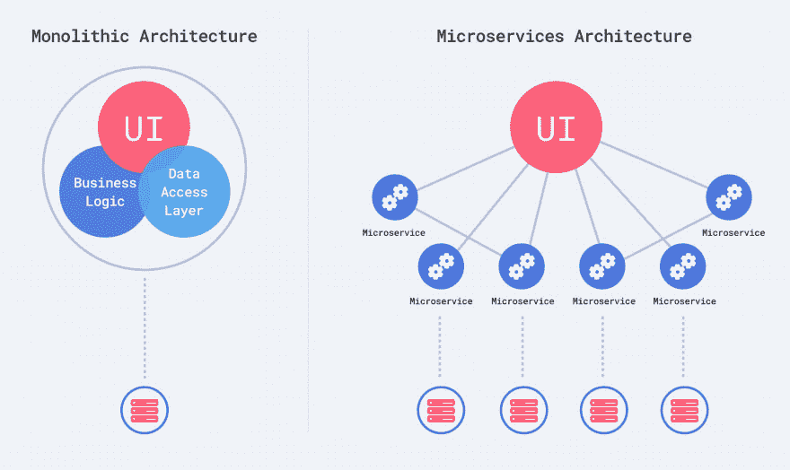

# 微服务与整体架构

> 原文：<https://dev.to/alex_barashkov/microservices-vs-monolith-architecture-4l1m>

技术的发展改变了我们构建应用程序架构的方式。Docker、云服务和容器编排服务使我们能够开发分布式、更具可扩展性和可靠性的解决方案。在本文中，我们将比较微服务和 monolith 架构，讨论什么团队和项目应该使用什么类型的架构，并探讨它们的优缺点。

一眼看去，这些类型之间的区别可以如下图所示

严格来说，monolith 应用并不总是简单的，但是微服务通常要大 10 倍，并且几乎总是需要更多的资源。

让我们逐点讨论各自的利弊。

#### 部署

Monolith 应用程序允许您设置一次部署，然后根据正在进行的更改简单地调整它。然而，与此同时，在部署过程中也只有一个单点故障，如果一切都出错，您可能会破坏整个项目。

微服务需要更多的工作；您将需要独立部署每个微服务，担心编排工具，并尝试统一 ci/cd 管道的格式，以减少为每个新的微服务进行部署所需的时间。然而，也有好的一面；如果出了问题，你只会坏一个小的微服务，比整个项目问题都小。回滚一个小的微服务比回滚整个 monolith 应用要容易得多。

#### 维护

如果您计划使用微服务架构，请为您的团队获取一个 DevOps，并做好准备。并非每个开发人员都熟悉 Docker 或编排工具，如 Kubernetes、Docker Swarm、Mesosphere 或任何类似的工具，它们可以帮助您管理具有大量移动部件的基础设施。必须有人监控和维护每个微服务和整个基础架构的 CI 配置的运行状态。

#### 可靠性

微服务架构显然是这里的赢家。中断一个微服务只会影响一个部分，并给使用它的客户端带来问题，而不会影响其他人。例如，如果你正在开发一个银行应用，而负责取钱的微服务宕机了，这肯定没有整个应用被迫停止严重。

#### 可扩展性

对于可伸缩性，微服务同样更适合。Monolith 应用程序很难扩展，因为即使你运行更多的工作人员，每个工作人员都在一个项目上，这是一种低效的资源使用方式。更糟糕的是，你编写代码的方式可能会使它无法水平缩放，从而使你的 monolith 应用程序只能垂直缩放。有了微服务，这就简单多了。可以更谨慎地使用资源，并允许您只扩展需要更多资源的部分。

#### 成本

成本很难计算，因为整体建筑在某些情况下更便宜，但在其他情况下则不然。例如，借助微服务更好的可扩展性，您可以设置自动扩展，并且只在用户数量确实需要更多资源时才支付费用。同时，为了保持基础架构的正常运行，您需要付费的开发运维服务。通过一个小型的 monolith 应用程序，你可以在一台 5-20 美元的主机上运行并打开快照。对于一个更大的 monolith 应用程序，你可能会托管一个非常昂贵的实例，因为你不能在多个小型、廉价的主机上共享它。

#### 发展

在我们的一个项目中，我们有 16 个微服务，我可以根据经验告诉你，这可能很难处理。处理微服务最好的方法是从头构建你的 docker-compose 文件，通过 docker 开发。这有助于你减少新员工入职的时间；只需从头开始运行系统，并根据需要启动所有微服务。打开 10 多个终端窗口并执行命令来启动每个单独的服务是一件痛苦的事情。

另一方面。当你开发一个微服务时，你可能不需要运行应用程序的其他部分。由于更好的分解任务的过程和跨微服务隔离开发人员的能力，这导致 git 冲突的问题更少。

用微服务做代码评审和 QA 更简单；你甚至可以用不同的语言编写微服务。

#### 释放

较小的微服务和适当的微服务通信架构允许您通过减少 QA 时间、构建时间和测试执行时间来更快地发布新功能。Monolith 应用程序有很多无法分解的内部依赖关系。还有一个更高的风险是，您所承诺的事情可能依赖于您的团队成员未完成的变更，这可能会推迟发布。

#### 建筑对你来说什么更好？

如果您有以下情况，请使用整体式架构:

*   有一个小团队。
*   构建新产品的 MVP 版本。
*   没有获得数百万美元的投资来雇佣开发人员或在复杂的架构上花费额外的时间。
*   有坚实的框架开发经验，如 Ruby on Rails，Laravel 等。
*   没有发现某些关键功能的性能瓶颈。
*   觉得微服务很酷，是一种趋势。

请记住，如果您发现您的项目中需要微服务，monolith 架构总是会因为这些小的微服务而带来崩溃的风险。

如果您符合以下条件，请使用微服务架构:

*   不要有紧迫的截止日期；微服务需要您进行研究和架构规划，以确保其正常工作。
*   拥有一支通晓不同语言的团队。
*   非常担心产品的可伸缩性和可靠性。
*   可能有几个开发部门(甚至可能在不同的国家/时区)。
*   拥有一个现有的 monolith 应用程序，并发现您的应用程序中可以跨多个微服务拆分的部分存在问题。