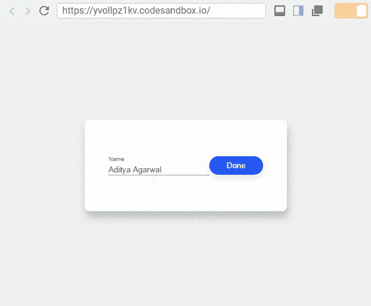
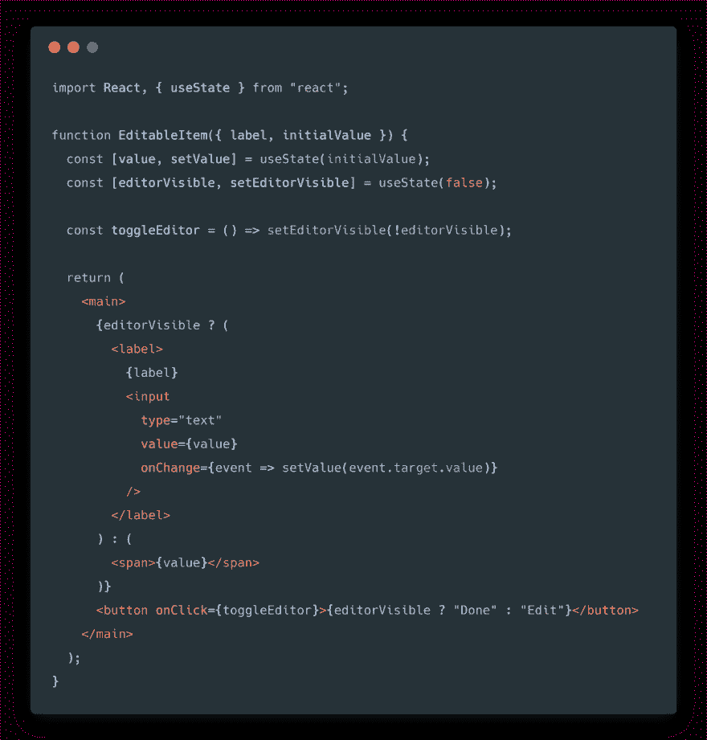
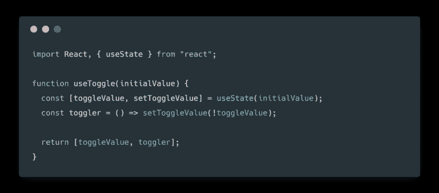
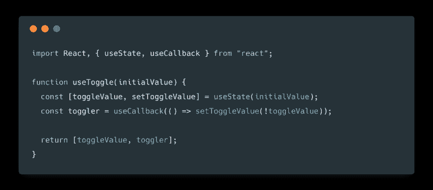
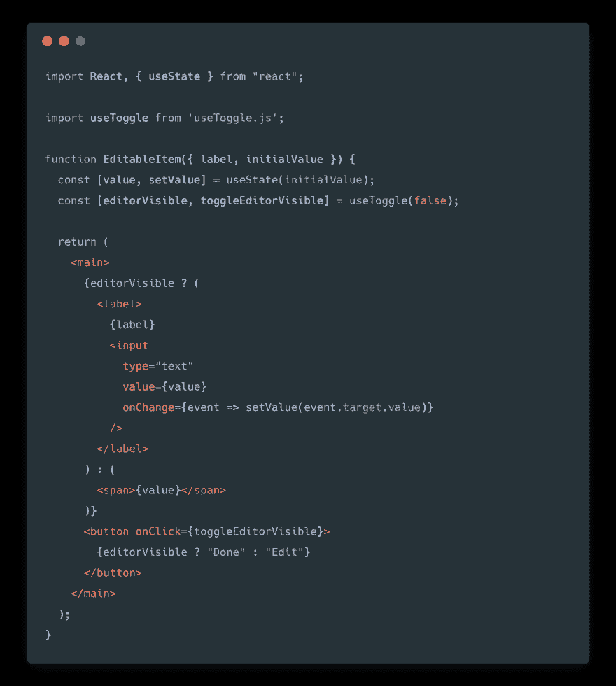
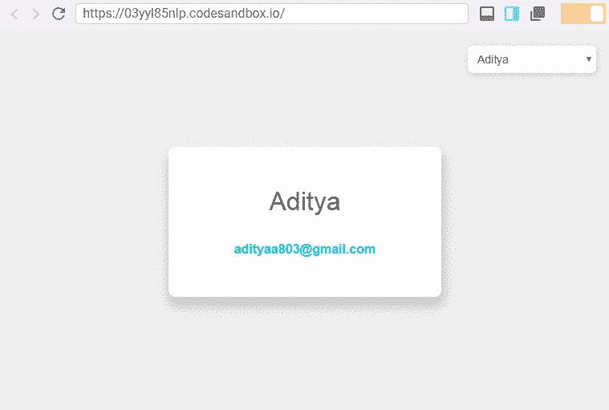
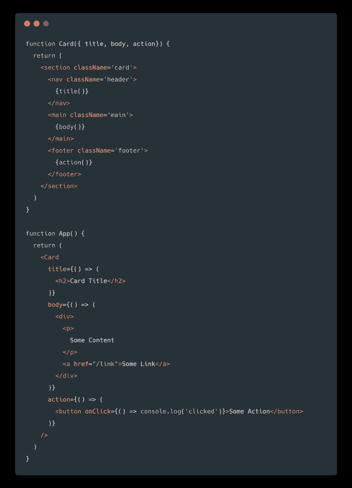
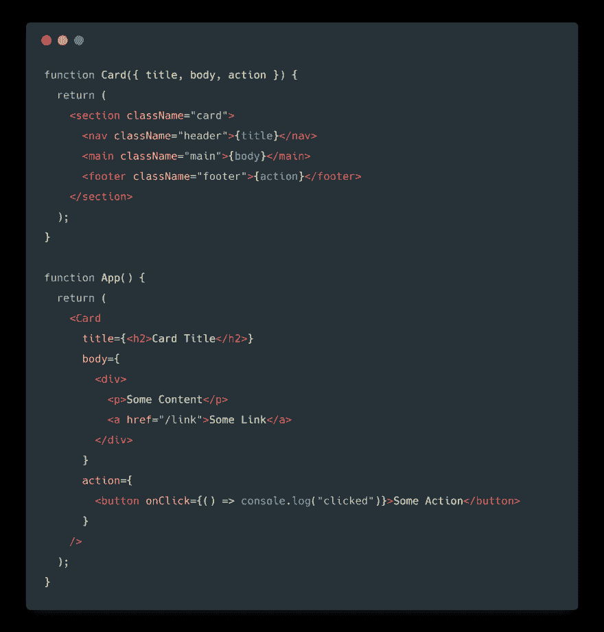

# 反应自定义钩子和渲染道具的死亡

> 原文：<https://dev.to/bnevilleoneill/react-custom-hooks-and-the-death-of-render-props-67p>

#### 上个月推出 React Hooks 时，每个人都有话要说。但是没看到有人说可以不用渲染道具。所以我来说。我们可以停止使用渲染道具。在本文中，我们将学习如何做到这一点。

**注意** —渲染道具不会*完全*消亡，但不会用于我们目前习惯的东西。此外，React 钩子**仍然在 alpha** 中，所以不建议**在生产**中使用它们。请不要急于重构你现有的所有应用。

### 什么是渲染道具？

**渲染道具**是一种跨组件共享逻辑的高级模式。组件(通常称为容器组件)可以将 UI 的外观委托给其他组件(称为表示组件)，并且只实现业务逻辑本身。因此，我们可以通过使用 Render Props 模式将横切关注点实现为组件。

### 为什么我们需要渲染道具？

1.  用于在组件之间共享代码
2.  要使用上下文 API

### 渲染道具的问题

使用渲染道具有其自身的问题。其中一些问题只有在我们深入挖掘或扩展项目时才会出现。

#### 包装地狱

为了增加代码库的干度，我们经常实现许多小的、粒度的组件，这样每个组件只处理一个问题。这样做的问题是，我们经常会有大量的包装组件嵌套在一起。如果我们减少包装组件的数量，那么组件的大小和复杂性就会增加。此外，包装组件的可重用性也可能降低。这条推文完美地总结了这一点。

body[data-twttr-rendered = " true "]{ background-color:transparent；}.twitter-tweet {margin: auto！重要；}

> [@三点一](http://twitter.com/threepointone) [@kentcdodds](http://twitter.com/kentcdodds) 我的意思是加油(我现在正在玩的实际代码的截图)
> 
> ——@ acdlite

函数 notify resize(height){ height = height？height:document . document element . offset height；var 调整大小= falseif(window . donkey & donkey . resize){ donkey . resize(height)；调整大小= true}if (parent && parent。_ resize iframe){ var obj = { iframe:window . frame element，height:height }；父母。_ resize iframe(obj)；调整大小= true} if(window . location & & window . location . hash = = = " # amp = 1 " & & window . parent & # window . parent . postmessage){ window . parent . postmessage({ sentinel:" amp "，type: "embed-size "，height: height}，" * ")；} if(window . WebKit & . window . WebKit . message handlers & . window . WebKit . message handlers . resize){ window . WebKit . message handlers . resize . postmessage(height)；调整大小= true}返回调整大小；}twttr.events.bind('rendered '，function(event){ notify resize()；});twttr.events.bind('resize '，function(event){ notify resize()；});if(父&父。_ resize iframe){ var maxWidth = parse int(window . frame element . get attribute(" width "))；if(500 < maxWidth){ window . frame element . set attribute(" width "，" 500 ")；}}

#### 捆绑`this`是一种痛苦

因为包装组件处理状态或生命周期方法，所以它们必须使用类组件。对于类组件，我们必须正确地绑定它，否则我们就有丢失函数内部上下文的风险。绑定所有方法的语法看起来很难看，对开发人员来说是个负担。

#### 对于人类和机器来说，上课都很难

每当我们将一个功能组件转换成一个类组件时，类都会附带大量的样板代码，这对于我们来说是非常糟糕的。事实证明，我们的构建工具也很难优化类。这导致了双重惩罚，因为它既没有带来好的 DX(开发者体验)，也没有带来好的 UX(用户体验)。React 团队甚至考虑将来将类组件支持转移到一个单独的包中。

#### 使用 PureComponent 变得复杂

如果我们在 render 方法中创建赋值函数，使用 render prop 会抵消使用 PureComponent 带来的好处。这是因为**浅属性比较将总是为新属性**返回 false，在这种情况下，每个渲染将为渲染属性生成一个新值。更多细节参见[文件](https://reactjs.org/docs/render-props.html#be-careful-when-using-render-props-with-reactpurecomponent)。

然而，这些问题中的许多并不完全是渲染道具模式的错误。直到现在，React 还没有提供一种使用状态或生命周期方法而不涉及类的方式，这就是为什么我们必须在容器组件中使用类来实现 Render Props 模式。

然而，随着 React Hooks API 的引入，所有这些都改变了。React 钩子让我们只用几行代码就可以在功能组件中使用状态和生命周期钩子。

body[data-twttr-rendered = " true "]{ background-color:transparent；}.twitter-tweet {margin: auto！重要；}

> [@ ericandrewlewis](http://twitter.com/ericandrewlewis)[@ react podcast](http://twitter.com/ReactPodcast)[@ Dan _ abra mov](http://twitter.com/dan_abramov)[@ Jared Palmer](http://twitter.com/jaredpalmer)在悬念(任何需要安排的事情)和挂钩(效果、上下文和本地状态)之间，没有框架级解决方案的渲染道具用例很少
> 
> — [@chantastic](https://twitter.com/chantastic/status/1064916849433833473)

函数 notify resize(height){ height = height？height:document . document element . offset height；var 调整大小= falseif(window . donkey & donkey . resize){ donkey . resize(height)；调整大小= true}if (parent && parent。_ resize iframe){ var obj = { iframe:window . frame element，height:height }；父母。_ resize iframe(obj)；调整大小= true} if(window . location & & window . location . hash = = = " # amp = 1 " & & window . parent & # window . parent . postmessage){ window . parent . postmessage({ sentinel:" amp "，type: "embed-size "，height: height}，" * ")；} if(window . WebKit & . window . WebKit . message handlers & . window . WebKit . message handlers . resize){ window . WebKit . message handlers . resize . postmessage(height)；调整大小= true}返回调整大小；}twttr.events.bind('rendered '，function(event){ notify resize()；});twttr.events.bind('resize '，function(event){ notify resize()；});if(父&父。_ resize iframe){ var maxWidth = parse int(window . frame element . get attribute(" width "))；if(500 < maxWidth){ window . frame element . set attribute(" width "，" 500 ")；}}

更好的是，我们可以实现自己的定制钩子。这些钩子为我们提供了一个新的、简单而强大的跨组件共享逻辑的原语。这意味着我们不需要类或渲染道具模式来在组件之间共享代码。在开始之前，让我们先看看 React 钩子是如何使用的。

### React 钩子的一个基本例子

学习东西的最好方法是使用它。因此，要使用 React 钩子，我们将构建一个组件，它默认显示一些信息，并让我们通过单击一个按钮来更新这些信息。它看起来会像这样。

 

<figcaption>**带 React 挂钩的可编辑项目**(点击[此处](http://recordit.co/fsqbCcOFSi)观看视频)</figcaption>

我们可以观察到，组件有两种状态。一种状态是[控制](https://reactjs.org/docs/forms.html#controlled-components)输入域，另一种状态是在查看器和编辑器之间切换。让我们看看如何用 React 钩子实现这一点。

 

<figcaption>[链接](https://carbon.now.sh/?bg=rgba(255%2C255%2C255%2C0)&t=material&wt=none&l=jsx&ds=true&dsyoff=5px&dsblur=34px&wc=true&wa=false&pv=27px&ph=32px&ln=false&fm=Hack&fs=13px&lh=199%25&si=false&code=import%2520React%252C%2520%257B%2520useState%2520%257D%2520from%2520%2522react%2522%253B%250A%250Afunction%2520EditableItem(%257B%2520label%252C%2520initialValue%2520%257D)%2520%257B%250A%2520%2520const%2520%255Bvalue%252C%2520setValue%255D%2520%253D%2520useState(initialValue)%253B%250A%2520%2520const%2520%255BeditorVisible%252C%2520setEditorVisible%255D%2520%253D%2520useState(false)%253B%250A%250A%2520%2520const%2520toggleEditor%2520%253D%2520()%2520%253D%253E%2520setEditorVisible(!editorVisible)%253B%250A%250A%2520%2520return%2520(%250A%2520%2520%2520%2520%253Cmain%253E%250A%2520%2520%2520%2520%2520%2520%257BeditorVisible%2520%253F%2520(%250A%2520%2520%2520%2520%2520%2520%2520%2520%253Clabel%253E%250A%2520%2520%2520%2520%2520%2520%2520%2520%2520%2520%257Blabel%257D%250A%2520%2520%2520%2520%2520%2520%2520%2520%2520%2520%253Cinput%250A%2520%2520%2520%2520%2520%2520%2520%2520%2520%2520%2520%2520type%253D%2522text%2522%250A%2520%2520%2520%2520%2520%2520%2520%2520%2520%2520%2520%2520value%253D%257Bvalue%257D%250A%2520%2520%2520%2520%2520%2520%2520%2520%2520%2520%2520%2520onChange%253D%257Bevent%2520%253D%253E%2520setValue(event.target.value)%257D%250A%2520%2520%2520%2520%2520%2520%2520%2520%2520%2520%252F%253E%250A%2520%2520%2520%2520%2520%2520%2520%2520%253C%252Flabel%253E%250A%2520%2520%2520%2520%2520%2520)%2520%253A%2520(%250A%2520%2520%2520%2520%2520%2520%2520%2520%253Cspan%253E%257Bvalue%257D%253C%252Fspan%253E%250A%2520%2520%2520%2520%2520%2520)%257D%250A%2520%2520%2520%2520%2520%2520%253Cbutton%2520onClick%253D%257BtoggleEditor%257D%253E%257BeditorVisible%2520%253F%2520%2522Done%2522%2520%253A%2520%2522Edit%2522%257D%253C%252Fbutton%253E%250A%2520%2520%2520%2520%253C%252Fmain%253E%250A%2520%2520)%253B%250A%257D&es=4x&wm=false)到代码</figcaption>

我们定义了一个名为 **EditableItem** 的功能组件，它有两个属性，label 和 initialValue。**标签**道具用于显示输入框上方的标签，**初始值**道具用于显示默认信息。

调用 **useState** 钩子给我们一个包含两项的数组，第一项是读取状态，第二项是更新状态。我们将在**值**变量中保存受控输入的状态，并在**设置值**变量中保存状态更新函数。默认情况下，**值**变量将被赋予**初始值**属性数据。

接下来，我们在 **editorVisible** 变量和 **setEditorVisible** 变量中保存在查看器和编辑器之间切换的状态。在标记中，我们在 **editorVisible** 的值为 **false** 时呈现查看器，在值为 **true 时呈现编辑器。**因为我们想要默认显示查看器，我们需要将 **editorVisible** 的值初始设为 false。这就是为什么我们在调用 **useState** 时传递 **false** 。

为了在查看器和编辑器之间切换，我们定义了一个 **toggleEditor** 函数，它会在每次调用该函数时将 **editorVisible** 状态设置为相反的状态。因为我们想在用户点击按钮时调用这个函数，所以我们将其指定为按钮的 **onClick** prop。

这就是使用 React 钩子的简单之处，但它并没有就此停止。钩子还有一个锦囊妙计，那就是定制钩子。我们可以看到 **editorVisible** 状态实际上是一个 toggler，切换在我们的 ui 中是一个非常常见的用例。如果我们想要跨组件共享切换逻辑，我们将定义一个 Toggler 组件并使用 render props 模式来共享切换方法。但是，如果我们能有一个函数来实现它，而不是搞乱组件，不是更容易吗？输入自定义挂钩…

### 使用定制的 React 钩子在组件之间共享逻辑

使用自定义钩子，我们可以将切换逻辑从 EditableItem 组件提取到一个单独的函数中。我们将调用这个函数 **useToggle** ,因为建议以单词“use”开始一个自定义钩子的名称。 **useToggle** 自定义挂钩将如下所示:

 

<figcaption>[链接](https://carbon.now.sh/?bg=rgba(255%2C255%2C255%2C0)&t=material&wt=none&l=jsx&ds=true&dsyoff=5px&dsblur=34px&wc=true&wa=false&pv=27px&ph=32px&ln=false&fm=Hack&fs=13px&lh=199%25&si=false&code=import%2520React%252C%2520%257B%2520useState%2520%257D%2520from%2520%2522react%2522%253B%250A%250Afunction%2520useToggle(initialValue)%2520%257B%250A%2520%2520const%2520%255BtoggleValue%252C%2520setToggleValue%255D%2520%253D%2520useState(initialValue)%253B%250A%2520%2520const%2520toggler%2520%253D%2520()%2520%253D%253E%2520setToggleValue(!toggleValue)%253B%250A%250A%2520%2520return%2520%255BtoggleValue%252C%2520toggler%255D%253B%250A%257D&es=4x&wm=false)到代码</figcaption>

首先，我们通过使用 useState 钩子获得状态和状态更新程序。然后我们定义一个 **toggler** 函数，它将 **toggleValue** 设置为其当前值的相反值。最后，我们返回两个项目的数组，第一个是读取当前状态的 **toggleValue** ，下一个是切换 toggleValue 状态的 **toggler** 。

虽然在现代浏览器中，每次渲染时创建函数并不慢，但是我们可以通过记忆 T2 的 toggler 函数来避免这个问题。为此目的**使用回拨**钩子就派上了用场。更多细节可以在这里找到[。](https://reactjs.org/docs/hooks-reference.html#usecallback)

 

<figcaption>[链接](https://carbon.now.sh/?bg=rgba(255%2C255%2C255%2C0)&t=material&wt=none&l=jsx&ds=true&dsyoff=5px&dsblur=34px&wc=true&wa=false&pv=27px&ph=32px&ln=false&fm=Hack&fs=13px&lh=199%25&si=false&code=import%2520React%252C%2520%257B%2520useState%252C%2520useCallback%2520%257D%2520from%2520%2522react%2522%253B%250A%250Afunction%2520useToggle(initialValue)%2520%257B%250A%2520%2520const%2520%255BtoggleValue%252C%2520setToggleValue%255D%2520%253D%2520useState(initialValue)%253B%250A%2520%2520const%2520toggler%2520%253D%2520useCallback(()%2520%253D%253E%2520setToggleValue(!toggleValue))%253B%250A%250A%2520%2520return%2520%255BtoggleValue%252C%2520toggler%255D%253B%250A%257D&es=4x&wm=false)到代码</figcaption>

自定义挂钩的使用方式和其他挂钩一样。这意味着在我们的 **EditableItem** 组件中使用 **useToggle** 就像这样简单:

 

<figcaption>[链接](https://carbon.now.sh/?bg=rgba(255%2C255%2C255%2C0)&t=material&wt=none&l=jsx&ds=true&dsyoff=5px&dsblur=34px&wc=true&wa=false&pv=27px&ph=32px&ln=false&fm=Hack&fs=13px&lh=199%25&si=false&code=import%2520React%252C%2520%257B%2520useState%2520%257D%2520from%2520%2522react%2522%253B%250A%250Aimport%2520useToggle%2520from%2520%27useToggle.js%27%253B%250A%250Afunction%2520EditableItem(%257B%2520label%252C%2520initialValue%2520%257D)%2520%257B%250A%2520%2520const%2520%255Bvalue%252C%2520setValue%255D%2520%253D%2520useState(initialValue)%253B%250A%2520%2520const%2520%255BeditorVisible%252C%2520toggleEditorVisible%255D%2520%253D%2520useToggle(false)%253B%250A%250A%2520%2520return%2520(%250A%2520%2520%2520%2520%253Cmain%253E%250A%2520%2520%2520%2520%2520%2520%257BeditorVisible%2520%253F%2520(%250A%2520%2520%2520%2520%2520%2520%2520%2520%253Clabel%253E%250A%2520%2520%2520%2520%2520%2520%2520%2520%2520%2520%257Blabel%257D%250A%2520%2520%2520%2520%2520%2520%2520%2520%2520%2520%253Cinput%250A%2520%2520%2520%2520%2520%2520%2520%2520%2520%2520%2520%2520type%253D%2522text%2522%250A%2520%2520%2520%2520%2520%2520%2520%2520%2520%2520%2520%2520value%253D%257Bvalue%257D%250A%2520%2520%2520%2520%2520%2520%2520%2520%2520%2520%2520%2520onChange%253D%257Bevent%2520%253D%253E%2520setValue(event.target.value)%257D%250A%2520%2520%2520%2520%2520%2520%2520%2520%2520%2520%252F%253E%250A%2520%2520%2520%2520%2520%2520%2520%2520%253C%252Flabel%253E%250A%2520%2520%2520%2520%2520%2520)%2520%253A%2520(%250A%2520%2520%2520%2520%2520%2520%2520%2520%253Cspan%253E%257Bvalue%257D%253C%252Fspan%253E%250A%2520%2520%2520%2520%2520%2520)%257D%250A%2520%2520%2520%2520%2520%2520%253Cbutton%2520onClick%253D%257BtoggleEditorVisible%257D%253E%250A%2520%2520%2520%2520%2520%2520%2520%2520%257BeditorVisible%2520%253F%2520%2522Done%2522%2520%253A%2520%2522Edit%2522%257D%250A%2520%2520%2520%2520%2520%2520%253C%252Fbutton%253E%250A%2520%2520%2520%2520%253C%252Fmain%253E%250A%2520%2520)%253B%250A%257D&es=4x&wm=false)到代码</figcaption>

让我们来看看渲染道具与反应钩子相比如何:

[https://medium . com/media/3591 DAC 4 e 57 ed 134 da 7735713 ee 17 b 03/href](https://medium.com/media/3591dac4e57ed134da7735713ee17b03/href)[https://medium . com/media/ad 8 c 63 daf 90 a 0 e 08713436 aad 3c EB 74 c/href](https://medium.com/media/ad8c63daf90a0e08713436aad3ceb74c/href)

毫无疑问，使用定制钩子，组件之间的代码重用更容易，并且需要的代码也更少。接下来，我们将学习如何使用 React 钩子来消费上下文数据，而不是使用 Render Props 模式。

### 使用 Reacts 钩子来消费上下文数据

就像我们有 **useState** 钩子用于状态一样，我们有 **useContext** 用于消费上下文数据。同样，我们将通过在实际场景中使用它来学习它。嗯，跨组件提供用户详细信息是一个常见的需求。这是上下文挂钩的一个很好的用例:

 

<figcaption>**使用上下文改变用户**(点击[此处](http://recordit.co/VYFdKNIQos)为视频)</figcaption>

这里我们有两个组件**用户配置文件**和**变更配置文件**。 **UserProfile** 组件显示用户的详细信息， **ChangeProfile** 组件用于用户之间的切换。

**注意—** 用户之间的切换部分仅用于我们的演示。在实际项目中，我们将根据登录者更新用户详细信息，而不是选择菜单。

实现可能如下所示:

[https://medium . com/media/4a 7b 03 b 04 ea b8 e 0469 bfc 52 b 921 b 543 a/href](https://medium.com/media/4a7b03b04eab8e0469bfc52b921b543a/href)

我们制作了一个名为 **User** 的独立组件，用于存储用户状态，并向 **UserContext 提供数据和数据更新方法。提供商**。这些然后被其子组件 **UserProfile** 和 **ChangeProfile** 消费。 **UserProfile** 组件只需要读取用户详细信息，因此我们只析构由 **useContext** 返回的数组中的第一项。

**ChangeProfile** 组件有一个配置文件数组。当用户选择一个概要文件时，我们通过使用 **UserContext** 本身**提供的 **setUser** 方法更新 **UserContext** 。**这个例子足以说明，通过定制钩子，使用上下文也是非常简单的。

还有一件事，人们有时会使用渲染道具模式。这是为了在它们的组件中实现插槽，如下所示:

 

<figcaption>[链接](https://carbon.now.sh/?bg=rgba(255%2C255%2C255%2C0)&t=material&wt=none&l=jsx&ds=true&dsyoff=5px&dsblur=34px&wc=true&wa=false&pv=27px&ph=32px&ln=false&fm=Hack&fs=13px&lh=199%25&si=false&code=function%2520Card(%257B%2520title%252C%2520body%252C%2520action%257D)%2520%257B%250A%2520%2520return%2520(%250A%2520%2520%2520%2520%253Csection%2520className%253D%27card%27%253E%250A%2520%2520%2520%2520%2520%2520%253Cnav%2520className%253D%27header%27%253E%250A%2520%2520%2520%2520%2520%2520%2520%2520%257Btitle()%257D%250A%2520%2520%2520%2520%2520%2520%253C%252Fnav%253E%250A%2520%2520%2520%2520%2520%2520%253Cmain%2520className%253D%27main%27%253E%250A%2520%2520%2520%2520%2520%2520%2520%2520%257Bbody()%257D%250A%2520%2520%2520%2520%2520%2520%253C%252Fmain%253E%250A%2520%2520%2520%2520%2520%2520%253Cfooter%2520className%253D%27footer%27%253E%250A%2520%2520%2520%2520%2520%2520%2520%2520%257Baction()%257D%250A%2520%2520%2520%2520%2520%2520%253C%252Ffooter%253E%250A%2520%2520%2520%2520%253C%252Fsection%253E%250A%2520%2520)%250A%257D%250A%250Afunction%2520App()%2520%257B%250A%2520%2520return%2520(%250A%2520%2520%2520%2520%253CCard%250A%2520%2520%2520%2520%2520%2520title%253D%257B()%2520%253D%253E%2520(%250A%2520%2520%2520%2520%2520%2520%2520%2520%253Ch2%253ECard%2520Title%253C%252Fh2%253E%250A%2520%2520%2520%2520%2520%2520)%257D%250A%2520%2520%2520%2520%2520%2520body%253D%257B()%2520%253D%253E%2520(%250A%2520%2520%2520%2520%2520%2520%2520%2520%253Cdiv%253E%250A%2520%2520%2520%2520%2520%2520%2520%2520%2520%2520%253Cp%253E%250A%2520%2520%2520%2520%2520%2520%2520%2520%2520%2520%2520%2520Some%2520Content%250A%2520%2520%2520%2520%2520%2520%2520%2520%2520%2520%253C%252Fp%253E%250A%2520%2520%2520%2520%2520%2520%2520%2520%2520%2520%253Ca%2520href%253D%2522%252Flink%2522%253ESome%2520Link%253C%252Fa%253E%250A%2520%2520%2520%2520%2520%2520%2520%2520%253C%252Fdiv%253E%250A%2520%2520%2520%2520%2520%2520)%257D%250A%2520%2520%2520%2520%2520%2520action%253D%257B()%2520%253D%253E%2520(%250A%2520%2520%2520%2520%2520%2520%2520%2520%253Cbutton%2520onClick%253D%257B()%2520%253D%253E%2520console.log(%27clicked%27)%257D%253ESome%2520Action%253C%252Fbutton%253E%250A%2520%2520%2520%2520%2520%2520)%257D%250A%2520%2520%2520%2520%252F%253E%250A%2520%2520)%250A%257D&es=4x&wm=false)到代码</figcaption>

好吧，有一个更简单的方法，一个不需要功能作为道具的方法。我们可以像这样将 JSX 指定为组件道具:

 

<figcaption>[链接](https://carbon.now.sh/?bg=rgba(255%2C255%2C255%2C0)&t=material&wt=none&l=jsx&ds=true&dsyoff=5px&dsblur=34px&wc=true&wa=false&pv=27px&ph=32px&ln=false&fm=Hack&fs=13px&lh=199%25&si=false&code=function%2520Card(%257B%2520title%252C%2520body%252C%2520action%2520%257D)%2520%257B%250A%2520%2520return%2520(%250A%2520%2520%2520%2520%253Csection%2520className%253D%2522card%2522%253E%250A%2520%2520%2520%2520%2520%2520%253Cnav%2520className%253D%2522header%2522%253E%257Btitle%257D%253C%252Fnav%253E%250A%2520%2520%2520%2520%2520%2520%253Cmain%2520className%253D%2522main%2522%253E%257Bbody%257D%253C%252Fmain%253E%250A%2520%2520%2520%2520%2520%2520%253Cfooter%2520className%253D%2522footer%2522%253E%257Baction%257D%253C%252Ffooter%253E%250A%2520%2520%2520%2520%253C%252Fsection%253E%250A%2520%2520)%253B%250A%257D%250A%250Afunction%2520App()%2520%257B%250A%2520%2520return%2520(%250A%2520%2520%2520%2520%253CCard%250A%2520%2520%2520%2520%2520%2520title%253D%257B%253Ch2%253ECard%2520Title%253C%252Fh2%253E%257D%250A%2520%2520%2520%2520%2520%2520body%253D%257B%250A%2520%2520%2520%2520%2520%2520%2520%2520%253Cdiv%253E%250A%2520%2520%2520%2520%2520%2520%2520%2520%2520%2520%253Cp%253ESome%2520Content%253C%252Fp%253E%250A%2520%2520%2520%2520%2520%2520%2520%2520%2520%2520%253Ca%2520href%253D%2522%252Flink%2522%253ESome%2520Link%253C%252Fa%253E%250A%2520%2520%2520%2520%2520%2520%2520%2520%253C%252Fdiv%253E%250A%2520%2520%2520%2520%2520%2520%257D%250A%2520%2520%2520%2520%2520%2520action%253D%257B%250A%2520%2520%2520%2520%2520%2520%2520%2520%253Cbutton%2520onClick%253D%257B()%2520%253D%253E%2520console.log(%2522clicked%2522)%257D%253ESome%2520Action%253C%252Fbutton%253E%250A%2520%2520%2520%2520%2520%2520%257D%250A%2520%2520%2520%2520%252F%253E%250A%2520%2520)%253B%250A%257D&es=4x&wm=false)到代码</figcaption>

在这里使用 Render Props 模式是错误的，因为它的目的是在组件之间共享数据。所以，在这种情况下，我们应该避免使用渲染道具。

我个人的观点是 Render Props 模式不是为上述用例设计的，但是社区必须使用它，因为没有其他方法。React 团队注意到了这一点，并做出了我们都喜欢使用的东西，这很好。钩子和渲染道具可以共存，因为它们各有不同的作用。陈宸制作了一段视频来解释这一点。

[https://medium . com/media/6c 3846 b 43 caf 82 F8 fc 45379 ae0d 87446/href](https://medium.com/media/6c3846b43caf82f8fc45379ae0d87446/href)

### 结论

很明显，React 的前景非常光明。React 团队的重点非常明确。如果有人知道渲染道具的其他用例，请告诉我，我一定会在文章中提及。

如果你喜欢我的作品，请在[推特](https://twitter.com/dev__adi)和[媒体](https://medium.com/@adityaa803)上关注我，或者订阅[我的简讯](https://buttondown.email/itaditya)。

### Plug: [LogRocket](https://logrocket.com/signup/) ，一款适用于网络应用的 DVR

<figcaption>[https://logrocket.com/signup/](https://logrocket.com/signup/)</figcaption>

LogRocket 是一个前端日志工具，可以让你回放问题，就像它们发生在你自己的浏览器中一样。LogRocket 不需要猜测错误发生的原因，也不需要向用户询问截图和日志转储，而是让您重放会话以快速了解哪里出错了。它可以与任何应用程序完美配合，不管是什么框架，并且有插件可以记录来自 Redux、Vuex 和@ngrx/store 的额外上下文。

除了记录 Redux 操作和状态，LogRocket 还记录控制台日志、JavaScript 错误、堆栈跟踪、带有头+正文的网络请求/响应、浏览器元数据和自定义日志。它还使用 DOM 来记录页面上的 HTML 和 CSS，甚至为最复杂的单页面应用程序重新创建像素级完美视频。

免费试用。

* * *