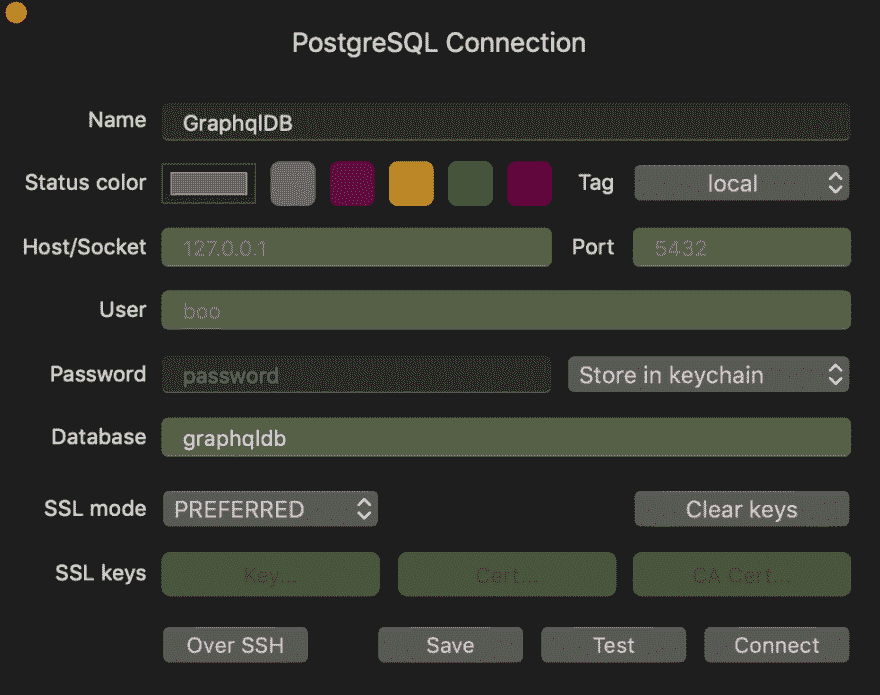

# 在 GraphQL 教程中使用 TypeORM 设置 PostgreSQL

> 原文：<https://dev.to/rxassim/setup-postgresql-with-typeorm-in-graphql-tutorial-1cn8>

注意:这是我时事通讯中的一篇交叉文章。每封邮件发出一周后，我都会在我的博客上发布。订阅以在您的收件箱中获得更多类似的内容💌！

嗨！在这篇文章中，我将向你展示如何在 GraphQL 服务器中用 TypeORM 设置 PostgreSQL。这是我通常用于后端项目的后端设置。

本教程侧重于 MacOS 环境🍏。稍后我可能会为 Windows 和 Linux 编写其他教程。

### MacOS Postgres 设置

最简单的方法是使用家酿，这是一个 MacOS 软件包管理器。

要安装 Homebrew，请在终端中运行以下命令:

```
/usr/bin/ruby -e "$(curl -fsSL https://raw.githubusercontent.com/Homebrew/install/master/install)" 
```

Enter fullscreen mode Exit fullscreen mode

安装结束后，我们需要安装 postgresql 包:

```
brew update
brew install postgresql
brew services start postgresql 
```

Enter fullscreen mode Exit fullscreen mode

为了确保所有东西都已安装，下一个命令应该返回已安装的 postgresql 的版本:

```
postgres --version 
```

Enter fullscreen mode Exit fullscreen mode

### 创建数据库

现在我们已经安装了 PostgreSQL，我们需要创建一个将要连接的数据库。我们将把我们的数据库命名为`graphqldb`。

在终端中运行下一条命令:

```
createdb graphqldb 
```

Enter fullscreen mode Exit fullscreen mode

这将为我们创建一个新的数据库。为了进行测试，你可以使用 [TablePlus](https://tableplus.io/) (免费)。

为了测试数据库是否存在，在 TablePlus 上创建一个新的连接，给它一个名称，在我的例子中，我将其命名为`GraphqlDB`，并给它一个数据库名称，即`graphqldb`(我们之前创建的数据库的名称)，然后单击 test。如果所有字段都变成绿色，那么数据库就创建好了，我们可以连接它了。

[](https://res.cloudinary.com/practicaldev/image/fetch/s--DRIGqGtz--/c_limit%2Cf_auto%2Cfl_progressive%2Cq_auto%2Cw_880/https://user-images.githubusercontent.com/17736659/49346097-a5f63d80-f68d-11e8-93ad-ea1cbf42e04e.png)

### 使用 Typescript 设置项目

现在让我们使用 typescript 创建一个新项目，为此我们需要安装一些依赖项。

首先让我们创建一个新的项目文件夹:

```
mkdir graphql-proj
cd graphql-proj 
```

Enter fullscreen mode Exit fullscreen mode

现在我们在项目文件夹中，我们需要安装`typescript`作为开发依赖项，并创建一个`tsconfig`文件:

```
yarn init -y
yarn add typescript nodemon ts-node @types/node -D 
```

Enter fullscreen mode Exit fullscreen mode

创建一个新文件，`tsconfig.json`并将下面的代码粘贴到其中:

```
{  "compilerOptions":  {  "lib":  ["es5",  "es6",  "esnext",  "dom"],  "target":  "es5",  "module":  "commonjs",  "moduleResolution":  "node",  "outDir":  "./build",  "emitDecoratorMetadata":  true,  "experimentalDecorators":  true,  "sourceMap":  true  }  } 
```

Enter fullscreen mode Exit fullscreen mode

我们将使用`nodemon`，这样我们就不必手动重启服务器来测试我们的更改。创建一个`nodemon.json`文件，并将下面的代码粘贴到其中:

```
{  "watch":  ["src"],  "ext":  "ts",  "exec":  "ts-node ./src/index.ts"  } 
```

Enter fullscreen mode Exit fullscreen mode

最后但同样重要的是，将以下部分添加到您的`package.json` :

```
"scripts":  {  "start":  "nodemon"  } 
```

Enter fullscreen mode Exit fullscreen mode

### 创建 GraphQL 服务器

对于我们的 GraphQL 服务器，我们将使用 [graphql-yoga](https://github.com/prisma/graphql-yoga) ，这是一个非常方便的用于创建 graphql 服务器的一体化包。

现在，添加这个包`graphql-yoga` :

```
yarn add graphql-yoga 
```

Enter fullscreen mode Exit fullscreen mode

要快速运行 graphql 服务器，只需从 [graphql-yoga](https://github.com/prisma/graphql-yoga) Quickstart 部分复制示例。

```
import { GraphQLServer } from 'graphql-yoga'

const typeDefs = `
  type Query {
    hello(name: String): String!
  }
`

const resolvers = {
  Query: {
    hello: (_, { name }) => `Hello ${name || 'World'}`,
  },
}

const server = new GraphQLServer({ typeDefs, resolvers })
server.start(() => console.log('Server is running on localhost:4000')) 
```

Enter fullscreen mode Exit fullscreen mode

让我们向 graphql 模式添加一个`User`类型，以便稍后我们可以从数据库中添加/编辑/删除用户:

```
...
const typeDefs = `
  type User {
    id: ID!
    name: String!
    email: String!
  }
  type Query {
    hello(name: String): String!
    user(id: ID!): User!
  }
`
... 
```

Enter fullscreen mode Exit fullscreen mode

### Setup TypeORM:

像往常一样，我们需要先安装一些包:

```
yarn add typeorm reflect-metadata pg
yarn add @types/node -D 
```

Enter fullscreen mode Exit fullscreen mode

一旦安装完成，将这两行添加到您的`tsconfig.json` :

```
...  "emitDecoratorMetadata":  true,  "experimentalDecorators":  true,  ... 
```

Enter fullscreen mode Exit fullscreen mode

创建一个`ormconfig.json`文件，将我们的数据库配置放入其中:

```
{  "type":  "postgres",  "host":  "localhost",  "port":  5432,  "database":  "graphqldb",  "synchronize":  true,  "logging":  true,  "entities":  ["src/entities/**/*.ts"]  } 
```

Enter fullscreen mode Exit fullscreen mode

正如您在配置中看到的，我们需要创建一个文件夹`entities`并将我们的实体放入其中。

在我们的例子中，我们将创建一个简单的`User.ts`实体:

```
import { Entity, PrimaryGeneratedColumn, Column, BaseEntity } from 'typeorm'

@Entity()
export class User extends BaseEntity {
  @PrimaryGeneratedColumn()
  id: number

  @Column()
  name: string

  @Column()
  email: string
} 
```

Enter fullscreen mode Exit fullscreen mode

这个实体与我们之前创建的 GraphQL `User`类型具有相同的属性。

现在在`index.ts`中，我们需要在启动服务器之前创建数据库连接:

```
...

const server = new GraphQLServer({ typeDefs, resolvers });

createConnection().then(() => {
  server.start(() => console.log("Server is running on localhost:4000"));
}).catch(() => {
  console.log("Couldn't connect to the database.")
}); 
```

Enter fullscreen mode Exit fullscreen mode

### 创建 addUser 突变

为了测试设置是否如我们希望的那样好，让我们创建一个向数据库添加用户的变异。

首先我们需要更新我们的模式:

```
...
const typeDefs = `
  type User {
    id: ID!
    name: String!
    email: String!
  }
  type Query {
    hello(name: String): String!
    user(id: ID!): User!
  }
  type Mutation {
    addUser(name: String!, email: String!): User
  }
`;
... 
```

Enter fullscreen mode Exit fullscreen mode

现在我们需要解决`addUser`突变和`user`查询，我们需要使用 TypeORM 的`getRepository`(我将写另一篇博文来详述 TypeORM ):

```
...
const resolvers = {
  Query: {
    hello: (_, { name }) => `Hello ${name || 'World'}`,
    // this is the user resolver
    user: (_, { id }) => {
      return getRepository(User).findOne(id)
    },
  },
  Mutation: {
    // this is the addUser resolver
    addUser: (_, { name, email }) => {
      const user = new User()
      user.email = email
      user.name = name
      return getRepository(User).save(user)
    },
  },
}
... 
```

Enter fullscreen mode Exit fullscreen mode

现在让我们添加一个使用这种变异的用户。转到`http://localhost:4000`并添加用户:

[](https://res.cloudinary.com/practicaldev/image/fetch/s--Q6qtEZg8--/c_limit%2Cf_auto%2Cfl_progressive%2Cq_auto%2Cw_880/https://user-images.githubusercontent.com/17736659/49346093-9e369900-f68d-11e8-9d96-66d88c9b46af.png)

正如您在右边看到的，我们创建了一个 id 为`1`的用户。

让我们尝试使用他的`Id`来查询我们刚刚添加的用户:

[](https://res.cloudinary.com/practicaldev/image/fetch/s--tPU_Jqqz--/c_limit%2Cf_auto%2Cfl_progressive%2Cq_auto%2Cw_880/https://user-images.githubusercontent.com/17736659/49346098-a5f63d80-f68d-11e8-8de2-b2c140bbf594.png)

我们赢回了用户🎉🎉