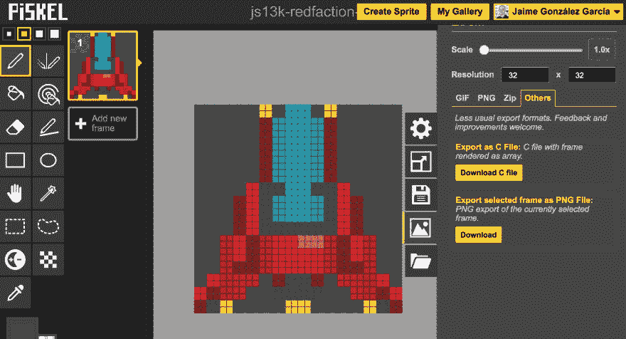
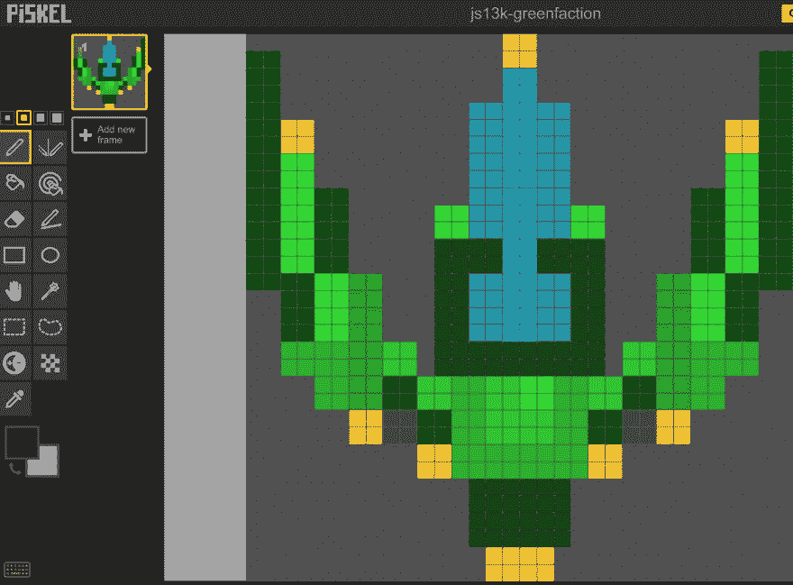
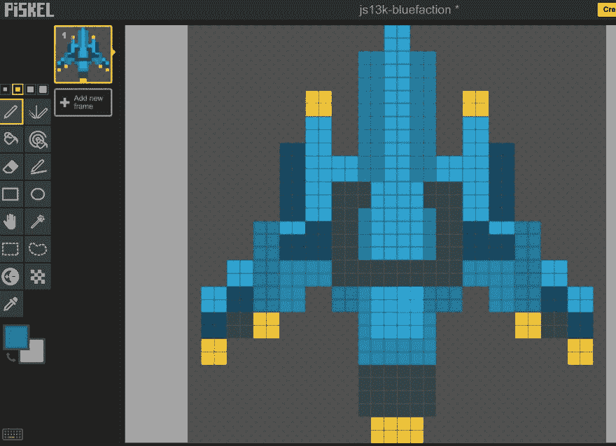

# 如何在照顾婴儿的同时用 13 Kb 写一个游戏

> 原文：<https://dev.to/vintharas/how-to-write-a-game-in-under-13-kb-while-taking-care-of-a-baby-4160>

*本文最初发布于[barbarianmeetscoding.com](https://www.barbarianmeetscoding.com/blog/2018/09/19/how-to-write-a-game-under-13k-while-taking-care-of-a-baby)。😊*

哇！有段时间了！过去的一年既精彩又艰难。作为一个平等的伙伴拥有并照顾一个婴儿是令人兴奋的，温暖人心的...非常累人，这就是为什么你在过去的一年里很少听到我的消息。让这篇文章和 [js13kgames](http://www.js13kgames.com) 比赛成为我的复出。

在下面的段落中，你将了解开发一款 13Kb 以下的游戏是什么感觉，我是如何应对挑战的，从规划到开发游戏机制、粒子系统、生成算法、音乐、星系、神秘外星人的舰队，以及我是如何到达类似游戏的东西: **[地球，即](http://js13kgames.com/entries/earth-that-was)** 。*(进入视频)*

[https://www.youtube.com/embed/yzkXUoI43ok](https://www.youtube.com/embed/yzkXUoI43ok)

## 13kb 以下写个游戏怎么样？

我不知道我到底是怎么发现[js13k 游戏](http://wwww.js13kgames.com)的。不知何故，它出现在我的推特上，我想*“嗯...俏皮……”*当我向下滚动到下一条 JavaScript 新闻时。直到几天后，这个想法在我脑海深处的某个地方形成并发酵，我决定，*“管它呢？这将是一个很棒的方式来重新点燃我对编码和在工作之外做一些很酷的事情的热情。*

原来是这样开始的。说服这位犹豫不决的父亲的最后一步是跟随[一个关于用](https://medium.com/web-maker/making-asteroids-with-kontra-js-and-web-maker-95559d39b45f) [kontra.js](https://straker.github.io/kontra/) 建造小行星的很棒的教程，并意识到这有多有趣。

## 设定目标和选择主题

所以我打算参加 gamejam，但是我的游戏是关于什么的呢？我想从这次 gamejam 体验中得到什么？对我来说，最重要的事情是**了解游戏开发**、**玩得开心**和**完成游戏**。考虑到这一点，我决定尽可能简化事情，继续使用教程中的太空射手主题。我经常发现，为了学习新的东西，你可以遵循的最佳方法是把事情分解，减少你在任何给定时间处理的复杂性。

为了节省宝贵的 13Kb，我会使用支持地图、图像、音乐等程序生成的经验法则...超过手工工作，由于我特殊的时间限制，我的目标是从基本原则开始以最简单的形式让一切工作(没有太多时间投入研究)。

## 机会主义编码，或者没有时间编码的时候怎么编码

下一个障碍是找时间开发游戏。作为一个有一个非常小的婴儿的父亲，我的时间和注意力都属于他，只有在他睡觉的时候，我才有时间和宁静去做除了照顾婴儿以外的任何事情。这里有几个同样适用于爸爸和非爸爸生物的建议:

1.  **干掉多任务**。专注于手头的一项任务。手头的一个项目。一次做一件事。持续的迭代努力应用到一个单一的问题上会结出惊人的果实。
2.  行动产生动力。如果你累了，感觉不到，打开你的电脑，开始编码。你会惊讶地发现，仅仅几分钟的编码后，你就会进入状态，感到精力充沛。

## 设置游戏开发环境

对于开发环境，我会使用这个时代的 web 开发人员熟悉的东西，  ，  和 。运行这样的东西:

```
$ npm start 
```

会设置我的游戏开发环境与现场重装。还有:

```
$ npm run build 
```

将我的作品“二进制”提交给竞争对手。这是一个超级方便的设置，而且  帮助我更快地找到并修复了某些错误。

在优化 JS 以将其保持在 13 Kb 以下方面，我用  和修补了一段时间，但我最终使用了 uglifyJS，因为它与 Webpack 有更好的集成。(TBH，在我仅有的一点时间里，我无法完成收尾工作，丑陋的 JS 已经足够好了)。

## 编写游戏

写游戏是一件非常有趣的事情。我最喜欢编程的一点是，它是一门创造的艺术:没有任何东西；你写一些代码然后**嘣！无中生有。游戏开发在这方面特别强，因为你有能力创造世界。如果你问我，我会觉得这很酷。领域模型无疑击败了我以前合作过的任何应用程序，`SpaceShip`、`Planet`、`Bullet`、`Elder`在一天中的任何时候都赢过`PurchaseOrder`。**

### 如果不是很酷吗？游戏设计

因为我玩这个游戏的主要目标是学习如何开发游戏，所以我采取了一种非常开放和探索性的方法:我称之为**不会很酷的游戏设计**。我知道我想做一个太空射击游戏，因为我认为这是一个比其他类型的游戏更简单的任务，但我没有花太多时间来计划这个游戏。我只是问自己:**写不同的孤立的力学，如果...**

*   这些小行星有很好的纹理？
*   它们有不同的形状和大小？
*   当飞船被摧毁时，他们会投放资源来充电/修理飞船？
*   飞船推进器发射出粒子？
*   有几个派别有不同的船只和目标？
*   有神秘且极度危险的外星人在四处游荡？
*   当没有能量时，游戏中不同的飞船系统会停止工作？
*   你可以宣称有行星？
*   你可以拥有这些星球的经济并建造防御设施、船只等？
*   你可以用不同的武器系统和方式向你的敌人发射火焰和毁灭？
*   如此这般，如此这般...

虽然这是一个开发游戏的有趣方式，但这意味着在比赛的最后一天，我有了一堆基本上孤立的机制，而不是一个游戏。有船，小行星，行星，太阳，扇区，星系，外星人，但是没有什么能把它们连接在一起成为一个类似游戏的东西。

所以在最后一天，我和我的儿子 Teo(在他睡觉的时候)进行了一次头脑风暴，想出了一个可以在一天内将所有这些元素联系在一起的想法:

一艘飞船盘旋在环绕垂死的地球的轨道上，这是人类最后的希望，它包含了跨越星球的新人类文明的种子。唯一缺少的是一个能够容纳剩余人类的新地球。那是地球。但它可以再次出现。

所以。很深。

### Using Kontra

Kontra.js 是一个极简的 2D 游戏库，非常适合 js13k 挑战。它提供了开发 2D 游戏所需的所有基础知识:一个更新游戏状态并在画布上渲染的游戏循环，一种在游戏中表示事物(精灵)的方法，如船只、小行星或子弹，一种加载资源和处理输入的方法，tilemaps，带有动画的精灵表，等等。好的方面是它是模块化的，你可以选择你想使用的部分，为你的游戏节省那些宝贵的 Kb。不太好的一点是(取决于您的偏好和您的开发环境)，它不支持 ESM，而 ESM 对于树抖动来说是很方便的。

Kontra 的 API 非常喜欢工厂函数，所以我用工厂函数代替类来建模我所有的域对象，因为它感觉更自然、更对称、更合适。例如，这是一个子弹-导弹-射弹的东西:

```
export interface Bullet extends Sprite {
  damage: number
  owner: Sprite
  color: RGB
}

const numberOfParticles = 2

export default function createBullet(
  position: Position,
  velocity: Velocity,
  angle: number,
  cameraPosition: Position,
  scene: Scene,
  owner: Sprite,
  damage: number = 10,
  color: RGB = { r: 255, g: 255, b: 255 }
): Bullet {
  const cos = Math.cos(degreesToRadians(angle))
  const sin = Math.sin(degreesToRadians(angle))

  return kontra.sprite({
    type: SpriteType.Bullet,
    // start the bullet at the front of the ship
    x: position.x + cos * 12,
    y: position.y + sin * 12,
    // move the bullet slightly faster than the ship
    dx: velocity.dx + cos * 5,
    dy: velocity.dy + sin * 5,
    // damage can vary based on who shoots the missile
    damage,
    // avoid friendly fire
    owner,
    ttl: 50,
    width: 2,
    height: 2,
    color,
    update() {
      this.advance()
      this.addParticles()
    },
    addParticles() {
      let particles = callTimes(numberOfParticles, () =>
        Particle(
          { x: this.x, y: this.y },
          { dx: this.dx, dy: this.dy },
          cameraPosition,
          angle,
          { color }
        )
      )
      particles.forEach(p => scene.addSprite(p))
    },
    render() {
      let position = getCanvasPosition(this, cameraPosition)
      Draw.fillRect(
        this.context,
        position.x,
        position.y,
        this.width,
        this.height,
        Color.rgb(this.color)
      )

      if (Config.debug && Config.showPath) {
        this.context.save()
        this.context.translate(position.x, position.y)
        Draw.drawLine(this.context, 0, 0, this.dx, this.dy, 'red')
        this.context.restore()
      }

      if (Config.debug && Config.renderCollisionArea) {
        this.context.save()
        this.context.translate(position.x, position.y)
        Draw.drawCircle(this.context, 0, 0, this.width / 2, 'red')
        this.context.restore()
      }
    },
  })
} 
```

除了这些游戏对象之外，它们只是扩展了`kontra.sprite({...})`的工厂，代表了游戏中任何可见的和能够交互的对象，我还创建了几个抽象:`Scene`和`Game`本身。这些场景非常有助于表现游戏的不同部分，并以有意义的方式对游戏对象进行分组(如开放场景、太空场景、游戏场景等)...)虽然游戏提供了一种集中状态管理、控制游戏音乐、预加载资产的方式，并提供了一种在场景之间转换的方式。

### 创成式编程

我花了大部分时间做两件事:

1.  用我的头去撞击基本的牛顿物理学和几何学，
2.  设计简单的算法来生成纹理、粒子、名字和星系。

让我们仔细看看 **#2** 哪个可能会让你更感兴趣。总的来说，在开发这些算法时，我遵循了几条规则:

1.  尽可能快地让一些东西工作起来，然后迭代
2.  思考首要原则。你将如何从头开始做这件事？

#### 像素化纹理

对于行星的纹理，我想达到像素艺术的感觉，看起来不像狗屎(所以非常低的期望:D)。我从三种类型的行星开始:红色、绿色和蓝色，以及从这些单独的颜色生成完整调色板的想法。

我立刻想到了`HSL`颜色模型，它是生成这些调色板的绝佳候选。`HSL`代表`Hue`、`Saturation`和`Lightness`，后者是*的英文意思，如果我上下改变亮度，我会得到一个调色板*。我就是这么做的。我的第一个算法使用了单一的颜色，并建立了一个调色板，有 2 个较暗的阴影和 2 个较亮的阴影。这些颜色后来以不同的比例应用于产生一个图案，然后用于填充一个星球的表面。后来，我在图案的不同部分尝试了不同的比例，透明度和调色板中有更多的颜色。

最终的算法使用了基色和强调色，看起来像这样:

```
// A way to represent HSL colors
export interface HSL {
  h: number
  s: number
  l: number
}

// An offscreen canvas to create textures
// in the background
export class OffscreenCanvas {
  // more codes here...
  // but here's the interesting part

  private savedPatterns: Map<string, CanvasPattern> = new Map<
    string,
    CanvasPattern
  >()

  getPatternBasedOnColors(
    primary: HSL,
    secondary: HSL,
    width: number = 16,
    height: number = 16,
    pixelSize: number = 2
  ) {
    // memoize
    // TODO: extract to higher-order function
    if (
      this.savedPatterns.has(twocolorkey(primary, secondary, width, height))
    ) {
      return this.savedPatterns.get(
        twocolorkey(primary, secondary, width, height)
      )
    }

    this.canvas.width = width
    this.canvas.height = height

    // 1\. define color theme
    let p = primary
    let s = secondary

    // Functions that return colors with different
    // alpha values. I ended up only using completely solid colors
    let baseColor = (a: number) => Color.hsla(p.h, p.s, p.l, a)
    let lightShade = (a: number) => Color.hsla(p.h, p.s, p.l + 10, a)
    let darkShade = (a: number) => Color.hsla(p.h, p.s, p.l - 10, a)
    let accent = (a: number) => Color.hsla(s.h, s.s, s.l, a)

    // This defines the color distribution
    // e.g. 40% base color, 20% lighter shade, 20% darker shade
    // and 20% accent color
    let buckets = [
      baseColor,
      baseColor,
      baseColor,
      baseColor,
      lightShade,
      lightShade,
      darkShade,
      darkShade,
      accent,
      accent,
    ]

    // 3\. distribute randomly pixel by pixel see how it looks
    for (let x = 0; x < this.canvas.width; x += pixelSize) {
      for (let y = 0; y < this.canvas.height; y += pixelSize) {
        let pickedColor = pickColor(buckets)
        this.context.fillStyle = pickedColor
        this.context.fillRect(x, y, pixelSize, pixelSize)
      }
    }

    let pattern = this.context.createPattern(this.canvas, 'repeat')
    this.savedPatterns.set(
      twocolorkey(primary, secondary, width, height),
      pattern
    )
    return pattern
  }
}

function pickColor(buckets: any) {
  let index = Math.round(getValueInRange(0, 9))
  let alpha = 1
  return buckets[index](alpha)
}

function twocolorkey(
  primary: HSL,
  secondary: HSL,
  width: number,
  height: number
) {
  let key1 = key(primary.h, primary.s, primary.l, width, height)
  let key2 = key(secondary.h, secondary.s, secondary.l, width, height)
  return `${key1}//${key2}`
} 
```

因为每次你需要的时候都创建一个图案有点贵，所以我*记住了*使用相同的颜色和尺寸创建的每个图案。通俗地说， *memoizing* 意味着保存带有一些参数的函数调用的结果，这样我就不需要再次处理相同的结果。在这种情况下，这意味着一旦创建了纹理就保存它们，并反复使用它们。

这里有很大的改进空间，我会喜欢做更多的实验，能够生成大块的陆地，云的形成，等等。然而结果相当好，我喜欢我的行星的样子。:D

#### 美丽的星星

当你的游戏发生在太空中，一切都是黑色的，玩家很难看到移动飞船的效果。所以我想创建一个星空背景，并实现某种视差效果，这将为玩家提供关于空间运动的巨大线索。

为了做到这一点，我设计了一个算法，该算法将考虑以下因素:

*   飞船周围的背景将永远被星星覆盖。
*   随着飞船的移动，我们将星星从飞船后面的*移动到飞船前面的*，创造出所有东西都被星星覆盖的幻觉。**
**   恒星与飞船的距离不同。有些会很远很远，有些会近一些*   远的星星会比近的星星看起来更暗更小*   当船移动时，远的恒星比近的恒星移动得慢*

 *`Star`本身就是一个非常简单的游戏对象:

```
export interface StarBuilder extends SpriteBuilder {}
export interface Star extends Sprite {
  distance: number
  color: string
}

export function Star({ x, y, cameraPosition }: StarBuilder): Star {
  let distance: number = parseFloat(getValueInRange(0, 1).toFixed(2))
  let alpha: number = 1 - 3 * distance / 4
  let color: string = Color.get(alpha)
  let size: number = 2.5 + (1 - distance)

  return kontra.sprite({
    // create some variation in positioning
    x: getNumberWithVariance(x, x / 2),
    y: getNumberWithVariance(y, y / 2),
    type: SpriteType.Star,
    dx: 0,
    dy: 0,
    ttl: Infinity,
    distance,
    color,
    size,
    render() {
      // the more distant stars appear dimmer
      // limit alpha between 1 and 0.75
      // more distant stars are less affected by the camera position
      // that is, they move slower in reaction to the camera changing
      // this should work as a parallax effect of sorts.
      let position = getCanvasPosition(this, cameraPosition, this.distance)
      this.context.fillStyle = this.color
      this.context.fillRect(position.x, position.y, this.size, this.size)
    },
  })
}

export function getNumberWithVariance(n: number, variance: number): number {
  return n + Math.random() * variance
} 
```

肉在函数中计算游戏对象在画布中的位置`getCanvasPosition`，并考虑摄像机位置和摄像机变化时距离的影响:

```
// Get position of an object within the canvas by taking into account
// the position of the camera
export function getCanvasPosition(
  objectPosition: Position,
  cameraPosition: Position,
  distance: number = 0
): Position {
  // distance affects how distant objects react to the camera changing
  // distant objects move slower that close ones (something like parallax)
  // that is, moving the ship will have less effect on distant objects
  // than near ones

  // distance is a value between 0 (close) and 1 (far)
  // at most the deviation factor will be 0.8
  let deviationFactor = 1 - distance * 0.2

  // include canvasSize / 2 because the camera is always pointing
  // at the middle of the canvas
  let canvasPosition: Position = {
    x:
      objectPosition.x -
      (cameraPosition.x * deviationFactor - Config.canvasWidth / 2),
    y:
      objectPosition.y -
      (cameraPosition.y * deviationFactor - Config.canvasHeight / 2),
  }

  return canvasPosition
} 
```

#### 人名

我最初的想法是探索一个无限的星系，手动命名每个星系、恒星和行星是行不通的。我只能想象 5 到 7 个名字。最多了。因此，我根据以下原则编写了一个名称生成器:

*   生成 1 到 3 个字母的音节。
*   1 个字母音节将是人声
*   2 和 3 个字母的音节将以辅音开头
*   把 2 到 4 个音节放在一起组成一个单词

我的希望是，连接音节而不是随机字符将导致更可识别和可信的名字，我认为我做到了这一点。算法看起来是这样的:

```
export function generateName() {
  let numberOfSyllabes = getIntegerInRange(2, 4)
  let name = ''
  for (let i = 0; i < numberOfSyllabes; i++) {
    name += `${generateSyllable()}`
  }
  return name
}

let vocals = ['a', 'e', 'i', 'o', 'u', 'ä', 'ö', 'å']
let minCharCode = 97 // a
let maxCharCode = 122 // z

function generateSyllable() {
  let syllableSize = getIntegerInRange(1, 3)
  if (syllableSize === 1) return getVocal()
  else if (syllableSize === 2) return `${getConsonant()}${getVocal()}`
  else return `${getConsonant()}${getVocal()}${getConsonant()}`
}

function getVocal() {
  return getRandomValueOf(vocals)
}
function getConsonant() {
  let consonant = ''
  while (!consonant) {
    let code = getIntegerInRange(minCharCode, maxCharCode)
    let letter = String.fromCharCode(code)
    if (!vocals.includes(letter)) consonant = letter
  }
  return consonant
} 
```

#### 粒子

我爱粒子！我认为他们增加了一个让游戏看起来和感觉更好的元素。当我着手编写粒子引擎时(尽管对于几个函数来说，*引擎*这个词太过雄心勃勃了)，我问自己**什么是粒子？这引发了一场非常有趣的对话，关于生命、宇宙和一切的终极问题的答案。不过，我不会拿细节来烦你...最后归结为:粒子是从一个源头以不同的方向、速度和加速度冒出来的小精灵，它们随着时间的推移逐渐消失。所以我的粒子引擎需要:**

*   创建从原点发芽的粒子
*   在给定方向和速度的情况下(我没有考虑加速度，我敢打赌这是一件很棒的事情)
*   粒子会有不同的生存时间
*   随着时间的推移，粒子会褪色、变小并消失
*   粒子会有不同的颜色，你可以配置

差不多就是这样。这是一个用于子弹的粒子的例子，最终看起来像彗星的尾巴:

```
export interface Particle extends Sprite {}
export interface ParticleOptions {
  ttl?: number
  color?: RGB
  magnitude?: number
}

// particle that takes into account camera position
export function Particle(
  position: Position,
  velocity: Velocity,
  cameraPosition: Position,
  // angle for the particles
  particleAxis: number,
  { ttl = 30, color = { r: 255, g: 255, b: 255 } }: ParticleOptions = {}
): Particle {
  let ParticleAxisVariance = getValueInRange(-5, 5)

  let cos = Math.cos(degreesToRadians(particleAxis + ParticleAxisVariance))
  let sin = Math.sin(degreesToRadians(particleAxis + ParticleAxisVariance))

  return kontra.sprite({
    type: SpriteType.Particle,

    // particles originate from a single point
    x: position.x,
    y: position.y,

    // variance so that different particles will have
    // slightly different trajectories
    dx: velocity.dx - cos * 4,
    dy: velocity.dy - sin * 4,

    // each particle with have a slightly
    // different lifespan
    ttl: getValueInRange(20, ttl),
    dt: 0,

    width: 2,
    update() {
      this.dt += 1 / 60
      this.advance()
    },
    render() {
      let position = getCanvasPosition(this, cameraPosition)
      // as time passes the alpha increases until particles disappear
      let frames = this.dt * 60
      let alpha = 1 - frames / ttl
      let size = (1 + 0.5 * frames / ttl) * this.width
      this.context.fillStyle = Color.rgba(color.r, color.g, color.b, alpha)
      this.context.fillRect(position.x, position.y, size, size)
    },
  })
} 
```

#### 星系

正如我前几节所说，我最初的想法是为玩家创造一个看似无限的星系去探索。我想，如果我让游戏变得足够困难和具有挑战性，玩家会在厌倦探索太空之前死去。我很乐意在玩家探索的时候探索生成星系的想法，但最终，随着最后期限的临近，我选择了 v0 版本，在这个版本中，我刚刚创建了一个 10x10 的扇区星系。所以:

*   银河系有 10×10 个扇区
*   一个扇区基本上是一个恒星系统，有一个中心恒星和 1 到 5 颗行星围绕它旋转(除了我们的恒星系统，它拥有你所期望的所有行星。抱歉冥王星，没有矮行星)。
*   这些扇区将占据一个 10000x10000 像素的表面，使可探索的星系成为一个 100Kx100K 的空间。
*   玩家将在太阳系中绕地球轨道运行开始游戏，太阳系方便地位于银河系的中间。

这是一些强大部门的示例代码:

```
export interface Sector extends Position {
  name: string
  planets: Planet[]
  sun: Sun
  bodies: Sprite[]

  asteroids?: Asteroid[]
}

export function Sector(
  scene: Scene,
  position: Position,
  cameraPosition: Position,
  name = generateName()
): Sector {
  // HAXOR
  let isSunSystem = name === 'sun'
  let isOrion = name === 'orion'

  let sun = createSectorSun(position, cameraPosition, name)
  let planets = createPlanets(sun, scene, cameraPosition, {
    isSunSystem,
    isOrion,
  })
  return {
    // this position represents the
    // top-left corner of the sector
    x: position.x,
    y: position.y,
    name,

    sun,
    planets,

    bodies: [sun, ...planets],
  }
}

function createSectorSun(
  sectorPosition: Position,
  cameraPosition: Position,
  name: string
) {
  let centerOfTheSector = {
    x: sectorPosition.x + SectorSize / 2,
    y: sectorPosition.y + SectorSize / 2,
  }
  let sunSize = getValueInRange(125, 175)
  let sun = createSun({ ...centerOfTheSector }, sunSize, cameraPosition, name)
  return sun
}

function createPlanets(
  sun: Sun,
  scene: Scene,
  cameraPosition: Position,
  { isSunSystem = false, isOrion = false }
) {
  if (isSunSystem) return createSunSystemPlanets(sun, scene, cameraPosition)
  if (isOrion) return createOrionSystemPlanets(sun, scene, cameraPosition)

  let numberOfPlanets = getIntegerInRange(1, 5)
  let planets = []
  let planetPosition: Position = { x: sun.x, y: sun.y }
  for (let i = 0; i < numberOfPlanets; i++) {
    let additiveOrbit = getValueInRange(500, 1000)
    planetPosition.x = planetPosition.x + additiveOrbit
    let radius = getValueInRange(50, 100)
    let planet = createPlanet(
      sun,
      /* orbit */ planetPosition.x - sun.x,
      radius,
      cameraPosition,
      scene
    )
    planets.push(planet)
  }
  return planets
}

interface PlanetData {
  orbit: number
  radius: number
  name: string
  type: PlanetType
  angle?: number
  claimedBy?: Faction
}
function createSunSystemPlanets(
  sun: Sun,
  scene: Scene,
  cameraPosition: Position
) {
  let planets: PlanetData[] = [
    { orbit: 300, radius: 30, name: 'mercury', type: PlanetType.Barren },
    { orbit: 500, radius: 70, name: 'venus', type: PlanetType.Desert },
    {
      orbit: 700,
      radius: 50,
      name: '*earth*',
      type: PlanetType.Paradise,
      angle: 40,
      claimedBy: Faction.Blue,
    },
    { orbit: 900, radius: 40, name: 'mars', type: PlanetType.Red },
    { orbit: 1500, radius: 150, name: 'jupiter', type: PlanetType.GasGiant },
    { orbit: 2100, radius: 130, name: 'saturn', type: PlanetType.GasGiant },
    { orbit: 2700, radius: 110, name: 'uranus', type: PlanetType.Blue },
    { orbit: 3500, radius: 110, name: 'neptune', type: PlanetType.Blue },
  ]
  return planets.map(p =>
    createPlanet(sun, p.orbit, p.radius, cameraPosition, scene, {
      name: p.name,
      type: p.type,
      startingAngle: p.angle,
      claimedBy: p.claimedBy,
    })
  )
}

function createOrionSystemPlanets(
  sun: Sun,
  scene: Scene,
  cameraPosition: Position
) {
  return [
    createPlanet(sun, 700, 100, cameraPosition, scene, {
      name: 'orion',
      type: PlanetType.Paradise,
    }),
  ]
} 
```

### 远古的长者种族

我想在游戏中加入一点香料，比如辣椒或胡椒，让游戏更有挑战性和趣味性。由于我没有太多的时间来思考和发展这个游戏的深层知识，我选择了一个科幻和幻想的比喻，**长者种族**。

我希望玩家至少要和三种不同类型的敌人战斗:

*   一种超快速、短程、弱但具有攻击性的飞行器:**无人机**
*   一个中型单位，非常坚固，可以在行星和恒星周围巡逻:哨兵
*   一艘巨大、坚固和强大的战舰将很少被看到，它将能够随意运输和喷射无人机:母舰。

这个想法是让这些不同的恒星系统以不同的方式居住，并有一个他们居住的中央系统，拥有所有舰队的母亲。在游戏开始的时候，我不太确定这个年长种族的角色或最终目标是什么，但后来我确定他们是最后一个适合人类生活的星球的守护者，因此也是游戏的最终老板。

当我实现这些旧船时，我想开发一个系统，在那里我可以定义...让我们打电话给他们...人工智能行为(同样是 **AI** 对于非常基本的算法来说是一个过于模糊的词)然后随意将它们组合在一起。所以我们可以让*跟随这个目标*，或者*向它射击*，或者*在这个区域巡逻*，或者*在你没有其他事情做的时候跟随这个路线*。

该系统由一系列 [Mixins](https://www.barbarianmeetscoding.com/blog/2015/12/28/black-tower-summoning-object-composition-with-mixins/) 组成，暴露了以下接口:

```
export interface Behavior {
  type: BehaviorType
  properties: BehaviorProperties
  update(dt?: number): void
  render?(): void
}

export interface BehaviorProperties {
  // any property
  [key: string]: any
} 
```

这个接口由一堆任意的属性`BehaviorProperties`组成，行为本身需要这些属性来运行，还有一个`update`和`render`方法来挂钩到自然的`Sprite`生命周期中。

行为的一个例子是这个`Shoot`，它通过让游戏对象在目标靠近时向目标射击来实现这个接口(`< 300` ):

```
export function Shoot(scene: Scene, target: Position): Behavior {
  return {
    type: BehaviorType.Shoot,
    properties: {
      dts: 0,
      damage: 1,
      color: { r: 255, g: 255, b: 255 },
    },
    update(dt?: number) {
      this.dts += 1 / 60
      let distanceToShip = Vector.getDistanceMagnitude(this, target)
      if (this.dts > 0.5 && distanceToShip < 300) {
        this.dts = 0
        let angle = radiansToDegrees(Math.atan2(this.dy, this.dx))
        let bullet = createBullet(
          this,
          this,
          angle,
          target,
          scene,
          /*owner*/ this,
          this.damage,
          this.color
        )
        scene.addSprite(bullet)
      }
    },
  }
} 
```

我用一个普通的`Sprite`来编写这个函数的方法是使用这个`composeBehavior`函数:

```
export function composeBehavior(sprite: Sprite, behavior: Behavior) {
  // only add properties if they're not already there
  Object.keys(behavior.properties).forEach(k => {
    if (sprite[k] === undefined) {
      sprite[k] = behavior.properties[k]
    }
  })

  sprite.update = before(sprite.update, behavior.update).bind(sprite)
  if (behavior.render) {
    sprite.render = after(sprite.render, behavior.render).bind(sprite)
  }
} 
```

其中`before`和`after`为效用函数:

```
/* Call a function before another function */
export function before(func: any, beforeFunc: any) {
  return function(...args: any[]) {
    beforeFunc.apply(this, args)
    func.apply(this, args)
  }
}

/* Call a function after another function */
export function after(func: any, ...afterFuncs: any[]) {
  return function(...args: any[]) {
    func.apply(this, args)
    afterFuncs.forEach((f: any) => f.apply(this, args))
  }
} 
```

因此，利用这个行为组合，我可以定义一个行为集合，并*将*它们附加到不同的旧船上，就像这样:

```
// some code...
if (this.elderType === ElderType.Sentry) {
  // patrol around target following an orbit of 200
  // (it'll be a planet setup later on)
  composeBehavior(elder, PatrolAroundTarget(PatrolType.Orbit, /* orbit */ 200))

  // if the player's ship comes near (<300) follow it steady
  composeBehavior(elder, FollowSteadyBehavior(this.ship, 300))

  // if the player's ship is near (<300) shoot at it
  composeBehavior(elder, Shoot(scene, this.ship))
}
// more code... 
```

这很好，因为它节省了 Kb 的，它允许我随意配置和附加行为，对长者，在未来，也许其他人工智能控制的派系。

### 像素艺术

我热爱像素艺术，但我只是一个完全的业余像素艺术家。对于这个游戏，我想至少有一个手工制作的看起来很酷的飞船。为了得到一个漂亮的精灵效果，我选择了 32x32 像素的精灵和有限的调色板。我使用了 [Piskel](https://www.piskelapp.com) ，这是一个**非常**好的基于网络的应用程序，用于创建像素艺术。下面你可以看到我制作的不同船只和 Piskel 编辑器本身的一些例子:

[](https://res.cloudinary.com/practicaldev/image/fetch/s--D3c1UYmb--/c_limit%2Cf_auto%2Cfl_progressive%2Cq_auto%2Cw_880/https://www.barbarianmeetscoding.cimg/js13k-games-pixelart-redship-versions.jpg)

[](https://res.cloudinary.com/practicaldev/image/fetch/s--30ygFuTz--/c_limit%2Cf_auto%2Cfl_progressive%2Cq_auto%2Cw_880/https://www.barbarianmeetscoding.cimg/js13k-games-pixelart-redship-piskel-editor.jpg)

[](https://res.cloudinary.com/practicaldev/image/fetch/s---CCHz753--/c_limit%2Cf_auto%2Cfl_progressive%2Cq_auto%2Cw_880/https://www.barbarianmeetscoding.cimg/js13k-games-pixelart-greenship-piskel-editor.jpg)

[](https://res.cloudinary.com/practicaldev/image/fetch/s--az4NOhYw--/c_limit%2Cf_auto%2Cfl_progressive%2Cq_auto%2Cw_880/https://www.barbarianmeetscoding.cimg/js13k-games-pixelart-blueship-piskel-editor.jpg)

### 音乐

音乐是游戏中非常重要的成分。它帮助你使你的游戏更加身临其境，向玩家提供反馈，设置合适的气氛并引发情绪(兴奋、恐惧、紧张、平静等)...).有了 13Kb 的限制，我立刻想到了生殖音乐(我在我的 twitter feed 中听到了很多)和使用[网络音频 API](https://developer.mozilla.org/en-US/docs/Web/API/Web_Audio_API) 。我遇到了两个障碍:

*   我对音乐一点概念都没有，无论是哪种形式
*   我对网络音频 API 的工作方式一无所知

在游戏的其他部分，我满足于脱离基本原则思考和解决问题。然而，当谈到音乐时，我真的需要研究、阅读和向他人学习。这是我在给游戏添加音乐时发现的无价之宝:

*   来自 [@teropa](https://twitter.com/teropa) 的这些关于网络音频的系列简直太棒了。他们对理解网络音频 API 的工作方式以及如何利用它来制作音乐有很大的帮助。
*   同样令人敬畏的还有他对生殖音乐的实验(还有 T2 的更多实验)。虽然在开发这个游戏的时候，它们对我来说太先进了，但是在接下来的几个月里，它们可能会派上用场，也许我能够在未来的游戏堵塞中吸收这些知识。
*   由 [@mcfunkypants](https://twitter.com/McFunkypants) 为 [procjam](http://www.procjam.com) 做的关于[程序音乐生成](http://www.procjam.com/tutorials/en/music/)的教程也非常好，给了我很多想法。
*   最后，阅读了[@ kevincentnis](https://twitter.com/kevincennis)[实现 TinyMusic](https://medium.com/@kevincennis/how-i-built-tinymusic-js-part-1-5a298d5d79ef) 的旅程，并查看了[的源代码](https://github.com/kevincennis/TinyMusic)，这是一次很好的学习经历，教会了我如何使用网络音频 API 创建音符序列。

最后，我写了一个小音乐引擎，从 TinyMusic 和 T2 的文章中汲取了很多灵感。不幸的是，就在我把它提交给比赛之前，我不得不在最后的 13k-猎巫时间里把它从游戏中删除。我唯一保留的是一个[击打效果](http://teropa.info/blog/2016/09/20/additive-synthesis.html#beating)我觉得和游戏的感觉很匹配。如果你对术语*节拍*不熟悉，就像我一周前一样，它包括混合频率非常接近的波，这些波在同相时相互加强，在异相时相互抵消，产生不断变化的准音符。

```
function Oscillator(ac: AudioContext, freq = 0) {
  let osc = ac.createOscillator()
  osc.frequency.value = freq
  return osc
}

function Gain(ac: AudioContext, gainValue: number) {
  let gain = ac.createGain()
  gain.gain.value = gainValue
  return gain
}

interface Connectable {
  connect(n: AudioNode): void
}
function Beating(
  ac: AudioContext,
  freq1: number,
  freq2: number,
  gainValue: number
) {
  let osc1 = Oscillator(ac, freq1)
  let osc2 = Oscillator(ac, freq2)
  let gain = Gain(ac, gainValue)
  osc1.connect(gain)
  osc2.connect(gain)
  return {
    connect(n: AudioNode) {
      gain.connect(n)
    },
    start(when = 0) {
      osc1.start(when)
      osc2.start(when)
    },
    stop(when = 0) {
      osc1.stop(when)
      osc2.stop(when)
    },
  }
}

function Connect({ to }: { to: AudioNode }, ...nodes: Connectable[]) {
  nodes.forEach(n => n.connect(to))
}

interface MusicTrack {
  start(): void
  stop(): void
}

function GameOpeningMusic(ac: AudioContext): MusicTrack {
  let b1 = Beating(ac, 330, 330.2, 0.5)
  let b2 = Beating(ac, 440, 440.33, 0.5)
  let b3 = Beating(ac, 587, 587.25, 0.5)
  let masterGain = Gain(ac, 0.1)

  Connect({ to: masterGain }, b1, b2, b3)
  masterGain.connect(ac.destination)

  return {
    start() {
      b1.start()
      b2.start()
      b3.start()
    },
    stop() {
      b1.stop()
      b2.stop()
      b3.stop()
    },
  }
}

export interface GameMusic {
  play(track: Track): void
  stop(): void
  currentTrack: MusicTrack
}

export function GameMusic(): GameMusic {
  let ac = new AudioContext()

  return {
    currentTrack: undefined,
    play(track: Track) {
      if (this.currentTrack) {
        this.currentTrack.stop()
      }
      let musicTrack = Tracks[track]
      this.currentTrack = musicTrack(ac)
      this.currentTrack.start()
    },
    stop() {
      this.currentTrack.stop()
    },
  }
} 
```

## 结论

这太有趣了！！！如果在我彻底推荐之前你还没有加入一个游戏 jam。不知道是不是所有游戏卡顿都像 [js13k](http://wwww.js13kgames.com) 一样。但事实上，这一次超过了整整一个月的时间，我可以在这里和那里找到时间，而不会感到超级匆忙。此外，使用 JavaScript 和开放 web 技术使入门变得更加容易。你只需要一个编辑器和一个浏览器就可以了(或者你甚至可以使用基于浏览器的编辑器:D)。

我也学到了很多关于游戏开发和网络音频 API 的知识。我有一大堆不同的小线索，我很想关注并体验游戏开发、生成式编程、音乐和像素艺术的许多其他方面。

总的来说，我觉得我完成了这次比赛的目标。如果我能改变一件事，我希望花多一点时间去计划，并有一个更明确的目标，那就是我想去哪里。这将有助于我集中精力，并最终提交一个更完美的游戏。

接下来的几周[我会继续更新游戏](https://www.barbarianmeetscoding.com/js13k-spaceshooter/)并将它打磨到我满意的水平。我认为这将是测试新游戏机制和完善那些生成算法的完美场所。

还有你！保重，考虑加入一个游戏果酱！:D

P.S .你可以在这里玩原版游戏！试试看，让我知道你的想法！:D*