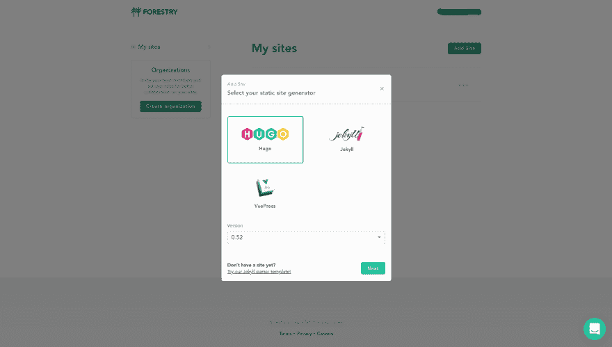
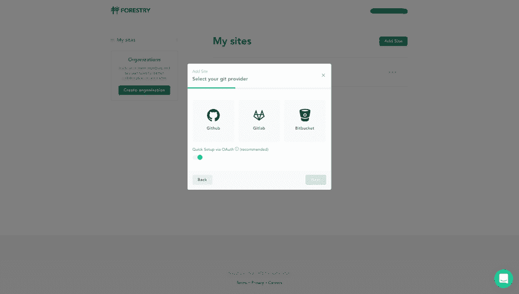
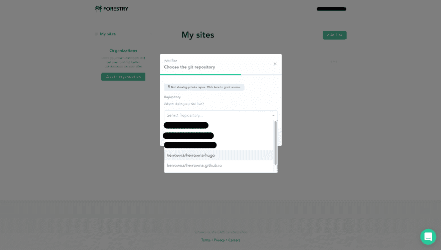
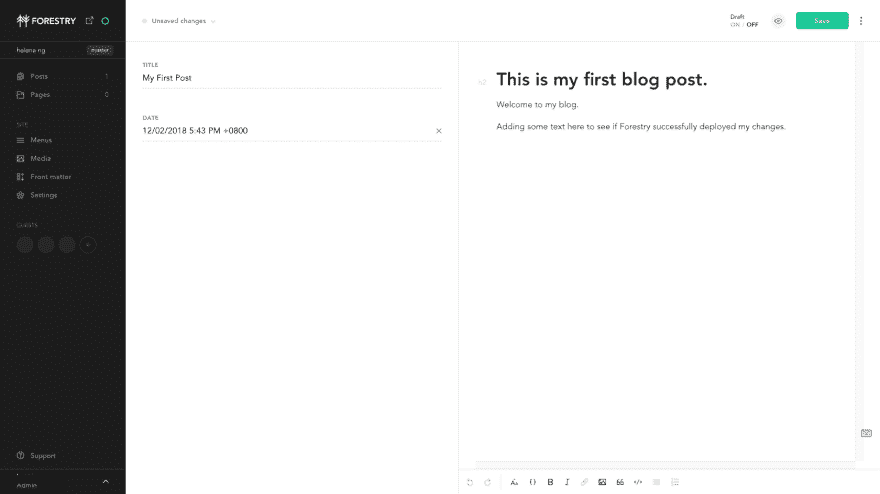

# 使用林业来维护你在 GitHub 页面上的 Hugo 站点

> 原文：<https://dev.to/herrowna/using-forestry-to-maintain-your-hugo-site-on-github-pages-45n6>

这里发生了很多事。但是让我们尽可能的不痛不痒。

假设:您正在使用 Hugo 生成一个静态站点，该站点托管在 GitHub 页面上。然后，您希望使用 [Forestry](https://forestry.io) 来维护未来的内容，这是 Hugo/Jekyll 的一个轻量级且漂亮的 CMS，面向喜欢在终端之外管理内容的人。

个人使用林业也是免费的，这意味着它们非常适合个人博客。在免费层，您还可以与[最多 3 位客人](https://forestry.io/pricing/)合作。

## 设置 GitHub 页面&雨果

我在 Hugo 和 GitHub 页面之间的设置是基于 [@dgavlock](https://dev.to/dgavlock) 的[这个指南](https://dev.to/dgavlock/creating-a-hugo-site-on-github-pages-3cjo)，你可以使用同一个指南来设置两个独立的库来为你的站点提供动力。

*   雨果“后端”的回购。您将使用此 repo 来配置您的博客设置、添加新帖子等。这将是你连接到林业回购。
*   `<your-user-name>.github.io`:这个 repo 是针对 Hugo 生成的静态文件。Forestry 会将上面 repo 中`public`下的文件部署到这个文件夹中。

## 创建一个林业网站

1.  让我们添加一个新站点。在我们的例子中，选择 Hugo(确保版本正确。您可以在您的终端上使用`hugo version`:
    [](https://res.cloudinary.com/practicaldev/image/fetch/s--9zPAlFbr--/c_limit%2Cf_auto%2Cfl_progressive%2Cq_auto%2Cw_880/https://thepracticaldev.s3.amazonaws.com/i/mu5wlrsvbv5eooe7xkok.png)

2.  选择您的 git 提供商。由于您的页面托管在 GitHub 页面上，因此它将是 GitHub:
    [](https://res.cloudinary.com/practicaldev/image/fetch/s--YZ4zAwUb--/c_limit%2Cf_auto%2Cfl_progressive%2Cq_auto%2Cw_880/https://thepracticaldev.s3.amazonaws.com/i/r3aje8aogo4uonk0t0c9.png)

3.  您将被引导到 GitHub 进行身份验证，然后您可以选择希望 Forestry 访问哪个回购。选择您刚刚创建的`your-hugo-site`回购:
    [](https://res.cloudinary.com/practicaldev/image/fetch/s--XO9FJLUS--/c_limit%2Cf_auto%2Cfl_progressive%2Cq_auto%2Cw_880/https://thepracticaldev.s3.amazonaws.com/i/8lwzk0uhzuntilzmbqax.png) 
    您将被提示选择一个分支，在我们的例子中是`master`。如果一切顺利，林业局将能检测到你的`config.toml`档案。如果失败了，你必须确保你的 Hugo 网站[设置正确](https://dev.to/dgavlock/creating-a-hugo-site-on-github-pages-3cjo)。

4.  最后一个对话框会提示您邀请客人。请随意邀请合作者，或者暂时跳过这一步。

5.  这就对了。你把你的回购和林业联系起来了。你现在可以通过 Forestry 的 UI 访问你的帖子。

## 配置林业

一旦你进入应用程序，进入**设置**来配置你的森林，并确保它被部署到正确的地方。

### 麾下大将

*   确保您输入了您的 **url** 。
*   如果你愿意，还可以在 Git 推送上打开 **Deploy(这意味着推送至`your-hugo-site`，而不是`<your-user-name>.github.io`)。这意味着，如果您从终端手动推送，内容将自动部署到`<your-user-name>.github.io`。**

### 正在部署中

*   在*连接*中，勾选 **GitHub 页面**。
*   你将被提示从你的 GitHub 账户中选择一个回购，在这种情况下选择`<your-user-name>.github.io`。这将让 Forestry 将 Hugo 在`public/`下的更改部署到该回购中。

#### 如果您使用自定义域名( [ref](https://forestry.io/docs/hosting/github-pages/#using-a-custom-domain) )

因为 Forestry 每次部署时都会覆盖您的 repo，所以您需要在`your-hugo-site` repo 中的`static`文件夹下创建一个 CNAME 记录。Hugo 将确保在根目录中部署一个 CNAME 的副本。

从`your-hugo-site`的根:

```
echo "your-url-here.com" > static/CNAME 
```

当然，您会希望将这些更改推送到您的遥控器:

```
git add static/CNAME
git commit -m "Modify custom domain for my site"
git push origin master 
```

## 用林业写博文

Forestry 有一个漂亮的 Markdown 编辑器，让我想起了 [Bear](https://bear.app) writer🐻看起来是这样的:

[](https://res.cloudinary.com/practicaldev/image/fetch/s--qu97OGN2--/c_limit%2Cf_auto%2Cfl_progressive%2Cq_auto%2Cw_880/https://thepracticaldev.s3.amazonaws.com/i/m0ep1hkm857ct1bt0g2j.png)

## 如果你想修改你的主题

你可能想不时改变你博客的主题。为此，您需要更新`your-hugo-site`中`themes/`下的文件。

前往`<your-user-name>.github.io`并确保您获得了林业部门的最新部署:

```
git pull origin master 
```

然后，切换到`your-hugo-site`并修改你的主题。

完成后，让 Hugo 在您的`<your-user-name>.github.io` :
中生成静态文件

```
hugo -D ../<your-user-name>.github.io 
```

> `-D`是一个标志，允许您定义生成的静态文件的目的地。

切换回`<your-user-name>.github.io`并推动更改:

```
cd ../<your-user-name>.github.io
git add .
git commit -m "Update my theme"
git push origin master 
```

# 结束！用林业快乐写作🦌