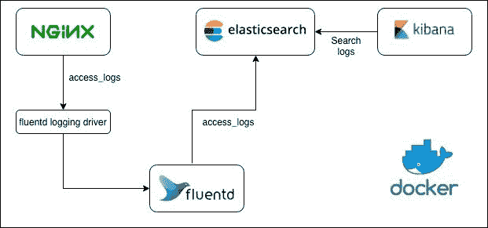
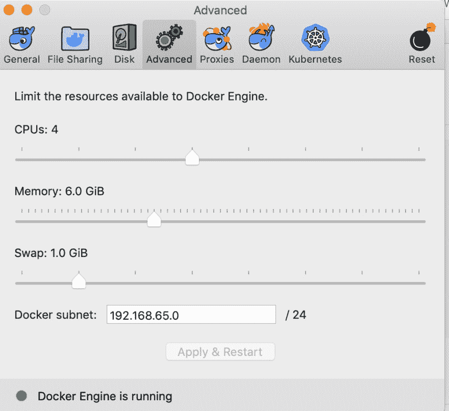
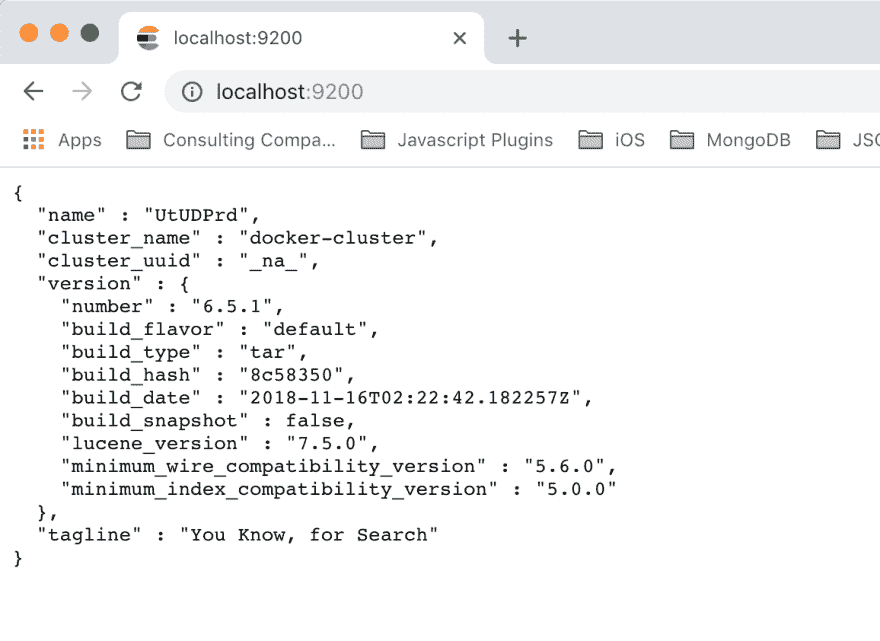
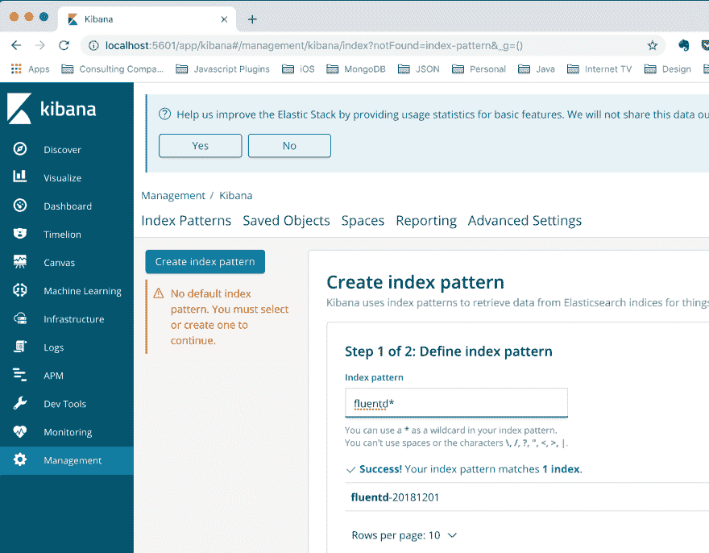
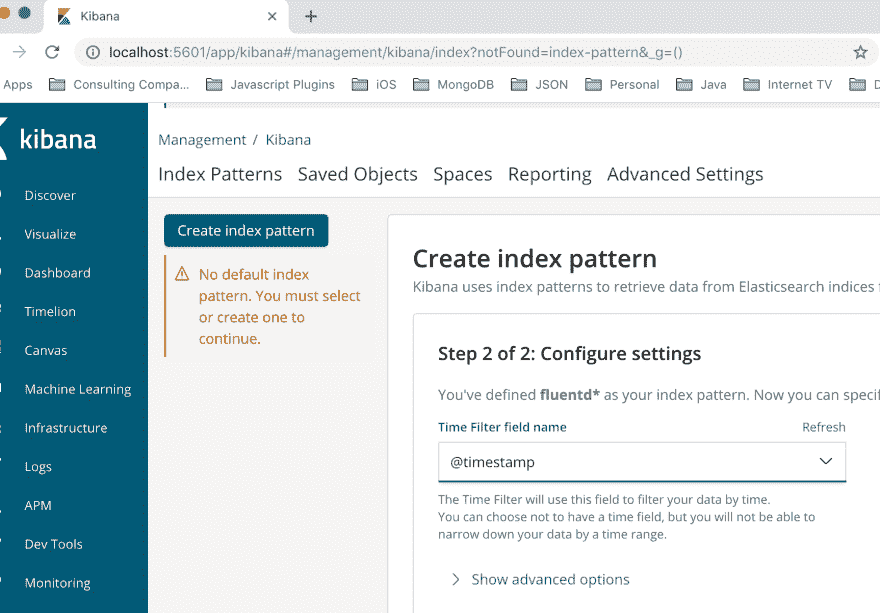
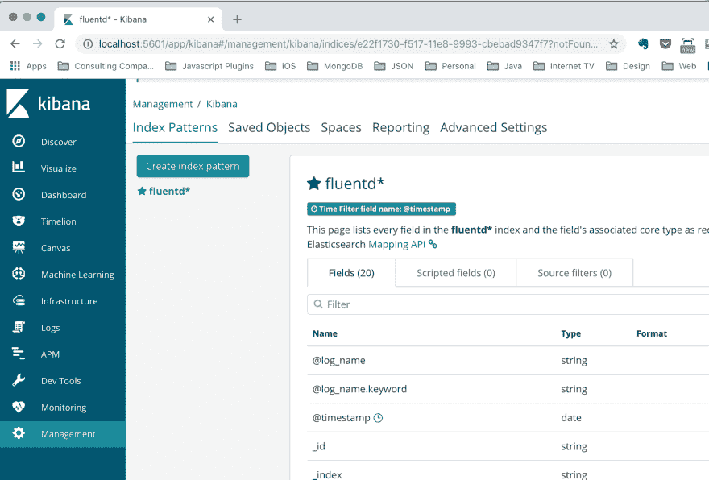
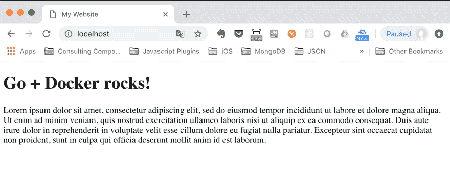
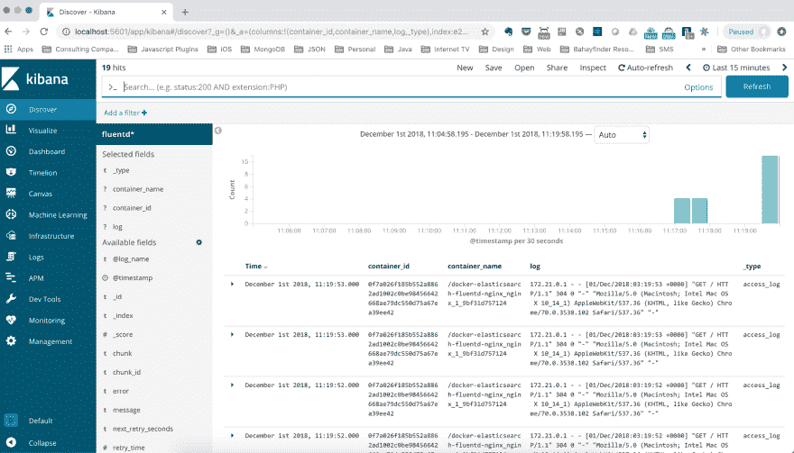

# 使用 Fluentd 和 Docker 将 NGINX 容器访问日志导入到 ElasticSearch

> 原文：<https://dev.to/donvito/ingest-nginx-container-access-logs-to-elasticsearch-using-fluentd-and-docker-272g>

[](https://res.cloudinary.com/practicaldev/image/fetch/s--dP7Vnlk2--/c_limit%2Cf_auto%2Cfl_progressive%2Cq_auto%2Cw_880/https://www.melvinvivas.com/conteimg/2018/12/Screenshot-2018-12-01-11.21.05-1.png)

这是一个关于如何使用 [Fluentd](https://www.fluentd.org/) 和 [Docker](https://www.docker.com/) 将 [NGINX](https://www.nginx.com/) 容器访问日志摄取到 [ElasticSearch](https://www.elastic.co/products/elasticsearch) 的例子。我还添加了 [Kibana](https://www.elastic.co/products/kibana) 以便于查看保存在 ElasticSearch 中的访问日志。

[](https://res.cloudinary.com/practicaldev/image/fetch/s---S1ZGJKq--/c_limit%2Cf_auto%2Cfl_progressive%2Cq_auto%2Cw_880/https://www.melvinvivas.com/conteimg/2018/12/fluentd-elastic.jpg)

我注意到 ElasticSearch 和 Kibana 需要更多的内存来更快地启动，所以我增加了 docker 引擎的内存配置，使用 6GB。我在 mac 上使用 Docker CE 的 2.0.0.0-mac78 (28905)版本。

[](https://res.cloudinary.com/practicaldev/image/fetch/s--ogGeY2OO--/c_limit%2Cf_auto%2Cfl_progressive%2Cq_auto%2Cw_880/https://www.melvinvivas.com/conteimg/2018/12/Screenshot-2018-12-01-10.58.01.png)

我为这个例子准备了一个合成文件“docker-compose.yml”。所有文件也可以在我的 [github repo](https://github.com/donvito/docker-elasticsearch-fluentd-nginx) 中获得。下面的合成文件启动了 4 个 docker 容器 ElasticSearch、Fluentd、Kibana 和 NGINX。我找不到内置了 ElasticSearch 插件的 Fluentd docker 图像，所以我创建了一个新的 docker 图像，并上传到我的 [dockerhub repo](https://hub.docker.com/r/melvindave/fluentd-elastic/) 。自定义 fluentd docker 图像的 docker 文件也可以在 [my github repo](https://github.com/donvito/docker-elasticsearch-fluentd-nginx/blob/master/dockerfiles/fluentd-custom/Dockerfile) 中找到。

##  [【多瑙河】](https://github.com/donvito) / [码头-弹性搜索-fluent engine](https://github.com/donvito/docker-elasticsearch-fluentd-nginx)

### 这是一个如何使用 Fluentd 将 Nginx 访问日志导入 ElasticSearch 的例子。还增加了 Kibana，方便查看保存在 ElasticSearch 中的访问日志。

<article class="markdown-body entry-content container-lg" itemprop="text">

# 坞站-弹性搜索-fluent engine

这是一个如何使用 Fluentd 将 Nginx 访问日志导入 ElasticSearch 的例子。还增加了 Kibana，方便查看保存在 ElasticSearch 中的访问日志。

请查看我关于这个例子的博文[https://www . melvinvivas . com/docker-elastic search-fluentd-nginx/](https://www.melvinvivas.com/docker-elasticsearch-fluentd-nginx/)

</article>

[View on GitHub](https://github.com/donvito/docker-elasticsearch-fluentd-nginx)

合成文件还为 ElasticSearch 创建了一个卷，这样当您重新启动 ElasticSearch 容器时就不会丢失数据。它还创建了一个名为“logging-net”的新网络，所有容器都将在该网络中进行通信。

为了让这个例子工作，我们需要将 Fluentd 配置为 NGINX 容器的日志驱动程序。

```
logging:
      driver: fluentd  
      options:
        fluentd-address: localhost:24224
        tag: httpd.access 
```

坞站-化合物. yml〔t0〕

```
version: "3.3"
services:

  elasticsearch:
    image: 'docker.elastic.co/elasticsearch/elasticsearch:6.5.1'
    ports:
      - "9200:9200"
      - "9300:9300"
    volumes:
      - elasticsearch-vol:/usr/share/elasticsearch/data 
    networks:
      - logging-net
    environment:
      - xpack.security.enabled=false 

  fluentd:
    image: melvindave/fluentd-elastic:1.0
    ports:
      - "24224:24224"
    networks:
      - logging-net
    depends_on:  
      - "elasticsearch"
    volumes:
      - ./fluentd/etc:/fluentd/etc      

  kibana:
    image: 'docker.elastic.co/kibana/kibana:6.5.1'
    ports:
      - "5601:5601"
    networks:
      - logging-net
    depends_on:
      - elasticsearch    

  nginx:
    image: nginx
    ports:
      - "80:80"
    networks:
      - logging-net
    deploy:
      replicas: 1  
    volumes:
      - ${NGINX_HTML_DIR}:/usr/share/nginx/html
    logging:
      driver: fluentd  
      options:
        fluentd-address: localhost:24224
        tag: httpd.access
    depends_on:  
      - "fluentd" 

networks:
  logging-net:

volumes:
  elasticsearch-vol: 
```

要运行这个示例，您需要设置一个环境变量，指向您希望 NGINX 提供 html 文件的根目录。如果您想在 repo 中使用示例 index.html，只需执行这个命令。

```
$ export NGINX_HTML_DIR=./nginx-files/ 
```

一旦配置了环境变量，现在就可以使用这个命令运行所有容器了。

```
$ docker-compose up -d 
```

您将看到类似的输出，如下所示。

[](https://res.cloudinary.com/practicaldev/image/fetch/s--UmHFcCU5--/c_limit%2Cf_auto%2Cfl_progressive%2Cq_auto%2Cw_880/https://www.melvinvivas.com/conteimg/2018/12/Screenshot-2018-12-01-11.21.05.png)

等待几分钟，因为 ElasticSearch 和 Kibana 需要一些时间来启动。您可以通过从浏览器访问 ElasticSearch 来不断检查它是否启动。

[](https://res.cloudinary.com/practicaldev/image/fetch/s--JD8od_B9--/c_limit%2Cf_auto%2Cfl_progressive%2Cq_auto%2Cw_880/https://www.melvinvivas.com/conteimg/2018/12/Screenshot-2018-12-01-10.59.04.png)

一旦 Kibana 启动，您需要创建一个索引模式来查看 NGINX 访问日志。在 fluentd 配置中，我们通过配置 **logstash_prefix** 来使用 **fluentd** 作为前缀。

```
<source>
  @type forward
  port 24224
</source>

<filter **>
  @type stdout
</filter>

<match *.**>
    @type copy
    <store>
      @type elasticsearch
      host elasticsearch
      port 9200
      logstash_format true
      logstash_prefix fluentd
      logstash_dateformat %Y%m%d
      include_tag_key true
      type_name access_log
      tag_key @log_name
      flush_interval 1s
    </store>
</match> 
```

因此，让我们继续在 Kibana 中创建索引模式。使用 fluentd*捕获所有以 fluentd 为前缀的索引。

<figure>[](https://res.cloudinary.com/practicaldev/image/fetch/s--d-C3Gy2S--/c_limit%2Cf_auto%2Cfl_progressive%2Cq_auto%2Cw_880/https://www.melvinvivas.com/conteimg/2018/12/Screenshot-2018-12-01-11.19.09.png) 

<figcaption>`</figcaption>

</figure>

[](https://res.cloudinary.com/practicaldev/image/fetch/s--Or2Y3GYN--/c_limit%2Cf_auto%2Cfl_progressive%2Cq_auto%2Cw_880/https://www.melvinvivas.com/conteimg/2018/12/Screenshot-2018-12-01-11.19.21.png)

[](https://res.cloudinary.com/practicaldev/image/fetch/s--obpKr4nU--/c_limit%2Cf_auto%2Cfl_progressive%2Cq_auto%2Cw_880/https://www.melvinvivas.com/conteimg/2018/12/Screenshot-2018-12-01-11.19.30.png)

最初，我们不会在 Kibana 中看到任何 Nginx 访问日志，因为我们没有真正访问过 NGINX。要访问 NGINX，只需从浏览器进入 [http://localhost](http://localhost) 即可。我们已经将 NGINX 配置为在其默认端口 80 上运行，因此 URL 中的端口不是必需的。一旦我们访问了我们创建的默认页面，我们就会开始在 Kibana 中看到访问日志。

[](https://res.cloudinary.com/practicaldev/image/fetch/s--xvwf6pMQ--/c_limit%2Cf_auto%2Cfl_progressive%2Cq_auto%2Cw_880/https://www.melvinvivas.com/conteimg/2018/12/Screenshot-2018-12-01-10.59.19.png)

下面是 Kibana 中日志条目的样子。

[](https://res.cloudinary.com/practicaldev/image/fetch/s--DqQ1TIdI--/c_limit%2Cf_auto%2Cfl_progressive%2Cq_auto%2Cw_880/https://www.melvinvivas.com/conteimg/2018/12/Screenshot-2018-12-01-11.20.21.png)

就是这样！希望你觉得有用！

*要了解更多关于新博客文章和示例代码的更新，你可以在 Twitter [@donvito](https://twitter.com/donvito) 和 [GitHub](https://github.com/donvito) 关注我。我的大部分推文都是关于 [Docker](https://www.docker.com/) 、 [Kubernetes](https://kubernetes.io/) 和[Go](https://golang.org/)T11】lT13】ang 的。我也在我的 [GitHub](https://github.com/donvito) 里分享代码。如果你想了解更多我是做什么的，请在 [LinkedIn](https://www.linkedin.com/in/melvinvivas/) 加我。我最近开通了一个新的 youtube 频道，我也上传了一些教程。看看吧！*