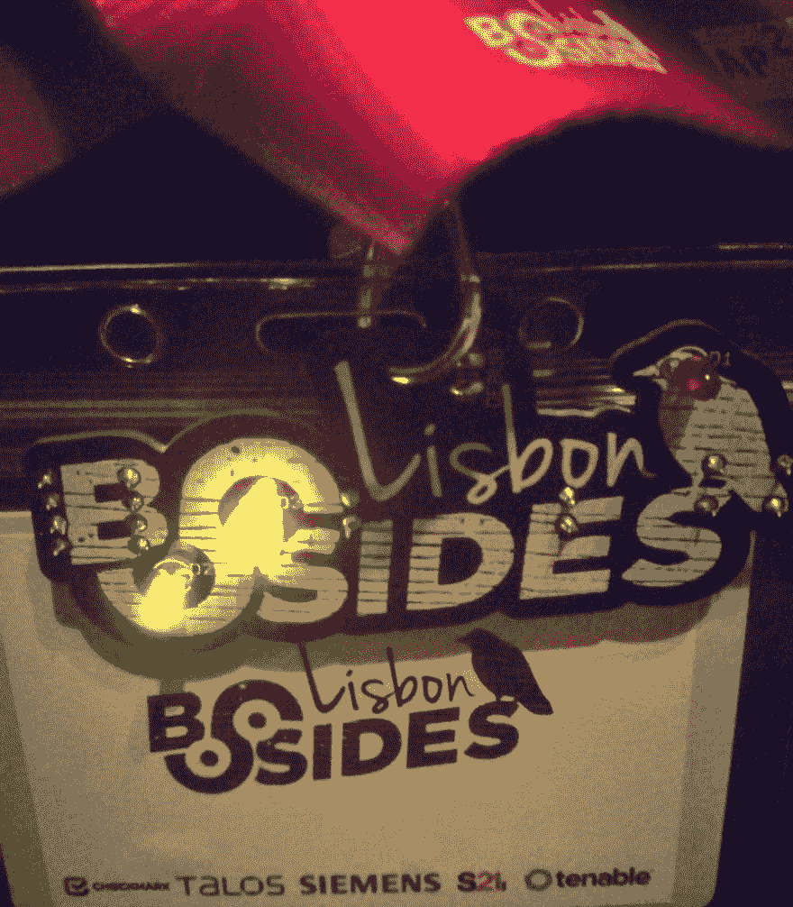

# 里斯本 2018 - Checkmarx(迷你)CTF 报道

> 原文：<https://dev.to/jpdias/bsides-lisbon-2018-checkmarx-mini-ctf-write-up-2ane>

在过去的两天里，我去了里斯本会议。在所有的讲座/研讨会(将在[在线](https://www.youtube.com/channel/UC_M0dk4dvcBr_rFgi710D4Q)提供)、一场 CTF 竞赛和两场基于徽章的挑战(RFID 卡和一个硬件焊接徽章)中，有一些赞助商为一些随机奖品举办的小型挑战(其中有一个毛绒绒的~~吓人的~~泰迪独角兽)。这是 Checkmarx 制造的*迷你* CTF 的特写。<！-更多- >

[](https://res.cloudinary.com/practicaldev/image/fetch/s--0O67dfv5--/c_limit%2Cf_auto%2Cfl_progressive%2Cq_auto%2Cw_880/https://jpdias.img/bsideslx18/badge.jpg) 挑战的地点(URL)分散在会场的二维码中(包括重复的二维码)，因此我们不知道挑战是否有先后顺序。一开始就给了一个提示:总共有 **4 个挑战**，最后应该只送**一面旗**。

大部分挑战都是在 [td00k](http://twitter.com/tiaggodias) 的协作下解决的。

## 密码

> jlpny！fhv cnhk kc 'o1rf '。ecci c xucv acf！

有一个 HTML 页面上只写着这句话。如果您检查了 HTML，会得到一个提示:

`<!-- Vigenere would probably start every conversation with 'Salut!' -->`

所以这是一个[维根涅密码](https://en.wikipedia.org/wiki/Vigen%C3%A8re_cipher)。从维基百科中，人们可以了解到这是一种通过使用一系列交织的*凯撒密码*来加密字母文本的方法，基于一个关键字的字母(多字母替换的一种形式)。所以稍加挖掘，你会找到几个破解密码的网站，但你总是需要密钥。

然而，有一种暗示，每次谈话都是以 *Salut 开始的！*，所以我们假设 *jlpny！*应该是对应*的密文 salut！*。这样，我们试图通过这个[网站](https://f00l.de/hacking/vigenere.php)使用已知的明文攻击获得密钥。然而，没有运气。经过一番实验，我们尝试把公司名称作为一个键( *checkmarx* )，成功了！

> > **Hello! The logo is' c1ro'. Have a nice day!**

所以，我们的错误是假设第一个单词是 *salut* ，但它是 *hello* 。所以使用上面的网站，我们可以马上找到第一部分的关键**检查**，这将是一个更容易的过程。毕竟我们还是找到了。

我们现在有了第一面旗帜:c1ro

## 什么是 Vuln

> 这段代码代表了 GO 中的一个漏洞，是什么呢？

所以我们又一次得到了一个 HTML 页面，里面有下面的 PHP 代码:

```
1
2
3
4
5
6
7
8
9
10
11
12
13
14
15

<?php
include ("flag.php");

highlight_file( __FILE__ );

/*
this piece of code represents a vulnerability in GO, what is it?
what is it?
ans := url.Parse(r.URL.Query().Get("input")).RequestURI()
*/

$ans = @$_GET["answer"];
echo check($ans);

?> 
```

Enter fullscreen mode Exit fullscreen mode

因此，当我们通过*答案*查询参数提交正确的漏洞名称时，该标志被*回显*。在怀疑这是一个与网络相关的漏洞(可能是 [OWASP 前 10 名](https://www.owasp.oimg/7/72/OWASP_Top_10-2017_%28en%29.pdf.pdf)之一)之后，经过深入挖掘，我们在 Go 语言知识库中发现了这个 Github 问题，它提到了`url.Parse`中的 SSRF 漏洞，所以我们尝试了一下，它成功了！

> > Way to go! The flag is ZujL

我们现在有了第二面旗帜:ZUJl

## ReverseIt

> 完成所有挑战以获得奖品@checkmarx

再次给出了一个 HTML 页面，但这一次使用了一个`input`。因此，在检查页面源代码后，我们可以看到一些 JS 黑魔法正在进行。源代码太长，无法嵌入，所以这里的[是](///assets/bsidesctf18/flag.html)。

所以我们在函数`function check(str)`中进行了一些字符比较。我们从转换 unicode 变量的真实名称开始:

*   `\u0073\u0074\u0072` - > str
*   `\u0065\u0076\u0061\u006c` - > eval

我们现在可以看到,`code`变量正在被计算/执行，所以这个巨大的十六进制字符串是一些 JS 代码。如果你把十六进制字符串转换成 ASCII，你会得到两个不同的部分。

第一部分由一个可识别方面的代码变量的新值组成，一个 *base64* 。使用 [CyberChef 工具](https://gchq.github.io/CyberChef/cyberchef.htm)将它转换成 ASCII 码也会给我们两个部分:

`code = [][(![]+[])[+[]]+([![]]+[][[]])[+!+[]+[+[]]]+(![]+[])[!+[]+!+[]]+(!![]+[])[+` …，我们知道这是 [JSF*ck](http://www.jsfuck.com/) 。有一个叫 [JSUnF*ck](http://codertab.com/JsUnFuck) 的在线工具会把它解码成常规的 JS。结果将是:`\u0073\u0074\u0072[3]=='\u004A'`，从 unicode 转换的结果将是:`str[3]=='J'`。

`str[2]=='h'?eval(code):!1`最后一行。

第二部分由常规 JS 组成:`str[- -true]=='3'?eval(atob(code)):!1;`，其中`str[- -true]`对应`str[1]`。

取 unicode 转换的最后一个 JS 行:`return str[~~!1]=='Q'?eval(code):!1`，其中`str[~~!1]`对应`str[0]`。

所以现在我们看到 4 个 char 比较正在进行，组织如下:

| 字符串[0] | str[1] | str[2] | str[3] |
| --- | --- | --- | --- |
| Q | three | h | J |

在`input`字段提交 Q3hJ 会给我们这样的消息:

> > T2】没错！

我们现在有了第三面旗帜:Q3hJ

## MrRobots

这个挑战 URL，`example.com/MrRobots`，在输入时会将我们重定向到一个已知的 Youtube [链接](https://www.youtube.com/watch?v=dQw4w9WgXcQ)。

所以第一件事是打开[打嗝套件](https://portswigger.net/burp/communitydownload)拦截，在 Firefox 上设置相应的代理，并输入 URL。我们可以在标题中看到一个`Location= https://www.youtube.com/watch?v=dQw4w9WgXcQ`和一个 302 状态代码。但是，当查看响应选项卡时，我们会得到以下消息:

> 错误的方式，朋友…仔细看看网址。

所以，经过一番挖掘和向一些朋友打听，我得到了一个关于`robots.txt`文件的提示。当输入 URL `example.com/MrRobots/robots.txt`时，我们会得到下面的文件:

```
User-agent: *
Disallow: /980j45grn/ 
```

Enter fullscreen mode Exit fullscreen mode

输入`example.com/980j45grn`会给出 404，但是输入`example.com/MrRobots/980j45grn`会把我们重定向到同一个 Youtube 链接。再次打开 Burp suite，我们会在 response 选项卡中看到以下文本:

> > **Well done, the flag is C3Q =**

我们现在有了第四个标志:c3Q=

## 获得奖品

有了这四面旗子，我们现在只需拿出一面就能获得奖品。在第四个标志中，有一个等号，所以它必须是一个 **base64** 字符串的结尾。再次去网吧，在测试了不同的旗帜组合后，我们会得到类似于 *CxIsZeBest* 的结果。这几乎是存在的，所以再次看加密挑战，我们注意到我们总是会得到一个小写字符串，即使它不是。玩了一会儿后，我们明白了:

**Q3hJc1RoZUJlc3Q=** 对应 **CxIsTheBest** 。

最终的奖品是一个小型便携式蓝牙音箱。