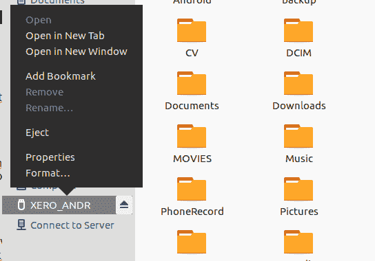
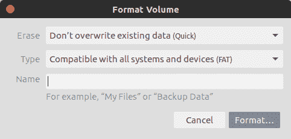

# 如何在 Ubuntu Linux 中格式化 u 盘

> 原文：<https://dev.to/xeroxism/how-to-format-usb-thumb-drive-in-ubuntu-linux-klm>

我们时常发现自己需要格式化 USB 驱动器的方法。在 Linux 中格式化 USB 拇指驱动器或 SD 卡有很多方法，但是在这篇文章中，我将向你展示一种快速而简单的方法，无需安装任何额外的软件。

_ **注意:**本演示使用的是 Ubuntu 16.04。_

## **第一步**

**将 USB 拇指驱动器**插入您的计算机系统/PC。这应该会自动安装到您的 PC 上(在启动器上显示)，并在文件管理器(nautilus)中打开。

如果文件管理器没有自动打开它；单击启动器上的 USB 拇指驱动器图标将其打开。

## **第二步**

右键单击文件管理器上的 USB 驱动器图标，显示一些选项。然后选择“格式”选项。

## **第三步**

**选择**一些格式化选项，如*擦除类型*(是否覆盖现有数据)、文件系统类型(FAT 文件系统是 USB 驱动器的常用文件系统)，最后是您想要给拇指驱动器起的名字(“备份”、“电影”、“数据”等)。

## 第四步

点击**格式化**按钮开始格式化。

那你就完了！

快乐的 Linux！

帖子[如何在 Ubuntu Linux 中格式化 u 盘](https://fossnaija.com/how-to-format-usd-thumb-drive-in-ubuntu-linux/)首先出现在 [Foss Naija](https://fossnaija.com) 上。