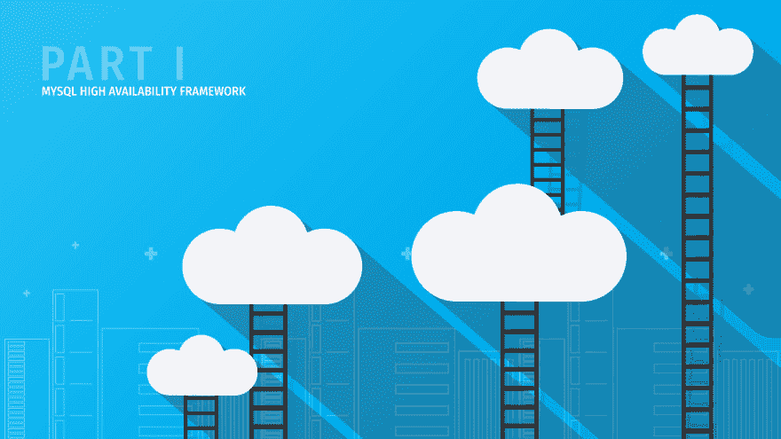
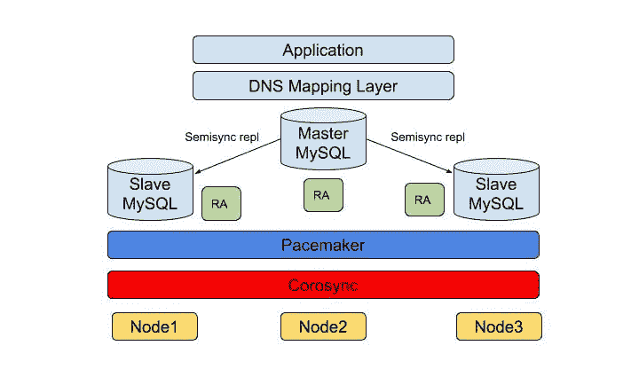

# MySQL 高可用性框架-第一部分

> 原文：<https://dev.to/scalegrid/mysql-high-availability-framework---part-i-3lh2>

在这个由两部分组成的博客系列中，我们将解释使用 MySQL 半同步复制和[Corosync](https://clusterlabs.org/corosync.html)plus[Pacemaker](https://clusterlabs.org/pacemaker/)堆栈的 [MySQL 托管](https://scalegrid.io/mysql.html)的高可用性(HA)框架的细节和功能。在第一部分中，我们将向您介绍高可用性的基础知识、HA 框架的组件，然后向您介绍 MySQL 的 HA 框架。 [MySQL 高可用性框架讲解–第一部分](https://scalegrid.io/blog/mysql-high-availability-framework-explained-part-1/)

## 什么是高可用性？

计算机系统的可用性是指在一段时间内其服务运行的时间百分比。它通常用一系列 9 来表示。例如，下表显示了一年内的可用性和相应的停机时间。

| **可用性%** | **每年停机时间** |
| 90% (" **一 9** ") | 36.53 天 |
| 99%(“**两个 9**”) | 3.65 天 |
| 99.9% (" **三个 9**") | 8.77 小时 |
| 99.99%(“**四个 9**”) | 52.60 分钟 |
| 99.999%(“**五个 9**”) | 5.26 分钟 |
| 99.9999%(“**六个 9**”) | 31.56 秒 |

高可用性的含义因您的应用程序和业务需求而异。例如，如果您无法承受服务每年超过几分钟的停机时间，我们说服务需要有 99.999%的高可用性。

## 高可用性框架的组件

高可用性的本质是能够从系统任何部分可能发生的故障中即时恢复。在任何 HA 框架中，都有四个非常重要的组件需要以自动化的方式协同工作，以实现这种可恢复性。让我们详细回顾一下这些组件:

### 1.基础设施和数据冗余

为了使服务具有高可用性，我们需要确保托管的基础设施中存在冗余，以及服务使用或提供的数据的最新冗余副本。它充当备用服务，准备在主服务受到故障影响时接管。

### 2.故障检测和纠正机制

立即检测主系统中任何可能影响其可用性的故障是非常重要的。这将使框架能够在同一主系统上采取纠正措施，或者将服务故障转移到备用系统。

### 3.故障转移机制

该组件负责将服务故障转移到备用基础设施。请注意，如果有多个冗余系统可用，此故障转移机制组件必须在这些系统中识别最合适的系统，并将其提升为主要服务。

### 4.应用程序/用户重定向机制

一旦备用系统接管了主系统，该组件将确保所有应用程序和用户连接开始发生在新的主系统上。

## MySQL 的高可用性框架

基于上述模型，我们在 ScaleGrid 上为 MySQL 托管使用了以下高可用性框架:

*   使用 [MySQL 半同步复制](https://scalegrid.io/blog/data-integrity-and-performance-considerations-in-mysql-semisynchronous-replication/)提供基础设施和数据冗余的 3 节点主从设置。
*   Corosync plus 起搏器堆栈提供故障检测、纠正和故障转移机制。
*   提供应用程序和用户重定向机制的 DNS 映射或虚拟 IP 组件。

查看下图，了解该架构的软件堆栈:

 让我们回顾一下这个框架中一些关键组件的功能。

1.  #### Corosync

    Corosync 为节点提供了一个通信框架，在它们之间进行可靠的消息传递。它形成一个由节点组成的集群环，并通过集群成员关系跟踪加入和离开集群的节点。Corosync 与 Pacemaker 密切合作，就节点可用性进行沟通，以便 Pacemaker 可以做出适当的决策。

2.  #### 起搏器

    Pacemaker 也称为集群资源管理器(CRM)，它通过与 Corosync 接口来确保在集群上运行的 MySQL 的高可用性，并检测和处理节点级故障。它还通过与[资源代理](https://clusterlabs.org/components.html) (RA)接口来检测和处理 MySQL 的故障。Pacemaker 通过启动、停止、监控、升级和降级操作来配置和管理 MySQL 资源。

3.  #### 资源代理

    资源代理充当 MySQL 和 Pacemaker 之间的接口。它实现由起搏器调用的启动、停止、升级、降级和监控操作。Percona 为 MySQL 实现了一个全功能的资源代理，名为[Percona Replication Manager](https://github.com/Percona-Lab/pacemaker-replication-agents/blob/master/agents/mysql_prm_gtid)(PRM)。ScaleGrid 增强了这一功能，并在我们的 [GitHub 页面](https://github.com/Scalegrid/percona-pacemaker-agents/blob/master/agents/mysql_prm_semisync)上提供。

4.  #### DNS 映射组件

    成功完成故障转移后，资源代理调用该组件，用新主服务器的 IP 地址更新主 MySQL 服务器的 DNS 记录。请注意，客户端总是使用主 DNS 名称来连接 MySQL 服务器，通过管理该 DNS 名称到当前主服务器的 IP 地址的映射，我们可以确保在发生故障转移时，客户端不必更改其连接字符串或属性。

在本博客系列的第二部分中，您将了解使用 MySQL 半同步复制实现的关键数据冗余组件。我们还将深入探讨我们用来实现高可用性支持的半同步复制细节和配置，最后，回顾各种故障场景以及框架从这些情况中响应和恢复的方式。