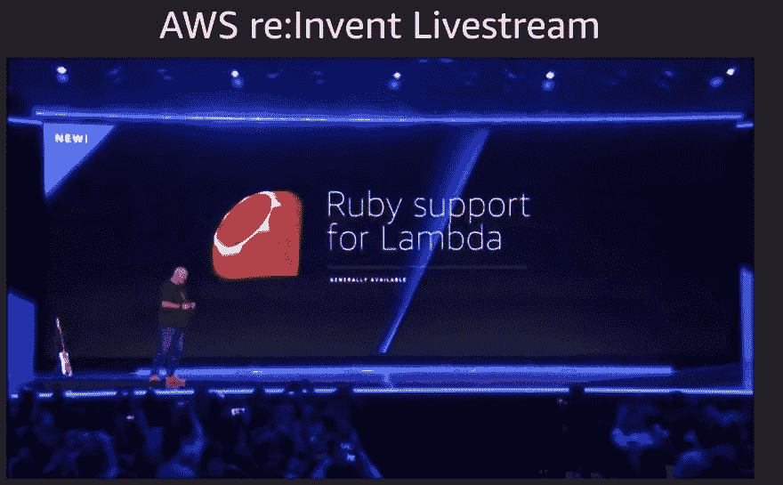

# AWS Lambda 现在原生支持 Ruby

> 原文：<https://dev.to/ben/ruby-on-aws-lambda-20e5>

我没有比这更多的背景:

> 安德烈克林格✌️[@安德烈克林格](https://dev.to/andreasklinger)红宝石上 AWSλ
> 红宝石上 AWSλ
> 这不是演习
> 🙀2018 年 11 月 29 日下午 17:49

液体错误:内部

液体错误:内部

但是...我很开心。

Ruby 似乎非常适合 Lambda，任何非本机支持的东西通常都不值得。

Ruby 的好处——简单易读的语法，非常适合编写小问题的脚本——让我觉得非常适合无服务器环境。作为一种支持 Rails 等的服务器端语言，Ruby 本身并不擅长我们要求它做的事情。

无论如何，作为一个 Rubyist，这对我来说是可爱的。我很想听听其他人的看法。