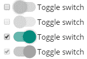

# 易访问性优先:拨动开关

> 原文：<https://dev.to/link2twenty/accessibility-first-toggle-switches-3obj>

在我开始之前，我想说这篇文章的灵感来自于 [@lkopacz](https://dev.to/lkopacz) 的文章。

[](/lkopacz) [## 创建自定义键盘辅助复选框

### 林赛·科帕奇 11 月 27 日 185 分钟阅读

#a11y #frontend #html #webdev](/lkopacz/create-custom-keyboard-accessible-checkboxes-2036)

我在这里展示的很多东西将与她的设计模式相似，当然，最终结果是一个开关，而不是一个复选框。

## 我们要创造什么？

我们的目标是制作一个受材料设计启发的拨动开关，与键盘交互兼容，我们不会使用 javascript，因为我不认为我们需要这么简单的东西。

[https://jsfiddle.net/link2twenty/v2kx9jcd//embedded/result//dark](https://jsfiddle.net/link2twenty/v2kx9jcd//embedded/result//dark)

## 标记

我们将使用标准的[复选框](https://developer.mozilla.org/en-US/docs/Web/HTML/Element/input/checkbox),因为它具有所有内置的优点，没有必要重新发明轮子。我们将用一个[标签](https://developer.mozilla.org/en-US/docs/Web/HTML/Element/label)将它包围起来，这样我们就可以根据需要与一些文本进行交互，也可以与我们将要制作的开关进行交互。

我发现有一个跨度，我们可以为我们的实际切换样式更容易。这是我选定的代码。

```
<label class="md_switch">
  <input type="checkbox" />
  <span class="md_switch__toggle"></span>
  Toggle switch
</label> 
```

Enter fullscreen mode Exit fullscreen mode

[https://jsfiddle.net/link2twenty/rhvydmge//embedded/html,result//dark](https://jsfiddle.net/link2twenty/rhvydmge//embedded/html,result//dark)

如果我们的 CSS 有问题，它会加载一个标准的复选框，并且完全可用，这是我们应该一直努力的。

## 样式

切换可以有几种状态，我们必须为每一种状态设计一种风格。这些状态是:

*   默认/未选中
*   检查
*   有缺陷的
*   焦点

### 默认

#### 设置

让我们先看看我们希望标签是什么样子，你会记得我们的标签有类`.md_switch`。这是一个材料项目，所以我们将使用开放的 Sans 字体，你不必，但我会。我们希望我们的标签是内联的，但同时我们希望在元素内部使用 flexbox，所以我们将 display 设置为`inline-flex`。这意味着我们可以用`align-items: center`垂直对齐元素中的所有位，这对我们来说是一个胜利。我们还想增加顶部和底部的边距，因为我们的切换会比标准的复选框大一点，我选择了 5px。

```
@import url(http://fonts.googleapis.com/css?family=Open+Sans);

.md_switch {
  display: inline-flex;
  font-family: "Open Sans";
  align-items: center;
  margin: 5px 0;
} 
```

Enter fullscreen mode Exit fullscreen mode

当鼠标悬停在切换按钮上时，我们希望光标显示我们可以单击的内容，因此让我们将光标改为指针。

```
.md_switch .md_switch__toggle {
  cursor: pointer;
} 
```

Enter fullscreen mode Exit fullscreen mode

#### 切换开关

让我们继续进行实际的切换。像这样的切换有两个部分:背景层和顶部的小按钮/开关。背景本身是一个`::before`，而 nob 是一个`::after`，这很简单。

之前和之后都需要有一个内容值，背景颜色，空白和过渡效果。所有的值都是一样的，所以我们把它们放在一起，就像这样

```
.md_switch .md_switch__toggle::before,
.md_switch .md_switch__toggle::after {
  content: '';
  background: #BDBDBD;
  margin: 0 3px;
  transition: all 100ms cubic-bezier(0.4, 0.0, 0.2, 1);
  display: block;
} 
```

Enter fullscreen mode Exit fullscreen mode

你会注意到我还添加了一个 display 属性，虽然技术上两者都不需要它，但它的存在并没有坏处。

我从材质设计规范中得到三次贝塞尔曲线和时间，[这里](https://material.io/design/motion/speed.html#controlling-speed)。

现在我们来看看开关的背景部分。你可以自己随意调整大小，但是我会解释为什么我选择这些设置。

```
.md_switch .md_switch__toggle::before {
  height: 1.3em;
  width: 3em;
  border-radius: 0.65em;
  opacity: 0.6;
} 
```

Enter fullscreen mode Exit fullscreen mode

我设置的高度刚好超过线的高度，所以感觉它填充了整个线，宽度刚好超过高度的两倍，使它感觉很长，但不太长，边框半径是高度的一半，使一个药丸形状，不透明度为 0.6，使它看起来比开关位更远，不透明度为 1。这些只是我认为正确的价值观，你可以随心所欲地改变它们。

最后，对于这一部分，我们将把开关放在顶部。我们想要定位这个绝对位置，所以我们需要将父元素的位置设置为相对位置，虽然父元素只是`.md_switch .md_switch__toggle`而已，所以没关系。

我们希望开关是圆形的，比背景稍微高一点，垂直居中，为了增加一点深度，让我们添加一个方框阴影。

```
.md_switch .md_switch__toggle::after {
  position: absolute;
  top: 50%;
  transform: translate(0, -50%);
  height: 1.7em;
  width: 1.7em;
  border-radius: 50%;
  box-shadow: 0 0 8px rgba(0,0,0,0.2), 0 0 2px rgba(0,0,0,0.4);
} 
```

Enter fullscreen mode Exit fullscreen mode

我用`transform`这种方式是为了以后更容易制作动画。

[](https://res.cloudinary.com/practicaldev/image/fetch/s--HtaSJXb4--/c_limit%2Cf_auto%2Cfl_progressive%2Cq_auto%2Cw_880/https://thepracticaldev.s3.amazonaws.com/i/zlbl8fv52rqfjsbfb8v7.png)

### 勾选

接下来的几部分就简单多了，大部分的工作都是在默认视图中完成的。

对于选中的，我们想将两位的背景颜色都改为我们的`active`颜色。

```
.md_switch [type=checkbox]:checked+.md_switch__toggle::before,
.md_switch [type=checkbox]:checked+.md_switch__toggle::after{
  background: #00897B;
} 
```

Enter fullscreen mode Exit fullscreen mode

但是我们也想把我们的开关移到背景药丸的另一边。如果我们在药丸的整个长度上移动凸块，并向后移动它自己的宽度，我们应该正对着右边缘，像`calc(3em - 100%)`这样的变换应该可以做到。确实如此。

```
.md_switch [type=checkbox]:checked+.md_switch__toggle::after {
  transform: translate(calc(3em - 100%), -50%);
} 
```

Enter fullscreen mode Exit fullscreen mode

[](https://res.cloudinary.com/practicaldev/image/fetch/s--MzwVO_2C--/c_limit%2Cf_auto%2Cfl_progressive%2Cq_auto%2Cw_880/https://thepracticaldev.s3.amazonaws.com/i/npnz0za4ga40c9ky50uk.png)

### 禁用

如果元素被禁用，我们想以某种方式告诉用户他们不能与之交互。我喜欢做的是添加一个灰度过滤器，降低不透明度，但也删除后元素的阴影，使其看起来平坦。

我们还可以将光标设置为`not-allowed`，以便鼠标用户获取消息。

```
.md_switch [type=checkbox]:disabled+.md_switch__toggle {
  cursor: not-allowed;
  filter: grayscale(100%);
  opacity: 0.6;
}

.md_switch [type=checkbox]:disabled+.md_switch__toggle::after {
  box-shadow: none;
} 
```

Enter fullscreen mode Exit fullscreen mode

[](https://res.cloudinary.com/practicaldev/image/fetch/s--E-h5A_i---/c_limit%2Cf_auto%2Cfl_progressive%2Cq_auto%2Cw_880/https://thepracticaldev.s3.amazonaws.com/i/dgop43ut83bzvbbr7y6w.png)

### 聚焦

这是我们需要考虑的最终状态，当复选框被聚焦时，我们希望向用户表明他们已经选择了我们的元素。这与 [@lkopacz](https://dev.to/lkopacz) 使用的代码完全相同，因为它工作得非常好。

```
.md_switch [type=checkbox]:focus+.md_switch__toggle {
  outline: #5d9dd5 solid 1px;
  box-shadow: 0 0 8px #5e9ed6;
} 
```

Enter fullscreen mode Exit fullscreen mode

## 整理完毕

我认为，我们已经使切换工作起来看起来相当漂亮，但是我们仍然需要隐藏原始的复选框。在过去，许多人会做一个显示无，但这是一个可怕的想法，它完全隐藏了元素，并将其从标签索引中删除，这意味着键盘用户完全失去了元素。那么我们能做什么呢？

有很多方法可以隐藏一个元素并将其保存在 tab 索引中。我个人喜欢的方法是不占用空间，降低不透明度，关闭指针事件，但是你可以使用任何你喜欢的方法。

```
.md_switch [type=checkbox] {
  position: absolute;
  opacity: 0;
  pointer-events: none;
} 
```

Enter fullscreen mode Exit fullscreen mode

[https://jsfiddle.net/link2twenty/v2kx9jcd//embedded/result,html,css//dark](https://jsfiddle.net/link2twenty/v2kx9jcd//embedded/result,html,css//dark)

请在下面的评论中告诉我你会怎么做，我期待听到你们的想法。