# 手指上的位运算🙌👩🏻‍💻

> 原文：<https://dev.to/emcain/bitwise-operations-on-your-fingers-2d01>

我第一次遇到位运算是在 2017 年代码挑战赛的一部分。我彻底糊涂了。“你怎么能在两个数字上做和？那没道理啊！”我尽职尽责地在挑战中使用的任何语言中使用 AND 操作符(可能是 Go ),只是接受不知道它的意思。

我的下一次遭遇是在一个工作场所讨论组中，在那里我们学习了使用 AND 操作符[过滤数据包，使用`tcpdump`](https://danielmiessler.com/study/tcpdump/) 。我问了足够多的问题来真正理解这些位运算是怎么回事，我想分享我在这篇文章中想到的一个方法。它包括用手指进行二进制计数，然后用手进行逐位算术运算——不需要计算机。我不知道是否还有人这样做过，但我觉得这很有帮助。

# 背景

你使用的任何计算机系统都是用一系列的 0 和 1 来表示信息，用基数 2 或者[二进制](https://en.wikipedia.org/wiki/Binary_number#Counting_in_binary)来表示数字。按位运算符对每一位执行一个[布尔运算](https://en.wikipedia.org/wiki/Logical_connective)以得到最终结果。

例如，假设我们想找到 6 和 3。

```
0110 (6) 
0011 (3)
----
0010 (2) 
```

Enter fullscreen mode Exit fullscreen mode

分解如下:

> 在 2^0 (1)的地方，第一个值是 0(假)，第二个值是 1(真)。真假=假。
> 
> 在 2^1 (2)的地方，第一个值是 1(真)，第二个值是 1(真)。真且真=真。
> 
> 在 2^2 (4)的地方，第一个值是 1(真)，第二个值是 0(假)。真假=假。
> 
> 在 2^3 (8)位置，第一个值是 0(假)，第二个值是 0(假)。假假=假。

总结一下:对于每个位置或列，对该列中的输入值进行布尔逻辑运算，以获得该列的输出。

您可以使用相同的过程进行其他按位运算。

或(如果任一值为真，则为真):

```
0110 (6) 
0011 (3) 
----
0111 (7) 
```

Enter fullscreen mode Exit fullscreen mode

[异或](https://en.wikipedia.org/wiki/XOR_gate)(如果两个值不同则为真):

```
0110 (6) 
0011 (3) 
----
0101 (5) 
```

Enter fullscreen mode Exit fullscreen mode

NOT 是一个一元操作符，也就是说它只接受一个输入，并反转每一列(或位)的值。

```
0101 (5) 
----
1010 (10) 
```

Enter fullscreen mode Exit fullscreen mode

你可以用[这个计算器](https://www.miniwebtool.com/bitwise-calculator)玩逐位算术。

# 手指法

我们将从学习用二进制数手指开始。

一些手指计数系统从拇指开始，但我将使用食指来计数 1，因为这样每只手代表一个半字节，即半字节，可以用一个十六进制的[数字来表示。(这也意味着我可以用我的拇指压住任何不用的手指。)中指 2，无名指 4，小指 8。](https://en.wikipedia.org/wiki/Hexadecimal)

1 或 0001:

[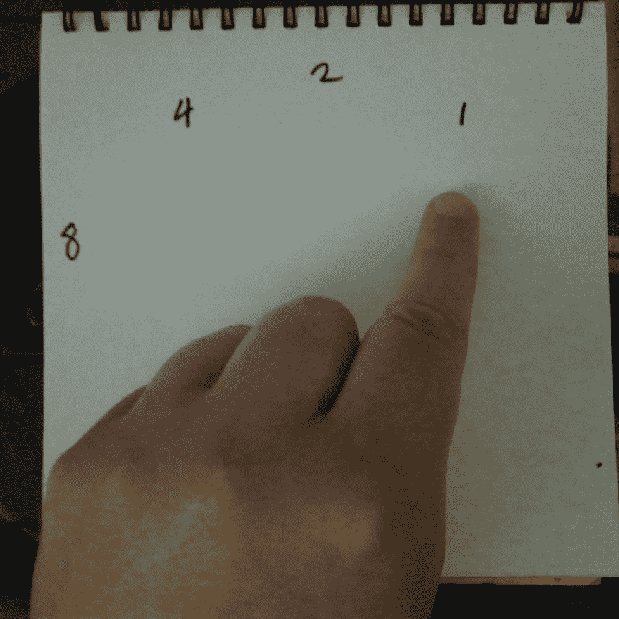](https://res.cloudinary.com/practicaldev/image/fetch/s--M5-QqRFF--/c_limit%2Cf_auto%2Cfl_progressive%2Cq_auto%2Cw_880/https://thepracticaldev.s3.amazonaws.com/i/23yjnc6958vvos9j1mv3.jpg)

2 或 0010:

[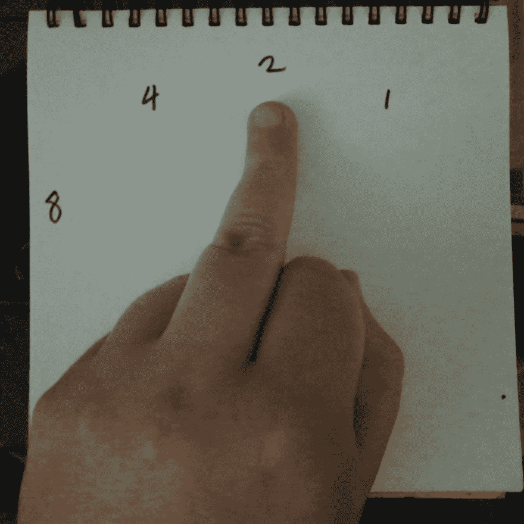](https://res.cloudinary.com/practicaldev/image/fetch/s--Xldj0sAY--/c_limit%2Cf_auto%2Cfl_progressive%2Cq_auto%2Cw_880/https://thepracticaldev.s3.amazonaws.com/i/fw5mc6d6zvxfwud6izad.jpg)

3，或者 0011，或者 2^1 + 2^0:

[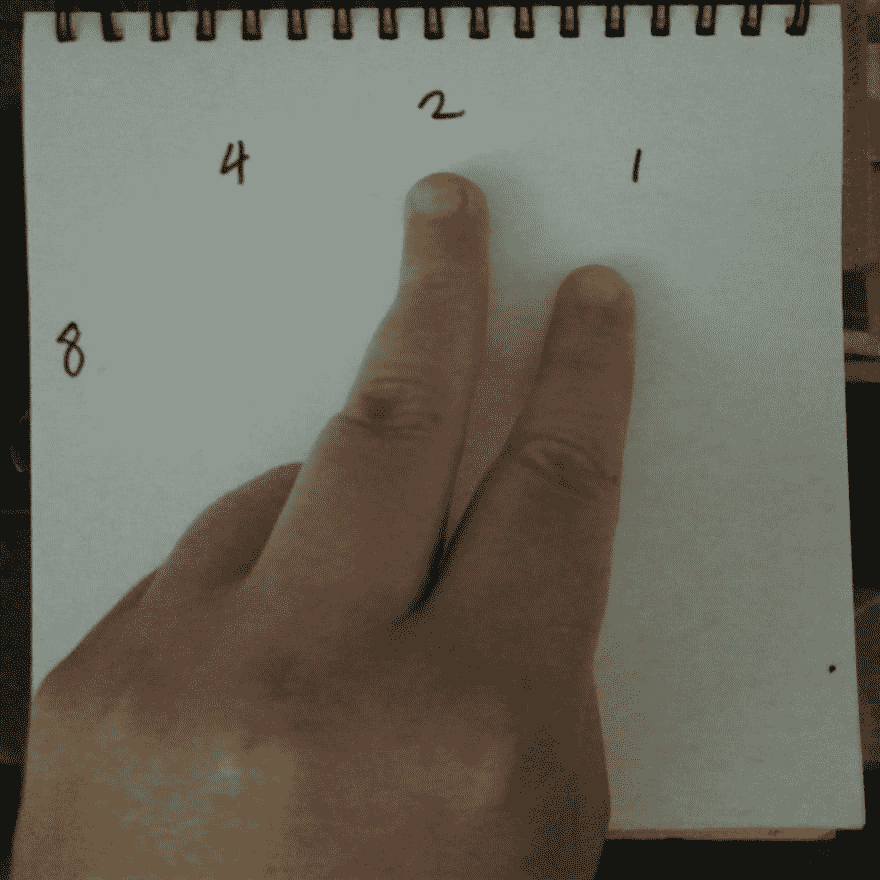](https://res.cloudinary.com/practicaldev/image/fetch/s--MiG3iTpp--/c_limit%2Cf_auto%2Cfl_progressive%2Cq_auto%2Cw_880/https://thepracticaldev.s3.amazonaws.com/i/odmtkzxtulxipvlt0g7k.jpg)

7，或者 0111，或者 2^2 + 2^1 + 2^0:

[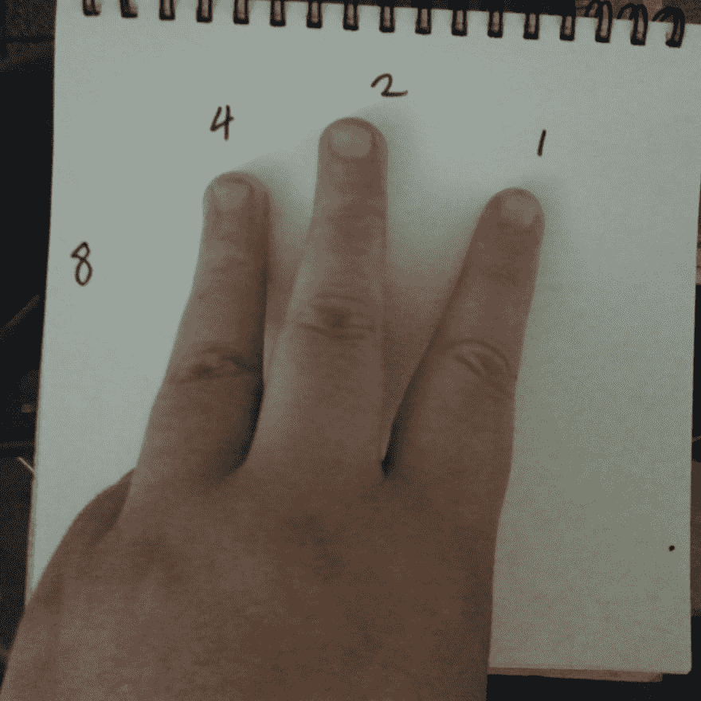](https://res.cloudinary.com/practicaldev/image/fetch/s--yLUSS_VE--/c_limit%2Cf_auto%2Cfl_progressive%2Cq_auto%2Cw_880/https://thepracticaldev.s3.amazonaws.com/i/pxvlj355bs4be999756u.jpg)

12，或 1100，或 2^3 + 2^2，或十六进制的 c:

[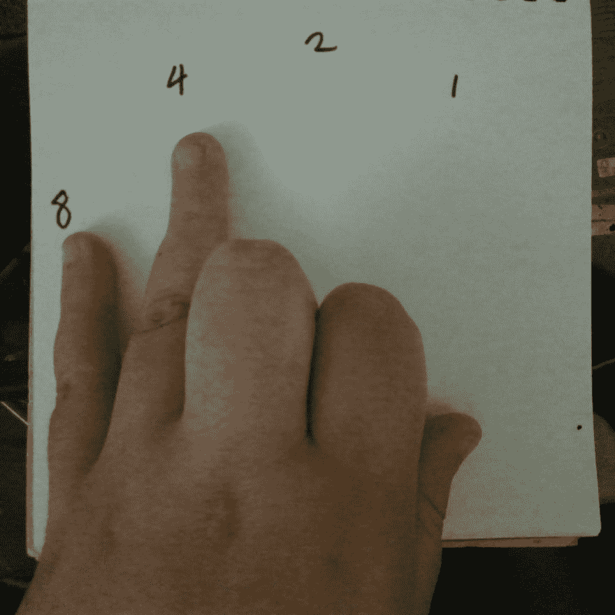](https://res.cloudinary.com/practicaldev/image/fetch/s--Ext0WTM_--/c_limit%2Cf_auto%2Cfl_progressive%2Cq_auto%2Cw_880/https://thepracticaldev.s3.amazonaws.com/i/rrj1pudoyb2hls5t4r71.jpg)

15，或 1111，或 2^3 + 2^2 + 2^1 + 2^0，或十六进制的 f:

[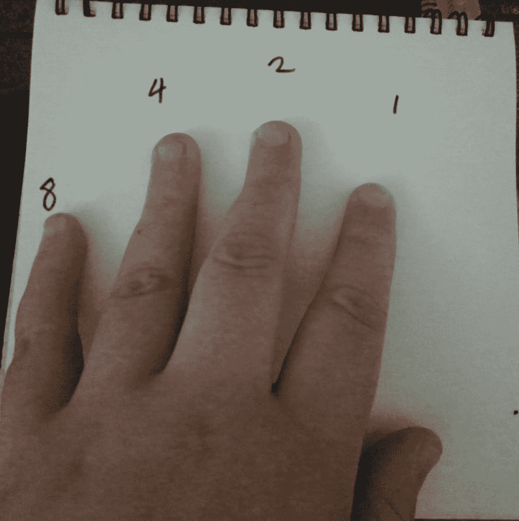](https://res.cloudinary.com/practicaldev/image/fetch/s--Bjext9x3--/c_limit%2Cf_auto%2Cfl_progressive%2Cq_auto%2Cw_880/https://thepracticaldev.s3.amazonaws.com/i/6ykoeruwy7pis3rkrxla.jpg)

# 和

对于 AND 运算，用左手产生第一个数字，用右手产生第二个数字。对于每只手，食指应该总是代表 1，小指代表 8。

这里左边是 6，右边是 3。

[](https://res.cloudinary.com/practicaldev/image/fetch/s--rWrQzQKw--/c_limit%2Cf_auto%2Cfl_progressive%2Cq_auto%2Cw_880/https://thepracticaldev.s3.amazonaws.com/i/aiuq2zvc550yutzye78x.jpg)

现在把两只手放在一起，手掌接触，手指张开。

接触顶部的手指代表答案(2)。

[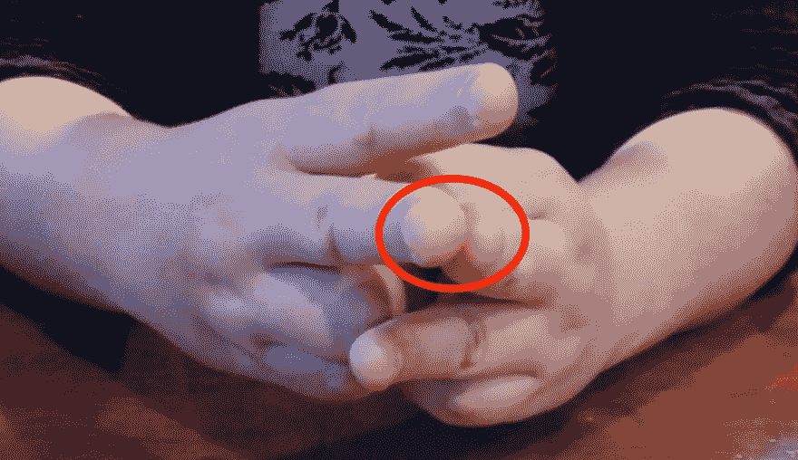](https://res.cloudinary.com/practicaldev/image/fetch/s--zwUTqI55--/c_limit%2Cf_auto%2Cfl_progressive%2Cq_auto%2Cw_880/https://thepracticaldev.s3.amazonaws.com/i/lya2r4dobtgx5b7wnga2.jpeg)

更多示例:

12 加 7 = 4

[](https://res.cloudinary.com/practicaldev/image/fetch/s--k4eO7Lyx--/c_limit%2Cf_auto%2Cfl_progressive%2Cq_auto%2Cw_880/https://thepracticaldev.s3.amazonaws.com/i/exscr81v6b17hbyztn2s.jpg)

[](https://res.cloudinary.com/practicaldev/image/fetch/s--I-1AxKy7--/c_limit%2Cf_auto%2Cfl_progressive%2Cq_auto%2Cw_880/https://thepracticaldev.s3.amazonaws.com/i/02xisx298qwrw9kyur2u.jpg)

10 加 5 = 0

[](https://res.cloudinary.com/practicaldev/image/fetch/s--_hAtCfFj--/c_limit%2Cf_auto%2Cfl_progressive%2Cq_auto%2Cw_880/https://thepracticaldev.s3.amazonaws.com/i/rq998udwm07a6ik55sd0.jpg)

[](https://res.cloudinary.com/practicaldev/image/fetch/s--K0FjxJDS--/c_limit%2Cf_auto%2Cfl_progressive%2Cq_auto%2Cw_880/https://thepracticaldev.s3.amazonaws.com/i/eqwvm6j8aumpbx3oefwt.jpg)

# 或

让我们对 OR 操作符使用相同的输入。

这里左边是 6，右边是 3。

[](https://res.cloudinary.com/practicaldev/image/fetch/s--rWrQzQKw--/c_limit%2Cf_auto%2Cfl_progressive%2Cq_auto%2Cw_880/https://thepracticaldev.s3.amazonaws.com/i/aiuq2zvc550yutzye78x.jpg)

现在把两只手放在一起，手掌接触，手指张开。

至少有一个手指朝上的地方代表答案(7)。

[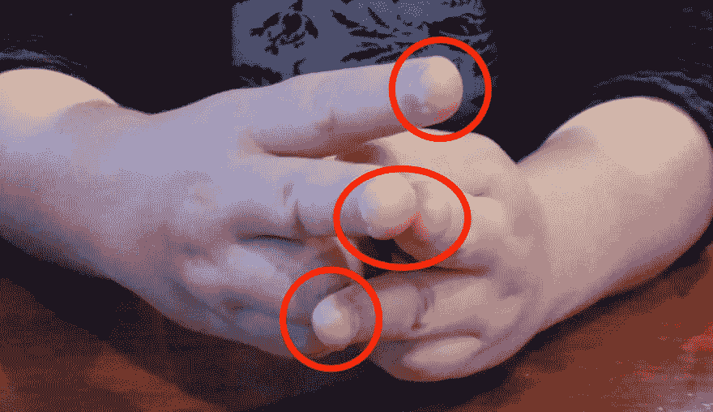](https://res.cloudinary.com/practicaldev/image/fetch/s--MsPIVBKt--/c_limit%2Cf_auto%2Cfl_progressive%2Cq_auto%2Cw_880/https://thepracticaldev.s3.amazonaws.com/i/y7r0y0qx0xkwethpu66s.jpeg)

更多示例:

12 或 7 = 15

[](https://res.cloudinary.com/practicaldev/image/fetch/s--k4eO7Lyx--/c_limit%2Cf_auto%2Cfl_progressive%2Cq_auto%2Cw_880/https://thepracticaldev.s3.amazonaws.com/i/exscr81v6b17hbyztn2s.jpg)

[](https://res.cloudinary.com/practicaldev/image/fetch/s--I-1AxKy7--/c_limit%2Cf_auto%2Cfl_progressive%2Cq_auto%2Cw_880/https://thepracticaldev.s3.amazonaws.com/i/02xisx298qwrw9kyur2u.jpg)

10 或 5 = 15

[](https://res.cloudinary.com/practicaldev/image/fetch/s--_hAtCfFj--/c_limit%2Cf_auto%2Cfl_progressive%2Cq_auto%2Cw_880/https://thepracticaldev.s3.amazonaws.com/i/rq998udwm07a6ik55sd0.jpg)

[](https://res.cloudinary.com/practicaldev/image/fetch/s--K0FjxJDS--/c_limit%2Cf_auto%2Cfl_progressive%2Cq_auto%2Cw_880/https://thepracticaldev.s3.amazonaws.com/i/eqwvm6j8aumpbx3oefwt.jpg)

8 或 1 = 9

[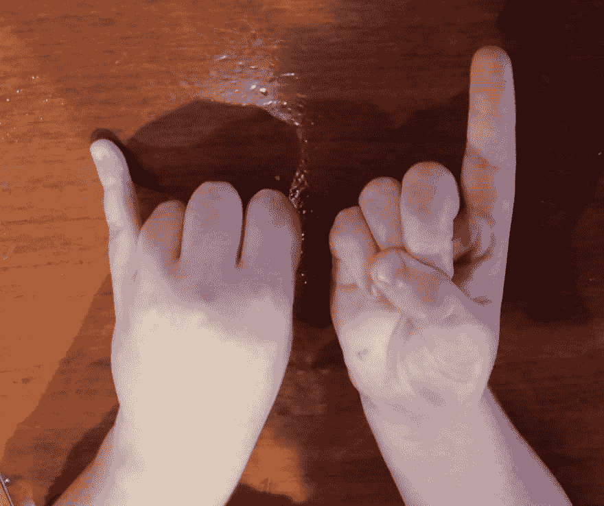](https://res.cloudinary.com/practicaldev/image/fetch/s--QGeXmq2n--/c_limit%2Cf_auto%2Cfl_progressive%2Cq_auto%2Cw_880/https://thepracticaldev.s3.amazonaws.com/i/zxb9bh9u0ery920nte1r.jpg)

[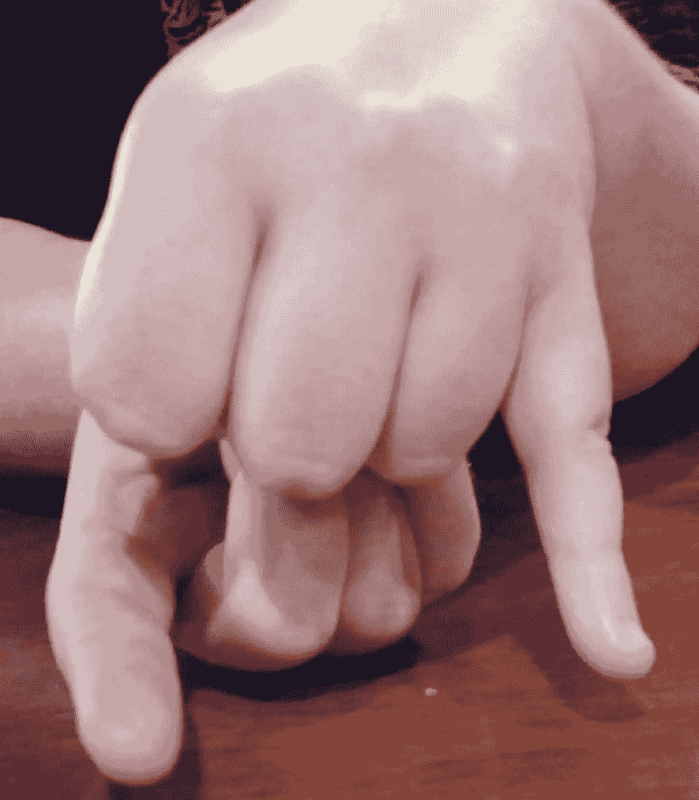](https://res.cloudinary.com/practicaldev/image/fetch/s--Q0jkzS6e--/c_limit%2Cf_auto%2Cfl_progressive%2Cq_auto%2Cw_880/https://thepracticaldev.s3.amazonaws.com/i/w6qpm9a996vhwv7u4um8.jpg)

# 异或

这里左边是 6，右边是 3。

[](https://res.cloudinary.com/practicaldev/image/fetch/s--rWrQzQKw--/c_limit%2Cf_auto%2Cfl_progressive%2Cq_auto%2Cw_880/https://thepracticaldev.s3.amazonaws.com/i/aiuq2zvc550yutzye78x.jpg)

现在把两只手放在一起，手掌接触，手指张开。

恰好有一个手指朝上的地方代表答案(5)。

[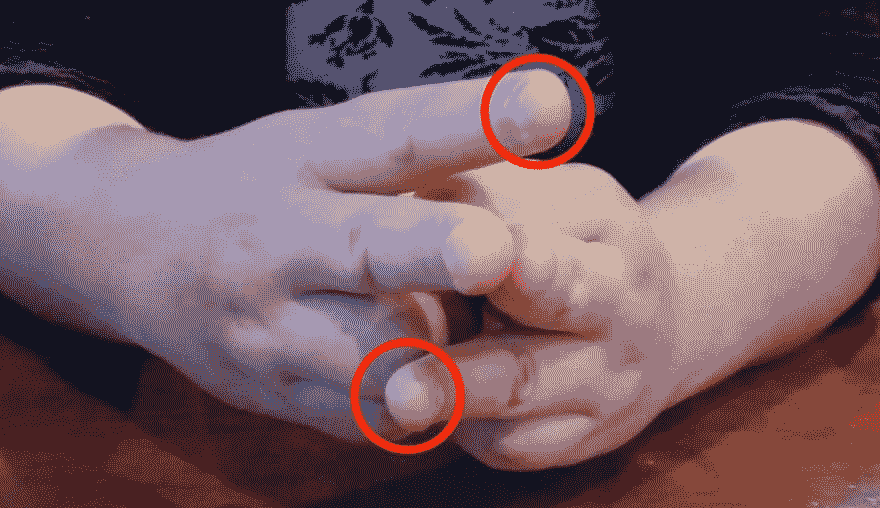](https://res.cloudinary.com/practicaldev/image/fetch/s--_oFQyGfK--/c_limit%2Cf_auto%2Cfl_progressive%2Cq_auto%2Cw_880/https://thepracticaldev.s3.amazonaws.com/i/kj3nw0tqwrexv4jgnbxt.jpeg)

更多示例:

12 异或 7 = 11

[](https://res.cloudinary.com/practicaldev/image/fetch/s--k4eO7Lyx--/c_limit%2Cf_auto%2Cfl_progressive%2Cq_auto%2Cw_880/https://thepracticaldev.s3.amazonaws.com/i/exscr81v6b17hbyztn2s.jpg)

[](https://res.cloudinary.com/practicaldev/image/fetch/s--I-1AxKy7--/c_limit%2Cf_auto%2Cfl_progressive%2Cq_auto%2Cw_880/https://thepracticaldev.s3.amazonaws.com/i/02xisx298qwrw9kyur2u.jpg)

10 异或 5 = 15

[](https://res.cloudinary.com/practicaldev/image/fetch/s--_hAtCfFj--/c_limit%2Cf_auto%2Cfl_progressive%2Cq_auto%2Cw_880/https://thepracticaldev.s3.amazonaws.com/i/rq998udwm07a6ik55sd0.jpg)

[](https://res.cloudinary.com/practicaldev/image/fetch/s--K0FjxJDS--/c_limit%2Cf_auto%2Cfl_progressive%2Cq_auto%2Cw_880/https://thepracticaldev.s3.amazonaws.com/i/eqwvm6j8aumpbx3oefwt.jpg)

# 不

把所有举起的手指都放下来；把所有放下的手指都举起来。

不是 5 = 10

[](https://res.cloudinary.com/practicaldev/image/fetch/s--SOU-QldP--/c_limit%2Cf_auto%2Cfl_progressive%2Cq_auto%2Cw_880/https://thepracticaldev.s3.amazonaws.com/i/oer0s3b03mir6l0ddj65.jpg)

[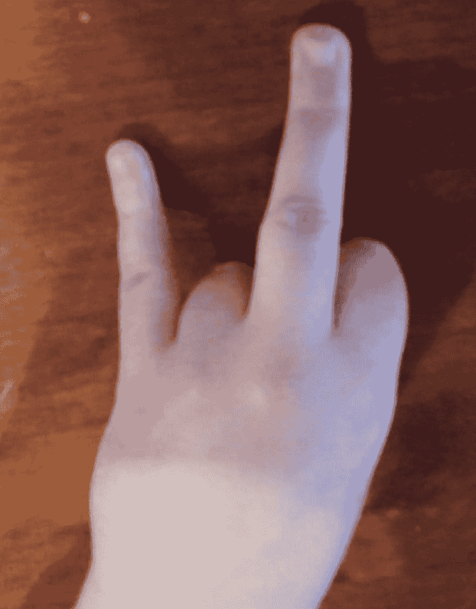](https://res.cloudinary.com/practicaldev/image/fetch/s--UnFuYgmY--/c_limit%2Cf_auto%2Cfl_progressive%2Cq_auto%2Cw_880/https://thepracticaldev.s3.amazonaws.com/i/q6qls6ngdzkz5c9tpc5k.jpg)

# 结论

现在你知道如何在手指上做位运算了！希望这有助于您以更直观的方式理解这些操作。