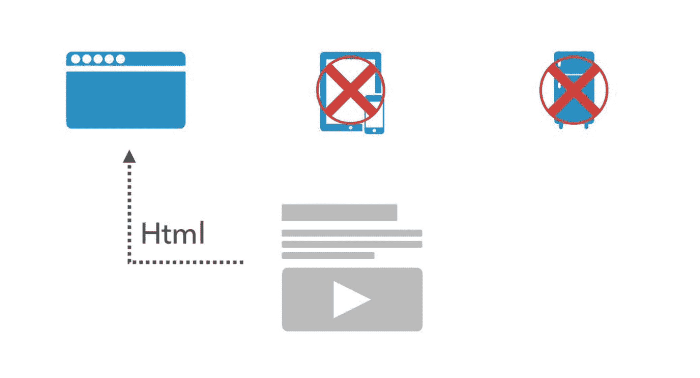
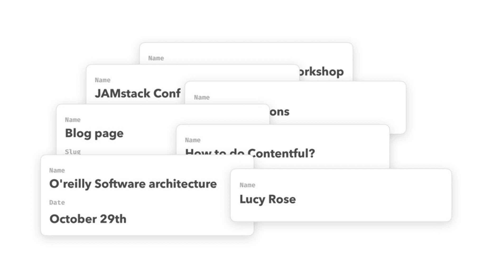
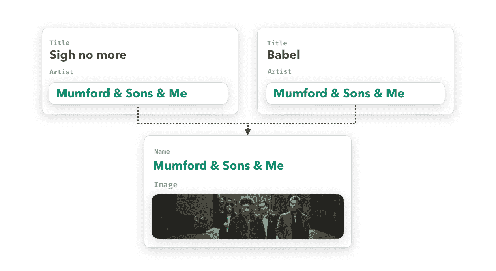
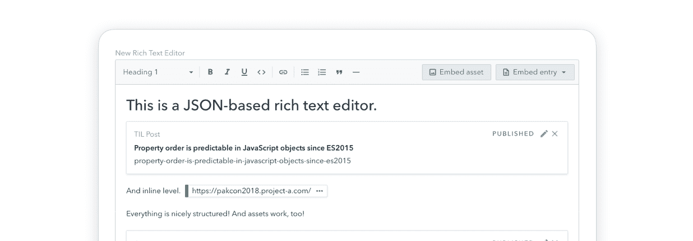
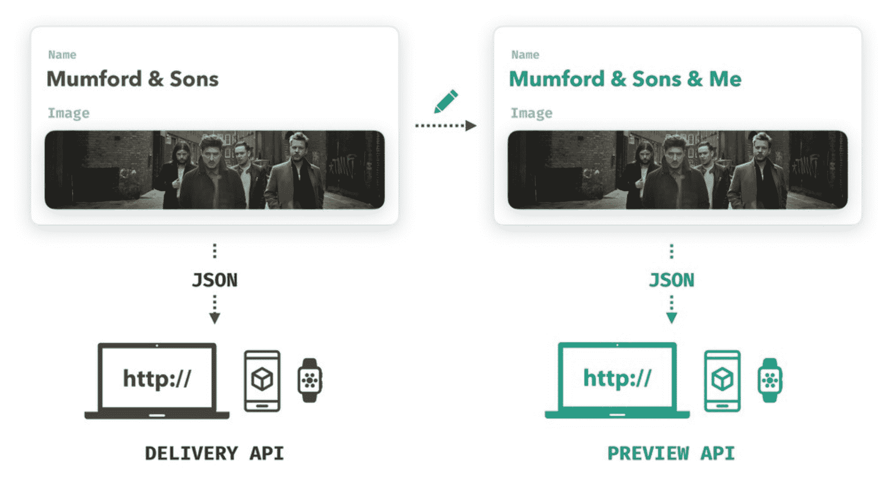
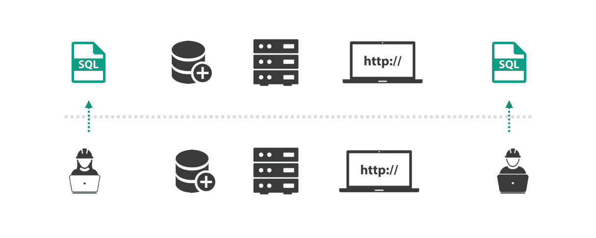
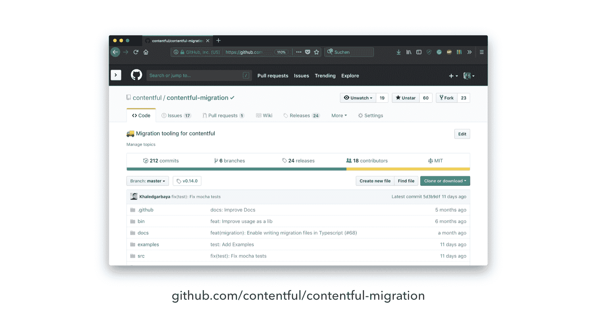
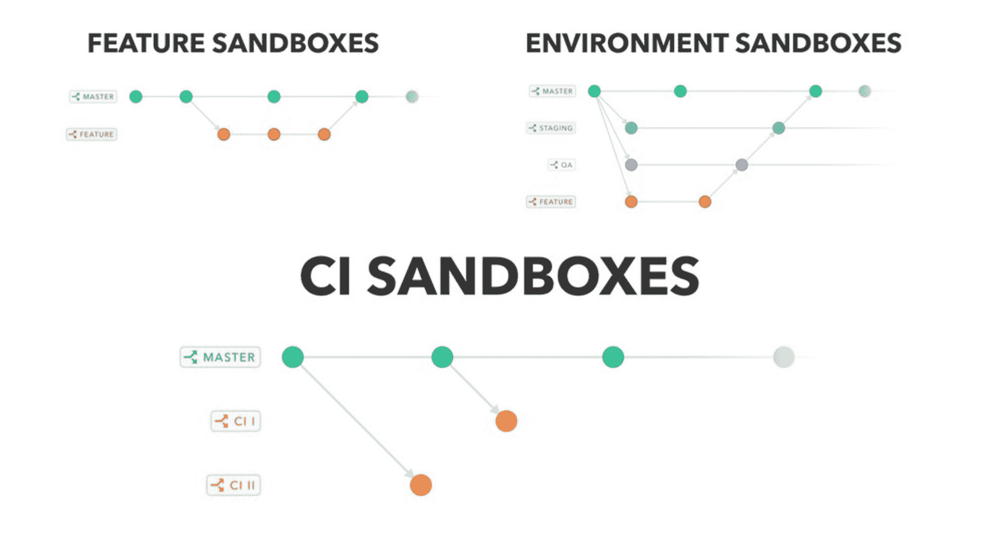
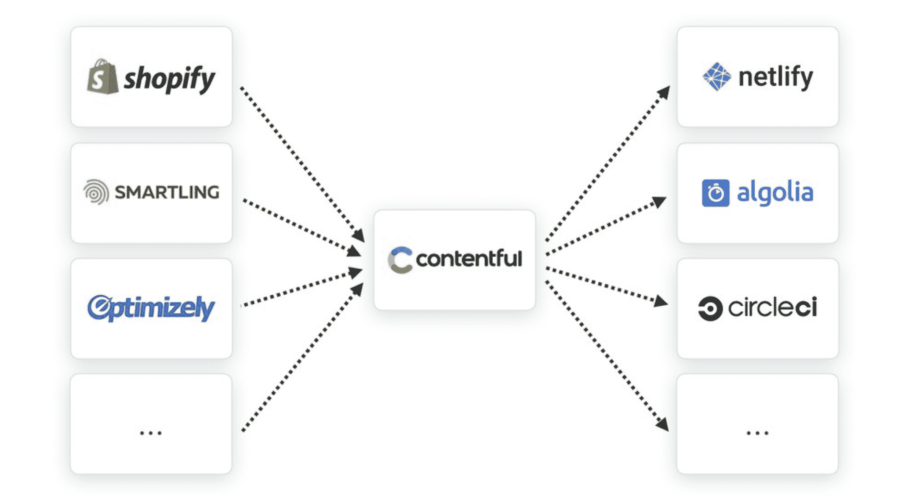

# 不仅仅是服务于 JSON——下一个 API 优先的 CMS 的五个要求

> 原文：<https://dev.to/contentful/more-than-just-serving-json--five-requirements-of-your-next-api-first-cms-4606>

[](https://res.cloudinary.com/practicaldev/image/fetch/s--ue691Tfu--/c_limit%2Cf_auto%2Cfl_progressive%2Cq_auto%2Cw_880/https://images.ctfassets.net/fo9twyrwpveg/5DsGlYk2zuakIuOCeQUGge/74096eaaefc15ab59cb5a697780e99fa/20181129-Blog-JSON-01.jpg)

当你的工作是构建数字产品时，你迟早会有冲动为你的同事提供一种编辑产品内容的方法。在大多数网站的情况下，传统的 CMS 系统可以很好地完成工作。当您不得不将相同的内容交付给使用不同技术堆栈在不同平台上运行的不同产品时，这就变得更加棘手了。

如果您的 CMS 以 HTML 格式存储(和提供)内容，您将无法轻松地将内容移植到其他技术。iOS、Android 等平台无法处理 HTML。

[](//images.ctfassets.net/fo9twyrwpveg/4iwgP1YjGMSa6QW4GQsQ6a/aac53070cc35aba4c2a432317500e911/image_0.png)

这个问题的解决方案是提供结构化的 JSON 而不是 HTML。毕竟，JSON 是网络语言，所有的通用平台都支持它，这是一个很大的优势。

*“酷！那只是一个 HTTP GET？我可以根据数据库中的内容创建一个 JSON API，这就足够了，对吗？”*

不完全是——的确，你可以从返回 JSON 的“只是一个 API”开始，以达到快速的结果；但是从长远来看，**跨平台和可扩展内容的管理不仅仅意味着“仅仅服务于 JSON”**。这就是无头或 API 优先的 CMS 发挥作用的时候了。这些系统不仅为您提供了一个可伸缩的 JSON API，还提供了一个编辑内容的界面和发展内容的方法——可以说是一个完整的内容基础设施。

在这篇文章中，我将分享五个 API 优先的 CMS 需求，如果你打算掌握可扩展的未来内容的问题，你应该注意这些需求。

## 1。您的 CMS 提供了快速移动所需的内容灵活性！

**_ 您应该能够在几分钟内建立符合您需求的内容结构。_** 当人们想到 CMS 时，他们总是会想到这些你必须自己安装的庞大系统，这些系统以页面为结构，包括巨大的 WYSIWYG 编辑器(" **W** 帽子**y**ou**s**ee**I**s**W**帽子 **y** ou **g** et ")。一个字段或文本区域无法提供足够的结构来在任何地方和跨分发渠道使用相同的内容源！你的系统必须让你有能力[将所有这些大的内容块分解成可重复使用的小块](https://www.contentful.com/r/knowledgebase/topics-and-assemblies/?utm_campaign=requirements-api-first-cms-json&utm_medium=referral&utm_source=devto&utm_content=requirements-api-first-cms-json&utm_term=)以真正成功地实现多渠道交付。

你必须明白，内容管理不是关于页面，当然也不是关于一个网站的一个所见即所得编辑器，而是关于基于小构件的数字体验。您可能正在构建一个小型 web 应用程序，并希望包含一个可编辑的公告部分，或者您希望管理移动应用程序的副本，所有这些内容都是 CMS 的用例。

您必须能够快速创建、添加和编辑可重复使用的内容结构，无论它们有多小或多复杂。您永远不会知道您的下一个项目将带来哪些内容需求，您的 CMS 设置不应该成为瓶颈。

[](//images.ctfassets.net/fo9twyrwpveg/2T63K9uWNOEq8G4saEAAQM/d521ee3a3951012ca681efc3d6bb3f35/image_1.png)

所有这些内容结构将演变成一幅大图，因此它们也必须能够连接起来——您的所有内容都必须成为可缩放的图表！

让我们以音乐集合的内容类型为例。一首歌可能是由一位艺术家创作的，而这位艺术家在他们的职业生涯中已经写了好几首歌。为了避免每个歌曲条目中的内容重复，这里应该使用两种不同的内容类型——“歌曲”类型和“艺术家”类型。

这两种内容类型的所有条目都可以相互关联，这样，当您更新一个艺术家时，您所做的更改将可用于引用它的所有其他条目。

[](//images.ctfassets.net/fo9twyrwpveg/356iPO7pduqseyK6KKcY4W/8dc72a301426b4d553eae6d73fb9f2c9/image_2.png)

使用内容图结构，您可以请求特定的节点，也可以请求条目的总和，因为它们是相互连接的。这取决于你，但是**你的 CMS 应该给你获取任何你需要的数据的灵活性**。

## 2。您的 CMS 将富文本视为 JSON！

当您有了精细的内容结构来避免重复时，下一步就是确保您的内容可以在每个平台上工作。为了实现这一点，您必须遵循*关注点分离*的规则。关注点分离的定义是将应用程序分解成不同的部分，这样每个部分实际上只处理一个关注点。

你的 CMS 的工作是让你创建和编辑内容-没有别的！该内容的样式和表示是另一个问题，应该由应用程序的另一部分来处理。每当特定于平台的内容(如 HTML)进入您的内容以应用样式时，您就打破了关注点分离的模型——相信我，当您决定以后将相同的内容提供给不同的产品或平台时，这将会给您的未来带来很多麻烦！

一个包含 HTML 字段的 JSON 对象是不够好的——忘记产生 HTML 的系统吧！T3】

一个可能的选择是 Markdown，它很好地实现了关注点的分离，对于在博客上写文章很有效，但是在处理更复杂的内容结构时，它有三个明显的缺点。

### Markdown 的功能集有限。

Markdown 在语义上下了很大的赌注，但开发人员今天必须处理的内容有额外的要求。它缺少格式选项，例如:

*   下划线(是的，可以通过 CSS 在网页上实现，但是 HTML 中没有相应的下划线，这导致 Markdown 中缺少下划线选项——试着向内容创建者解释一下...)
*   能够嵌入视频和其他几种格式的内容
*   描述组件的选项(例如，手风琴)

你可以在 Markdown 中完成所有这些工作，但事实是它并不是这项工作的合适工具。

### Markdown 不能表示关系

JSON 是 100%结构化的——一个对象包含另一个对象，另一个对象包含另一个对象。让我们来看看一个条目可能的 API 响应:

```
{  "fields":  {  "title":  “A  title”,  "body":  “##  A  post  written  by  Jane  Doe”  "artist":  {  "fields":  {  "name":  “Jane  Doe”  }  }  }  } 
```

你在上面看到的是结构化的 JSON，它用一个`title`、一个用 Markdown 编写的`body`和一个对另一个对象的引用来描述一首歌，这个对象代表这首歌的`artist`。

像这样的情况是条目之间的关系闪光的地方。由于每首歌曲都包含制作该歌曲和其他歌曲的特定艺术家的引用，因此如果您更新了艺术家的姓名，该更改将反映在引用该艺术家的每个条目中。

另一方面，存储在 Markdown 中的内容只是一个长字符串，不允许引用其他条目，这使得维护大量内容非常困难，并且容易出错。

### Markdown 允许 HTML 内容

允许 HTML 输入的 Markdown 可能看起来没什么大不了的，但是如果人们有机会使用 HTML 定制他们的内容，他们就会这么做并破坏你的应用程序。它会发生，你必须确保它不会发生。

***那种跨平台的便携性应该是没办法搞乱的！*T3】**

### 丰富的内容编辑必须基于 JSON！

[](//images.ctfassets.net/fo9twyrwpveg/4JDYcz8RgkGQMmO6W8akSe/0c730245815c1b18462ae39d1a821231/image_3.png)

为了成功处理复杂的数据结构，[富内容编辑](https://www.contentful.com/developers/docs/tutorials/general/getting-started-with-rich-text-field-type/?utm_campaign=requirements-api-first-cms-json&utm_medium=referral&utm_source=devto&utm_content=requirements-api-first-cms-json&utm_term=)也应该基于 JSON。这样，编辑可以在文本区域引用其他条目，是的，在最好的情况下，他们可以在不破坏系统的情况下给单词加下划线。

## 3。你的 CMS 可以让你的内容创建者感到安全！

一旦你做到了这一步，你的所有内容都是基于 JSON 的，下一个问题就是如何预览内容。编辑预览机制对于编辑团队来说至关重要，但是当您只有一个 JSON API 时，这是如何实现的呢？

要构建一个合适的预览环境，您需要查看未发布内容更改的选项。**是时候推出第二个 API 了——预览版 API** 。

有了第二个 API，[你可以设置不同的环境](https://www.contentful.com/developers/bits-and-bytes/#creating-a-preview-environment-using-the-preview-api?utm_campaign=requirements-api-first-cms-json&utm_medium=referral&utm_source=devto&utm_content=requirements-api-first-cms-json&utm_term=)，编辑可以在发布前检查内容和对内容的修改。

[](//images.ctfassets.net/fo9twyrwpveg/4GnA6BxoQMyeoOMIwGWI6u/ac2dc5375fbceda6f4c22abbef3d4733/image_4.png)

你的编辑必须对你提供的系统感到安全和舒适——预览机制是其中很大的一部分。

## 4。你的 CMS 给了你无畏进化的工具！

来自传统 CMSes 的开发人员习惯于在他们的开发机器上拥有生产环境(包括生产数据库)的精确本地副本。在进行结构性更改时，他们倾向于编写一个 SQL 脚本，在本地对其进行测试，并在感觉良好时将其应用到生产中——但是，当您的内容不存储在数据库中，而只能通过 API 访问时，您如何遵循这一工作流程呢？

[](//images.ctfassets.net/fo9twyrwpveg/4KcZ2xvEE0meUsmasyICQK/21fb706b6e2c7c991c3675d983b55b9a/image_5.png)

此工作流导致了对您的内容基础架构的两个主要要求:

*   制作生产内容拷贝的能力
*   大规模编写内容变化脚本的能力

### 制作制作内容的副本

在 Contentful，你可以创建你的“主内容”的副本，你可以在一个稍微不同的 URL 下访问这些副本——我们称这些副本为[沙盒环境](https://www.contentful.com/faq/environments/?utm_campaign=requirements-api-first-cms-json&utm_medium=referral&utm_source=devto&utm_content=requirements-api-first-cms-json&utm_term=)。在那里，您可以创建、更改和删除它们，而不会影响任何生产数据；为您提供在本地开发内容更改的安全性。

使用环境 ID 和空间 ID 的组合，您可以访问其内容来构建生产、暂存或本地环境:

```
cdn.contentful.com/spaces/{space_id}/environments/{environment_id}/entries

cdn.contentful.com/spaces/.../environments/master/entries
cdn.contentful.com/spaces/.../environments/my-new-feature/entries 
```

沙盒环境相当于传统系统的 SQL 数据库转储。下一个问题是——如何在这个新世界中编写数据库脚本？

### 自动化迁移工具

首先，要让开发者能够编写内容变化的脚本，**你需要第三个 API 来写数据。**不幸的是，仅有写访问权限的准系统 API 端点是不够的。开发人员希望快速编写脚本，而不是深入研究关于 API 端点的文档。

[](//images.ctfassets.net/fo9twyrwpveg/5Vs3xFOhwIs2ekM6ksWE0q/77a9b44443dc7e374172e83bddb4d680/image_6.png)

在 API 端点上定义脚本通常会产生一个定制的解决方案。在 Contentful，我们决定让[内容迁移成为我们生态系统的一等公民](https://github.com/contentful/contentful-migration),为开发人员提供一种简单的方式来更改他们的内容！

### CMS 为代码工作流

通过沙盒环境和迁移脚本的结合，您可以像对待应用程序中运行的源代码和数据库一样处理 CMS。

[](//images.ctfassets.net/fo9twyrwpveg/5Egtp2Qs8ggiK6GQ6e2cmA/f73a584674aa10c7b8f08dedd613f499/image_7.png)

您可以创建开发工作流来为某些功能启动环境并运行测试，或者简单地拥有试运行或 QA 环境，并自动化您的 CI 渠道。有许多大型公司[成功实施](https://www.contentful.com/blog/2018/09/13/content-model-changes-scale-telus-cms-as-code/?utm_campaign=requirements-api-first-cms-json&utm_medium=referral&utm_source=devto&utm_content=requirements-api-first-cms-json&utm_term=) [开发人员工作流的实例。](https://www.contentful.com/blog/2018/09/13/content-model-changes-scale-telus-cms-as-code/?utm_campaign=requirements-api-first-cms-json&utm_medium=referral&utm_source=devto&utm_content=requirements-api-first-cms-json&utm_term=)

## 5。您的 CMS 与其他供应商合作得很好！

今天的开发者生态系统由非常专业化的服务组成。有持续集成、商务、翻译的解决方案；这个清单还在继续。为您的产品提供支持的内容很可能会与您的堆栈中的其他服务有一些接触点。

您的 API 优先的 CMS 必须准备好与其他软件即服务(SaaS)产品很好地集成。

[](//images.ctfassets.net/fo9twyrwpveg/7ePP9kr7eEywcIAsQ0WcgM/7e40552b83714f0a9b7d476e0e169453/image_8.png)

### 一个可扩展的编辑界面

配置编辑器界面的可能性对于提高内容创建者的生产力非常重要。假设你在你的产品中使用不同的 API，你也可能想要创建短路径，例如，从你的商务平台中检索[数据，](https://www.contentful.com/developers/marketplace/contentful-ui-shopify/?utm_campaign=requirements-api-first-cms-json&utm_medium=referral&utm_source=devto&utm_content=requirements-api-first-cms-json&utm_term=)[控制 AB 测试](https://blog.optimizely.com/2018/02/13/experimentation-content-creation-process/)或者[在你的 CMS 中翻译单词](https://www.contentful.com/developers/marketplace/translate/?utm_campaign=requirements-api-first-cms-json&utm_medium=referral&utm_source=devto&utm_content=requirements-api-first-cms-json&utm_term=)。

### 灵活可调的网钩

此外，无论何时有人添加或删除内容，您都希望能够通知基础架构的其他部分。解决这个问题的一个常见方法是 web hooks——云服务向您选择的 URL 发送请求。

并非每个 webhook 实现都是相同的，连接不同的服务可能比看起来更困难。然而，通过特定的 webhook 功能，如定义自定义标题、在非常精细的级别控制 webhook 操作以及调整 web hook 的有效负载，您将使您的 API 提供者相互对话，并且您将能够[直接连接服务](https://www.contentful.com/developers/docs/tutorials/general/enhancing-search-experience-with-algolia/?utm_campaign=requirements-api-first-cms-json&utm_medium=referral&utm_source=devto&utm_content=requirements-api-first-cms-json&utm_term=)以节省工作和额外的基础设施。

## 不止一个 JSON API

正如您所看到的，为了在您的产品中成功发布所有优秀的内容，它需要一个比作为 CMS 的数据库之上的可伸缩 JSON API 稍微多一点的东西。

在 API 级别上，您至少需要以下内容:

*   为您的站点和应用服务的可扩展缓存 API
*   一个预览 API，允许您为编辑人员构建预览他们的更改的环境
*   允许您执行自动内容更改的编写或管理 API

提示:如果有一种自动调整大小和裁剪图像的方法，也会加分。

此外，内容结构和编辑体验与 API 本身一样重要，但如果您处理大量内容， ***您的 CMS 应该为您提供解决方案，以更改您的生产系统中已经存在的内容*** 。没有什么比停滞不前、无法前进更糟糕的了——这是一个经常被忽视的点。

有了这个词——明智地选择 API 优先的 CMS。:)

(您可以在演讲[“当内容管理系统不够用时——来自内容基础设施的故事”](https://speakerdeck.com/stefanjudis/when-a-cms-is-not-enough)的幻灯片中找到关于内容管理系统应具备哪些功能的更详细信息)。