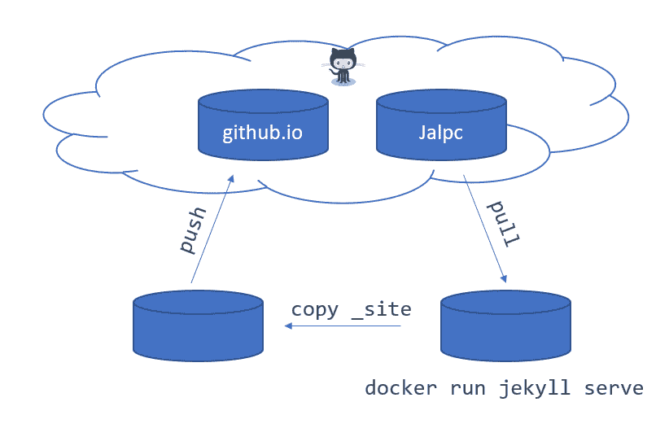

# 用 Jekyll 和 Docker 容器设置 GitHub 页面

> 原文：<https://dev.to/sebagomez/setting-up-a-github-page-with-jekyll-and-a-docker-container-56pb>

***TL；博士*** *:我使用一个容器构建了我的静态个人站点(*[*【https://sebagomez.github.io/】*](https://sebagomez.github.io/)*)，而不是安装 Jekyll 所需的所有运行时/构建，包括 Ruby 和谁知道还有什么。*

我最近偶然发现了一个非常酷的个人网站([https://jarrekk.github.io/Jalpc/](https://jarrekk.github.io/Jalpc/))，我认为是时候用一些有用的东西来改造我的旧 GitHub 页面了。该网站的回购托管在 GitHub 上，所以我想我可以自己分叉回购，并用我的数据更新它。不对！

分叉回购后，我意识到这是所谓的哲基尔的东西。我以前听说过杰基尔，但不知道它是什么，更不知道如何使用它。我开始阅读一些相关资料，发现我必须安装 Ruby。不要误解我，我对 Ruby 没有任何意见，但我不想在我的 PC 上安装任何其他东西。尤其是另一个运行时/构建工具。

所以在删除这个项目并忘记所有关于这个网站的事情之前，我想我可以花 2 分钟寻找一个装有所需工具的容器。我真幸运！我找到了正确的容器(jekyll\jekyll:builder)。

所以这就是我在一无所知的情况下得到我的网站的方法。

我做的第一件事是启动一个基于该映像的容器，我注意到`jekyll serve`启动了一个端口为 4000 的 web 服务器，所以我添加了-p 标志和-v 来将我的文件挂载到容器中。这是我运行的命令:

```
docker run — rm -v c:/code/sebastian/Jalpc:/srv/jekyll -p 4000:4000 -it jekyll/jekyll:builder bash 
```

Enter fullscreen mode Exit fullscreen mode

我创建了一个启动容器的批处理文件。

一旦进入 bash 提示符下的容器，你只需输入`_jekyll serve_`。该命令将构建静态站点，并在端口 4000 上启动一个 web 浏览器。

仅此而已。这就是你如何建立网站，但现在你必须把它推到你的. github.io 库，所以这是我的解决方案…它可能是一个我不知道的更好的解决方案，所以这就是我所做的。

生成的静态站点位于 _site 文件夹下，所以我创建了另一个名为 deploy.cmd 的批处理文件，它会将 _site 下的文件复制到我的本地机器上的另一个 repo，该机器有一个针对我的 sebagomez.github.io repo
的远程

```
robocopy \_site\ ..\github.io \*.\* /E /XF \*.cmd \*.md 
```

Enter fullscreen mode Exit fullscreen mode

在所有东西都被复制之后，我需要做的就是去 github.io repo，提交/推送修改。

[](https://res.cloudinary.com/practicaldev/image/fetch/s--UyvKCzcT--/c_limit%2Cf_auto%2Cfl_progressive%2Cq_66%2Cw_880/https://cdn-images-1.medium.com/max/1024/1%2AhXWMTcAGR433Zjl8J-FItw.gif)

我为什么那样做？

问题是 _site 文件夹在最初的回购中被忽略了，当然，我们希望保持这种状态。(据我所知)没有办法添加另一个不同的远程回购。gitignore 文件，所以我不知道如何解决这个问题。这是我能想到的最好的解决方案，我愿意听取如何改进这一设计的建议。

[](https://res.cloudinary.com/practicaldev/image/fetch/s--ZlpBI41---/c_limit%2Cf_auto%2Cfl_progressive%2Cq_auto%2Cw_880/https://cdn-images-1.medium.com/max/822/1%2AldOBeIDjHZSY6CatP9ZOkg.png)