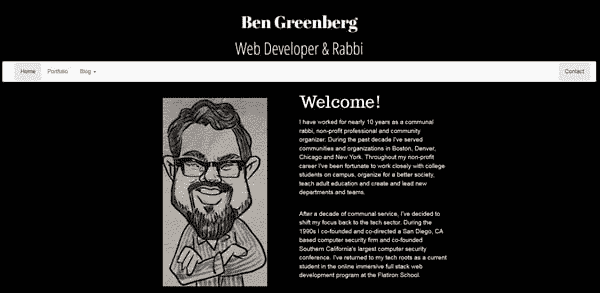
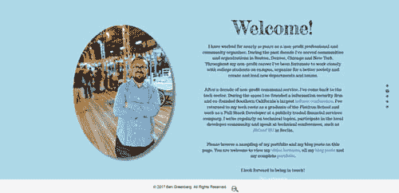
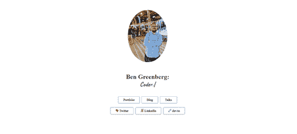

# 一个由 3 张图片组成的投资组合网站演变的故事

> 原文：<https://dev.to/bengreenberg/a-tale-of-portfolio-site-evolution-in-3-pictures-1437>

作品集网站是我们展示我们的项目、分享我们的作品的地方，总的来说，是为我们的专业自我培养一个在线形象的地方。这是所有这些事情，但它也是对人本身的反映。

portfolio 站点不仅仅是一个展示个人项目的地方，它还是一个项目本身。这是一个不断变化和发展的项目，展示了设计者的设计选择和编码风格。也许当你第一次开始设计它的时候，你有一种引人注目的心情，所以你的网站使用了很多明亮的颜色和大的有表现力的字体。也许你在创建网站的时候情绪比较低落，所以网站由柔和的颜色和适中的字体组成。

在过去一年左右的时间里，我创建了三个不同的投资组合网站。现在回头看看它们，当我刚刚部署了我的第三个也是最近的版本时，是思考这段旅程的好时机。portfolio 网站的经历反映了我的编码之旅，以及我想把自己投射到网络空间的想法。每个网站都是我作为一个人和一个程序员的快照。

## 组合站点# 1:2017 年 7 月

第一个网站是我在熨斗学校学习期间创建的。我刚刚通过了面向对象的 Ruby 和 Sinatra 项目评审。bootcamp 项目是我建立的第一个真正的网络应用程序，它让我非常兴奋地将它应用到另一个领域，我决定用一个投资组合网站来这样做。至此，我了解了 Bootstrap、PostgreSQL 和设置 Sinatra 应用程序的基础知识。

对于那些不知道的人来说，Sinatra 就像是 Rails 的一个轻量级版本。它不那么固执己见，而是依赖开发人员做更多的设置工作。在 Flatiron 课程中，学生在学习 Rails 之前先学习 Sinatra，以此来理解形成大量 Rails 体验的一些“魔法”。 ]

关于设计，我脑海中有一个真正清晰的图像，一个开发者网站*应该是什么样子的*,它包含了许多黑色、灰色和白色的颜色选择。在进入 Flatiron 之前，我最后一次认真从事技术工作是在 20 世纪 90 年代末，当时黑色背景网站非常流行。

我也没有任何在这个时候分离前端和后端的经验，所以它们都是一起创建的。这主要是一个 Ruby 驱动的网站，如果有 Javascript 的话，也很少。

## 组合站点# 2:2017 年 9 月

两个月在现实中可能不是很长，但它包含了训练营世界中大量的知识。到这个时候，我已经为我的投资组合网站准备好了一个新的前端。黑色、灰色和白色的选择在这一刻并没有反映出我。我还想将我对 Javascript 的了解融入到我的网站中。

虽然我不再对我的投资组合网站的展示产生共鸣，但数据仍然是好的，我如何在数据库中组织它正是我仍然需要的。因此，在这一点上，我决定把我的网站分成两部分:Sinatra 驱动的 API 后端和 React 前端。

关于后端，SQL 表就是 SQL 表，除非需求改变，否则你不会发现自己经常需要重构它。然而，前端开发的世界一直在适应和变化。因此，我稍微调整了一下我的 Sinatra 路由，以 JSON 格式提供数据，并着手用 React 创建一个新的前端。

现在回过头来看，我发现我想利用我新发现的反应知识的愿望意味着我为自己把事情复杂化了一点。在我的例子中，我不知道使用像 Redux 这样的状态管理工具是否真的有必要处理我在组件之间传递的状态。但是，在那一刻，我更感兴趣的是运用我学到的每一点知识，而不是明智地应用准确的架构和设计决策。当你第一次学习某样东西的时候，你会发现我能做什么！“只有后来你才意识到，选择不做某事的行为也是一种示范，有时是一种更好的示范，证明你能做什么。

这个网站在过去一年左右的时间里基本保持不变。这一年来，我做了一些表面上的改变，主要是本着同样的精神:1)学习一些东西，2)应用它。结果，网站变得越来越杂乱。我不再喜欢看我自己的投资组合网站，这可能是一个很好的迹象，是时候改变它了！

## 组合站点# 3:2018 年 11 月

现在，在我开发生涯的这个阶段，我已经做了一年的全职程序员。我有幸教过一些编程新手，总的来说，我积累了更多的经验。还有很多东西需要学习，但是我已经有了应用架构和设计选择的企业生产经验，我想将其中的一些应用到我的投资组合站点中。

简而言之，我想要一个作品集网站，让我自豪地与他人分享，并且当我在自己的浏览器中打开它时，不会让我做鬼脸。

在建造任何东西之前，我坐下来制定了我的目标:

建立一个简约整洁的作品集网站。

然后，我深入研究了我特别想整合的组件，它们是:作品集、博客和演讲。我从这三个部分中删除了更多的子页面，还删除了一个联系人组件，代之以三个指向我活跃的地方的简单链接:Twitter、LinkedIn、**当然还有**、dev.to。

自从我的上一个作品集建立以来，我也学会了真正重视网站中空白空间的作用。充足的空白可以吸引人们注意设计师所强调的东西。它让用户可以轻松地对内容进行优先排序。因此，我想确保我真正利用了浏览器中的空白，而不是填满它。

就代码选择而言，我想在这里做出正确的选择，我对使用我所知道的一切不感兴趣，只使用合适的工具来完成工作。

我知道我想把我的后端和前端分开维护，同样，我的老的可信赖的 Sinatra API 服务将充分地完成它的工作。在这一年中，我对 React 的欣赏和钦佩与日俱增，我的 Javascript 技能也是如此。我真的很喜欢 ES6 的语法，API 调用的 async/await 格式非常优雅。之前的 portfolio 站点使用了 Flexbox，这很棒，将它与 CSS Grid 相结合，提供了一种真正的响应性体验，构建起来并不痛苦。

我也对过于复杂的路由和状态管理不感兴趣，所以我选择使用 Next.js 来构建前端。Next.js 通过内置的链接 API 轻松处理路由，并具有许多其他的渲染功能，等等。这使得它使用起来没有痛苦，充满乐趣。因为我只是传递一点数据，并且只在数量非常有限的组件之间传递，所以我选择对应用程序使用本地状态，而不使用像 Redux 这样过于复杂的中间件。在我看来，我的用例不能证明利用比这更复杂的东西是正确的。

最后，我希望网站加载非常快，而不是臃肿。有这么多的 npm 模块可以增强一个网站，并添加许多有趣的功能。然而，就我的目的而言，我只是想要一个简单的、极简主义的和整洁的网站，所以我考虑了我真正需要的，并研究了 npm 生态系统。我最终加入了[反应型](https://www.npmjs.com/package/react-typed)(感谢[贾雷特·布莱恩](https://dev.to/jaybeekeeper/getting-started-with-gatsby-54n9)的灵感)、[反应型国旗](https://www.npmjs.com/package/react-country-flag)和[反应型微调器](https://www.npmjs.com/package/react-spinners)。每一个都满足了不同的需求，而且小巧紧凑。

## 接下来是什么？

一个投资组合网站平行于生活，并继续适应和调整。我刚刚部署的第三个版本非常适合我。会永远吗？我可以肯定地说，不会。

接下来会是什么？嗯，就像生活一样，你永远不知道下一步会发生什么，这就是为什么它是一次冒险。

您可以在[bengreenberg.org](https://www.bengreenberg.org)查看我当前的投资组合网站。