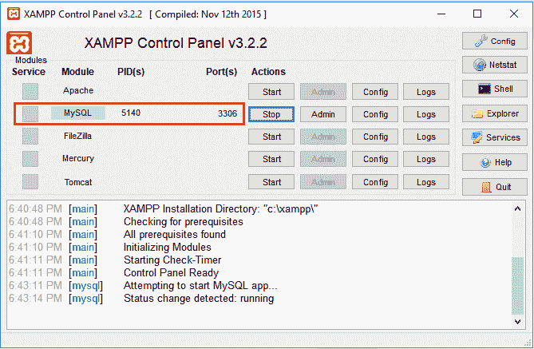
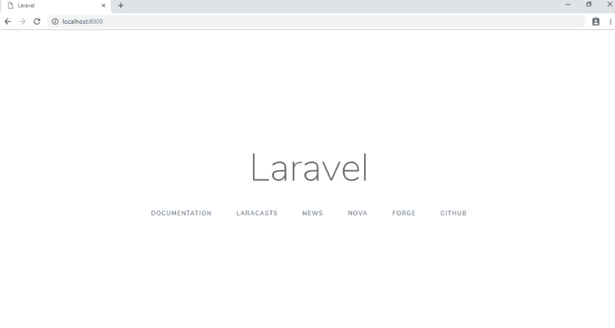

# Windows 的简单 Laravel 设置

> 原文：<https://dev.to/alchermd/simple-laravel-setup-for-windows-2kna>

*最初发布于[我的网站](https://johnalcher.me/articles/simple-laravel-setup-for-windows)T3】*

> 注意:在从零开始建立了一个定制的博客平台后，我最近正试图重返博客。这篇文章的内容不是开创性的，但它可能对我们的一些成员有用。干杯！

* * *

## 简介

大家好。在本文中，我将向您展示一种在 Windows 机器上设置 Laravel 开发环境的简单方法。请注意，这只是设置开发工作流的许多方式之一，但是我将重点放在简单性上，并试图在我们的设置中尽可能减少复杂性。我知道有**码头工人**、**流浪汉**、**宅地**以及其他针对这个问题的健壮解决方案，但是让我们只关注基础，尽快开始吧！

### 目标受众

这篇文章适合你，如果你是:

*   一个已经使用 XAMPP 的 Wordpress 开发者，想要尝试一个像 Laravel 这样的现代 MVC 框架
*   有其他后端语言的经验，想看看 Laravel 提供了什么
*   一个 Linux 用户(像我！)不知道如何使用 Windows 机器进行开发工作
*   有人只是想尝试 PHP，这个设置也适合你！

## 你需要什么

在我们继续之前，请确保将这些软件下载到您的机器上:

*   [XAMPP](https://www.apachefriends.org/index.html)——一个预打包的、跨平台的解决方案，包括多个用于 web 开发的软件。它包含了很多好东西，但是我们最感兴趣的是 PHP 和 MySQL
*   作曲家-PHP 的依赖管理器。不再需要手动下载一个`.zip`文件，现在只需要一个命令就可以下载软件包！
*   Visual Studio 代码 -微软的文本编辑器。这是可选的，你可以使用任何你想要的编辑器。

## 流程

现在我们已经了解了先决条件，让我们开始设置我们的开发环境。

**第一步** -启动 XAMPP

确保 MySQL 已经启动，否则我们将无法对数据库执行命令。

[](https://res.cloudinary.com/practicaldev/image/fetch/s--NC6YbPwi--/c_limit%2Cf_auto%2Cfl_progressive%2Cq_auto%2Cw_880/https://i.imgur.com/YOYgLVP.png)

**步骤#2** -使用 Composer 创建一个新的 Laravel 项目

打开你的命令提示符(输入 **"cmd"** ，不要在你的开始菜单上加引号)并输入下面的命令:

```
> composer create-project --prefer-dist laravel/laravel my-laravel-project 
```

Enter fullscreen mode Exit fullscreen mode

这个命令将在名为`my-laravel-project`的新目录下生成一个新的 Laravel 项目。让我们确保在继续
之前将我们的命令提示符移动到那个目录中

```
> cd my-laravel-project
> dir
<DIR>  app
<DIR>  bootstrap
<DIR>  config
... 
```

Enter fullscreen mode Exit fullscreen mode

**第 2.5 步** -修复 MySQL Windows 错误

这是一个快速捕获。XAMPP 提供的 MySQL 版本有一些问题，详见本帖中的[。要解决这个问题，打开`app/Providers/AppServiceProvider.php`文件，**用下面的代码片段替换**的内容:](https://laravel-news.com/laravel-5-4-key-too-long-error) 

```
<?php

namespace App\Providers;

use Illuminate\Support\Facades\Schema;
use Illuminate\Support\ServiceProvider;

class AppServiceProvider extends ServiceProvider
{
    /**
     * Bootstrap any application services.
     */
    public function boot()
    {
        Schema::defaultStringLength(191);
    }

    /**
     * Register any application services.
     */
    public function register()
    {
        //
    }
} 
```

Enter fullscreen mode Exit fullscreen mode

**步骤#3** -配置环境变量

Laravel 使用环境变量来保存特定于环境的细节，比如数据库凭证。这些可以在`.env`文件中找到。让我们配置用于连接数据库的环境变量。为此，用您喜欢的文本编辑器打开`.env`文件。

> 注意:如果您正在建立一个现有的 Laravel 项目，那么您的目录中可能还没有`.env`文件。您可以创建自己的`.env`文件，并复制`.env.example`文件的内容作为起点。

如果您安装了 Visual Studio 代码，您可以打开您的 Laravel 项目并在那里编辑`.env`文件:

```
> code . 
```

Enter fullscreen mode Exit fullscreen mode

打开`.env`文件后，替换以下值:

```
DB_CONNECTION=mysql
DB_DATABASE=my-laravel-project
DB_USERNAME=root
DB_PASSWORD= 
```

Enter fullscreen mode Exit fullscreen mode

> 注意:MySQL 的默认用户名是 root，它没有密码。如果您已经将其设置为不同的凭据，请相应地调整这些值。

**步骤#4** -设置应用密钥

为了安全起见，Laravel 使用应用程序密钥，或您的`.env`文件中的`APP_KEY`。最值得注意的是它在[跨站点请求伪造](https://en.wikipedia.org/wiki/Cross-site_request_forgery) (CSRF)保护中的使用，所以一旦我们安装了我们的项目，设置这个应用程序密钥是一个好主意。为此，我们可以使用一个 [Artisan](https://laravel.com/docs/5.7/artisan) 命令来为我们生成一个密钥:

```
> C:\xampp\php\php.exe artisan key:generate
Application key set! 
```

Enter fullscreen mode Exit fullscreen mode

> 注意:C:\xampp\php\php.exe 是 xampp 的默认 php 安装路径。如果您将它安装在不同的目录中，请对此进行调整。

**第 5 步** -运行数据库迁移

Laravel 使用[数据库迁移](https://laravel.com/docs/5.7/migrations)来定义应用程序的数据库模式。但在此之前，我们需要先做一个 MySQL 数据库。:

```
> C:\xampp\mysql\bin\mysql.exe -u root
>>> CREATE DATABASE my-laravel-project;
>>> exit; 
```

Enter fullscreen mode Exit fullscreen mode

为了确保我们可以连接到我们的数据库，让我们使用下面的命令运行预定义的迁移:

```
> C:\xampp\php\php artisan migrate
Migration table created successfully.
Migrating: 2014_10_12_000000_create_users_table
Migrated:  2014_10_12_000000_create_users_table
Migrating: 2014_10_12_100000_create_password_resets_table
Migrated:  2014_10_12_100000_create_password_resets_table 
```

Enter fullscreen mode Exit fullscreen mode

如果您有类似的输出，那么恭喜您！您的 Laravel 应用程序现在可以连接到 MySQL 数据库。

**第 6 步** -运行应用程序

让我们看看我们努力的回报，并运行我们的应用程序！为此，在您的终端中使用`serve` artisan 命令:

```
> C:\xampp\php\php.exe artisan serve
Laravel development server started: <http://127.0.0.1:8000> 
```

Enter fullscreen mode Exit fullscreen mode

打开网络浏览器，访问 http://127.0.0.1:8000 ，如果一切顺利，你应该会看到 Laravel 的起始页

[](https://res.cloudinary.com/practicaldev/image/fetch/s--TlpbSyxl--/c_limit%2Cf_auto%2Cfl_progressive%2Cq_auto%2Cw_880/https://i.imgur.com/XPcNKuF.png)

## 结论

就是这样！现在您已经有了一个配置了 MySQL 的工作 Laravel 设置。你现在可以开始一个 Laravel 项目了。要了解更多关于 Laravel 框架的信息，你可以查阅官方的 Laravel 文档或者观看来自 T2 Laracasts 的教程。Laravel 生态系统正在蓬勃发展，对于您想要构建的任何应用程序都应该有足够的支持！