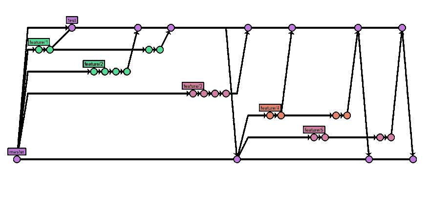
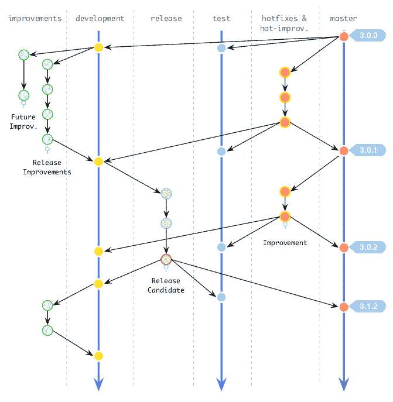
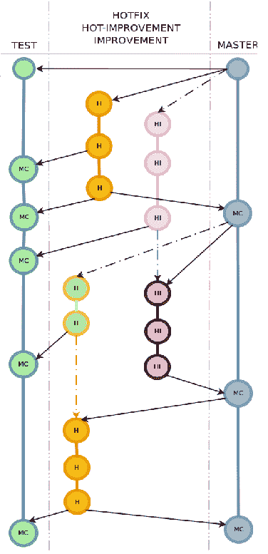

# 自我发现之旅...以及我如何学习如何使用 Git

> 原文：<https://dev.to/grmnsort/a-journey-of-self-discovery-and-also-how-i-learned-how-to-use-git-1n6>

在我的第一篇文章中，我想讲述一个关于我如何学习使用和热爱 Git 的故事，但是我想更早地开始，当我刚刚学习 VCS 工具的时候。

在学习期间，我将 SVN 作为我默认的 VCS，我们和几个朋友一起努力试图理解它的奥秘，同时开发一些被遗忘的 web 应用程序的原型。

我们年幼无知的头脑几乎不能理解树干、树枝、提交以及它们之间的一切。我们将最终设置在一个单独的主干上，并发布相关的分支来分离我们的工作。

<figure>

<figcaption>Actual picture of me and my friends preparing to merge some feature into the master trunk - circa 2008</figcaption>

</figure>

但是我们糟糕的理解导致我们在合并我们的工作时犯了几个错误，带来了一系列的问题，从方法混乱到整个类被覆盖。许多“意外”之后，我们放弃了 VCS 的想法，我们既不能处理其组件，也不能理解该工具如何适应我们的工作流程。因此，我很早就完全放弃了使用这些工具。

因此，我坚持学习，并不时地发展，不知何故，没有任何形式的 VCS，直到我找到了我的第一份正经工作(也是我现在的工作)。那是 2013 年 12 月，我加入了一个使用 Git 才一年多的小型开发团队。当他们向我解释这是什么，他们如何使用它，以及我以前在 SVN 的悲惨经历让我感觉多么简单时，我被震撼了。

<figure>

<figcaption>The inside of my head as I realized for how long I had lived a sinful life without using a VCS tool</figcaption>

</figure>

当时，开发工作流围绕着两个主要的 Git 分支: *master* 托管所有部署到我们生产环境中的经过验证的稳定代码，以及 *test* ，一个包含所有必须由我们 QA 团队审查的代码的分支，这个分支被部署到一个特殊的“测试”环境中。此外，每个开发人员将创建一个特性/错误修复分支来解决特定的问题，这些分支将为每个开发人员部署在系统的本地实例上。一旦每个开发人员完成了他们的工作，他们会立即将它合并到测试分支中。

在一天中的某些时候，我们的首席开发人员会将*测试*分支的内容部署到测试环境中。一旦测试完成，并且*测试*分支的所有内容都被认为是“批准的”，那么我们的首席开发人员将会把*测试*分支合并到我们的*主*分支中，并着手将其所有内容部署到生产环境中。

<figure>

<figcaption>Our fearless head developer waiting to merge the test branch into the master branch</figcaption>

</figure>

请考虑一下，当时我认为这是我见过的最棒的事情...

这个工作流程有许多问题，其中包括:

*   在两次部署之间，没有使用添加到主分支的更改来更新任何功能或错误修复分支。这导致了对旧功能的巨大冲突，有时意味着重新制作整个东西。
*   所有的合并都是通过快进完成的(当时我们不知道这是什么意思),这使得日志几乎不可读，无法跟踪对系统所做的更改组。
*   为了完成产品部署，我们的首席开发人员会让我们所有人停止将我们的特性和装置合并到*测试*分支中，直到他完成为止。有时候，开发者会忘记这一点，并在其中加入一些东西，这在我的国家俚语中被称为“中场进球”(来自智利的强制性足球引用)...检查)有效地将代码直接部署到生产中，而无需 QA 团队的任何人给它一个简单的 AOK。

作为一个图表，它看起来像这样:

<figure>

<figcaption>On this graph new commits are closer to the right</figcaption>

</figure>

不知何故，我们设法在 2014 年年中完成了这个工作流程，当我们最终达到临界质量时，糟糕的解决冲突和许多“中场目标”将我们置于一个非常糟糕的位置，错过了最后期限，并且无法完全保证在我们的生产环境中有稳定的代码，我们需要改变，而且我们需要尽快改变。

进入 Gitflow，从我们无畏的首席开发人员手中降临到我们身上，这是一种“对我们来说新的”组织我们工作的方式，并收回对我们在 master 分支上的混乱的控制。我们将添加*开发*分支，以分离我们的功能和 bugfix 分支的生命周期，并使用*发布*分支，以受控的、有希望的、有计划的方式逐渐向系统添加功能。标记不仅用作标志来指示 git 历史中应用程序的给定状态，还用作执行生产环境部署的特定点。

<figure>

<figcaption>How we saw our head developer, as he told us about GitFlow</figcaption>

</figure>

我们有额外的挑战，我们的*测试*分支必须保留，因为这仍然是我们必须部署代码的唯一方式，以便它可以被我们的 QA 团队测试，所以在实践中，我们最终有两个 Gitflows，一个用于*测试*分支，一个用于*主*分支。考虑到当前的状态，错误修正和发布将被合并到任何一个分支中。

这个新的工作流程如下图所示:

<figure>

<figcaption>On this graph new commits are closer to the bottom</figcaption>

</figure>

我们还被告知，我们不再需要等待将合并的代码部署到*测试*分支来修复错误。如果开发人员完成了，除了立即将分支合并到测试分支中，他们还会将代码部署到测试环境中。

在一段时间内，这还不错。

你看，我们认为仅仅通过改变分支策略就能解决我们所有的问题，但我们也应该检查我们对分支的处理，特别是:

*   我们仍然没有正确地更新旧的分支。
*   我们仍然不确定这个“快进”策略是什么。
*   解决冲突时并没有真正关注到底发生了什么。那时，我们没有使用 diff 工具来解决合并，办公室中流行的策略是接受当前合并到目标分支中的变更作为“正确的”变更，而不是必须读取和手动接受任何一组变更。
*   *测试*分支开始与我们不断合并的所有问题相关分支“混杂”,导致许多不必要的冲突和没有真正解决的问题的误报。

17 个版本...这就是我们再次崩溃的全部原因。自从我们采用这个修改的 Gitflow 以来，一年半的时间已经过去了，而最后一个版本至少花了一周半的时间来完全解决它的每一个冲突。

<figure>

<figcaption>average production deploy during our GitFlow period</figcaption>

</figure>

我们必须解决这个混乱的问题，我们不确定要做什么，我们从完全放弃 GitFlow 开始，回到我们的“2 个主要分支工作流”，并慢慢地试图找出哪里出错了。从那时起，我们开始解决检测到的每个问题，一次解决一个:

*   我们了解了使我们的开发保持最新的不同策略。
*   我们建立了一个适当的渠道来讨论解决冲突。
*   我们同意使用非快进合并，这样我们的代码可以很容易地分组阅读。

考虑到这一点，我们设计了一个工作流模型，它基于我们过去的经验和我们从在线文章中找到的东西，可以适应我们的学习过程和我们开发过程生命周期的现实。

我们最终设定了一个工作流程，它要求:

*   还没有被合并到*主*中的每个分支必须相对于最后被推送的标签进行更新。
*   分行更新策略是通过重定基准。
*   对*主*或*测试*分支进行的任何合并都是以“非快进”格式完成的，留下了额外的提交，正确地识别了何时合并了与问题相关的分支。
*   *测试*分支必须在内容上尽可能接近*主*上的最新推送标签。

我们还放弃了任何与问题相关的分支的即时测试合并和部署，并选择了“等到我们在测试环境中真正需要它时”的方法。

此外，我们采用了一个程序，每当我们向 master 推送一个新标签时，我们将删除 *test* 分支，并通过从新推送的标签分支开始一个新的分支。

<figure>

作为一个图表，我们的新工作流看起来像这样:

<figcaption>On this graph new commits are closer to the bottom</figcaption>

</figure>

有了这些改变，我们得以:

*   几乎完全消除任何主要分支上的大冲突。并将小冲突从“大多数问题相关分支上的每日频率”减少到“一些问题相关分支上的每月一次”。

*   创建一个简单易读的 git 历史，其中每个问题的所有工作都很容易识别。

*   几乎完全消除了问题测试阶段的误报。

我们一直在调整这个模型，直到今天，我们做的最后一件事是将 Gitlab 引入混合，希望在不久的将来使用合并请求和 CI/CD。我们希望继续发展，并建立一个日益强大的工作流程。

当我回顾这个故事的时候，我几乎不敢相信我们经历了多少，我们付出了多少努力和学习才走到今天。随着我继续学习，我会努力不忘记这一点。

感谢您抽出时间阅读本文:)