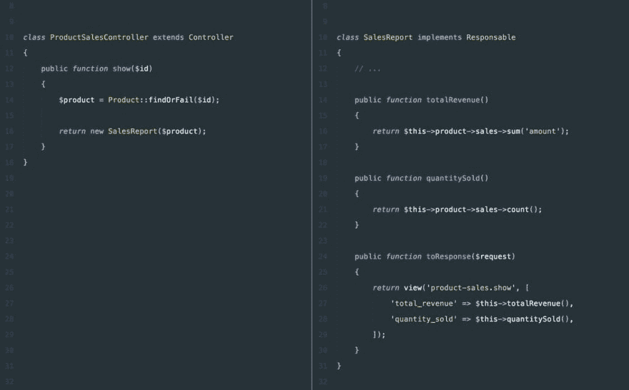

# 在 Laravel 中对视图采取基于类的方法。

> 原文：<https://dev.to/slashequip/taking-a-class-based-approach-to-views-in-laravel-3lmi>

> 注意。本文最初于 2018 年 3 月 15 日发表在 Medium 上。

我最近一直在开发一个简单的 Laravel 包，名为 [Laravel Viewables](https://github.com/haganjones/laravel-viewables) ，它总结了我在 Laravel 中使用基于类的视图的方法。我在几乎所有我参与的中/大型项目中都使用它。

一段时间以来，我一直想写下我的想法，为什么我采取这种方法，以及其他人如何从中受益。冒名顶替综合症阻止了我尽快发表这篇文章，但我最终还是做到了！嗨，和我的冒名顶替者们击掌！

### 什么时候使用基于类的视图？

这里要明确的是，除非*你知道*你需要将视图提取到类中，否则我不认为一个项目应该从一开始就使用这种方法。基于类的视图可以在重构期间非常简单地实现，此时控制器方法开始变得臃肿，依赖于特定于视图本身。

一个很好的例子就是涉及销售收入汇总的电子商务应用程序报告页面。思考关注点的分离；管制员是否应该知道(或关心)这些事情:

*   视图文件的名称和位置。
*   如何检索/计算特定视图数据，以及…
*   …视图期望接收的变量的名称。

个人认为，不，我不这么认为。如果所有这些视图逻辑都保存在自己的类中，并有自己的依赖关系，那就方便多了，这就是基于类的视图可以帮助清理控制器并帮助更容易地管理复杂视图的地方。

使用基于类的视图减少了控制器与特定视图/ [刀片](https://laravel.com/docs/5.6/blade)文件的紧密耦合，并将这种耦合转移到专用类。当控制器有多个返回视图的方法时，这种耦合性的降低变得更加明显。

再次声明，我并不是建议在基于类的视图中使用所有的视图，不要用简单的逻辑为简单的视图过度或预先优化代码。

### 我被卖了。它们是如何工作的？

从 Laravel 5.5 开始，框架附带了一个 Responsable 接口，实现这个接口需要在 Responsable 类中包含一个 toResponse()方法。该类的新实例现在可以直接从控制器返回。

亚当·瓦森在推特上举了一个关于责任类的小例子:

> 亚当·瓦坦@亚当·瓦坦🔥专用视图对象是 Laravel 5.5 新的“可响应”界面的一个很好的用例。
> 
> 可以去掉对其他花式图案的需要👍2017 年 8 月 16 日下午 15:04189591

### 好了，那么什么是可视呢？

可视对象(正如我给它们起的名字)是建立在 Responsable 接口之上的，内置的功能和方法类似于 Laravel 的[maillable](https://laravel.com/docs/5.6/mail#generating-mailables)类的工作方式。它们提供了一种更加流畅的方式来构建基于类的视图。

完整的文档可以在这里找到[，但是我将从](https://github.com/haganjones/laravel-viewables/blob/master/README.md)[亚当](https://adamwathan.me/)的例子中重构上面的例子，并加入一些注释来展示如何完成。