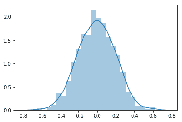

# 用于数据科学、机器学习和统计的基本 Python 库

> 原文：<https://dev.to/marsja/essential-python-libraries-for-data-science-machine-learning-and-statistics-5175>

在这篇文章中，我将为打算使用 Python 进行数据科学、机器学习和统计的人列出一些非常有价值的库。这些库非常广泛，由世界各地的大量专家开发，这些库使 Python 成为一个非常强大的数据分析工具。

我真的建议您安装并使用 Anaconda(科学 Python 发行版)。这将为您提供大量已安装的 Python 库。在下面的例子中，我们将使用一个非常方便的库；熊猫。

[](https://res.cloudinary.com/practicaldev/image/fetch/s--YrwplfMZ--/c_limit%2Cf_auto%2Cfl_progressive%2Cq_auto%2Cw_880/https://thepracticaldev.s3.amazonaws.com/i/idy4tckeslb906qv6wb0.JPG)

惯例是将 pandas 作为 pd 加载，然后我们可以非常容易地使用这些方法和类。例如，我们可以编写 pd.read_csv('datafile.csv ')来将 csv 文件加载到 dataframe 对象。

## Python 中的基本库

在这一节中，我将列出一些涉及数据科学的最重要的 Python 库。

### NumPy(数字 Python)

NumPy 是一个用于数据存储和计算的扩展库。这个库包含数据结构、算法和其他用于在 Python 中处理数字数据的东西。此外，NumPy 包含了比 Python 内置方法更有效的数组(列表)方法。这使得 NumPy 比 Python 的标准方法更快。NumPy 还包含可用于向 Python 加载数据以及从 Python 导出数据的特性。

例如，如果你是从 MATLAB 迁移过来的，你会喜欢 NumPy(见这里的)

http://num py . org

### 熊猫

Pandas 是最强大的数据处理库。Pandas 包含广泛的数据导入和导出功能，以及索引和操作数据。对于那些使用 Python 进行数据科学的人来说，这个库是不可或缺的。Pandas 还包括复杂的数据结构方法。pandas 中最常用的数据结构是 dataframe(一系列列和行)和 series(一个一维数组)。

Pandas 对于重塑、合并、拆分、聚合和选择(子集化)数据非常有效。事实上，数据科学项目中的绝大多数代码通常包含数据争论，这是准备数据以便执行分析所需的步骤。为所有的数据争论建立一个一致的库当然是有利的。与被称为 R 的统计编程环境不同，Python 中没有内置的 dataframes 变体。数据框架是基本上所有数据分析的核心。数据帧是由列和行组成的表格。[这里是](https://www.marsja.se/pandas-dataframe-read-csv-excel-subset/)我写的一个非常好的熊猫数据帧教程，针对初学者。

[http://pandas.pydata.org](http://pandas.pydata.org)

### matplotlib

Matplotlib 用于可视化数据。虽然 matplotlib 很容易使用，而且你可以很好地控制你的绘图，但是我还是推荐你使用 Seaborn。

[http://matplotlib.org](http://matplotlib.org)

### 海风

Seaborn 是基于 matplotlib 的数据可视化 Python 包。这个包为我们提供了一个高级界面来绘制美丽和丰富的可视化效果。可以绘制条形图、直方图、散点图和许多其他漂亮的图。

下面是一个使用 NumPy 生成数据并使用 Seaborn 绘制数据的例子:

```
import numpy as np
import seaborn as sns

# Generate some normally distributed data dat = np.random.normal(0.0, 0.2, 1000)

# Create a histogram using seaborn sns.distplot(dat) 
```

[](https://res.cloudinary.com/practicaldev/image/fetch/s--_q4VzzI0--/c_limit%2Cf_auto%2Cfl_progressive%2Cq_auto%2Cw_880/https://thepracticaldev.s3.amazonaws.com/i/r4rqnlyn7obgroqr45ff.png)

*   [了解如何使用 Seaborn](https://www.marsja.se/how-to-make-a-scatter-plot-in-python-using-seaborn/) 在 Python 中创建散点图。

### SciPy(科学蟒)

SciPy 包括高级计算功能。

-= ytet-伊甸园字幕组=-翻译:粒粒粒尘紫月猫姐校对

### scikit-learn

scikit-learn 是一个巨大的数据分析特性库。在 scikit-learning 中，有分类模型(例如，支持向量机、随机森林)、回归分析(线性回归、岭回归、lasso)、聚类分析(例如，k-means 聚类)、数据简化方法(例如，主成分分析、特征选择)、模型调整和选择(具有像网格搜索、交叉验证等特征)、数据的预处理等等。
[http://scikit-learn.org/](http://scikit-learn.org/)