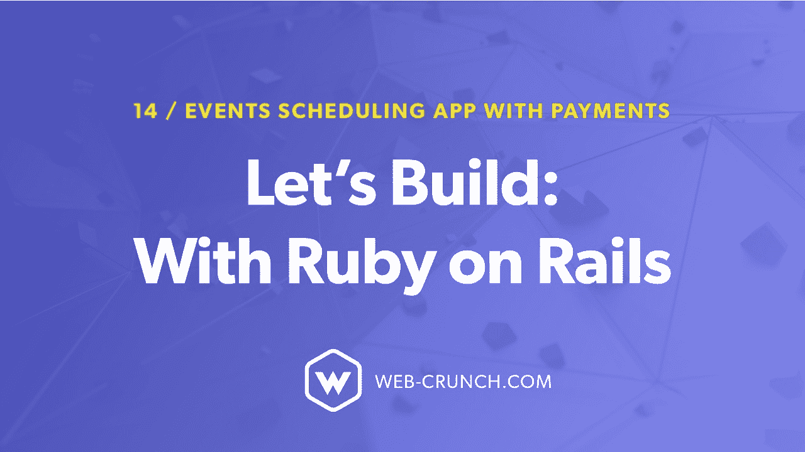

# 让我们来构建:用 Ruby on Rails——带有支付功能的事件安排应用程序

> 原文：<https://dev.to/justalever/lets-build-with-ruby-on-rails--event-scheduling-app-with-payments-hce>

欢迎阅读我的下一期“让我们构建:用 Ruby on Rails 截屏”系列。经过一段时间的中断，我又开始用 Ruby on Rails 构建应用程序了。我的目标是在公众中学习，并教那些有兴趣做同样事情的人。

你在那里看到的关于 Ruby on Rails 的大部分内容都已经过时了，所以这个系列以及更多的内容都是为了让你更快地了解新技术、约定、配置等等。

### 源代码

## /[请教](https://github.com/justalever/consultly)

### 一个演示 Rails 应用程序，围绕咨询和安排事件的概念构建。

<article class="markdown-body entry-content container-lg" itemprop="text">

[](https://web-crunch.com/lets-build-ruby-on-rails-event-scheduling-app-payments/)

# 让我们来构建:用 Ruby on Rails——带有支付功能的事件安排应用程序

原创于[web-crunch.com](https://web-crunch.com/lets-build-ruby-on-rails-event-scheduling-app-payments/)

欢迎阅读我的下一期“让我们构建:用 Ruby on Rails 截屏”系列。经过一段时间的中断，我又开始用 Ruby on Rails 构建应用程序了。我的目标是在公众中学习，并教那些有兴趣做同样事情的人。

你在那里看到的关于 Ruby on Rails 的大部分内容都已经过时了，所以这个系列以及更多的内容都是为了让你更快地了解新技术、约定、配置等等。

## 关于构建

在这七个部分的系列中，我将构建一个名为**的应用程序。该应用程序主要处理事件安排，但可以扩展很多。**

任何新用户都可以免费注册，但如果他们有兴趣安排一个…

</article>

[View on GitHub](https://github.com/justalever/consultly)

### 关于建

在这个七部分系列中，我将构建一个名为`Consultly`的应用程序。该应用程序主要处理事件安排，但可以扩展很多。

任何新用户都可以免费注册，但如果他们对安排咨询会议(与应用程序的管理员)感兴趣，将收取费用。与每个新会话相关的所有数据都与当前登录的用户相关。主要的重点是为创业顾问提供一个平台，无需交换大量的电子邮件或电话，就可以接收付款、与客户沟通和预约会议。

我将添加对管理用户角色的支持，以管理用户，查看已预订的即将到来的会话，以及管理应用程序。

讨论的主题包括:

*   我的[启动顺风轨道应用模板](https://github.com/justalever/kickoff_tailwind)
*   在本地开发时使用[领班](https://github.com/ddollar/foreman)
*   利用 [webpack](https://github.com/rails/webpacker) 利用[顺风 CSS](https://tailwindcss.com/)
*   添加一个[邮件程序](https://guides.rubyonrails.org/action_mailer_basics.html)，一旦预约了会话，该邮件程序就会发送给当前用户。
*   为每个新的会话条目集成带有[条纹](https://stripe.com/)的支付系统。
    *   我将利用[条纹宝石](https://github.com/stripe/stripe-ruby)和[条纹的元素以信用卡的形式掉落](https://stripe.com/payments/elements)。

#### 我们要驾驭的宝石

分享我的宝石文件可能更容易，所以在下面找到我们使用的宝石。注意:其中一些与我的启动-顺风应用程序模板捆绑在一起。

```
source 'https://rubygems.org'
git_source(:github) { |repo| "https://github.com/#{repo}.git" }

ruby '2.5.3'

gem 'rails', '~> 5.2.1'
gem 'sqlite3'
gem 'puma', '~> 3.11'
gem 'sass-rails', '~> 5.0'
gem 'uglifier', '>= 1.3.0'
# gem 'mini_racer', platforms: :ruby
gem 'coffee-rails', '~> 4.2'
gem 'turbolinks', '~> 5'
gem 'jbuilder', '~> 2.5'
gem 'redis', '~> 4.0'
# gem 'bcrypt', '~> 3.1.7'

# Use ActiveStorage variant
# gem 'mini_magick', '~> 4.8'

# Use Capistrano for deployment
# gem 'capistrano-rails', group: :development

# Reduces boot times through caching; required in config/boot.rb
gem 'bootsnap', '>= 1.1.0', require: false

group :development, :test do
  gem 'byebug', platforms: [:mri, :mingw, :x64_mingw]
end

group :development do
  gem 'web-console', '>= 3.3.0'
  gem 'listen', '>= 3.0.5', '< 3.2'
  gem 'spring'
  gem 'spring-watcher-listen', '~> 2.0.0'
end

group :test do
  gem 'capybara', '>= 2.15'
  gem 'selenium-webdriver'
  gem 'chromedriver-helper'
end

gem 'tzinfo-data', platforms: [:mingw, :mswin, :x64_mingw, :jruby]

gem 'devise', '~> 4.4', '>= 4.4.3'
gem 'friendly_id', '~> 5.2', '>= 5.2.4'
gem 'foreman', '~> 0.84.0'
gem 'sidekiq', '~> 5.1', '>= 5.1.3'
gem 'tailwindcss', '~> 0.2.0'
gem 'webpacker', '~> 3.5', '>= 3.5.3'

# consultly specific
gem 'simple_calendar', '~> 2.3'
gem 'trix', '~> 0.9.9'
gem 'stripe', '~> 4.0', '>= 4.0.2'

group :development, :test do
  gem 'better_errors'
end 
```

Enter fullscreen mode Exit fullscreen mode

### 跟随前进

我认为视频做得更好，作为一步一步的指导，当跟随这个构建时。因为它涵盖了很多细节，所以我邀请你自己观看并跟随它。有些人更喜欢书面形式，我可以联系，但我真的没有时间了。如果你更喜欢书面形式，请在下面留言表达。

## 视频

观看由七部分组成的“让我们一起构建:使用 Ruby on Rails——带有支付系列的活动日程安排应用程序”:

### 第一部分

[https://www.youtube.com/embed/l9zDmY9VrCw](https://www.youtube.com/embed/l9zDmY9VrCw)

### 第二部分

[https://www.youtube.com/embed/lG51oDx4Dr4](https://www.youtube.com/embed/lG51oDx4Dr4)

### 第三部分

[https://www.youtube.com/embed/Tf8jK_UmgvM](https://www.youtube.com/embed/Tf8jK_UmgvM)

### 第四部分

[https://www.youtube.com/embed/p8igKthu9O8](https://www.youtube.com/embed/p8igKthu9O8)

### 第五部分

[https://www.youtube.com/embed/vfnvdRLtUKA](https://www.youtube.com/embed/vfnvdRLtUKA)

### 第六部分

[https://www.youtube.com/embed/nUg4z2QNakY](https://www.youtube.com/embed/nUg4z2QNakY)

### 第七部分

[https://www.youtube.com/embed/C9Rt2B5HVz8](https://www.youtube.com/embed/C9Rt2B5HVz8)

#### 到目前为止，让我们用 Ruby on Rails 构建系列

*   [让我们构建:使用 Ruby on Rails——简介](https://web-crunch.com/lets-build-with-ruby-on-rails-introduction/)
*   [让我们构建:使用 Ruby on Rails——安装](https://web-crunch.com/lets-build-with-ruby-on-rails-installation/)
*   [让我们构建:用 Ruby on Rails——带评论的博客](https://web-crunch.com/lets-build-with-ruby-on-rails-blog-with-comments)
*   [让我们构建:用 Ruby on Rails——Twitter 的克隆版](https://web-crunch.com/lets-build-with-ruby-on-rails-a-twitter-clone/)
*   [让我们用 Ruby on Rails 构建一个可移植的克隆版本](https://web-crunch.com/lets-build-dribbble-clone-with-ruby-on-rails/)
*   [让我们用 Ruby on Rails 构建——项目管理应用](https://web-crunch.com/lets-build-with-ruby-on-rails-project-management-app/)
*   [让我们构建:使用 Ruby on Rails——论坛](https://web-crunch.com/lets-build-with-ruby-on-rails-discussion-forum/)
*   [让我们构建:使用 Ruby on Rails——将应用部署到 Heroku](https://web-crunch.com/lets-build-with-ruby-on-rails-deploying-an-app-to-heroku/)
*   [让我们建立:用 Ruby on Rails——电子商务音乐商店](https://web-crunch.com/ruby-on-rails-ecommerce-music-shop/)
*   [让我们构建:使用 Ruby on Rails——带 Stripe 订阅支付的图书图书馆应用](https://web-crunch.com/lets-build-ruby-on-rails-book-library-stripe-subscription-payments/)
*   [让我们构建:用 Ruby on Rails——带应用内消息的交易应用](https://web-crunch.com/lets-build-with-ruby-on-rails-trade-app-in-app-messaging/)
*   [让我们来构建:使用 Ruby on Rails——多租户锻炼追踪应用](https://web-crunch.com/lets-build-with-ruby-on-rails-multitenancy-workout-tracker-app/)

### 无耻的塞时间

[](http://hellorails.io)

我有一门新课程叫做 [Hello Rails](https://hellorails.io) 。Hello Rails 是一门现代课程，旨在帮助您快速开始使用和理解 Ruby on Rails。如果你是 Ruby 或 Ruby on Rails 的新手，我邀请你去看看这个网站。该课程将与这些构建非常相似，但是是一个超级深入的版本，具有更现实的目标和可交付成果。[报名今天得到通知](https://hellorails.io/)！

在推特上关注 [@hello_rails](https://twitter.com/hello_rails) 和[本人@justalever](https://twitter.com/justalever) 。

帖子[Let ' s Build:With Ruby on Rails-Event Scheduling App With Payments](https://web-crunch.com/lets-build-ruby-on-rails-event-scheduling-app-payments/)首先出现在[的 Web-Crunch](https://web-crunch.com) 上。