# 一位 Vim 用户对航天飞机的介绍

> 原文：<https://dev.to/caduribeiro/an-introduction-into-spacemacs-from-a-vim-user-118>

[](https://res.cloudinary.com/practicaldev/image/fetch/s--edliSUQ3--/c_limit%2Cf_auto%2Cfl_progressive%2Cq_auto%2Cw_880/https://cdn-images-1.medium.com/max/400/0%2A1WlehGOk0peCQhbx.jpg)

我是 Vim 用户。我一直在我的工作流程中使用它，但有时我喜欢尝试其他编辑器，我会分享我使用 Spacemacs 的经验。

### 什么是 Spacemacs？

Spacemacs 是 emacs 的入门套件，让任何人都更容易使用。它默认有[邪恶](https://github.com/emacs-evil/evil)插件。Evil 是 Emacs 的一个模拟 Vim 的层。我总是在所有其他编辑器中尝试 vim 模式，它们都不太好，Evil 是我见过的最好的 Vim 模拟器之一。它让我更容易使用 Emacs，因为它模拟了我已经知道的 Vim 命令。

Spacemacs 的按键很容易记忆。一切都从 SPC 密钥开始(它就像 Vim 中的 leader 密钥),并且都属于某个组。例如:SPC b 用于所有缓冲区命令，SPC p 用于所有项目命令。如果你不记得这个命令，按 SPC SPC，它会带来一个自动完成缓冲区来搜索命令。

### 我如何实验另一个编辑器？

我很难在一两天内学会一个工具的所有内容。所以当我想进一步了解一个编辑器的时候，我强迫自己至少实验一个星期，尝试在新的编辑器上做所有的事情，而不打开其他的。要使用编辑器，我需要学习如何搜索文件，如何浏览文件，如何分割窗口，只有这个。

### 安装

首先，你应该安装 Emacs。

可以用家酿在 mac 上安装 emacs:

```
brew install emacs --use-git-head --cocoa --srgb 
```

Enter fullscreen mode Exit fullscreen mode

要在 Linux 上安装，您可以遵循这个[文档](https://www.gnu.org/software/emacs/manual/html_node/efaq/Installing-Emacs.html)。

现在可以安装 Spacemacs 发行版:

```
git clone https://github.com/syl20bnr/spacemacs ~/.emacs.d 
```

Enter fullscreen mode Exit fullscreen mode

现在打开 Emacs..

<figure>[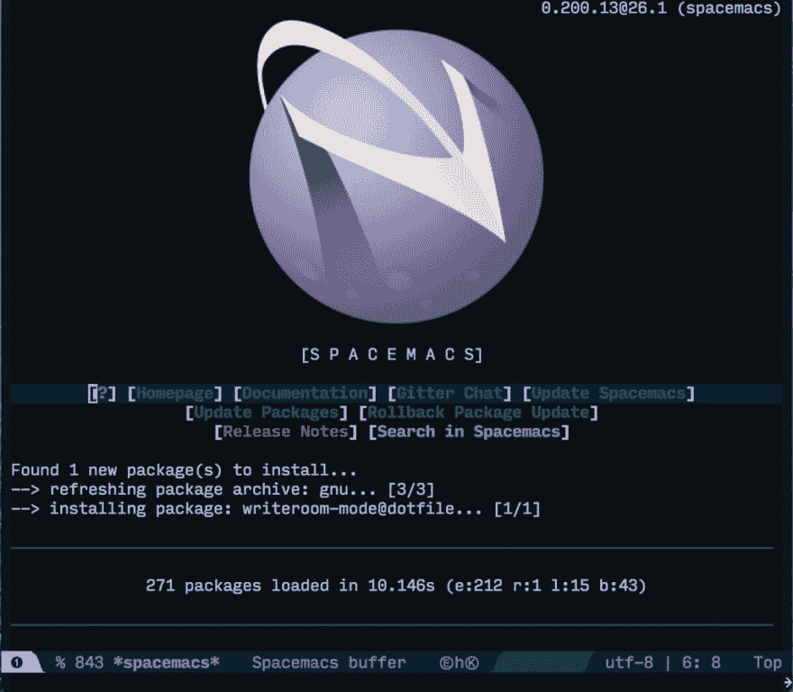](https://res.cloudinary.com/practicaldev/image/fetch/s--goyPlBfN--/c_limit%2Cf_auto%2Cfl_progressive%2Cq_auto%2Cw_880/https://cdn-images-1.medium.com/max/1024/0%2AisSOE_FDRGXQ0Yth.png) 

<figcaption>Spacemacs 启动画面</figcaption>

</figure>

### 基础知识

宇宙飞船有分层的概念。这个想法是有一些配置包的集合。文件上说:

> 层:在 Spacemacs 中可以启用(或禁用)的配置的集合单元。一个层通常集合了一个或多个包，以及使它们之间以及与 Spacemacs 之间良好运行所需的胶合配置代码。

一旦你打开 Emacs，输入 SPC f e d，这将带你到 Spacemacs 配置文件(~/。太空飞行器)。在这里，您可以在 dotspace Macs-configuration-layers 中添加层。例如:

```
dotspacemacs-configuration-layers
 '(
 elixir
 (ruby :variables ruby-version-manager 'rvm)
 ruby-on-rails
 ) 
```

Enter fullscreen mode Exit fullscreen mode

这增加了使用 Elixir、Ruby 和 Ruby on Rails 的层

### 浏览文件

为了在文件上导航，我使用 Vim 命令。

```
gg =\> goes to the top of the file
G =\> goes to the bottom
h =\> left
j =\> down
k =\> up
l =\> right 
```

Enter fullscreen mode Exit fullscreen mode

(要了解更多关于导航的信息，[阅读此处](http://vim.wikia.com/wiki/Moving_around))

### 加载您的项目

加载后，您可以使用 SPC a d(或文件->打开目录)来打开您的项目。

[](https://res.cloudinary.com/practicaldev/image/fetch/s--Bw47Ihaw--/c_limit%2Cf_auto%2Cfl_progressive%2Cq_auto%2Cw_880/https://cdn-images-1.medium.com/max/352/1%2Af2aEVrVO424eAKVfUN8XhA.png)

它将加载这个缓冲区，你可以找到你的项目文件。按回车键加载它

Spacemacs 包括[propeline](https://github.com/bbatsov/projectile)，一个用于处理项目的 emacs 库。因此，在您第一次使用 SPC a d 添加项目后，您可以使用 SPC p p 在项目之间切换

[](https://res.cloudinary.com/practicaldev/image/fetch/s--c3eq5RDW--/c_limit%2Cf_auto%2Cfl_progressive%2Cq_auto%2Cw_880/https://cdn-images-1.medium.com/max/350/1%2AG6tl43SpJFd1sDuu7EtwyA.png)

### 术语

我喜欢用这个图像来理解 Emacs 术语

<figure>[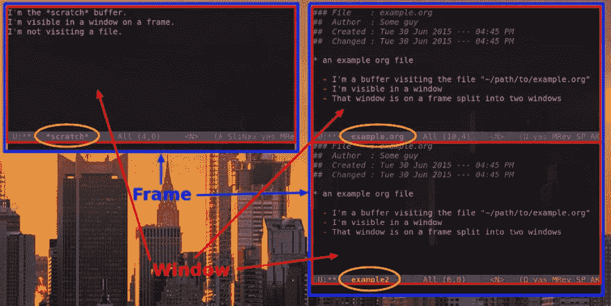](https://res.cloudinary.com/practicaldev/image/fetch/s--PxvEPrSe--/c_limit%2Cf_auto%2Cfl_progressive%2Cq_auto%2Cw_880/https://cdn-images-1.medium.com/max/1024/0%2AV790P2DvSbUyLai3.jpg)

<figcaption>[https://emacs . stack exchange . com/questions/13583/whats-the-difference-a-buffer-a-file-a-window-a-frame](https://emacs.stackexchange.com/questions/13583/whats-the-difference-between-a-buffer-a-file-a-window-and-a-frame)</figcaption>

</figure>

通常在大多数应用程序中，我们称运行的实例为窗口，但在 Emacs 上，我们称之为框架。一个帧可以包含多个窗口，在每个窗口中我们加载了一个缓冲区(在上图中，加载的缓冲区用黄色圆圈表示)。缓冲区可以是加载文件的内容，也可以是某些命令执行的输出。每次打开一个文件，它都会将活动缓冲区更改为这个文件，但是打开了过去文件的缓冲区仍然是活动的。您可以使用 SPC b b 查看所有缓冲区并进行切换

[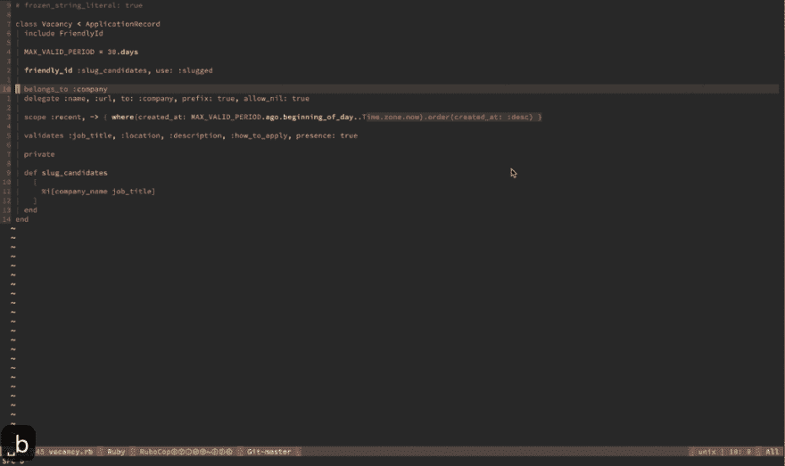](https://res.cloudinary.com/practicaldev/image/fetch/s--eCT8LaA0--/c_limit%2Cf_auto%2Cfl_progressive%2Cq_66%2Cw_880/https://cdn-images-1.medium.com/max/1024/1%2Ag6xsZuwBoh-7bLpRhbuD9g.gif)

您可以使用 SPC 选项卡轻松地在上次使用的缓冲液之间切换

[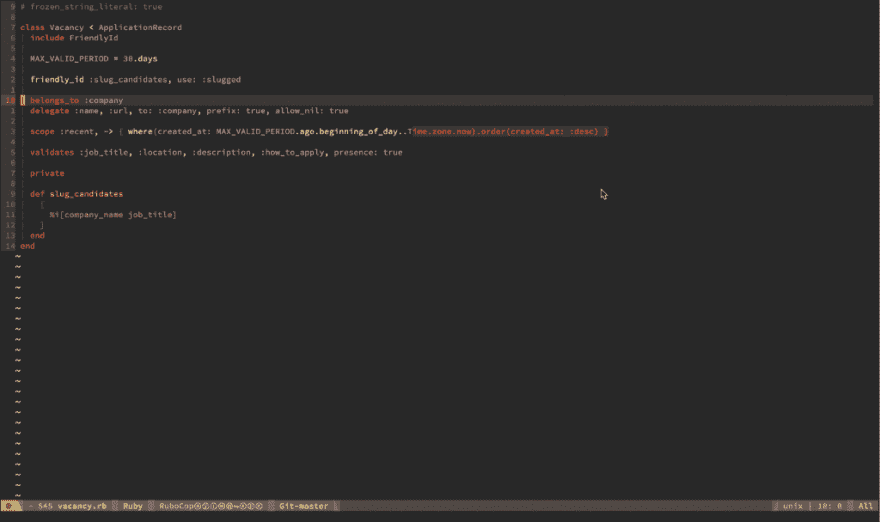](https://res.cloudinary.com/practicaldev/image/fetch/s--i6fS5TcX--/c_limit%2Cf_auto%2Cfl_progressive%2Cq_66%2Cw_880/https://cdn-images-1.medium.com/max/1024/1%2A1OWdL-LXoWbS5C8w5YQoYA.gif)

### 搜索文件

我在新编辑器中学到的第一件事是:如何搜索文件？

在 Spacemacs 中，我们可以按 SPC p f 进行模糊文件搜索

<figure>[](https://res.cloudinary.com/practicaldev/image/fetch/s--iYlGZUyQ--/c_limit%2Cf_auto%2Cfl_progressive%2Cq_66%2Cw_880/https://cdn-images-1.medium.com/max/1024/1%2AeeEs8GYQu-IJ2pOjUyiXVA.gif) 

<figcaption>模糊文件搜索</figcaption>

</figure>

另一种方法是使用标签搜索类和方法。SPC p G 将为您的项目生成一个标签文件。生成后，您可以使用 SPC p g 搜索标签

<figure>[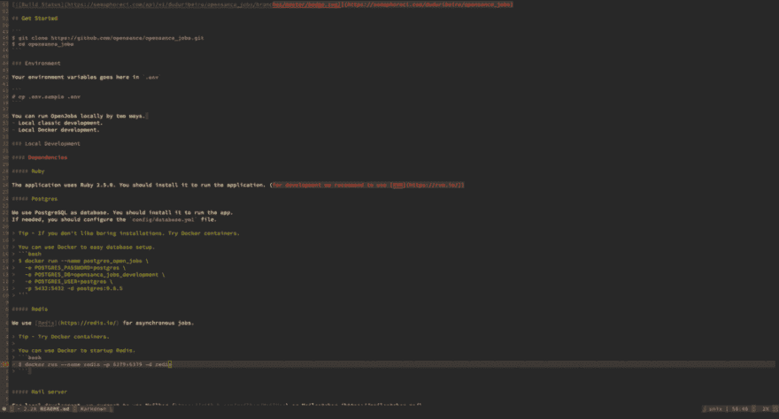](https://res.cloudinary.com/practicaldev/image/fetch/s--cnFGWuXb--/c_limit%2Cf_auto%2Cfl_progressive%2Cq_66%2Cw_880/https://cdn-images-1.medium.com/max/1024/1%2AAkzXGmwPbIx1mvNkYM0tog.gif) 

<figcaption>使用标签按类/方法名搜索</figcaption>

</figure>

您还可以使用 SPC p t 打开树资源管理器

<figure>[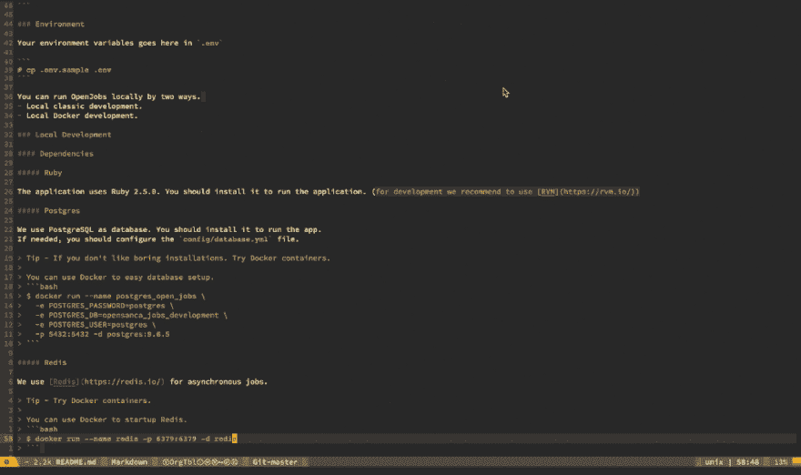](https://res.cloudinary.com/practicaldev/image/fetch/s--ldB_rHlK--/c_limit%2Cf_auto%2Cfl_progressive%2Cq_66%2Cw_880/https://cdn-images-1.medium.com/max/1024/1%2AykdIGDHb5hKUN55v7ptXMA.gif) 

<figcaption>SPC p t 将打开树浏览器</figcaption>

</figure>

### 拆分窗口

我经常使用的另一个功能是拆分窗口。您可以使用 Emacs 键绑定来实现:

```
SPC w - =\> Split window into two windows, one above the other.
SPC w / =\> Split window into two windows, side by side. 
```

Enter fullscreen mode Exit fullscreen mode

或者使用 vim 命令:

```
:sp =\> Split window into two windows, one above the other.
:vsp =\> Split window into two windows, side by side. 
```

Enter fullscreen mode Exit fullscreen mode

<figure>[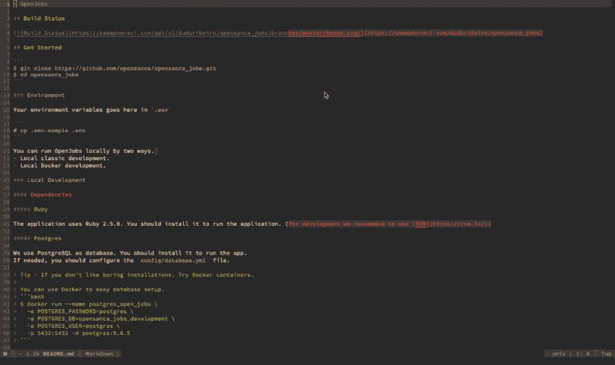](https://res.cloudinary.com/practicaldev/image/fetch/s--ZggEoo_9--/c_limit%2Cf_auto%2Cfl_progressive%2Cq_66%2Cw_880/https://cdn-images-1.medium.com/max/1024/1%2A4HZiedewGWiJNSNhE5I46g.gif) 

<figcaption>拆分窗口</figcaption>

</figure>

拆分后，您会注意到窗口中定义了一个数字

[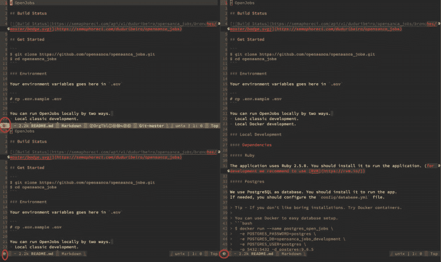](https://res.cloudinary.com/practicaldev/image/fetch/s--cAy0_kPL--/c_limit%2Cf_auto%2Cfl_progressive%2Cq_auto%2Cw_880/https://cdn-images-1.medium.com/max/1024/1%2AK02Mq9n_eMlv8ABamsD8nw.png)

要跳转到一个窗口，您可以按下 SPC 编号转到该窗口(例如，SPC 3 将我带到图像上的右侧窗口)

<figure>[](https://res.cloudinary.com/practicaldev/image/fetch/s--dtU-1Kc6--/c_limit%2Cf_auto%2Cfl_progressive%2Cq_66%2Cw_880/https://cdn-images-1.medium.com/max/1024/1%2AqgxRsfzVDJU4dzLYg75m7A.gif) 

<figcaption>在窗口间切换</figcaption>

</figure>

你可以用 SPC w d 或者:q 杀死一个窗口。

[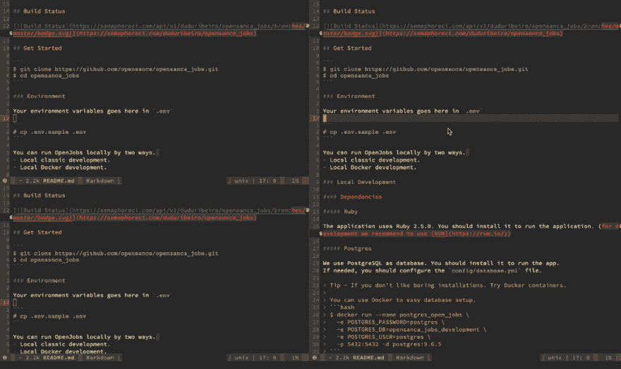](https://res.cloudinary.com/practicaldev/image/fetch/s--Xw7S50hO--/c_limit%2Cf_auto%2Cfl_progressive%2Cq_66%2Cw_880/https://cdn-images-1.medium.com/max/1024/1%2AbuC_BQKmCPKUoA-6rFKkmA.gif)

有时当在同一个框架中处理多个窗口时(例如，同时打开一个类和一个测试文件)，我喜欢最大化其中的一个。你可以用 SPC w m 来最大化，再用一次来还。

[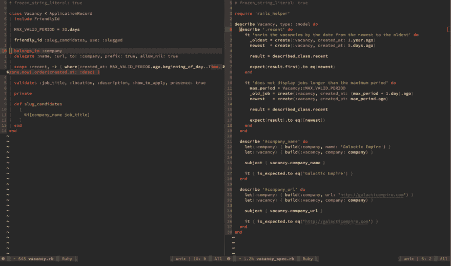](https://res.cloudinary.com/practicaldev/image/fetch/s--Ws2CoWHR--/c_limit%2Cf_auto%2Cfl_progressive%2Cq_66%2Cw_880/https://cdn-images-1.medium.com/max/1024/1%2Abc0ZGbmD9gjSB17zVILoXg.gif)

### 我的工作流用它工作

通常，我的 Vim 工作流也涉及 Tmux。我通常打开 3 个 Tmux 窗格。一个用于编辑器(Vim)，一个用于终端(运行测试、ssh 等)，一个用于服务器(和日志)。

<figure>[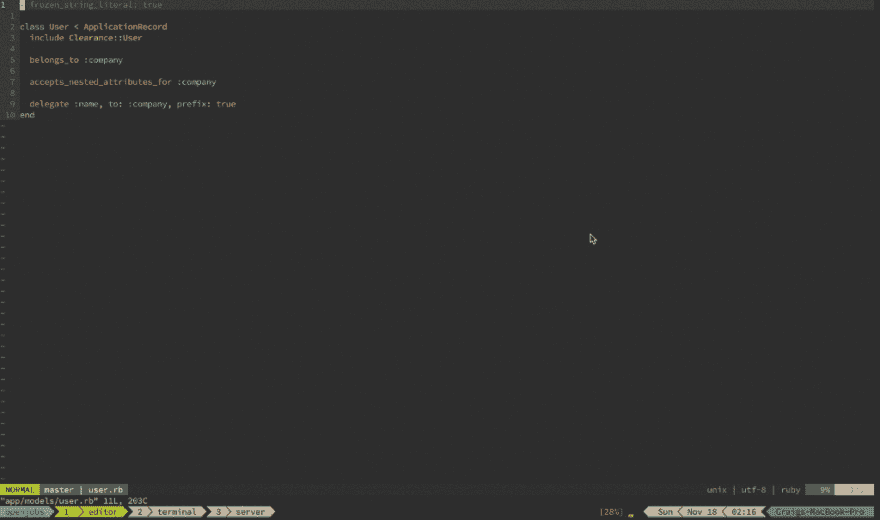](https://res.cloudinary.com/practicaldev/image/fetch/s--l560bV_3--/c_limit%2Cf_auto%2Cfl_progressive%2Cq_66%2Cw_880/https://cdn-images-1.medium.com/max/1024/1%2Ai_-7O6wOGJ_R68ezpzNbzA.gif) 

<figcaption>我的工作流与 Vim 和 tmux</figcaption>

</figure>

我也喜欢使用 [vim-test](https://github.com/janko-m/vim-test) 在 vim 内部运行我的测试

[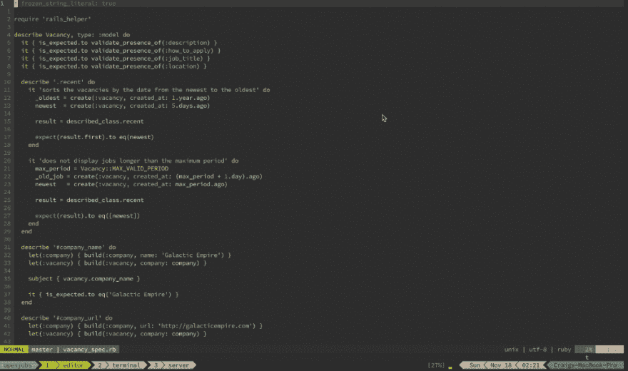](https://res.cloudinary.com/practicaldev/image/fetch/s--PMU5IaNR--/c_limit%2Cf_auto%2Cfl_progressive%2Cq_66%2Cw_880/https://cdn-images-1.medium.com/max/1024/1%2Amb3axdT9givXhxTqp7lhXA.gif)

Emacs 另一方面，你可以在 Emacs 上做任何事情。你可以在上面启动你的服务器，打开一个终端，等等，而不需要每件事都有多个终端(尽管我在 Emacs 上工作的时候仍然让它们开着😄)

我的下一个例子使用 Spacemacs 上的 rails 层。

我可以用 SPC m b i 在其中运行 bundle install(安装我的 ruby 依赖项)

[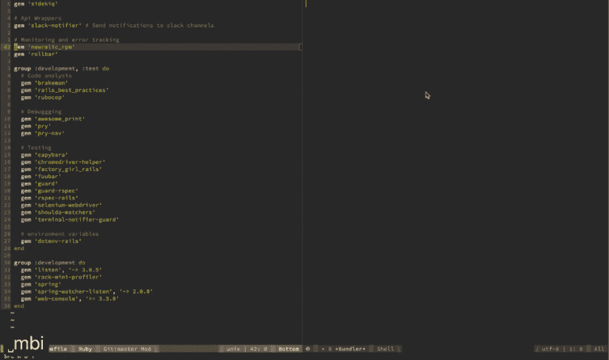](https://res.cloudinary.com/practicaldev/image/fetch/s--S-ZN5V4w--/c_limit%2Cf_auto%2Cfl_progressive%2Cq_66%2Cw_880/https://cdn-images-1.medium.com/max/1024/1%2AxvFEvzNsI5xh6Qunk36dFQ.gif)

我可以在其中运行 rails 服务器并检查日志:

[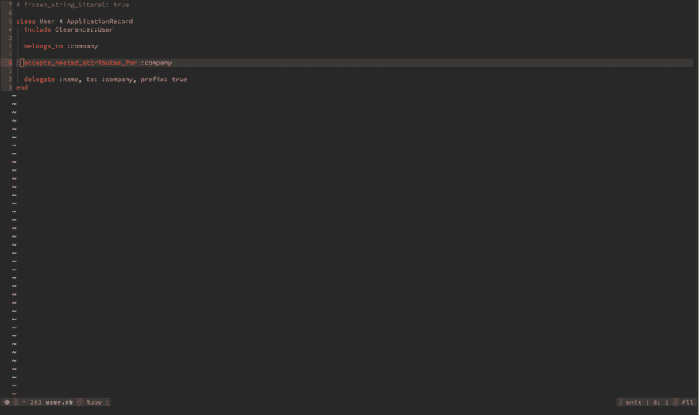](https://res.cloudinary.com/practicaldev/image/fetch/s--ie8xeUsp--/c_limit%2Cf_auto%2Cfl_progressive%2Cq_66%2Cw_880/https://cdn-images-1.medium.com/max/1024/1%2Axek3DjksVemXCqtavhSswg.gif)

也可以直接从 Emacs 运行测试:

[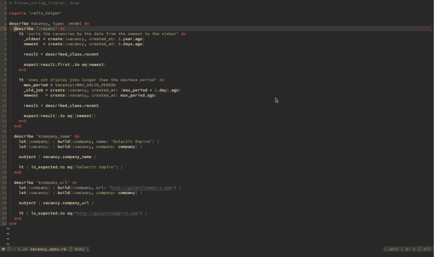](https://res.cloudinary.com/practicaldev/image/fetch/s--ArTKweVq--/c_limit%2Cf_auto%2Cfl_progressive%2Cq_66%2Cw_880/https://cdn-images-1.medium.com/max/1024/1%2AvEjoFzZNxuPcZ8ads4H62Q.gif)

遵循我为这些基本命令创建的简单思维导图:

[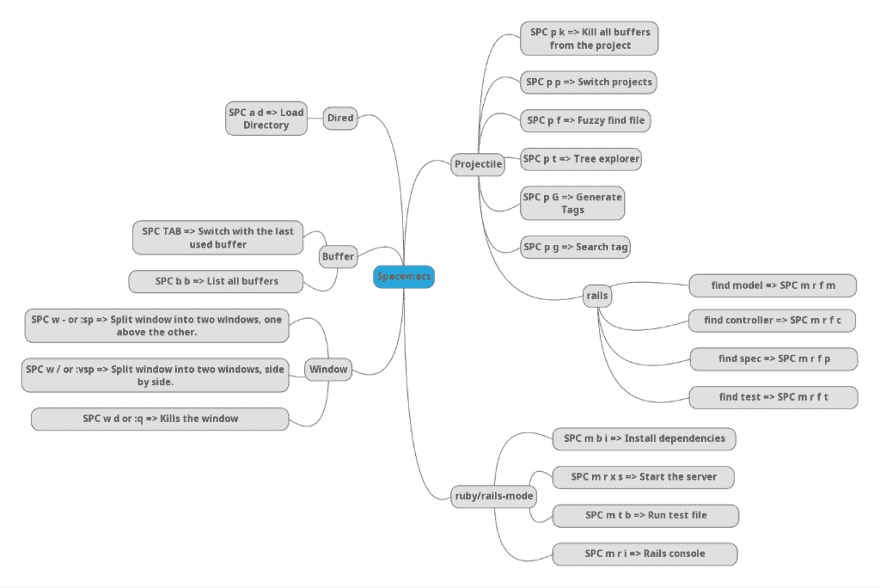](https://res.cloudinary.com/practicaldev/image/fetch/s--aaLcs4ig--/c_limit%2Cf_auto%2Cfl_progressive%2Cq_auto%2Cw_880/https://cdn-images-1.medium.com/max/1024/1%2AVKqD5q2PaAuZj4UZnBZf7A.png)

这是我使用它所需要的所有基础知识，也是我想要分享的。

[](https://res.cloudinary.com/practicaldev/image/fetch/s--me0oXZse--/c_limit%2Cf_auto%2Cfl_progressive%2Cq_auto%2Cw_880/https://cdn-images-1.medium.com/max/1024/1%2AeqsPaN0ft0DkhHczXD5vJA.png)

干杯🍻

* * *