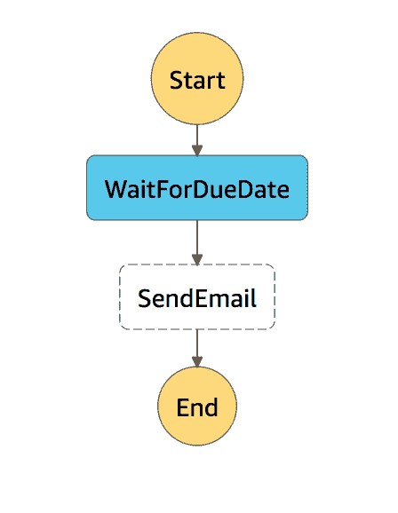

# 使用 Step 函数安排电子邮件，无需轮询数据库

> 原文：<https://dev.to/paulswail/schedule-emails-without-polling-a-database-using-step-functions-1b10>

发送电子邮件是 web 应用程序的一个非常标准的功能。电子邮件服务提供商提供简单的 API，让你只用几行代码就能发送一封电子邮件。

但是将它们安排在未来的某个时间交付要麻烦得多。比方说，你想让新用户在几天内完成一个入职序列，或者你可能需要发送一个关于用户在你的应用中创建的任务或事件的提醒。现在，您必须:

*   在数据库中创建一个`ScheduledEmails`表来存储未来的消息
*   创建一个 cron 作业来轮询该表中是否有到期的电子邮件，然后在邮件送达后清除它们
*   维护 cron 作业和运行的服务器

对于本应简单得多的事情来说，这是一个很大的浪费。

但是有一个更好的方法...

通过使用 AWS[λ](https://aws.amazon.com/lambda/)和[阶跃函数](https://aws.amazon.com/step-functions/)，您可以得到一个解决方案:

*   不需要数据库
*   不涉及轮询
*   你只需为它的使用量付费
*   为您的应用程序提供一个简单的 API 调用来调用 Lambda(它可以被视为自己的微服务)

如果你想跳到完整的代码库，[去这里](https://github.com/paulswail/serverless-email-scheduler)。
如果你只想知道关键点，请继续关注我，我将带你了解如何使用 Node.js 和无服务器框架实现这一点。

📖**相关: *[为什么无服务器新手要用部署框架](https://winterwindsoftware.com/serverless-newbies-should-use-framework/)。***

侧边栏:虽然我在这里使用电子邮件，但这种方法可以应用于你的应用程序需要执行的任何未来计划任务。

## 开始设置

首先，[安装无服务器框架](https://serverless.com/framework/docs/providers/aws/guide/installation/)。
我们也将使用 [`serverless-step-functions`](https://github.com/horike37/serverless-step-functions) 插件来允许我们在`serverless.yml`文件中轻松配置我们的步骤功能。

## 配置步进功能顺序

[](https://res.cloudinary.com/practicaldev/image/fetch/s--kXFeC3Zg--/c_limit%2Cf_auto%2Cfl_progressive%2Cq_auto%2Cw_880/https://winterwindsoftware.com/img/blog-images/send-email-step-function.png)

序列中有两种状态:

1.  `WaitForDueDate`:这是一个简单的[等待](https://docs.aws.amazon.com/step-functions/latest/dg/amazon-states-language-wait-state.html)步骤，从输入对象中读取一个`dueDate`字段，并等待到该时间，然后进入下一个状态。
2.  `SendEmail`:一个 Lambda 函数，它调用 API 来发送电子邮件。

这些配置如下:

```
# serverless.yml
# ...
stepFunctions:
  stateMachines:
    EmailSchedulingStateMachine:
      name: EmailSchedulingStateMachine
      definition:
        Comment: "Schedules  an  email  to  be  sent  at  a  future  date"
        StartAt: WaitForDueDate
        States:
          WaitForDueDate:
            Type: Wait
            TimestampPath: "$.dueDate"
            Next: SendEmail
          SendEmail:
            Type: Task
            Resource: "arn:aws:lambda:#{AWS::Region}:#{AWS::AccountId}:function:${self:service}-${opt:stage}-SendEmail"
            End: true 
```

## 创建 SendEmail 功能

以下代码为 Lambda 函数`SendEmail`定义了一个处理程序，该函数由步骤函数配置中的 SendEmail 状态引用。该功能使用 [AWS SES](https://aws.amazon.com/ses/) 发送电子邮件。

```
const AWS = require('aws-sdk');
const ses = new AWS.SES();
const { EMAIL_SENDER_ADDRESS } = process.env;

module.exports.handle = async (event) => {
    const result = await sendEmail(event.email);
    console.log('Sent email successfully', result);
    return result;
};

function sendEmail(email) {
    const params = {
        Destination: {
            ToAddresses: email.to,
        },
        Message: {
            Subject: {
                Data: email.subject,
            },
            Body: {
                Html: {
                    Data: email.htmlBody || email.textBody,
                },
                Text: {
                    Data: email.textBody || email.htmlBody,
                },
            },
        },
        Source: EMAIL_SENDER_ADDRESS,
    };
    return ses.sendEmail(params).promise();
} 
```

## 发起调度

现在 SendEmail 逻辑已经实现并连接到 Step Functions 状态机，我们需要一种从应用程序启动 step function 的方法。这是通过使用阶跃函数 API 中的 [`startExecution`](https://docs.aws.amazon.com/step-functions/latest/apireference/API_StartExecution.html) 函数来完成的。

```
// schedule-email.js
const AWS = require('aws-sdk');
const stepfunctions = new AWS.StepFunctions();

module.exports.scheduleEmail = async (dueDate, email) => {
    const stateMachineArn = process.env.STATEMACHINE_ARN;
    const result = await stepfunctions.startExecution({
        stateMachineArn,
        input: JSON.stringify({
            dueDate, email
        }),
    }).promise();
    console.log(`State machine ${stateMachineArn} executed successfully`, result);
    return result;
}

// ----------------------------------------------
// your-app-module.js
const scheduleEmail = require('./schedule-email');
const email = {
    to: ['test@example.com'],
    subject: 'MyApp Onboarding Day 1 - Setting up your project',
    textBody: 'TEXT body.\nsecond line.',
    htmlBody: '<strong>HTML</strong> body<br>second line.'
};
const dueDate = '2018-11-16T13:55:25.000Z';
const result = await scheduleEmail(dueDate, email);

// result :
// {
//     "executionArn": "arn:aws:states:eu-west-1:123456789:execution:EmailSchedulingStateMachine:84b1f498-ab4d-4f69-a635-ab1fa5199e16",
//     "startDate": "2018-11-16T16:19:23.560Z"
// } 
```

您需要更新您的应用程序正在运行的 IAM 角色，以允许在`EmailSchedulingStateMachine`状态机上执行`states:StartExecution`操作。

## 如果我需要取消预定的邮件怎么办？

`startExecution`调用返回一个对象，该对象包含这次执行的唯一的`executionArn`字符串。如果您需要取消电子邮件的能力，您可以存储这个 ARN，然后稍后将它传递给 [`stopExecution`](https://docs.aws.amazon.com/step-functions/latest/apireference/API_StopExecution.html) 函数，以便在它进入 SendEmail 状态之前取消执行(假设它还没有结束)。

## 自己尝试一下

如果您认为这对您有用，那么[克隆这个 repo](https://github.com/paulswail/serverless-email-scheduler) 并自己部署它。

您可以做出的一些潜在改进:

*   添加发送邮件失败时的重试逻辑(`serverless-step-functions`插件支持的
*   支持除 se 之外的电子邮件提供商

* * *

💌 ***如果你喜欢这篇文章，你可以注册[到我的关于在 AWS 中构建无服务器网络应用的每周时事通讯](https://winterwindsoftware.com/newsletter/)。***
你也可能会喜欢:

*   [担心无服务器带走](https://winterwindsoftware.com/concerns-that-serverless-takes-away/)
*   [生产中的 AWS 无服务器应用案例研究](https://winterwindsoftware.com/real-world-serverless-case-studies/)
*   [“无服务器”的不同定义](https://winterwindsoftware.com/serverless-definitions/)

*原载于 winterwindsoftware.com*。