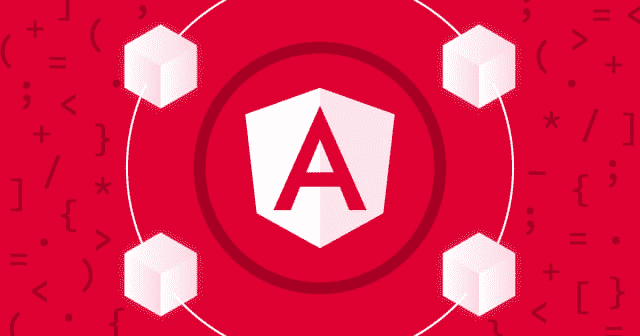
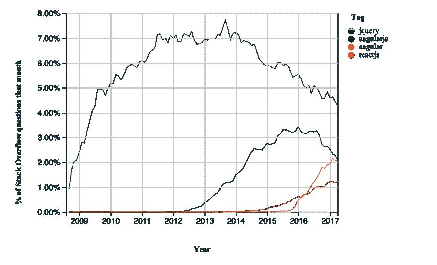

# 是什么让 Angular 成为最受欢迎的 Web 开发框架？

> 原文：<https://dev.to/shahidmansuri/what-makes-angular-the-most-preferable-web-development-framework-52ll>

它的第一个版本 AngularJS 在很短的时间内成为了高级 web 应用程序开发的事实标准。

2016 年 9 月，谷歌发布了当时称为 Angular 2 的最终版本，现在只是 Angular。这个新框架建立在多年的工作和来自使用 AngularJS(框架的 1.x 版本)的用户的反馈之上。它的开发花了 2 年多时间。

它不是 AngularJS 的新版本或演变，但它是一个新产品，有自己的概念和技术。此外，Angular 使用作为其主要编程语言 TypeScript，这是 JavaScript/ECMAScript 的超集，极大地方便了 [AngularJS 开发](https://www.peerbits.com/angularjs-development.html)。

此外，我们将解释 Angular 开发高级 web 开发框架的原因:

## 不使你思考

由于 Angular 是一个框架，它提供了比简单的库更多的“观点”和系列特性。

对于其他类似的软件，最常见的是在[开发一个应用](https://www.peerbits.com/mobile-application-development.html)时不得不从几个第三方库中“拉取”。

最有可能的是，你需要一些额外的东西来做路由、管理依赖关系、调用 REST APIs、做测试等等。

Angular 提供了更多的“意见”作为一个系列，帮助你开始没有被决策吓倒。也就是说，使用 Angular，您从一开始就已经知道如何组织代码，以及如何执行应用程序架构所需的不同任务。

一个非常重要的问题是，你强加的这种一致性也有助于公司雇佣新的程序员或给团队带来新人。一个回到 Angular 项目的新程序员很快就有了家的感觉，因为如果你知道 Angular 知道用这个框架做事情的方式。这也方便了项目之间的程序员交流。

## 打字稿

尽管你可以用“纯”ECMAScript 编程， [Angular 的团队](https://www.peerbits.com/our-team.html)决定用 TypeScript 语言进行所有的开发，几乎所有的文档和例子都使用这种语言。

对于许多人来说，这似乎是一个错误，但是 Angular 团队在使用各种 JavaScript 时遵循的标准有很多优点。

例如，ES6(即 ECMAScript 2015)提供了几种不同的声明对象的方式，这可能会让许多人感到困惑。使用 TypeScript 不会发生这种情况，代码中的所有语法和做事方式都是相同的，这增加了信息的一致性和阅读代码的方式。

尽管 Angular 并不强迫您使用 TypeScript，但是 Angular 核心团队已经采用了它，并且文档建议默认使用 TypeScript。

这种一致性应该有助于避免从 Angular 开始的决策中的混乱和过载。从长远来看，这是维护应用程序更好、更容易的方法。

## Web 组件

Angular 中的组件是一段可以在其他 Angular 项目中重用的代码，只需很少的努力，就可以让更加[敏捷的应用程序开发](https://www.peerbits.com/blog/agile-software-development.html)从一个“昂贵的”MVC 转移到一个有我们组件的益智游戏。

Angular 的设计采用了 web 组件的标准。它是一组 API，允许您创建新的自定义、可重用和自包含的 HTML 标签，然后您可以在其他网页和应用程序中使用这些标签。这些定制组件可以在现代浏览器中工作，也可以与任何支持 HTML 的 JavaScript 库或框架一起工作。

在 Angular 中创建的组件很容易转换成本地 web 组件。因此，更多的工作重用使它成为每个 web 应用程序开发公司的首选。

## 通往稳定未来的道路

当前 JavaScript 世界的一个大问题是变化如此之多，如此之频繁，以至于每个人都为了跟上最新的消息而“焦头烂额”。

事实上，一些 JavaScript 库从出现到稳定经历了如此多的变化，以至于大部分信息都过时了。更不用说多年前开发的代码已经失效，你还得更新。

以下是 Javascript 开源的一些有趣的发展和衰落模式

Angular 是对 AngularJS 等成熟框架的精心和有条不紊的改造。从 2016 年 9 月第一个稳定版本的出现开始，他们保证有一个团队在对未来做出深思熟虑的决策，这将避免匆忙，并成为其他库和框架的特征。

## 极大的工具支持

当你编程时，你很少会在纯文本编辑器中完成。您将使用高级编辑器、ide 和其他相关工具，如“Linters”(代码中的风格审阅者和良好实践)。

Angular 模板分别存储用户界面和业务逻辑的代码，因此您可以利用许多现有的工具来编辑这种类型的文件。例如，React 等其他框架将所有代码混合在同一个文件中。虽然这可能有其优点，但它阻碍了标准开发工具的使用。

此外，主要的编辑器和 ide 已经提供了扩展，以尽可能舒适的方式使用这个框架。