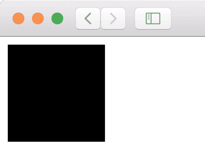
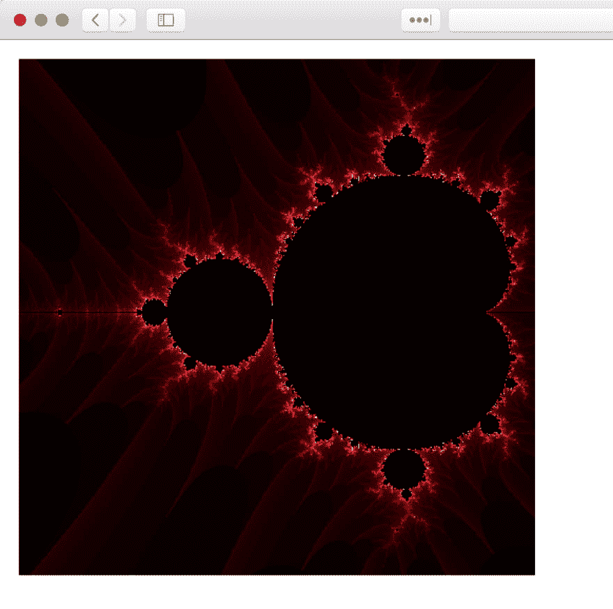
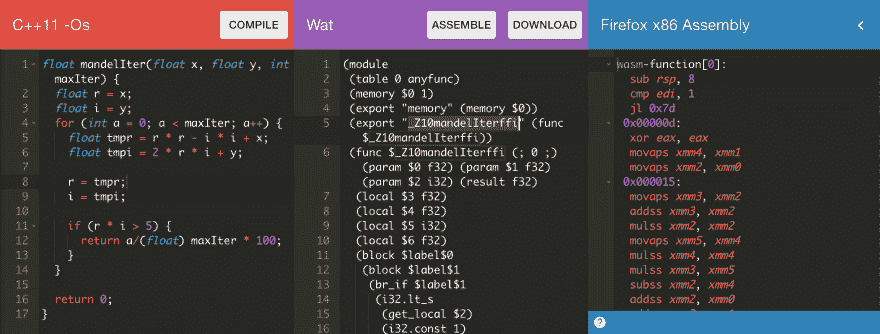
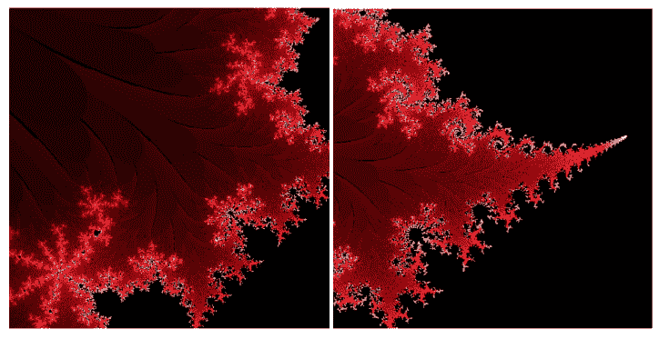

# 将 WebAssembly 与 React 一起使用

> 原文：<https://dev.to/brightdevs/using-webassembly-with-react-1led>

WebAssembly (WASM)是浏览器中可执行代码的二进制格式。在本文中，我们将使用 React 库创建一个简单的 web 应用程序，编写并编译一部分 JavaScript 代码到 WASM，然后将它链接到应用程序。

我们需要一个带有反应库的最小应用程序。我不描述如何从头开始创建它，你可以在文章[最小化的 React + Webpack 4 + Babel 设置](https://www.robinwieruch.de/minimal-react-webpack-babel-setup/)中了解它。这个[仓库](https://github.com/rwieruch/minimal-react-webpack-babel-setup)中的应用程序足以满足我们的需求。

## 准备中

要开始使用最小的 React 应用程序，我们可以克隆存储库:

```
$ git clone git@github.com:rwieruch/minimal-react-webpack-babel-setup.git wasm_react 
```

Enter fullscreen mode Exit fullscreen mode

现在我们可以安装所有的依赖项并启动服务器:

```
$ cd wasm_react
$ yarn install
$ yarn start 
```

Enter fullscreen mode Exit fullscreen mode

之后你可以去 [http://localhost:8080](http://localhost:8080) 看看是否能用。

## 创建画布组件

接下来我们要做的是用 canvas 创建一个新的 React 组件，并将该功能添加到 drawing 中。

对于我们的新组件，我们可以创建新文件:

```
$ touch src/canvas.js 
```

Enter fullscreen mode Exit fullscreen mode

并在里面放上这段代码:

```
// src/canvas.js
import React, {Component} from "react";

class Canvas extends Component {

  componentDidMount() {
    let canvas = this.refs.canvas.getContext('2d');
    canvas.fillRect(0, 0, 100, 100);
  }

  render() {
    return (
        <canvas ref="canvas" width={this.props.width} height={this.props.height}/>
    )
  }
}

export default Canvas; 
```

Enter fullscreen mode Exit fullscreen mode

这个组件使用来自`props`的参数创建画布，然后你应该在画布上看到一个黑色的矩形。

为了渲染新组件，我们可以将其添加到`src/index.js` :

```
// src/index.js
import React from 'react';
import ReactDOM from 'react-dom';

import Canvas from './canvas';

const title = 'My Minimal React Webpack Babel Setup';

ReactDOM.render(
  <Canvas height={500} width={500} />,
  document.getElementById('app')
);

module.hot.accept(); 
```

Enter fullscreen mode Exit fullscreen mode

现在，您可以进入浏览器，检查是否能看到一个黑色矩形:

[](https://res.cloudinary.com/practicaldev/image/fetch/s--sV3qItaQ--/c_limit%2Cf_auto%2Cfl_progressive%2Cq_auto%2Cw_880/https://thepracticaldev.s3.amazonaws.com/i/imna216fso00uov74vts.png)

## 绘制分形

接下来我们要画的是难以置信的美丽[曼德尔布罗布景](https://en.wikipedia.org/wiki/Mandelbrot_set)。首先，我们将使用 JavaScript 实现它，然后我们将在 WebAssembly 中重新实现它。更多的理论背景你可以在这篇[文章](https://progur.com/2017/02/create-mandelbrot-fractal-javascript.html)中找到。我刚刚从这篇文章中得到了主要功能。

现在我们可以将`mandelIter`函数添加到画布组件:

```
// scr/canvas.js
class Canvas extends Component {

//.....

mandelIter(x, y, maxIter) {
  let r = x;
  let i = y;
  for (let a = 0; a < maxIter; a++) {
    let tmpr = r * r - i * i + x;
    let tmpi = 2 * r * i + y;

    r = tmpr;
    i = tmpi;

    if (r * i > 5) {
      return a/maxIter * 100;
    }
  }

  return 0;
}

//..... 
```

Enter fullscreen mode Exit fullscreen mode

之后，我们可以向`componentDidMount`添加两个循环来迭代画布中的所有像素。

更新后的功能:

```
// src/canvas.js
componentDidMount() {
  let canvas = this.refs.canvas.getContext('2d');
  let mag = 200;
  let panX = 2;
  let panY = 1.25;
  let maxIter = 100;

  for (let x = 10; x < this.props.height; x++)  {
    for (let y = 10; y < this.props.width; y++)  {
      let m = this.mandelIter(x/mag - panX, y/mag - panY, maxIter);
      canvas.fillStyle = (m === 0) ? '#000' : 'hsl(0, 100%, ' + m + '%)'; 
      canvas.fillRect(x, y, 1,1);
    }
  }
} 
```

Enter fullscreen mode Exit fullscreen mode

更改后，您可以在页面上看到 Mandelbrot 集合:

[](https://res.cloudinary.com/practicaldev/image/fetch/s--tByb5GZ6--/c_limit%2Cf_auto%2Cfl_progressive%2Cq_auto%2Cw_880/https://thepracticaldev.s3.amazonaws.com/i/6bo1ypkb6r6sx5elfl6z.png)

看起来很棒，不是吗？

## 在 WebAssembly 中实现

现在我们可以在 WebAssembly 中实现一个函数`mandelIter`。我们可以用 C++，Rust 或者 Go 来做。但是这里我们将使用 C++和在线编译器 [WebAssembly Explorer](https://mbebenita.github.io/WasmExplorer/) :

用 C++实现的函数`mandelIter`:

```
float mandelIter(float x, float y, int maxIter) {
  float r = x;
  float i = y;
  for (int a = 0; a < maxIter; a++) {
    float tmpr = r * r - i * i + x;
    float tmpi = 2 * r * i + y;

    r = tmpr;
    i = tmpi;

    if (r * i > 5) {
      return a/(float) maxIter * 100;
    }
  }

  return 0;
} 
```

Enter fullscreen mode Exit fullscreen mode

我们编译后的函数有一个很奇怪的名字:`_Z10mandelIterffi`。我们将在 JavaScript 代码中使用这个名称。

[](https://res.cloudinary.com/practicaldev/image/fetch/s--CpC_S9xE--/c_limit%2Cf_auto%2Cfl_progressive%2Cq_auto%2Cw_880/https://thepracticaldev.s3.amazonaws.com/i/i6cmxbyx8gi942003j3q.png)

编译完成后，我们可以下载并把文件放在`src`文件夹中。我已经把它命名为`fractal.wasm`。

要在 React 中使用 wasm，您只需将导入添加到`Canvas`-组件:

```
// src/canvas.js
import React, {Component} from "react";

const wasm = import("./fractal.wasm");

class Canvas extends Component { 
```

Enter fullscreen mode Exit fullscreen mode

下一步是更新`componentDidMount`函数:

```
// src/canvas.js

componentDidMount() {
  wasm.then(wasm => {
    const mandelIterWASM = wasm._Z10mandelIterffi;
    let canvas = this.refs.canvas.getContext('2d');
    let mag = 200;
    let panX = 2;
    let panY = 1.25;
    let maxIter = 100;

    for (let x = 10; x < this.props.height; x++)  {
      for (let y = 10; y < this.props.width; y++)  {
        // let m = this.mandelIter(x/mag - panX, y/mag - panY, maxIter);
        let m = mandelIterWASM(x/mag - panX, y/mag - panY, maxIter);
        canvas.fillStyle = (m === 0) ? '#000' : 'hsl(0, 100%, ' + m + '%)'; 
        canvas.fillRect(x, y, 1,1);
      }
    }
  });
} 
```

Enter fullscreen mode Exit fullscreen mode

现在，为了在画布上绘图，我们使用在 WebAssembly 中实现的函数。

你可以操纵变量`mag`、`panX`和`panY`来创建另一种形式的分形:

[](https://res.cloudinary.com/practicaldev/image/fetch/s--_4CQ-1oq--/c_limit%2Cf_auto%2Cfl_progressive%2Cq_auto%2Cw_880/https://thepracticaldev.s3.amazonaws.com/i/jecea3exfptw8nel1f3w.png)

你能在我的[库](https://github.com/janczer/minimal-react-webpack-babel-setup)中找到的所有代码。

最初发布于 [brightinventions.pl](https://brightinventions.pl/blog/)

光明发明公司的软件开发员伊万·门什科夫

[推特](https://twitter.com/men_ivn)