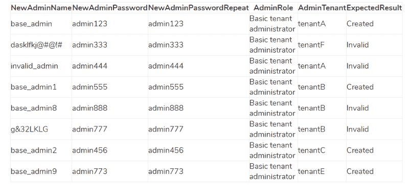

# 如何自动化您的回归测试项目？

> 原文：<https://dev.to/dohertykornelia/how-to-automate-your-regression-testing-projects-3jl8>

## 什么是回归测试？

回归测试，也称为重复测试，是确保所有旧功能在新变化下仍能正常工作的过程。换句话说，处理回归测试就是测试一个已经测试过的应用程序，以发现变更导致的缺陷。这是任何软件开发过程中的一个常规步骤，由测试专家来完成。测试人员通过对修改后的应用程序重新执行测试来进行回归测试，以评估修改后的代码是否破坏了之前工作的任何东西。回归测试可能不起作用的唯一原因是，在程序中更改或添加新代码很容易将错误引入到不打算更改的代码中。在以下情况下需要回归测试:

*   当代码根据需求的变化而被修改时
*   当添加新功能时
*   修复缺陷时
*   同时修复性能问题

## 为什么回归测试要自动化？

让我们考虑一个例子，以及如何在那种情况下执行回归测试:
在一个项目的开始，假设我们有六个开发人员和两个测试人员。敏捷模型每两周设置一次，用于冲刺。一切都开始了。
在第一次冲刺中，我们从基本功能开始(例如大约十个功能)，测试人员开始设计测试场景进行测试(例如大约 100 个场景)。第一款 Sprint 获得了客户的好评。
在第二次冲刺中，开发人员继续创造新的特性——大约 10 个，测试人员也像在第一次冲刺中一样做事情——有 100 个新脚本加上 100 个需要重新测试的旧场景。嗯，只有 200 个脚本，一切还在掌控之中。
在下一个冲刺阶段，由于新的客户需求，开发人员需要开发八个新功能，并更新两个旧功能。在这一点上，两个测试人员不仅要为 8 个新特性设计测试脚本，还要测试和更新 200 个旧场景。整个实现大概是 300 个场景。你觉得有什么不对劲吗？
在接下来的几个冲刺阶段，三个开发人员仍然满足特性的数量和不断变化的需求，但是有了两个测试人员，要创建和更新的脚本数量就多得多了。疲倦开始蔓延。缺少时间和错过 bug 的风险越来越高。出现了太多的问题。因此，当回归测试自动化时，它使测试人员能够检查生产环境中的各种变化和异常情况。并不是所有的退化都是由新特性或常规错误修复的结果引起的；数据库更新或新的浏览器版本也可能导致它们。回归也可能是效率和速度的问题。自动化那些稳定且可重复的案例允许手工测试人员花费更多的时间测试各种环境，并在更高的层次上合并更复杂的案例。此外，回归分析是成功的关键。它需要的是智慧而不是努力。

*   最高回报:执行有助于高需求覆盖率的测试，然后是其他任何测试…
*   快速降低风险:对最关键的需求执行测试，然后是其他需求…
*   实际安全:执行所有关键需求的测试，然后是任何其他需求……特别是因为大约 20%的测试用例覆盖了大约 80%的业务价值

## 如何提高自动化回归测试？

两种自动化回归测试方法是最常用的:数据驱动测试和关键字驱动测试。
**数据驱动测试**是一个框架，其中测试输入和输出值从数据文件(数据池、ODBC 源、CSV 文件、Excel 文件、DAO 对象、ADO 对象等)中读取，并加载到捕获或手动编码脚本中的变量中。在这种方法中，变量用于输入值和输出验证值。通过程序的导航，数据文件的读取，以及测试状态和信息的记录都被编码在测试脚本中。让我们考虑一个在系统中设置管理员帐户的数据驱动脚本的简单示例:

```
private void Auto_ID_400_test()
{
     Common.InitializeWebDocument();
     DataInit.Init();
     BasePage.NavigateToHomePage();
     HomePage.NavigateToSettings();
     SettingBasePage.NavigateToBase();
     Base.AdminSection.AddNewAdmin(Data.Read("NewAdmin"));
} 
```

```
public static void AddNewAdmin(DataTable dataTable)
{
     Report.Log(ReportLevel.Info, "Add new Admin:");
     OpenAddnewAdminPopUp();
     FillNewAdminData(dataTable);
     ConfirmAdmin(Read(dataTable.GetValue"NewAdminName"));
} 
```

[](https://res.cloudinary.com/practicaldev/image/fetch/s--xBJSptIl--/c_limit%2Cf_auto%2Cfl_progressive%2Cq_auto%2Cw_880/https://cdn-images-1.medium.com/max/800/1%2ArgrE2F9UYOS-HX3d3RzPDA.png) 
**关键字驱动测试**是一种将大量编程工作从实际测试步骤中分离出来的技术，这样测试步骤就可以更早地开发出来，并且经常只需要很小的更新就可以维护，即使应用程序或测试需求发生了重大变化。关键字驱动测试方法将测试创建分为两个阶段:计划阶段和实现阶段。
示例:登录测试用例:导航到登录页面，键入用户 ID，键入密码，验证登录。
然后，自动化测试工程师为关键词开发脚本:
[](https://res.cloudinary.com/practicaldev/image/fetch/s--EjJ32W0U--/c_limit%2Cf_auto%2Cfl_progressive%2Cq_auto%2Cw_880/https://cdn-images-1.medium.com/max/800/1%2AiSOLJgkLjKbT4ooqDFGVhw.png)

这种策略不需要编程技能，因此非技术人员更容易参与回归测试过程。作为解释，它更适合于迎合大量观众的项目，并且比数据驱动测试需要更广泛的关注。

关于这种方法的更多细节可以在[获得](https://testautomationresources.com/software-testing-basics/automated-regression-testing/)