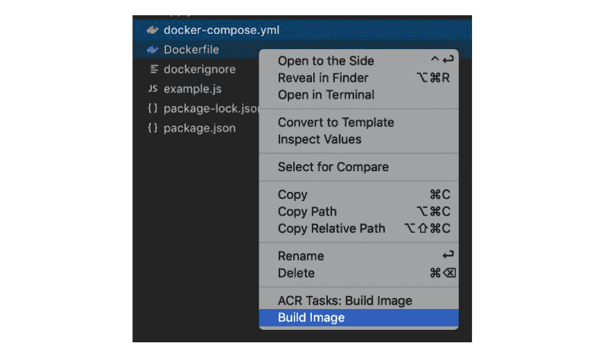
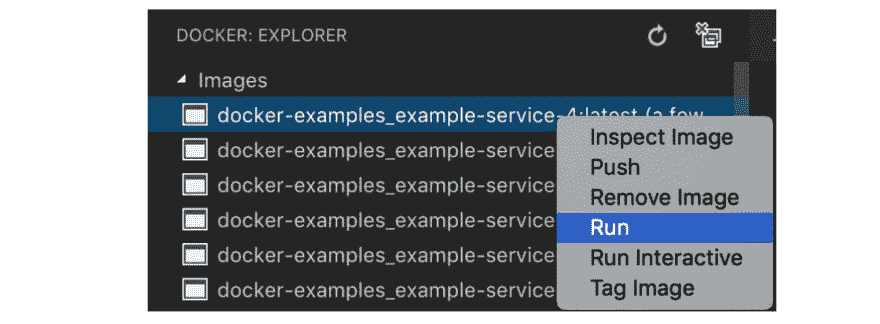
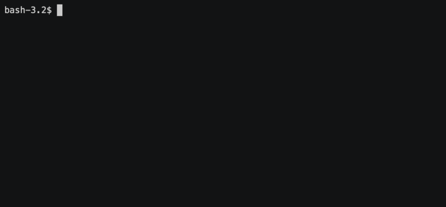
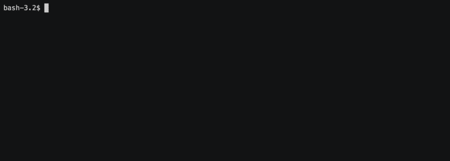
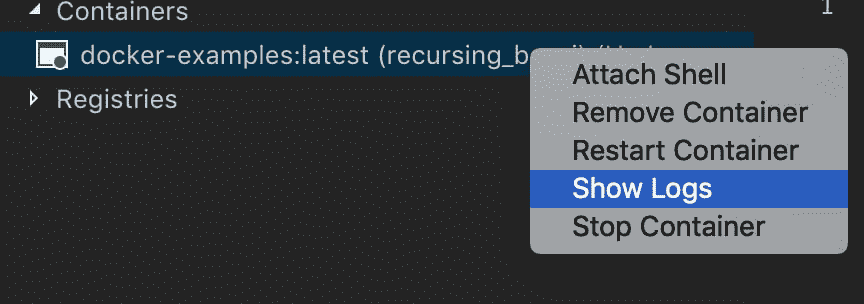
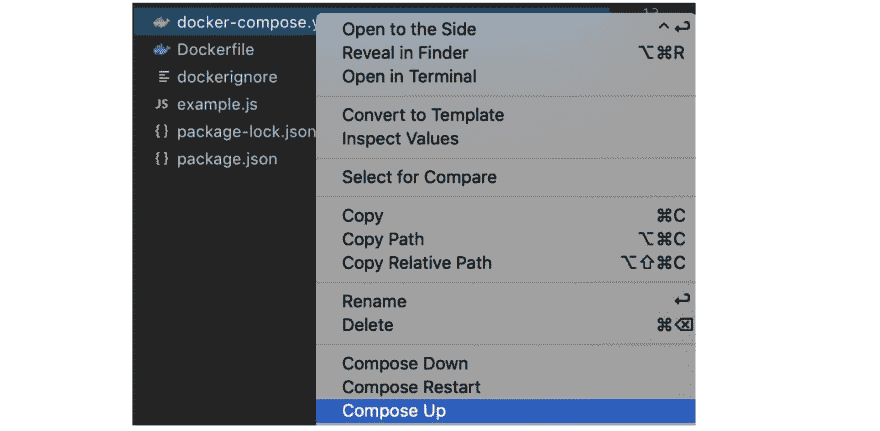
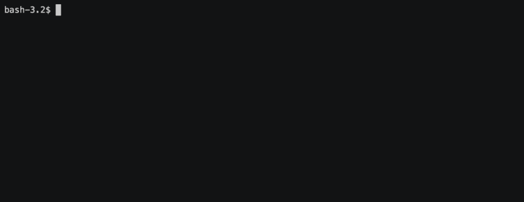

# 面向开发人员的 20 个 Docker 命令用例

> 原文：<https://dev.to/alex_barashkov/20-docker-commands-use-cases-for-developers-2d9g>

当你知道如何使用技术时，技术是最有效的；当你和 Docker 一起工作时，请记住这一点。第一次采用 Docker 的团队通常是在 Devops 的推荐下这样做的。然而，Devops 不能总是解释新团队应该如何使用它而不损害他们现有系统的好处。

在这里，您可以找到开发人员使用特定命令的案例、对其功能的解释以及演示。当你在公司采用 Docker 的过程中，把它交给你的开发团队，让他们先发制人。

### docker build

```
docker build --rm -t docker-examples:latest . 
```

Enter fullscreen mode Exit fullscreen mode

[](https://res.cloudinary.com/practicaldev/image/fetch/s--uMRb6j4a--/c_limit%2Cf_auto%2Cfl_progressive%2Cq_66%2Cw_880/https://thepracticaldev.s3.amazonaws.com/i/rcmuz1sn91fym4rcqerm.gif)

**用例:**您没有 docker-compose 文件，只有 docker 文件。您想要运行您的服务，但是首先您必须构建它。

**细节:**从 dockerfile 文件构建一个映像。
`--rm`用于在构建成功后移除一个中间容器。如果在您的容器列表中没有这个选项，那么在构建之后，您将得到如下内容:
[](https://res.cloudinary.com/practicaldev/image/fetch/s--1cu-xoAf--/c_limit%2Cf_auto%2Cfl_progressive%2Cq_auto%2Cw_880/https://thepracticaldev.s3.amazonaws.com/i/i16m49otauml8rinwa2b.png) 
`-t`您构建的标签图像，否则很难一眼就知道它包含了什么。
[](https://res.cloudinary.com/practicaldev/image/fetch/s--bKSY0hOn--/c_limit%2Cf_auto%2Cfl_progressive%2Cq_auto%2Cw_880/https://thepracticaldev.s3.amazonaws.com/i/kuh6tg2424e4qzo9bpca.png)

**快捷键带 VS 代码**
[](https://res.cloudinary.com/practicaldev/image/fetch/s--s5gmczBr--/c_limit%2Cf_auto%2Cfl_progressive%2Cq_auto%2Cw_880/https://thepracticaldev.s3.amazonaws.com/i/c0sckiy6iyr36ev6crj5.png) 

```
docker build --rm -t --no-cache docker-examples:latest . 
```

Enter fullscreen mode Exit fullscreen mode

**用例:**您没有指定依赖包版本，想要更新到最新版本，但是您没有更改 Docker 文件，Docker 不断使用缓存层。

**详情:**强制 Docker 从头开始重建镜像。

### docker 运行

```
docker run -d -p 4000:3000 docker-examples:latest 
```

Enter fullscreen mode Exit fullscreen mode

[](https://res.cloudinary.com/practicaldev/image/fetch/s--DlqXMywK--/c_limit%2Cf_auto%2Cfl_progressive%2Cq_66%2Cw_880/https://thepracticaldev.s3.amazonaws.com/i/cmyy6vema6iybijzrgtv.gif) 
**用例:**您已经构建了一个 Docker 映像并想要运行它。容器内的应用程序使用 3000 端口，但您想在本地机器的 4000 上使用它。

**详情:**
`-d`在后台运行容器并打印容器 ID。
`-p`将容器端口发布到本地机器端口 **host_port:docker_port** 。

**快捷键带 VS 代码**
[](https://res.cloudinary.com/practicaldev/image/fetch/s--m0B4_Ivk--/c_limit%2Cf_auto%2Cfl_progressive%2Cq_auto%2Cw_880/https://thepracticaldev.s3.amazonaws.com/i/76kq3cnd4o6bxmuz9deq.png) 

```
docker run docker-examples:latest 
```

Enter fullscreen mode Exit fullscreen mode

[](https://res.cloudinary.com/practicaldev/image/fetch/s--yNyoq5gw--/c_limit%2Cf_auto%2Cfl_progressive%2Cq_66%2Cw_880/https://thepracticaldev.s3.amazonaws.com/i/u4feu1yoc08vad1s78he.gif)

**用例:**您想要运行 Docker 映像，并在您的终端中查看/控制已启动的流程。按 Ctrl+C 退出你的容器。

```
docker run -t -i docker-examples:latest node 
```

Enter fullscreen mode Exit fullscreen mode

[](https://res.cloudinary.com/practicaldev/image/fetch/s--TFF_busm--/c_limit%2Cf_auto%2Cfl_progressive%2Cq_66%2Cw_880/https://thepracticaldev.s3.amazonaws.com/i/uoxpzq4tso9nxe5s3jar.gif) 
**用例:**你想在你的容器内部运行一个特定的命令/工具，使用它，然后运行容器的一个新实例。例如，如果您想要访问 node.js 控制台并执行某些操作。也可参见`docker exec`中已启动的容器。

### 停靠站

```
docker stop container_name 
```

Enter fullscreen mode Exit fullscreen mode

**用例:**你需要停止一个已经启动的容器。

**详情:**使用“docker ps -a”命令可以找到容器名。

**快捷键带 VS 代码**
[](https://res.cloudinary.com/practicaldev/image/fetch/s--NXJYdPa0--/c_limit%2Cf_auto%2Cfl_progressive%2Cq_auto%2Cw_880/https://thepracticaldev.s3.amazonaws.com/i/lqp8843oca7kacuoz1f5.png) 

```
docker stop $(docker ps -a -q) 
```

Enter fullscreen mode Exit fullscreen mode

**示例:**停止所有容器

### docker ps

```
docker ps -a 
```

Enter fullscreen mode Exit fullscreen mode

[](https://res.cloudinary.com/practicaldev/image/fetch/s--GTnQ5F0s--/c_limit%2Cf_auto%2Cfl_progressive%2Cq_66%2Cw_880/https://thepracticaldev.s3.amazonaws.com/i/g7eyialerdprath5ph4l.gif)

**用例:**您查看容器列表，找到您需要的容器名称，以便停止它。您还可以使用它来查看容器的状态和暴露的端口。

**快捷键带 VS 代码**
[](https://res.cloudinary.com/practicaldev/image/fetch/s--YLIdCy4z--/c_limit%2Cf_auto%2Cfl_progressive%2Cq_auto%2Cw_880/https://thepracticaldev.s3.amazonaws.com/i/b8uhhvj3dhdz9eb33cfs.png)

### docker 日志

```
docker logs -f container_name 
```

Enter fullscreen mode Exit fullscreen mode

[](https://res.cloudinary.com/practicaldev/image/fetch/s--zBnEudAh--/c_limit%2Cf_auto%2Cfl_progressive%2Cq_66%2Cw_880/https://thepracticaldev.s3.amazonaws.com/i/65e3jebndvvm0j1q0ozb.gif)

**用例:**您的服务在启动时崩溃，您想知道原因。您可能还希望持续监视某项服务的日志。

**详细:**查看特定容器的日志；这适用于运行和停止的容器。
`-f`开启日志输出跟随。

**快捷键带 VS 代码**
[](https://res.cloudinary.com/practicaldev/image/fetch/s--E1yEuFzx--/c_limit%2Cf_auto%2Cfl_progressive%2Cq_auto%2Cw_880/https://thepracticaldev.s3.amazonaws.com/i/ta504iqv9sqcdt2w1jco.png)

### 码头工人杀

```
docker kill $(docker ps -q) 
```

Enter fullscreen mode Exit fullscreen mode

**用例:**你对 Docker 很失望，想看与之相关的一切。

**详情:**杀死所有运行中的容器。

### docker rm

```
docker rm $(docker ps -a -q) 
```

Enter fullscreen mode Exit fullscreen mode

**用例:**你的容器列表很乱，想整理一下。

**详情:**删除所有停止的集装箱

### docker 系统

```
docker system prune 
```

Enter fullscreen mode Exit fullscreen mode

[](https://res.cloudinary.com/practicaldev/image/fetch/s--7HN2eREw--/c_limit%2Cf_auto%2Cfl_progressive%2Cq_66%2Cw_880/https://thepracticaldev.s3.amazonaws.com/i/4yjsim87hxftylnzro4k.gif)

**用例:**你想扔掉不用的东西。

**详细信息:**删除所有未使用的容器、网络、图像(悬空的和未引用的)，以及可选的卷。

**快捷键带 VS 代码**
[](https://res.cloudinary.com/practicaldev/image/fetch/s--eRIkX_0V--/c_limit%2Cf_auto%2Cfl_progressive%2Cq_auto%2Cw_880/https://thepracticaldev.s3.amazonaws.com/i/fglcushpkso0dbmjrgbl.png)

### RMI 坞站

```
docker rmi $(docker images -q) 
```

Enter fullscreen mode Exit fullscreen mode

**用例:**你需要更多的磁盘空间。

**详情:**删除所有图像

坞站执行〔t0〕

```
docker exec -it container_name /bin/sh 
```

Enter fullscreen mode Exit fullscreen mode

[](https://res.cloudinary.com/practicaldev/image/fetch/s--BI2G1FTX--/c_limit%2Cf_auto%2Cfl_progressive%2Cq_66%2Cw_880/https://thepracticaldev.s3.amazonaws.com/i/aeothoq7kitzr4a5ut6g.gif)

**用例:**在执行过程中，一个容器向 example.com 抛出一个“get”请求的连接超时错误。您可以连接到容器并运行 curl/ping。

**细节:**在你的容器内运行一个特定的命令/工具，并允许你在容器内使用它。对于调试和理解 Docker 容器内部发生的事情非常有用。

### 码头工-堆肥起来

```
docker-compose up 
```

Enter fullscreen mode Exit fullscreen mode

[](https://res.cloudinary.com/practicaldev/image/fetch/s--GO0XFyNd--/c_limit%2Cf_auto%2Cfl_progressive%2Cq_66%2Cw_880/https://thepracticaldev.s3.amazonaws.com/i/56e7q56x6ga3qukf51q0.gif)

**用例:**您有一个包含一些服务的 docker-compose 文件，您想要构建并运行它们并查看它们的输出。

```
docker-compose up -d 
```

Enter fullscreen mode Exit fullscreen mode

[](https://res.cloudinary.com/practicaldev/image/fetch/s--KheNOyQD--/c_limit%2Cf_auto%2Cfl_progressive%2Cq_66%2Cw_880/https://thepracticaldev.s3.amazonaws.com/i/7sqdk9rdi1ovapw6b7bq.gif)

**用例:**您希望在后台构建和运行所有服务，并在以后查看它们的状态。

**快捷键带 VS 代码**
[](https://res.cloudinary.com/practicaldev/image/fetch/s--_UWj4eNx--/c_limit%2Cf_auto%2Cfl_progressive%2Cq_auto%2Cw_880/https://thepracticaldev.s3.amazonaws.com/i/q7azsbl2s3welclo0r4n.png) 

```
docker-compose up -d example-service-1 
```

Enter fullscreen mode Exit fullscreen mode

**用例:**您想要运行一个特定的服务(名称与 docker-compose 文件中的名称相同),以便所有端口和卷都按照 docker-compose 文件中声明的那样用于该服务。

### 对接器-复合下行

```
docker-compose down 
```

Enter fullscreen mode Exit fullscreen mode

**用例:**您需要停止 docker-compose 文件中声明的所有服务。这将停止容器并删除每个容器的网络、卷和由 ip 创建的映像。当你想从头开始时，这很有帮助。

### 对接器-复合运行

```
docker-compose run example_app rails db:migrate 
```

Enter fullscreen mode Exit fullscreen mode

**用例:**您需要运行服务提供的特定任务，比如迁移或测试。您可以用与 docker run 类似的方式来完成这个任务，但是您可以通过 docker-compose 文件中的服务名来运行这个任务。请记住，当您使用“运行”端口时，如果不使用- service-ports，docker-compose 中的声明将不会被发布。

### 坞站-复合式执行

```
docker-compose exec example_app node 
```

Enter fullscreen mode Exit fullscreen mode

[](https://res.cloudinary.com/practicaldev/image/fetch/s--Gwdwu2fb--/c_limit%2Cf_auto%2Cfl_progressive%2Cq_66%2Cw_880/https://thepracticaldev.s3.amazonaws.com/i/foyey4wqhke06g5u6682.gif)

**用例:**你想访问启动的容器内部并执行一些东西，类似于 docker exec。不同之处在于，您可以通过服务名进行访问。用于调试目的，测试网络，检查 Docker 容器中是否存在所有数据。

### 码头工-编订日志

```
docker-compose logs -f container_name 
```

Enter fullscreen mode Exit fullscreen mode

**用例:**您的服务在启动时崩溃，您想知道原因。

**详细信息:**监视特定容器的日志，包括运行和停止的容器。这里不使用 docker logs 命令，而是使用服务名而不是容器名。
`-f`开启日志输出跟随。

### 码头工-堆肥停止

```
docker-compose stop example_app 
```

Enter fullscreen mode Exit fullscreen mode

用例:您希望通过服务名或容器名来停止您的容器。

### 对接器-复合重启

```
docker-compose restart example_app 
```

Enter fullscreen mode Exit fullscreen mode

**用例:**你想用服务名或者容器名重启一个容器。

### 想了解更多关于 Docker 的内容？

我以前的文章将帮助您更好地理解 Docker:

*   [如何在 Docker 容器中调试 node . js](https://dev.to/alex_barashkov/how-to-debug-nodejs-in-a-docker-container-bhi)
*   [在开发和生产中使用 Docker for node . js](https://dev.to/alex_barashkov/using-docker-for-nodejs-in-development-and-production-3cgp)

更多文章即将发布，请在 Twitter [@alex_barashkov](https://twitter.com/alex_barashkov) 和 [Dev.to](https://dev.to/alex_barashkov) 订阅我的文章