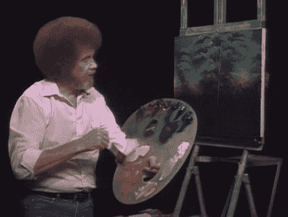
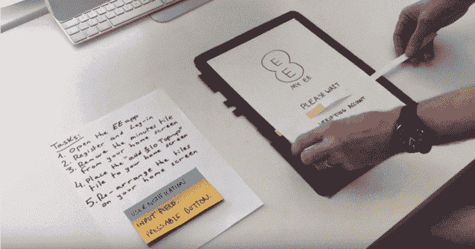

# 创建纸质原型时要避免的 3 个错误

> 原文：<https://dev.to/belhassen07/3-mistakes-to-avoid-when-creating-paper-prototypes-3ffa>

纸质原型是可以在短时间内制作的低成本原型，这也是它们有用的原因:它们制作简单快捷，因此我们可以在可用性测试的过程中再次包括用户(尽早消除一些可用性问题)。此外，我们很容易对原型应该是什么样子有多种想法。

## 耗费大量时间

我见过有很好的图纸的纸上原型，我认为这是一个错误，因为它需要太多的时间。我们不应该关注这里的美学，我们想要一个足够好的低保真度原型来测试。

## 制作精美的东西

我见过有人用手工和纸制作的动画制作花式加载屏幕。这是另一个错误，因为用户对这个技巧比对产品印象深刻，他说:“太棒了！”。

我们不应该让用户兴奋，因为他使用的是纸质原型，即使他很可能会兴奋，我们也应该确保至少不要做出像上面 GIF 中加载这样的花哨动作来中和这种兴奋。

## 不准备对用户选择做出反应

当用户点击某个东西的时候，你要确保你知道该给他什么。准备好这些场景，这样你就不会因为给错了一张纸或者犹豫不决该给他什么而迷惑他。