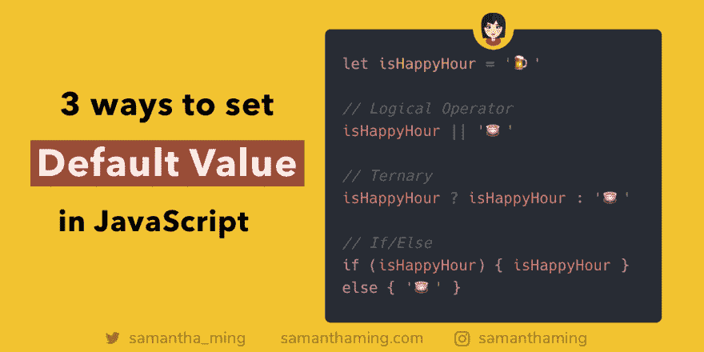

# 在 JavaScript 中设置默认值的 3 种方法

> 原文：<https://dev.to/samanthaming/3-ways-to-set-default-value-in-javascript-2253>

[](https://res.cloudinary.com/practicaldev/image/fetch/s--5pLJ2m6C--/c_limit%2Cf_auto%2Cfl_progressive%2Cq_auto%2Cw_880/https://thepracticaldev.s3.amazonaws.com/i/j9f8mt9e470hv4yzvx2p.png)

我的目标一直是有条件地给变量赋值的三元运算符。但是自从我发现“||”可以用作选择符后，我就更多地使用它了。我发现我的代码更容易阅读👍

是的，你需要一些时间来理解它。但是一旦掌握了概念，就超级得心应手了。现在我不认为更少的代码会让你的代码更好。但是在这种情况下，我更喜欢使用`||`操作符🤩

```
let isHappyHour = '🍺';

// Logical Operator
isHappyHour = isHappyHour || '🍵'; // '🍺'

// Ternary
isHappyHour = isHappyHour ? isHappyHour : '🍵'; // '🍺'

// If/Else
if (isHappyHour) { 
  isHappyHour = isHappyHour 
} else { 
  isHappyHour = '🍵' 
}

console.log(isHappyHour); // '🍺' 
```

## 理解`||`运算符

我肯定你们大多数人认为`||`只用于布尔检查，比如:

```
if(a || b) {
  // do something
} 
```

但是！您还可以使用它来计算选定的表达式并产生一个值。这就是为什么把逻辑操作符看作是选择操作符是有帮助的。当与非布尔值一起使用时，`||`操作符将返回一个指定表达式或操作数的非布尔值。

爆头了吗？！别担心，让我用凯尔·辛普森的方式来解释。他是“[你不知道 JavaScript](https://github.com/getify/You-Dont-Know-JS/blob/f0d591b6502c080b92e18fc470432af8144db610/types%20%26%20grammar/ch4.md#operators--and-) ”的作者——这是一本免费的 JavaScript 电子书。

> &&或||运算符产生的值不一定是布尔类型。产生的值将总是两个操作数表达式之一的值。

好的，让我们看一个例子。

```
const truthy = true;
const falsy = false;
const poop = '💩';

truthy || poop; // true
falsy || poop; // '💩'; 
```

只要第一个表达式(左侧)是真的，它将总是被选中的。但是，如果第一个表达式(左侧)为 falsy，那么第二个表达式(右侧)将是默认输出。这就是为什么这个`||`被称为设置默认值的操作符。

### 使用默认值作为功能参数

你经常会看到`||`被这样使用:

```
function(name) {
  name = name || 'no name';
} 
```

注意:这不再是推荐的方式了。比 ES6 的默认参数好多了。因为通常情况下，您可能不希望缺省值适用于所有的 false 值——我将在下一节解释 false 值。最有可能的是，如果没有值或`undefined`作为参数传递，我们只希望设置默认值。

**用 ES6 默认参数**更好的解决方案

```
function(name = 'no name') {
} 
```

### Falsy 值

在`||`运算符中，第二个表达式(右侧)仅在第一个表达式(左侧)出现时才被计算。所以让我们来看看什么构成了一个假值。

```
// JS Essentials: Falsy Values

false
undefined
null
NaN
0
"" or '' or `` (empty string) 
```

*(我写了另一篇关于 Falsy 价值观的博文，你可以在这里)*

## 比喻为`&&`运算符

在我之前的文章中，我写了关于`&&`操作符的内容。(这里读一下)。`&&`也被称为**警卫操作员**。所以这里有一个区别的快速总结:

*   `||`:总是输出第一个表达式。只有当第一个表达式为 falsy 时，第二个表达式才会被输出。

*   `&&`:如果为 FALSY，则输出第一个表达式。只有当第一个表达式为真时，才输出第二个表达式。

## 什么是猫王算子

这个很有意思。在 JavaScript 中，我们用`||`来设置默认值。在其他语言如 **C++** 中，这种行为类似于**猫王操作符**，表示为`?:`。

```
// JavaScript
someVariable || 'default value'

// Elvis Operator (not JavaScript)
someVariable ?: 'default value' 
```

至于为什么叫猫王算子:

[](https://res.cloudinary.com/practicaldev/image/fetch/s--4T1VL8E4--/c_limit%2Cf_auto%2Cfl_progressive%2Cq_auto%2Cw_880/https://thepracticaldev.s3.amazonaws.com/i/7itmzmaoim6awjmqop4k.jpg)

*GlobalNerdy.com 的形象功劳*

## 什么时候用哪个？

现在你已经理解了 **Falsy 值**，让我们来看看这三种方法中哪一种更好用。

**🏆逻辑运算符`||`**

如果你想捕捉所有虚假的值，这是很棒的。代码更少，也更容易阅读。当然，假设每个人都理解这三种行为。

注意:我并不是说代码越少越好，人们很容易过于聪明地试图缩短代码，使其不可读。我们为他人编写代码，这是一种交流方式。与聪明相比，选择传达理解总是更好。

```
let a;

// ✅ Short and simple
a = a || b;

// ☹️ Meh, could be better
a = a ? a : b;

// 😱 Ouch
if (a) {
  a = a;
} else {
  a = b;
} 
```

**🏆三元运算符**

假设我们不想捕捉所有虚假的值。我们只希望默认值在`undefined`
时生效

```
// ❌ Logical doesn't work
a = (a === undefined) || b;
// (a === undefined) > will output a boolean 'true' not the actual value

// ✅ Ternary works
a = (a === undefined) ? a : b;

// ☹️ Of course if/else will also work...but Ouch
if (a === undefined) {
  a = a;
} else {
  a = b;
} 
```

**🏆If/Else**

这是控制力最强的选项。如果我说，我需要执行一个额外的动作，这是我绝对会去做的事情。

```
// ✅ If/Else is much better
if (a) {
  a = a;
  // do something else
} else {
  a = b;
} 
```

* * *

## 资源

*   [MDN Web 文档-逻辑运算符](https://developer.mozilla.org/en-US/docs/Web/JavaScript/)
*   类型&语法
*   [维基百科-猫王操作员](https://en.wikipedia.org/wiki/Elvis_operator)
*   [堆栈溢出-三元运算符、Elvis 运算符、安全导航运算符和逻辑 or 运算符的比较](https://stackoverflow.com/questions/44046927/comparison-of-ternary-operator-elvis-operator-safe-navigation-operator-and-log)
*   [堆栈溢出-逻辑 or 与三元运算符](https://stackoverflow.com/questions/42026158/precedence-logical-or-vs-ternary-operator)
*   [Java 脚本中的默认操作符和现实生活中的例子](https://zzz.buzz/2016/01/10/default-operator-in-javascript-and-real-life-examples/)
*   [SamanthaMing.com 卫队操作员](https://www.samanthaming.com/tidbits/51-prevent-object-retrieval-type-error-with-guard-operator)

* * *

**感谢阅读❤**
问好！[insta gram](https://www.instagram.com/samanthaming/)|[Twitter](https://twitter.com/samantha_ming)|[脸书](https://www.facebook.com/hisamanthaming) | [媒体](https://medium.com/@samanthaming) | [博客](https://www.samanthaming.com/blog)