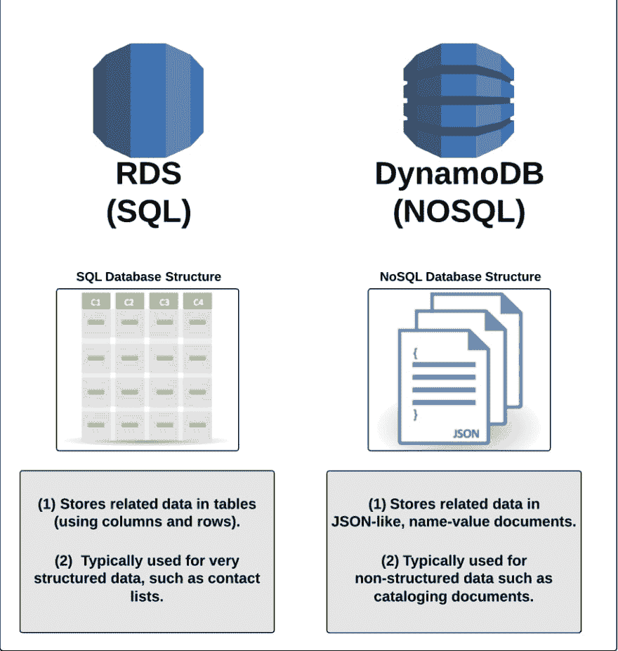

# 30 天 AWS(第 7 天)

> 原文：<https://dev.to/gameoverwill/30-days-of-aws-day-7-377k>

今天我研究了 AWS 上的数据库，这个主题对我来说太棒了，尽管你应该知道 VCP、网络和安全，如果你读了旧的帖子，这不是我的强项。

## 数据库

AWS 有两种类型的数据库可用，SQL 或关系数据库(RDS)和 NoSql 非关系数据库(DynamoDB)。

## RDS

RDS 是一个 SQL 数据库，为不同的引擎提供了大量的选项。在这里你会看到亚马逊 Aurora，Mysql，Postgres，Oracle 和微软 SQL server。

## DynamoDB

DynamoDB 是一个 NoSQL 数据库服务。如今 AWS 的目录中没有另一个 NoSql 选项。实现这一点的一种方法是创建一个 EC2 实例，并安装它 MongoDB 或 Oracle NoSql。

## 比较

## 练习

今天我练习了很多创建数据库，基本上是为了更好地理解 VPC 和安全性。你可以查看关于如何创建 RDS 的官方教程。

今天到此为止，很抱歉我发了这么短的帖子，但这是今天计划好的。