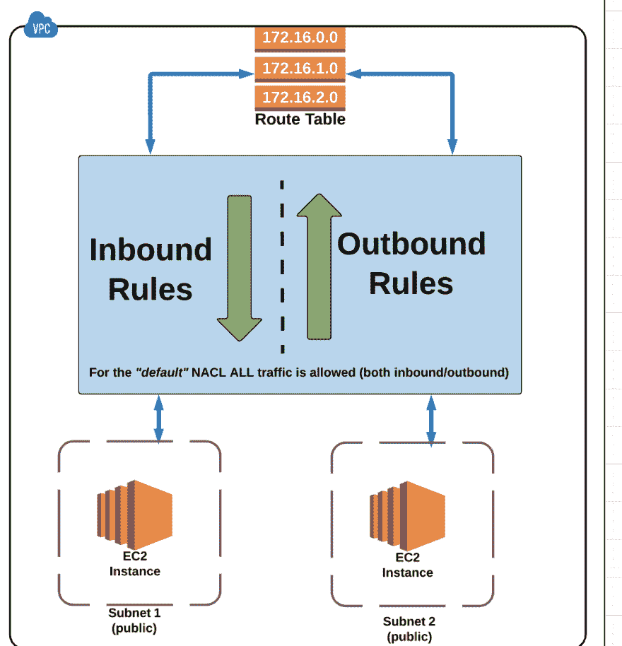
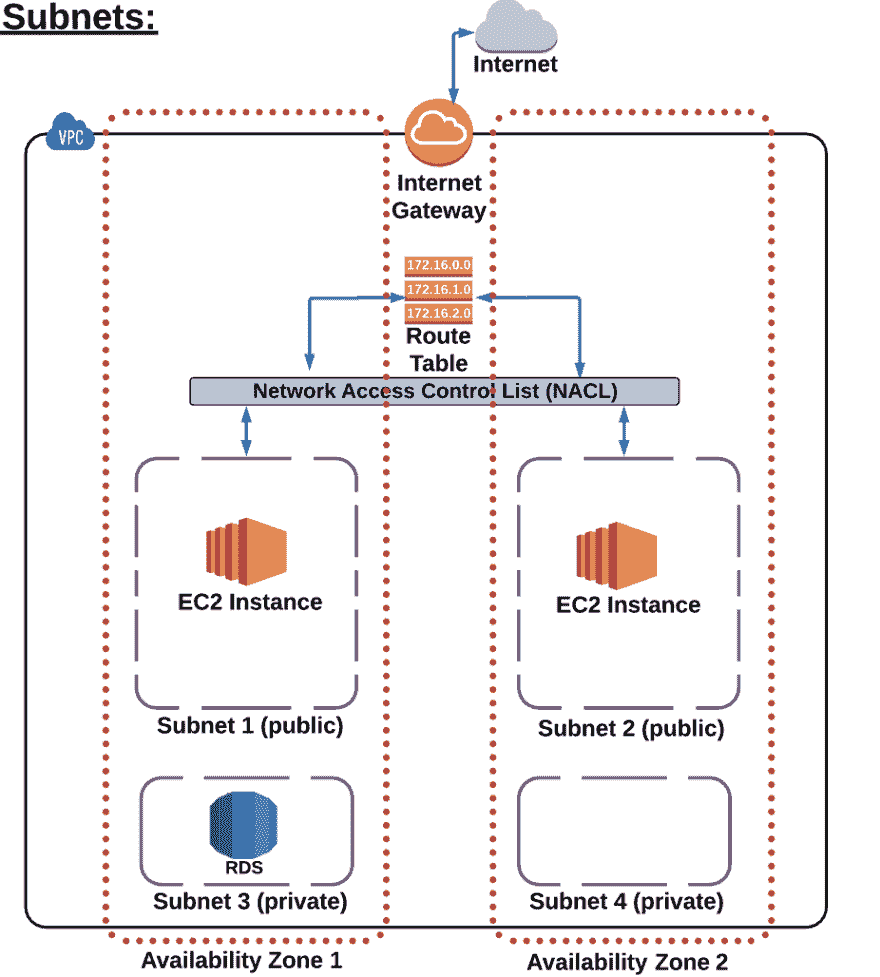
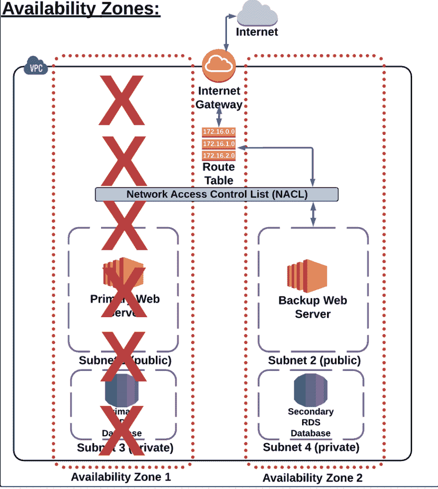

# 30 天 AWS(第 3 天和第 4 天)

> 原文：<https://dev.to/gameoverwill/30-days-of-aws-days-3-and-4-20fj>

首先，我很抱歉昨天我没有发表我的帖子，虽然我学习了，但我觉得写下来很累。

这几天我一直在研究 VCP、互联网网关(IGW)、路由表、网络访问控制列表、子网和可用性区域。

## IGW

根据 AWS 文档“互联网网关是一个水平扩展的、冗余的、高度可用的 VPC 组件，它允许您的 VPC 中的实例与互联网之间的通信。因此，它不会对您的网络流量带来可用性风险或带宽限制。

互联网网关有两个用途:在 VPC 路由表中为可路由的互联网流量提供一个目标，并为尚未分配公共 IPv4 地址的实例执行网络地址转换(NAT)。

换句话说，IGW 是硬件和软件的结合，它为您的私有网络提供了一条通往互联网的路径。

## 路由表

这是一组称为路由的规则，用于确定网络流量被重定向到哪里。

## 的意思

这是 VPC 的一个可选安全层，就像防火墙一样。下图将向您解释什么是路由表和 NACL:

NACL 有入站规则和出站规则，默认情况下允许所有流量(两者都允许)，但您可以设置允许特定路由、端口或 HTTP 或 SSH 等的规则。

## 子网

AWS 用这个词来表示子网，每个子网必须位于一个可用性区域中，您可以向一个可用性区域添加一个或多个子网。

在上图中，您可以看到我们如何将子网划分为不同的可用性区域，将 EC2 和数据库划分为不同的子网也是一种很好的做法。

## 可用性区域

您启动的所有 AWS 资源(如 EC2 /RDS)都必须放在 VPC 子网中，并且任何子网都必须位于可用性区域中。

值得一提的是，您可以使用多个可用性区域来创建一个冗余架构，提供高的可调度性和容错能力。

例如，如果可用性区域 A 发生问题，将自动切换到 B，让您的网站或系统保持运行并保存。

最后，我做了一个整合上述所有主题的练习，并进行了一次测试，我以 83% / 100%的成绩通过了测试。

此外，我想对 Andrew Brown 表示感谢，因为他给了我许多关于云从业者认证的想法。他还让我提前使用他的平台，这很酷，但当我完成真正的课程时，我会从那里学习。

今天就到这里，明天另发帖子。

谢谢大家。