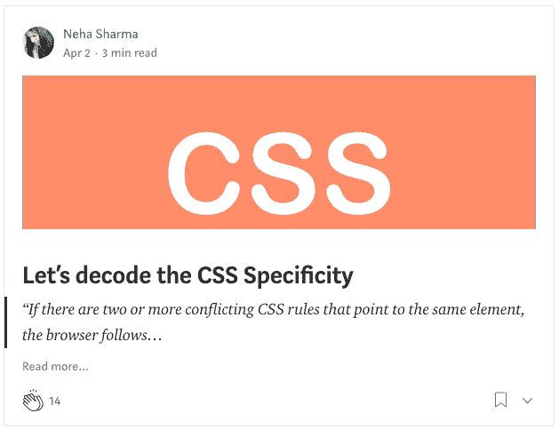

# 本周值得一读的 5 篇外星人文章👽📖

> 原文：<https://dev.to/xenoxdev/5-alien-articles-of-the-week-worth-reading-lm0>

大家好！我希望你喜欢我的上一篇文章。上周对我和我的团队来说非常忙碌，发布了 Dragula 和接下来的所有事情。这就是为什么我这周的文章有点晚了，但无论如何，这里是本周的顶级外星人文章。这些是在 Dev.to 之外发布的文章，因此被称为“alien”。👽
我希望你们喜欢它们！

# 1。20 多个最佳 JavaScript 模态窗口插件

模态在你的网站中可以有多种用途，例如，图库，显示错误信息，填充表格等。Prechu 的这篇文章分享了一个最佳 JavaScript 模型列表，您可以选择在 web 应用程序中实现这些模型。

# 2。整合并实施更漂亮的& ESLint

开发应用程序时，代码的一致性和质量非常重要，可以通过使用一些工具来提高。本文将解释并帮助您通过集成两个最流行的工具 Prettier & ESLint 来实现这一点。

# 3。对::before 和::after 伪元素的冷静使用

使用::before 和::after 伪元素可以做很多事情，KBall 的这篇文章涵盖了其中的一些，比如用特定的类添加图标、在行首和行尾添加引号、制作形状等等。

# 4。没人教过我关于 CSS 的事情

Charlie Gerard 的这篇文章分享了一些你可能不知道的关于 CSS 的重要事情。

# 5。让我们解码 CSS 的特异性

有时我们会注意到，我们应用于一个元素的样式并没有得到预期的反映，这完全取决于特性。基于这种特殊性，浏览器确定选择哪个选择器。妮哈·沙尔玛的这篇文章展示了这方面的一个快速概述，它将帮助你更好地掌握它。

# 让我知道你的想法！

在评论里告诉我你觉得哪篇文章最有用！另外，告诉我你最喜欢的 dev 博客，并分享你最近阅读的内容。祝你愉快！❤

* * *

附:如果你有几分钟空闲时间，请试试 [Dragula](https://dragula.teamxenox.com/) 。如果你喜欢它，请告诉我！

