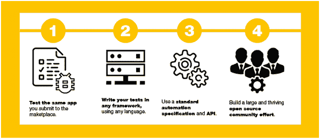
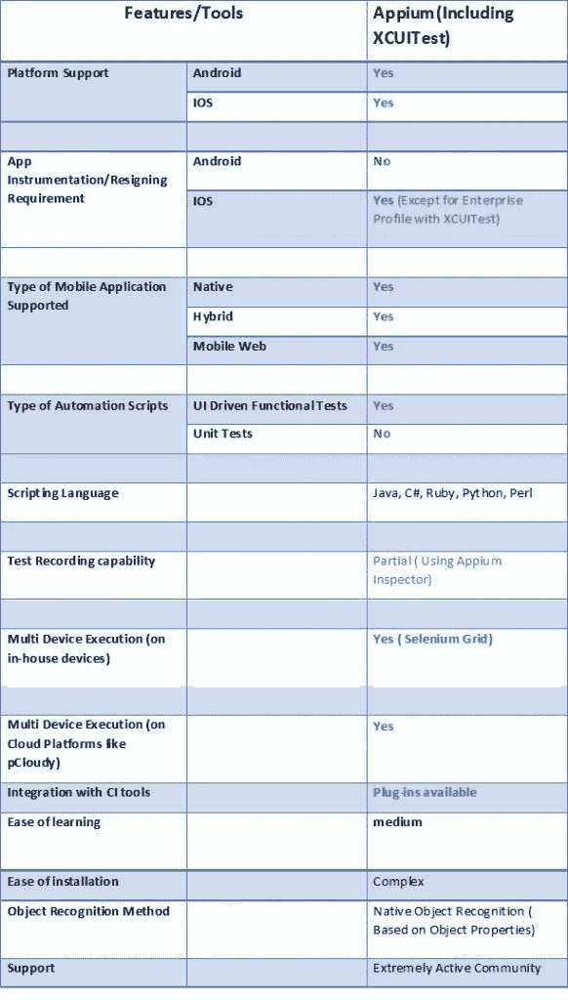

# Appium 是设备云上最好的移动自动化测试工具的 5 个理由

> 原文：<https://dev.to/pcloudy/5-reasons-why-appium-is-the-best-mobile-automation-testing-tool-on-device-cloud-59f6>

**移动测试自动化工具**

随着 Appium 在企业移动领域引起轰动，移动团队仍在寻找利用 Appium 成功自动化测试的方法。Appium 是一个开源工具，是在各自的平台上自动化本地、移动 web 和混合应用程序的完美选择。

现在让我们来看看 Appium 成为移动自动化工具最佳选择背后的主要因素:

1.  使用标准 API: Appium 非常受欢迎，因为它在所有平台上都使用标准 API，所以不需要修改代码或重新编译应用程序。Appium 可以轻松地使用相同的 API 在 iOS 和 Android 平台上创建测试。但是，仍然需要独立的 iOS 和 Android 脚本，因为两个平台上的 UI 元素各不相同。

2.  使用任何与 WebDriver 兼容的语言: [Appium 提供了自由](https://www.pcloudy.com/5-reasons-why-appium-is-the-best-tool-for-mobile-automation-on-device-cloud/)来编写和运行测试，而不会受限于特定的语言或框架。任何与 WebDriver 兼容的语言，如 Perl with Selenium WebDriver API、Java、PHP、C#、Python、Ruby、Javascript with Node.js，都可以用来编写测试。

3.  选择测试框架:Appium 为移动团队提供了使用他们选择的测试框架的灵活性。早期，测试只能通过 Javascript 使用苹果库的 UI 自动化来编写，或者基于 Java 的测试只能通过谷歌的 UI 自动化来编写。Appium 完全改变了这种情况。

4.  跨平台测试自动化:拥有在 Android 和 iOS 设备上测试的能力使其成为最好的跨平台移动应用测试自动化工具。为了用 Selenium WebDriver 与 Android 和 iOS 交互，Appium 使用了 JSON wire 协议。Appium 在一个名为 Instruments 的应用程序的帮助下，利用苹果公司提供的库来自动化 iOS 应用程序。在 9.3 版之后的 iOS 新版本中，Instruments api 已被弃用，现在使用 XCUITest 框架。

Android 中的方法也类似，Appium 将自动化命令代理给设备上运行的 UIAutomator 测试用例。Android 有一个名为 UIAutomator 的本地 UI 自动化框架，它支持从命令行直接在设备上运行 JUnit 测试用例。

1.  开源:作为一个开源测试框架是 Appium 的最大优势之一，因为它支持模拟器，仿真器，真实设备，当然，还有 iOS 和 Android 的原生，混合和 web 应用测试。Appium 拥有一个庞大且蓬勃发展的开放社区，这使得新的自动化工程师更容易澄清他们的疑虑。

对于任何 iOS 或 Android 设备，您都可以在云预留的会话上，发起从本地 Appium 库创建的测试脚本。Appium 与持续集成服务器集成，以确保更好的结果，并驱动 GUI 相关的小部件和控件，允许相同的脚本为各种应用程序的不同软件版本运行。Appium 可以自动化本地、web 和混合移动应用程序，您可以在真实设备、模拟器或仿真器上进行测试。它还支持 iOS 上的 Safari 和 Chrome Mozilla 或 Android 上的任何内置“浏览器”应用程序。

有许多用于移动应用测试的自动化工具。测试人员通常会选择 Appium 作为最好的移动测试工具。[移动自动化测试工具](https://www.pcloudy.com/mobile-app-testing-on-multiple-devices/)比较可以在语言支持和持续集成的基础上进行。用于移动应用测试的最常见的自动化测试工具是 Appium、Robotium 和 Calabash。如果你正在寻找 iOS 应用程序自动化测试工具，那么 Appium 和 Calabash 可以帮你完成这项工作。

这里有一个表格，让你了解 Appium 与不同特性和工具的兼容性。为什么选择内置 Appium 支持的移动设备云？

刚开始使用自动化或考虑将 Appium 作为一个选项的团队必须探索一种替代方案，以使用内置 Appium 的移动设备云。

移动设备云不仅有助于管理和共享设备，还有助于简化自动化测试和持续交付流程。内置 Appium 的移动设备云使团队可以轻松开始自动化，并在以后进行扩展。此外，它将为使用开源平台进行测试时可能出现的任何障碍提供额外的缓冲。让我们来看看在移动设备云上内置 Appium 支持的一些好处:

支持在多个设备上进行并行测试
降低测试框架的复杂性
轻松创建应用程序脚本
简化 CI/CD 流程

在 pCloudy，我们致力于通过将 it 与 Appium 等尖端工具相集成，帮助企业移动团队实现无缝、快速的移动开发、测试和设备共享流程。阅读这个博客，获得一个全面的分析表，快速选择哪个开源测试自动化工具将适合您的自动化测试。

[在 pCloudy](https://device.pcloudy.com/signup) 上注册，使用最佳开源自动化工具自动化您的测试，以便更快更好地交付应用。

欲了解更多信息，请观看此视频:

[https://www.youtube.com/watch?v=4XVv7s7-RL8](https://www.youtube.com/watch?v=4XVv7s7-RL8)