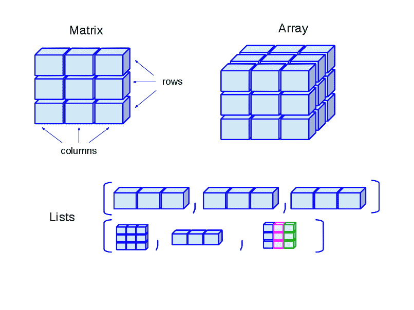
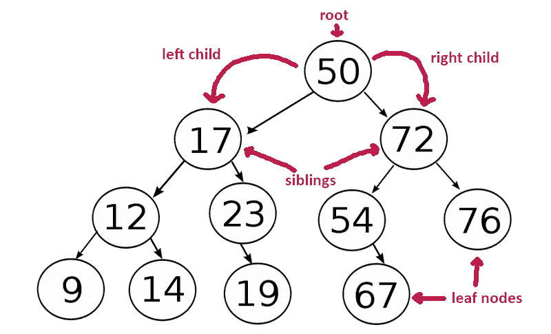
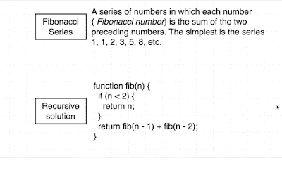
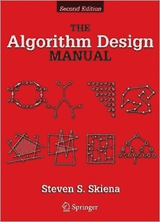
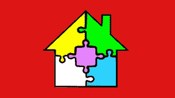
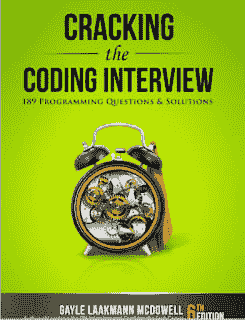

# 来自编码访谈的 50 多个数据结构和算法问题

> 原文：<https://dev.to/javinpaul/50-data-structure-and-algorithms-problems-from-coding-interviews-4lh2>

*披露:这篇文章包括附属链接；如果您从本文提供的不同链接购买产品或服务，我可能会收到报酬。*

有很多计算机科学毕业生和程序员申请像优步和网飞这样的初创公司的编程、编码和软件开发职位；像[亚马逊](https://javarevisited.blogspot.com/2016/01/top-20-amazon-and-google-programming-interview-questions.html)、[微软](https://javarevisited.blogspot.com/2015/12/30-microsoft-interview-questions-for-software-development-engineers.html)、[谷歌](https://javarevisited.blogspot.com/2012/01/google-interview-questions-answers-top.html)这样的大机构；和像 Infosys 或 Luxsoft 这样的服务型公司，但他们中的许多人不知道当你申请这些公司的工作时，会遇到什么样的编程面试问题。

在这篇文章中，我将分享一些*常见的编程面试问题*来自不同经验层次程序员的不同工作面试，从大学刚毕业的人到有一到两年经验的程序员。

编码面试主要包括 [d](http://www.java67.com/2018/06/data-structure-and-algorithm-interview-questions-programmers.html) [数据结构和基于算法的问题](http://www.java67.com/2018/06/data-structure-and-algorithm-interview-questions-programmers.html)以及一些逻辑问题，例如，如何在不使用临时变量的情况下交换两个整数？

我觉得把编码面试问题分成不同的话题领域是有帮助的。

我在面试中最常看到的话题领域有[数组](https://medium.com/javarevisited/20-array-coding-problems-and-questions-from-programming-interviews-869b475b9121)、[链表](https://medium.com/javarevisited/top-20-linked-list-coding-problems-from-technical-interviews-90b64d2df093)、[字符串](https://medium.com/javarevisited/top-21-string-programming-interview-questions-for-beginners-and-experienced-developers-56037048de45)、[二叉树](https://medium.com/javarevisited/20-binary-tree-algorithms-problems-from-coding-interviews-c5e5a384df30)，以及字符串算法之类的算法的问题，快速排序[或](https://javarevisited.blogspot.com/2014/08/quicksort-sorting-algorithm-in-java-in-place-example.html)[基数排序](http://www.java67.com/2018/03/how-to-implement-radix-sort-in-java.html)之类的排序算法，以及其他一些杂七杂八的问题，这些你都会在本文中找到。

不能保证你会被问到这些编码或数据结构和算法问题，但它们会让你对真实编程工作面试中可能遇到的问题有足够的了解。

一旦你完成了这些问题，你应该有足够的信心参加任何电话或面对面的面试。

顺便说一句，如果你对基本的数据结构和算法没有足够的了解，或者你已经很久没有接触过它们，尝试这些问题是没有意义的。

在这种情况下，你应该参加一个很好的入门课程，比如 [**数据结构和算法:使用 Java**](https://click.linksynergy.com/fs-bin/click?id=JVFxdTr9V80&subid=0&offerid=634352.1&type=10&tmpid=14538&RD_PARM1=https%3A%2F%2Fwww.udemy.com%2Fdata-structures-and-algorithms-deep-dive-using-java%2F) 深入学习，以刷新你的 DS 和算法技能。

## **50 强算法与编码面试题**

事不宜迟，下面是我从编程工作面试中列出的一些**最常被问到的编码面试问题:**

### 1。数组编码面试问题

数组是最基本的数据结构，它将元素存储在连续的内存位置。这也是面试官最喜欢的话题之一，你会在任何一次[编码面试](https://javarevisited.blogspot.com/2011/06/top-programming-interview-questions.html)中听到很多关于数组的问题，比如反转数组、排序数组或者搜索数组中的元素。

数组数据结构的主要好处是，如果知道索引，它可以提供快速的 O(1)搜索，但是从数组中添加和删除元素会很慢，因为一旦创建了数组，就不能改变它的大小。

为了创建一个更短或更长的数组，您需要创建一个新数组，并将所有元素从旧数组复制到新数组。

解决基于数组的问题的关键是充分了解[数组数据结构](http://www.java67.com/2013/08/ata-structures-in-java-programming-array-linked-list-map-set-stack-queue.html)以及基本的编程构造函数，如循环、递归和基本运算符。

以下是解决基于数组的编码问题的一些技巧:

1.  数组索引从零开始
2.  您可以使用循环来迭代数组
3.  数组元素存储在连续的内存位置，因此您也可以使用指针算法来访问它们
4.  数组为使用索引的搜索提供 O(1)性能
5.  由于重新调整大小，在数组中添加或删除元素的速度较慢

以下是一些常见的基于数组的编码面试问题，供您练习使用:

1.  **如何在给定的 1 到 100 的整数数组中找到缺失的数字** **？( [**解**](http://javarevisited.blogspot.com/2014/11/how-to-find-missing-number-on-integer-array-java.html) )**
2.  如何在给定的整数数组中找到重复的数字？ **(** [**)解**](http://javarevisited.blogspot.com/2014/01/how-to-remove-duplicates-from-array-java-without-collection-API.html) **)**
3.  **如何在一个未排序的整数数组中找到最大和最小的数？( [**解**](http://java67.blogspot.com/2014/02/how-to-find-largest-and-smallest-number-array-in-java.html) )**
4.  **如何求一个整数数组的和等于给定数的所有对？( [**解**](http://javarevisited.blogspot.com/2014/08/how-to-find-all-pairs-in-array-of-integers-whose-sum-equal-given-number-java.html) )**
5.  如果一个数组中包含多个重复的数字，如何找到重复的数字？( [**解**](http://javarevisited.blogspot.com/2014/03/3-ways-to-find-first-non-repeated-character-String-programming-problem.html) )
6.  在 Java 中，如何从给定的数组中删除重复项？( [**解**](http://javarevisited.blogspot.com/2014/01/how-to-remove-duplicates-from-array-java-without-collection-API.html) **)**
7.  如何使用快速排序算法对整数数组进行排序？( [**解**](http://javarevisited.blogspot.com/2014/08/quicksort-sorting-algorithm-in-java-in-place-example.html) **)**
8.  如何就地删除数组中的重复项？( [**解**](http://javarevisited.blogspot.com/2014/01/how-to-remove-duplicates-from-array-java-without-collection-API.html) **)**
9.  在 Java 中，你如何反转一个数组？( [**解**](http://javarevisited.blogspot.com/2013/03/how-to-reverse-array-in-java-int-String-array-example.html) )
10.  如何在不使用任何库的情况下从数组中删除重复项？( [**解**](http://javarevisited.blogspot.sg/2014/01/how-to-remove-duplicates-from-array-java-without-collection-API.html) **)**

这些问题不仅有助于您发展解决问题的技能，还能提高您对数组数据结构的了解。

如果你需要基于 array 的更高级的问题，那么你也可以参见 [**《编码面试训练营:算法+数据结构**](https://click.linksynergy.com/fs-bin/click?id=JVFxdTr9V80&subid=0&offerid=323058.1&type=10&tmpid=14538&RD_PARM1=https%3A%2F%2Fwww.udemy.com%2Fcoding-interview-bootcamp-algorithms-and-data-structure%2F) ，这是一门关于算法的训练营式课程，专为在谷歌、微软、苹果、脸书等技术巨头找到工作的面试准备而设计。

而且，如果你觉得 10 道题不够，需要多加练习，那么你也可以看看这张 [**30 道阵题**](http://javarevisited.blogspot.sg/2015/06/top-20-array-interview-questions-and-answers.html) 的清单。

### 2。链表编程面试问题

[链表](http://www.java67.com/2017/06/5-difference-between-array-and-linked.html)是补充数组数据结构的另一种常见数据结构。与数组类似，它也是一种线性数据结构，以线性方式存储元素。

然而，与数组不同，它不将它们存储在连续的位置；相反，它们分散在内存中的每个地方，内存使用节点相互连接。

一个[链表](https://medium.com/javarevisited/top-20-linked-list-coding-problems-from-technical-interviews-90b64d2df093)只不过是一个节点列表，其中每个节点包含存储的值和下一个节点的地址。

由于这种结构，**很容易在链表**中添加和删除元素，因为你只需要改变链接而不是创建数组，但是搜索是困难的，并且经常需要 O(n)时间来找到单链表中的元素。

这篇[文章](http://javarevisited.blogspot.sg/2013/07/difference-between-array-and-linked-list-java.html)提供了更多关于数组和链表数据结构之间区别的信息。

它也有多种形式，比如单链表，允许你单向遍历(正向或反向)；一个**双向链表**，允许你双向遍历(向前和向后)；最后是循环链表，形成一个圈。

为了解决基于链表的问题，很好地了解[递归](https://javarevisited.blogspot.com/2017/03/how-to-reverse-linked-list-in-java-using-iteration-and-recursion.html)是很重要的，因为**链表是一种递归数据结构**。

如果从链表中取出一个节点，剩下的数据结构仍然是一个链表，正因为如此，许多链表问题有比迭代更简单的递归解。

以下是一些最常见、最受欢迎的链表面试问题及其解决方案:

1.  **如何一次找到单链表的中间元素？( [**解**](http://javarevisited.blogspot.sg/2012/12/how-to-find-middle-element-of-linked-list-one-pass.html) )**
2.  如何检查一个给定的链表是否包含循环？如何找到循环的开始节点？( [**解**](http://javarevisited.blogspot.sg/2013/05/find-if-linked-list-contains-loops-cycle-cyclic-circular-check.html) **)**
3.  如何反转一个链表？( [**解**](http://www.java67.com/2016/07/how-to-reverse-singly-linked-list-in-java-example.html) **)**
4.  如何在没有递归的情况下反转一个单链表？( [**解**](http://javarevisited.blogspot.sg/2017/03/how-to-reverse-linked-list-in-java-using-iteration-and-recursion.html) )
5.  **在一个未排序的链表中，如何去除重复的节点？(** [**解**](https://www.geeksforgeeks.org/remove-duplicates-from-an-unsorted-linked-list/) **)**
6.  如何求单链表的长度？( [**解**](http://javarevisited.blogspot.sg/2016/05/how-do-you-find-length-of-singly-linked.html) **)**
7.  **如何在单链表中找到倒数第三个节点？(** [**解**](http://javarevisited.blogspot.sg/2016/07/how-to-find-3rd-element-from-end-in-linked-list-java.html) **)**
8.  **如何用 Stack 求两个链表的和？(** [**解**](https://www.geeksforgeeks.org/sum-of-two-linked-lists/) **)**

这些问题将帮助你发展解决问题的技能，并提高你对链表数据结构的了解。

如果你在解决这些链表编码问题上有困难，那么我建议你通过学习 [**数据结构和算法:深度学习**](https://click.linksynergy.com/fs-bin/click?id=JVFxdTr9V80&subid=0&offerid=323058.1&type=10&tmpid=14538&RD_PARM1=https%3A%2F%2Fwww.udemy.com%2Fdata-structures-and-algorithms-deep-dive-using-java%2F) **使用 Java**课程来更新你的数据结构和算法技能。

您也可以查看此列表中的 [**30 个链表面试问题**](http://javarevisited.blogspot.sg/2017/07/top-10-linked-list-coding-questions-and.html) 以获得更多练习题。

### 3。字符串编码面试问题

除了数组和链表数据结构，字符串是编程工作面试的另一个热门话题。我从未参加过编码面试，在面试中没有问[基于字符串的问题](http://www.java67.com/2018/04/21-string-programming-and-coding-interview-questions-answers.html)。

关于字符串的一个好处是，如果你知道数组，你可以很容易地解决基于字符串的问题，因为**字符串只不过是一个字符数组**。

所以你通过解决[基于数组的编码问题](https://medium.com/javarevisited/20-array-coding-problems-and-questions-from-programming-interviews-869b475b9121)学到的所有技术也可以用来解决字符串编程问题。

以下是我在编程工作面试中常见的字符串编码问题:

1.  如何从字符串中打印出重复的字符？( [**解**](http://java67.blogspot.sg/2014/03/how-to-find-duplicate-characters-in-String-Java-program.html) **)**
2.  如何检查两个字符串是否互为变位？( [**解**](http://javarevisited.blogspot.sg/2013/03/Anagram-how-to-check-if-two-string-are-anagrams-example-tutorial.html) **)**
3.  如何打印字符串中第一个不重复的字符？( [**解**](http://javarevisited.blogspot.sg/2014/03/3-ways-to-find-first-non-repeated-character-String-programming-problem.html) **)**
4.  如何使用递归来反转给定的字符串？( [**解**](http://javarevisited.blogspot.sg/2012/01/how-to-reverse-string-in-java-using.html) **)**
5.  如何检查一个字符串是否只包含数字？( [**解**](http://javarevisited.blogspot.sg/2012/10/regular-expression-example-in-java-to-check-String-number.html) **)**
6.  如何在字符串中找到重复的字符？( [**解**](http://java67.blogspot.sg/2014/03/how-to-find-duplicate-characters-in-String-Java-program.html) **)**
7.  如何计算给定字符串中元音和辅音的数量？( [**解**](http://java67.blogspot.sg/2013/11/how-to-count-vowels-and-consonants-in-Java-String-word.html) **)**
8.  如何计算一个给定字符在字符串中的出现次数？( [**解**](http://javarevisited.blogspot.sg/2012/12/how-to-count-occurrence-of-character-in-String.html) **)**
9.  如何找到一个字符串的所有排列？( [**解**](http://javarevisited.blogspot.com/2015/08/how-to-find-all-permutations-of-string-java-example.html) **)**
10.  **如何在不使用任何库方法的情况下，对给定句子中的单词进行逆序？(** [**解**](http://java67.blogspot.com/2015/06/how-to-reverse-words-in-string-java.html) **)**
11.  如何检查两个弦是否是彼此的旋转？( [**解**](http://www.java67.com/2017/07/string-rotation-in-java-write-program.html) **)**
12.  如何检查给定的字符串是否是回文？( [**解**](http://java67.blogspot.com/2015/06/how-to-check-is-string-is-palindrome-in.html) **)**

这些问题有助于提高您对作为数据结构的字符串的了解。如果你能在没有任何帮助的情况下解决所有这些字符串问题，那么你的状态就很好。

对于更高级的问题，我建议你解决史蒂文·斯基亚纳 的《算法设计手册》 [**中给出的问题，这本书有最难的算法问题。**](http://www.amazon.com/Algorithm-Design-Manual-Steven-Skiena/dp/1849967202?tag=javamysqlanta-20)

如果你需要更多的练习，这里还有另外一张 [**20 个字符串编码题**](http://javarevisited.blogspot.sg/2015/01/top-20-string-coding-interview-question-programming-interview.html) 的清单。

### 4。二叉树编码面试问题

到目前为止，我们只研究了线性数据结构，但是现实世界中的所有信息都不能用线性方式表示，这就是树数据结构的用处。

树形数据结构是一种数据结构，允许您以分层的方式存储数据。根据您存储数据的方式，有不同类型的树，例如[二叉树](http://javarevisited.blogspot.sg/2016/07/binary-tree-preorder-traversal-in-java-using-recursion-iteration-example.html)，其中每个节点最多有两个子节点。

和它的近亲二叉查找树一起，它也是最流行的树数据结构之一。所以你会发现很多基于它们的问题，比如如何遍历它们，计算节点，求深度，检查它们是否平衡。

解决二叉树问题的一个关键点是强大的理论知识，如二叉树的大小或深度，什么是叶子，什么是节点，以及对流行的遍历算法的理解，如前、后和按序遍历。

以下是软件工程师或开发人员面试中常见的[二叉树编码问题](https://medium.com/javarevisited/20-binary-tree-algorithms-problems-from-coding-interviews-c5e5a384df30):

1.  二叉查找树是如何实施的？( [**解**](http://javarevisited.blogspot.sg/2015/10/how-to-implement-binary-search-tree-in-java-example.html#axzz4wnEtnNB3) **)**
2.  **如何在给定的二叉树中进行前序遍历？(** [**解**](http://javarevisited.blogspot.sg/2016/07/binary-tree-preorder-traversal-in-java-using-recursion-iteration-example.html#axzz5ArdIFI7y) **)**
3.  如何在没有递归的情况下，按前序遍历给定的二叉树？( [**解**](http://www.java67.com/2016/07/binary-tree-preorder-traversal-in-java-without-recursion.html) **)**
4.  如何在给定的二叉树中进行有序遍历？*( [**解**](http://www.java67.com/2016/08/binary-tree-inorder-traversal-in-java.html) **)**
5.  **如何在没有递归的情况下使用 inorder 遍历打印给定二叉树的所有节点？(** [**解**](http://www.java67.com/2016/08/binary-tree-inorder-traversal-in-java.html) **)**
6.  如何实现一个后序遍历算法？( [**解**](http://www.java67.com/2016/10/binary-tree-post-order-traversal-in.html) **)**
7.  **如何在后序遍历中不用递归遍历一棵二叉树？(** [**解**](http://www.java67.com/2017/05/binary-tree-post-order-traversal-in-java-without-recursion.html) **)**
8.  二叉查找树的所有叶子是如何印刷的？( [**解**](http://www.java67.com/2016/09/how-to-print-all-leaf-nodes-of-binary-tree-in-java.html) **)**
9.  如何计算给定二叉树中的叶节点数？( [**解**](http://javarevisited.blogspot.sg/2016/12/how-to-count-number-of-leaf-nodes-in-java-recursive-iterative-algorithm.html) **)**
10.  如何在给定的数组中执行二分搜索法？( [**解**](http://javarevisited.blogspot.sg/2015/10/how-to-implement-binary-search-tree-in-java-example.html#axzz4wnEtnNB3) **)**

如果你觉得自己对二叉树编码的理解不足，自己无法解决这些问题，建议你回去挑一门好的数据结构和算法课程像 [**从 0 到 Java 中的数据结构&算法**](https://click.linksynergy.com/fs-bin/click?id=JVFxdTr9V80&subid=0&offerid=323058.1&type=10&tmpid=14538&RD_PARM1=https%3A%2F%2Fwww.udemy.com%2Ffrom-0-to-1-data-structures%2F) 。

如果你需要更多的建议，这里是我列出的有用的[数据结构算法书籍](http://javarevisited.blogspot.sg/2015/07/5-data-structure-and-algorithm-books-best-must-read.html)和[课程](http://javarevisited.blogspot.sg/2018/01/top-5-free-data-structure-and-algorithm-courses-java--c-programmers.html)的清单。

### 5。杂项编码面试问题

除了基于数据结构的问题，大多数编程工作面试还会问[算法](https://javarevisited.blogspot.com/2019/04/top-20-searching-and-sorting-algorithms-interview-questions.html)、[软件设计](https://medium.com/javarevisited/25-software-design-interview-questions-to-crack-any-programming-and-technical-interviews-4b8237942db0)、位操作和一般基于逻辑的问题，我将在这一部分进行描述。

实践这些概念是很重要的，因为有时它们在实际面试中变得很难解决。之前练习过它们不仅让你熟悉它们，也让你更有信心向面试官解释解决方案。

1.  如何实现冒泡排序算法？( [**解**](http://javarevisited.blogspot.sg/2014/08/bubble-sort-algorithm-in-java-with.html#axzz5ArdIFI7y) **)**
2.  **迭代快速排序算法是如何实现的？(** [**解**](http://javarevisited.blogspot.sg/2016/09/iterative-quicksort-example-in-java-without-recursion.html#axzz5ArdIFI7y) **)**
3.  如何实现插入排序算法？( [**解**](http://www.java67.com/2014/09/insertion-sort-in-java-with-example.html) **)**
4.  如何实现合并排序算法？( [**解**](http://www.java67.com/2018/03/mergesort-in-java-algorithm-example-and.html) **)**
5.  如何实现桶排序算法？( [**解**](http://javarevisited.blogspot.sg/2017/01/bucket-sort-in-java-with-example.html) **)**
6.  如何实现计数排序算法？( [**解**](http://www.java67.com/2017/06/counting-sort-in-java-example.html) **)**
7.  如何实现基数排序算法？( [**解**](http://www.java67.com/2018/03/how-to-implement-radix-sort-in-java.html) **)**
8.  如何在不使用第三个变量的情况下交换两个数？( [**解**](http://www.java67.com/2015/08/how-to-swap-two-integers-without-using.html) **)**
9.  如何检查两个矩形是否重叠？( [**解**](http://javarevisited.blogspot.sg/2016/10/how-to-check-if-two-rectangle-overlap-in-java-algorithm.html) **)**
10.  如何设计一台自动售货机？( [**解**](http://javarevisited.blogspot.sg/2016/06/design-vending-machine-in-java.html) **)**

如果你需要更多这样的编程问题，你可以从《破解代码访谈》 、[**Gayle Laakmann McDowell**](https://medium.com/@gayle)等书中得到帮助，这些书提供了 189 个以上的编程问题和解决方案。短时间内准备编程求职面试的好书。

对了，你在实践中解决的问题越多，你的准备就越充分。所以，如果你觉得 50 还不够，还需要更多，那就去看看这些额外的**[电话面试](http://www.java67.com/2015/03/top-40-core-java-interview-questions-answers-telephonic-round.html)和这些[书籍](http://javarevisited.blogspot.sg/2016/06/top-5-books-for-programming-coding-interviews-best.html)和[课程](http://javarevisited.blogspot.sg/2018/02/10-courses-to-prepare-for-programming-job-interviews.html)做更彻底的准备吧。**

 **### 现在你已经为编码面试做好了准备

这些是数据结构和算法之外的一些最常见的问题，有助于你在面试中表现出色。

我在我的[博客](http://java67.com/)上也分享了很多这样的问题，所以如果你真的感兴趣，你可以随时去那里搜索。

这些**常见的编码、数据结构和算法问题**是你需要知道的，以成功面试任何公司，无论大小，任何级别的编程工作。

如果你想在 2021 年找一份编程或软件开发的工作，你可以从这个编码问题列表开始准备。

这个列表提供了准备的好话题，也有助于评估你的准备情况，找出你的强项和弱项。

良好的数据结构和算法知识对于成功编写面试代码非常重要，这也是你应该集中大部分注意力的地方。

**进一步学习** \
[数据结构和算法:深潜使用 Java](https://click.linksynergy.com/fs-bin/click?id=JVFxdTr9V80&subid=0&offerid=323058.1&type=10&tmpid=14538&RD_PARM1=https%3A%2F%2Fwww.udemy.com%2Fdata-structures-and-algorithms-deep-dive-using-java%2F)
[10 本书准备技术编程/编码求职面试](http://www.java67.com/2017/06/10-books-to-prepare-technical-coding-job-interviews.html)
[10 本算法书每个程序员都应该读的](http://www.java67.com/2015/09/top-10-algorithm-books-every-programmer-read-learn.html)
[Java 开发人员前 5 本数据结构和算法书](http://javarevisited.blogspot.sg/2016/05/5-free-data-structure-and-algorithm-books-in-java.html#axzz4uXETWjmV)
[从 0 到 1:Java 中的数据结构&算法](https://click.linksynergy.com/fs-bin/click?id=JVFxdTr9V80&subid=0&offerid=323058.1&type=10&tmpid=14538&RD_PARM1=https%3A%2F%2Fwww.udemy.com%2Ffrom-0-to-1-data-structures%2F)
[数据结构和算法分析-求职面试](https://click.linksynergy.com/fs-bin/click?id=JVFxdTr9V80&subid=0&offerid=323058.1&type=10&tmpid=14538&RD_PARM1=https%3A%2F%2Fwww.udemy.com%2Fdata-structure-and-algorithms-analysis%2F)

#### 期末备注

谢谢，你坚持到了文章的结尾...祝你编程面试好运！这当然不容易，但是通过遵循这个路线图和指南，你离成为一名 [DevOps 工程师](https://hackernoon.com/10-free-courses-to-learn-docker-for-programmers-and-devops-engineers-7ff2781fd6e0)更近了一步。

如果你喜欢这篇文章，那么请分享给你的朋友和同事，别忘了在 Twitter 上关注 [javinpaul](https://twitter.com/javinpaul) ！

### P.S. -如果你需要一些免费的资源，可以查看这份[免费数据结构与算法课程](http://javarevisited.blogspot.com/2018/01/top-5-free-data-structure-and-algorithm-courses-java--c-programmers.html)的列表，开始准备。**