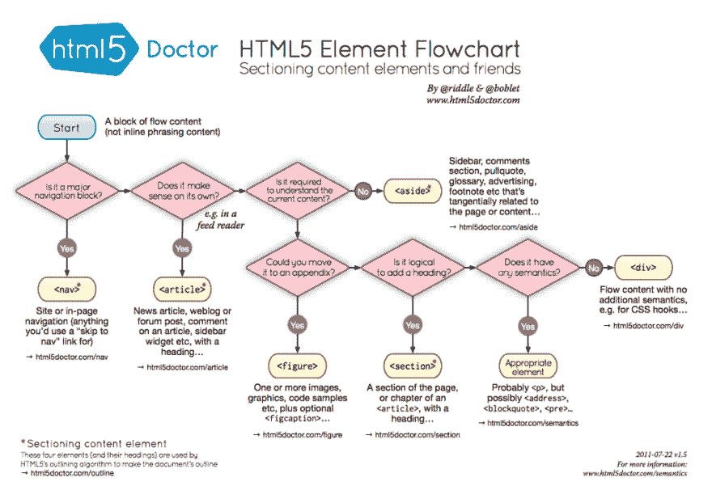

# HTML 中 div 标签的 7 种替代方法

> 原文：<https://dev.to/zac_heisey/7-alternatives-to-the-div-tag-in-html-62i>

在学习如何构造 HTML 文档的早期阶段，以一些开发人员所说的“ [div soup](https://www.pluralsight.com/blog/software-development/html5-web-components-overview) 结束并不罕见你的主页需要一个内容部分吗？用 div 包起来！构建侧边栏？分割它！三栏布局？div div div！

以这种方式编写 HTML 没有任何功能上的错误。浏览器仍然能够呈现您的标记并向用户显示您的内容。大量使用`<div>`标签的主要问题是它们缺乏语义。编写[语义 HTML](https://www.lifewire.com/why-use-semantic-html-3468271) 为 web 浏览器和屏幕阅读器赋予你的标记意义，可以帮助 SEO，使调试代码更容易，等等。

根据 [W3C](http://w3c.github.io/html/grouping-content.html#the-div-element) :

> “div 元素没有任何特殊的意义……强烈建议作者将 div 元素视为万不得已的元素，因为没有其他元素是合适的。使用更合适的元素而不是 div 元素可以让读者更容易访问，让作者更容易维护。

好的，那么 W3C 提到的这些“更合适的元素”是什么呢？当 HTML5 在 2014 年发布时，它引入了一些新的部分和分组元素，web 开发人员可以使用这些元素来增强他们的标记的语义。

让我们探索一下`<div>`标签的一些更具语义的替代物。

### 主要元素

[main](http://html5doctor.com/element-index/#main-desc) 元素向浏览器和屏幕阅读器指出你的标记的哪一部分包含了给定页面上的主要内容。这有助于键盘命令访问、移动浏览器缩放等。每页只应使用一次。

```
<!-- other content -->

<main role="main">

  <h1>Skateboards</h1>
  <p>The skateboard is the way cool kids get around.</p>

</main>

<!-- other content --> 
```

### 截面元素

[section](http://html5doctor.com/element-index/#section) 元素用于按主题对内容进行分组，代表文档或应用程序的一个部分。节可以有自己的页眉和页脚元素，并且在一个页面上可以使用多个节元素。

```
<!-- other content -->

<main role="main">

  <section id="skateboards-intro">
    <h1>Skateboards</h1>
    <p>The skateboard is the way cool kids get around.</p>
  </section>

  <section id="skateboards-history">
    <h1>History of Skateboards</h1>
    <p>Skateboarding was born in the late 1940s or early 1950s.</p>
  </section>

</main>

<!-- other content --> 
```

### 风卷残云

[除此之外](http://html5doctor.com/element-index/#aside)元素主要用于表示页面的一部分，包含给定部分的相关内容。侧边通常用作侧边栏。

```
<!-- other content -->

<main role="main">

  <section id="skateboards-intro">
    <h1>Skateboards</h1>
    <p>The skateboard is the way cool kids get around.</p>
  </section>

  <section id="skateboards-history">
    <h1>History of Skateboards</h1>
    <p>Skateboarding was born in the late 1940s or early 1950s.</p>

    <aside id="timeline">
      <p>1940s: Lorem Ipsum</p>
      <p>1950s: Lorem Ipsum</p>
      <p>1960s: Lorem Ipsum</p>
    </aside>

  </section>

</main>

<!-- other content --> 
```

### 文章元素

[article](http://html5doctor.com/element-index/#article) 元素可以用于独立的内容部分。博客文章、报纸文章和用户评论是 article 元素的一些可能的用例。

```
<!-- other content -->

<main role="main">

  <section id="skateboards-intro">
    <h1>Skateboards</h1>
    <p>The skateboard is the way cool kids get around.</p>
  </section>

  <section id="skateboards-history">
    <h1>History of Skateboards</h1>
    <p>Skateboarding was born in the late 1940s or early 1950s.</p>

    <aside id="timeline">
      <p>1940s: Lorem Ipsum</p>
      <p>1950s: Lorem Ipsum</p>
      <p>1960s: Lorem Ipsum</p>
    </aside>

  </section>

  <article class="blog-posts">
    <header>
      <h2>Why I Love Skateboarding</h2>
      <p>By Tony Hawk</p>
    </header>
    <p>Skateboarding is the best! I love doing gnarly tricks 🤘</p>
  </article>

</main>

<!-- other content --> 
```

### block quote 元素

[blockquote](http://html5doctor.com/element-index/#blockquote) 元素表示从外部来源(个人、文档、报纸、案例研究等)引用的内容。).它通常伴随着一个内部的`<footer>`元素，将报价归因于其来源。

```
<!-- other content -->

<main role="main">

  <section id="skateboards-intro">
    <h1>Skateboards</h1>
    <p>The skateboard is the way cool kids get around.</p>
  </section>

  <section id="skateboards-history">
    <h1>History of Skateboards</h1>
    <p>Skateboarding was born in the late 1940s or early 1950s.</p>

    <aside id="timeline">
      <p>1940s: Lorem Ipsum</p>
      <p>1950s: Lorem Ipsum</p>
      <p>1960s: Lorem Ipsum</p>
    </aside>

  </section>

  <article class="blog-posts">
    <header>
      <h2>Why I Love Skateboarding</h2>
      <p>By Tony Hawk</p>
    </header>
    <p>Skateboarding is the best! I love doing gnarly tricks 🤘</p>
  </article>

  <blockquote cite="http://www.tonyhawkshreds.com">
    "Skateboarding is life. The rest is just details."
    <footer>- Tony Hawk</footer>
  </blockquote>

</main>

<!-- other content --> 
```

### Nav 元素

顾名思义， [nav](http://html5doctor.com/element-index/#nav) 元素表示文档的导航部分。导航元素应该包括给定页面、应用程序等的主要导航链接。

```
<!-- other content -->

<nav id="main-navigation">
  <ul>
    <li><a href="#skateboards-intro"></a>Introduction to Skateboards</li>
    <li><a href="#skateboards-history"></a>History of Skateboards</li>
  </ul>
</nav>

<main role="main">

  <section id="skateboards-intro">
    <h1>Skateboards</h1>
    <p>The skateboard is the way cool kids get around.</p>
  </section>

  <section id="skateboards-history">
    <h1>History of Skateboards</h1>
    <p>Skateboarding was born in the late 1940s or early 1950s.</p>

    <aside id="timeline">
      <p>1940s: Lorem Ipsum</p>
      <p>1950s: Lorem Ipsum</p>
      <p>1960s: Lorem Ipsum</p>
    </aside>

  </section>

  <article class="blog-posts">
    <header>
      <h2>Why I Love Skateboarding</h2>
      <p>By Tony Hawk</p>
    </header>
    <p>Skateboarding is the best! I love doing gnarly tricks 🤘</p>
  </article>

  <blockquote cite="http://www.tonyhawkshreds.com">
    "Skateboarding is life. The rest is just details."
    <footer>- Tony Hawk</footer>
  </blockquote>

</main>

<!-- other content --> 
```

### 页脚元素

[footer](http://html5doctor.com/element-index/#footer) 元素表示文档或节的“页脚”部分。在许多网站中，页脚元素将包含联系人和版权信息、简短的“关于”简介、社交媒体标志和链接等。

```
<!-- other content -->

<nav id="main-navigation">
  <ul>
    <li><a href="#skateboards-intro"></a>Introduction to Skateboards</li>
    <li><a href="#skateboards-history"></a>History of Skateboards</li>
  </ul>
</nav>

<main role="main">

  <section id="skateboards-intro">
    <h1>Skateboards</h1>
    <p>The skateboard is the way cool kids get around.</p>
  </section>

  <section id="skateboards-history">
    <h1>History of Skateboards</h1>
    <p>Skateboarding was born in the late 1940s or early 1950s.</p>

    <aside id="timeline">
      <p>1940s: Lorem Ipsum</p>
      <p>1950s: Lorem Ipsum</p>
      <p>1960s: Lorem Ipsum</p>
    </aside>

  </section>

  <article class="blog-posts">
    <header>
      <h2>Why I Love Skateboarding</h2>
      <p>By Tony Hawk</p>
    </header>
    <p>Skateboarding is the best! I love doing gnarly tricks 🤘</p>
  </article>

  <blockquote cite="http://www.tonyhawkshreds.com">
    "Skateboarding is life. The rest is just details."
    <footer>- Tony Hawk</footer>
  </blockquote>

</main>

<footer>
  <p>© 2019 Skateboards, Inc.</p>
  <a href="https://twitter.com/@skateboards">Twitter Profile</a>
  <a href="https://www.facebook.com/Skateboards">Facebook Page</a>
</footer>

<!-- other content --> 
```

既然我们已经知道了 div 元素的一些语义优化的替代方案，那么我们如何知道何时使用它们呢？什么时候(如果有的话)可以在我们的标记中使用 div 元素？医生有一个非常方便的流程图来帮助回答这个问题:

[](https://res.cloudinary.com/practicaldev/image/fetch/s--pUbjv5IY--/c_limit%2Cf_auto%2Cfl_progressive%2Cq_auto%2Cw_880/https://cdn-images-1.medium.com/max/1024/1%2A1d6PpXylYNTGZtMU_q4_Vg.png)

* * *

*感谢阅读！如果你有兴趣学习更多关于 HTML、CSS 和 JavaScript 的基础知识，请关注我的媒体出版物，* [*Web Dev 基础知识*](https://medium.com/web-dev-basics) *。准备好写一些代码了吗？太棒了。* [*报名参加*](https://www.web-dev-basics.com/) *课程，学习 web 开发基础知识。*