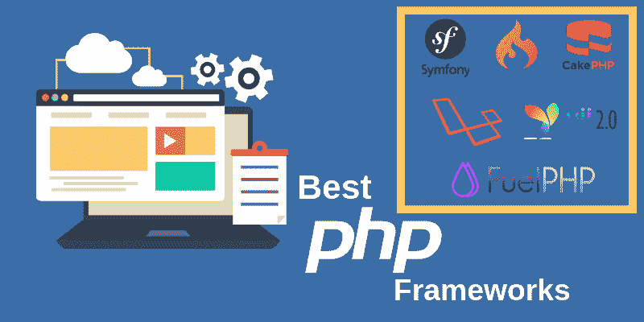

# PHP 开发人员推荐的 7 个最佳 PHP 框架

> 原文：<https://dev.to/appdevelopmentagency/7-best-php-frameworks-recommended-by-php-developers--2d87>

PHP 被认为是世界上最流行的服务器端脚本语言，自从内联代码片段出现在第一个 HTML 代码静态 HTML 文件中以来，它已经有了很大的发展。

如今，开发人员需要创建复杂的网站和 web 应用程序，在一定的复杂程度之上，总是从头开始可能会有太多的时间和麻烦，因此需要更结构化的自然开发方法。PHP 框架为开发者提供了足够的解决方案。在本帖中，我们仔细处理了由顶级 PHP 开发人员推荐的 7 个流行的 PHP 框架，它们可以使后端 web 开发过程最适合和有效。

## 为什么要使用 PHP 框架

但是首先，让我们看看为什么许多开发人员喜欢使用 PHP 框架的主要原因，以及这些框架如何调整您的开发过程。PHP 框架是这样的:

使快速开发成为可能
提供组织良好的、可重用的和可维护的代码
您与时俱进，因为在该框架上运行的 web 应用程序是可伸缩的
消除对网站低级安全性的担忧
遵循 MVC(模型-视图-控制器)模式，确保表示和逻辑的分离
推广现代 web 开发实践，如面向对象的编程工具

## 1。拉勒韦尔

虽然 Laravel 是一个相对较新的 PHP 框架(这是 2011 年发布的)，但根据 SitePoint 最近的在线调查，它是最受开发者欢迎的框架。Laravel 拥有一个庞大的生态系统，拥有快速的托管和部署平台，其官网提供了几个名为 Laracasts 的截屏教程。

Laravel 有许多特性使得快速应用程序开发成为可能。Laravel 有自己的轻量级模板引擎，名为“Blade”，优雅的语法让您可以方便地经常工作，如身份验证、会话、队列、缓存和 restful 路由。Laravel 还包括一个名为 Homestead 的本地开发环境，这是一个打包的 veg box。

## 2。symphony

Symfony 2 框架的组件被许多有影响力的项目使用，例如 Drupal 内容管理系统，或者 phpBB 平台软件，但是幼体——上面列出的设计——也依赖于此。Symfony 有一个广泛的开发者社区和许多热情的粉丝。

Symfony 组件是可重用的 PHP 库，您可以完成各种功能，如表单创建、对象配置、路由、认证、模板等。您可以使用 Composer PHP 依赖管理器安装任何组件。在 Symfony 的网站上有一个很酷的展示区，在那里你可以看到那些在这个简单框架的帮助下完成的项目开发者。

## 3。代码点火器

CodeIgniter 是一个轻量级 PHP 框架，已经有将近 10 年的历史了(最初发布于 2006 年)。CodeIgniter 有一个非常简单的安装过程，只需要最低限度的配置，所以它可以节省你很多麻烦。如果你想避免 PHP 版本冲突，这是一个理想的选择，因为它在几乎所有的共享和专用托管平台上都运行良好(目前只需要 PHP 5.2.4)。

CodeIgniter 并不严格基于 MVC 开发模式。使用控制器类是必须的，但是模型和视图是可选的，您可以使用自己的编码和命名约定，证据是 CodeIgniter 给了开发人员很多独立性。下载的话会看到只有 2MB 左右，所以是瘦结构，但是如果你需要更复杂的功能，那么它允许你添加第三方插件。

## 4。一二

如果你选择 Yii 框架，那么你鼓励你的站点的性能，因为它比其他 PHP 框架更快，因为它使用大规模加载技术。Yii 2 是完全面向对象的，它基于 DRY(不重复你自己)的编码概念，所以它为你提供了一个非常干净和有逻辑的代码库。

Yii 2 与 jQuery 集成在一起，它带有一组支持 AJAX 的特性，并且它实现了一个易于使用的皮肤和主题化系统，因此对于来自前端背景的任何人来说，它都是一个很好的选择。它还有一个强大的类代码生成器 Gii，它提供了面向对象的编程和快速原型，并提供了一个基于 web 的界面，允许您交互式地生成必要的代码。

## 5。法尔孔

Phalcon 框架于 2012 年发布，并在 PHP 开发人员中迅速流行起来。据说 Phalcon 像猎鹰一样快，因为它在 C 和 C ++中达到了最高的性能优化水平。好消息是，您不必学习一门语言，因为该功能突出显示为 PHP 类，可用于任何应用程序。

由于 Phalcon 是作为 C-Extension 发布的，它的架构在底层进行了优化，这减少了基于 MVC 的应用程序的开销。Phalcon 不仅提高了执行速度，还减少了处理量。Phalcon 已经打包了许多优秀的特性，如通用自动加载器、资产管理、安全性、翻译、缓存等。因为它是一个文档完善且易于使用的框架，所以绝对值得一试。

## 6。CakePHP

CakePHP 已经有十年的历史了(第一个版本是在 2005 年发布的)，但它仍然是最受欢迎的 PHP 框架之一，因为它总是能够随着时间的推移进行维护。最新版本 CakePHP 3.0 增强了会话管理，改进和完善了很多组件，提高了创建更多独立库的能力。

CakePHP 的性能非常出色；它为宝马、现代和快递等大品牌的网站提供支持。这是一个创建需要高级安全性的 web 应用程序的优秀工具，因为它有许多内置的安全特性，如输入验证、SQL 注入防护、XSS(跨站脚本)防护、CSRF(跨站伪造)防护等等。

## 7。燃料电池

FuelPHP 是一个灵活的全栈 PHP 框架，它不仅支持普通的 MVC 模式，还支持其在架构级别的开发版本，也是 HMVC(层次模型-视图-控制器)。在 FuelPHP 控制器和视图层中，attendant(以前称为 ViewModel)添加了一个可选类，以便放置逻辑来生成视图。

FuelPHP 是模块化和可扩展的，通过提供输入和 URI 滤波以及输出编码等功能来处理安全问题，并且它带有自己的认证框架，以及许多其他复杂的功能和详细的文档。