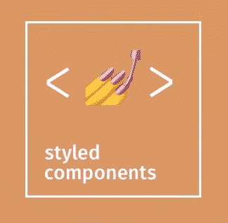

# 使用样式组件的 8 个理由

> 原文：<https://dev.to/bnevilleoneill/8-reasons-to-use-styled-components-3aml>

[](https://res.cloudinary.com/practicaldev/image/fetch/s--VrOPJ-Ee--/c_limit%2Cf_auto%2Cfl_progressive%2Cq_auto%2Cw_880/https://cdn-images-1.medium.com/max/324/1%2A0wLQ0p3qBo1bBt5km_nUXQ.png)

> TL；DR:在本文中，我们将探讨样式化组件的各种好处，以及为什么您应该考虑将它作为首选的 CSS-in-JS 框架。

### 什么是风格化-组件？

[Styled components](http://styled-components.com/) 是一个 **CSS-in-JS** 样式框架，它使用 JavaScript 中的标记模板文字和 CSS 的强大功能来提供一个平台，允许您编写实际的 CSS 来样式化 react 组件。本质上，样式化组件是用[样式化组件](http://styled-components.com)库编写的易于制作的 react 组件，在这个库中，你可以用 javascript 代码中的普通 CSS 来样式化组件。在官方文档页面上，你会看到下面的例子:

```
const Button = styled.a`
  display: inline-block;
  border-radius: 3px;
  padding: 0.5rem 0;
  margin: 0.5rem 1rem;
  width: 11rem;
  background: transparent;
  color: white;
  border: 2px solid white; ${props => props.primary && css`
    background: white;
    color: palevioletred;
  `} `

render(
  <div>
    <Button
      href="https://github.com/styled-components/styled-components"
      target="_blank"
      rel="noopener"
      primary>
      GitHub
    </Button>

    <Button as={Link} href="/docs" prefetch>
      Documentation
    </Button>
  </div>
) 
```

我们可以清楚地看到按钮是一个 JavaScript 变量，反勾号中定义的样式是普通的 CSS 样式。我们还看到嵌套样式属性也有普通的 CSS 样式。这就是样式化组件在 JavaScript 中呈现 CSS 的方式。

我知道 CSS-in-JS 的主题在前端社区，尤其是 react 开发者中引起了激烈的争论，所以我希望你保持开放的心态。

[](https://logrocket.com/signup/)

### 造型反应组件

有许多方法可以设置 react 组件的样式:

*   传统上——在外部 CSS 文件中使用 CSS，然后传递一个字符串作为类名属性来引用它们，如下所示:

```
render() {
  return <span className="menu navigation-menu">Menu</span>
} 
```

如果您曾经使用过大型 web 应用程序，您可以证明 CSS 文件开始变得非常庞大、笨拙和复杂。一个很好的解决方案是引入 SASS，虽然这很有帮助，但是对于一个项目可以拥有的大量 SCSS 文件来说，它开始变成同样的事情，抽象本身甚至开始变得复杂。

*   react 组件中的内联 CSS:

```
const divStyle = {
  color: 'blue',
  backgroundImage: 'url(' + imgUrl + ')',
};

function HelloWorldComponent() {
  return <div style={divStyle}>Hello World!</div>;
} 
```

React 非常不鼓励这样做，因为它不可持续，也不可伸缩(稍后将详细介绍)。

*   CSS-in-JS 是一种使用 JavaScript 来设计组件样式的技术。当解析这个 JavaScript 时，CSS 作为一个样式元素生成，并直接附加在 DOM 之上。有很多 CSS-in-JS 框架:styled-components、emotion、jss、radium、aphrodite 等等，你可以[在这里看到一个比较表](http://michelebertoli.github.io/css-in-js/)。然而，样式组件无疑是最受欢迎的。

这个选项看起来很有前途，难怪在过去的一个月里有超过 60 万次下载的[非常快速的广泛采用](http://www.npmtrends.com/jss-vs-aphrodite-vs-radium-vs-styled-components-vs-glamorous-vs-emotion-vs-styletron)。

### 为什么要使用样式化组件

#### 用 CSS 自由构建定制组件

有了样式化组件，用户界面设计的重点就从仅仅通过 className 对 HTML 元素或 React 组件进行样式化，转移到定义包含它们自己的样式的样式化组件，并且可以在整个项目中轻松地重用。最初的副标题声明是这样的:

```
<h2 className="subTitle">Gucci Snakes </h2> 
```

样式定义如下:

```
h2.subTitle{
  font-size: 2em;
  color: blue;
} 
```

会变成这样:

```
import styled from 'styled-components';
const Subtitle = styled.h2`
  font-size: 2em;
  color: blue;
`;
<Subtitle>Gucci Snakes</Subtitle> 
```

在这里，样式成为组件不可分割的一部分，从而消除了 CSS 类最初通过消除样式和组件之间的映射而扮演的关键角色。这都是用普通的 CSS 构建的，当你使用你已经习惯的东西时，总会有一种熟悉的感觉。这种感觉已经为样式化组件的每个用户小心翼翼地保留了下来，因为语法在很大程度上仍然是普通的 CSS。

#### 内嵌式造型

通常，react 团队不鼓励内联样式，这是一个非常有意义的顾虑，因为内联样式不允许使用伪样式和媒体查询。此外，由于对浏览器兼容性、驼峰式大小写和自动追加标量的大量关注，不应使用内联样式。但是对于样式组件，我们可以看到一种内嵌样式，但是没有前面提到的所有内嵌样式的包袱，我称之为 *vibranium* power。下面是示例代码来演示:

```
const paragraphStyles = {
color: red,
backgroundColor: black,
padding: 2px
}
<p style={paragraphStyles}> inline styles applied here </p> 
```

编译输出:

```
<p style="color: red; background-color: black;">
inline styles applied here </p> 
```

但是使用样式组件…

```
import styled from 'styled-components';
const Text = styled.div`
color: red,
background: black
`
<Text>Styled with CSS-in-JS </Text> 
```

编译输出:

```
<style>
.hash12345tf {
background-color: black;
color: red;
}
</style>
<p class="hash12345tf">Styled with CSS-in-JS</p> 
```

我们还看到了 styled-component 如何在 DOM 上附加一个 style 标记，而 inline style 只是处理 DOM 节点的属性。

#### 原生移动支持

对于拥有 React 代码库并使用 React Native 进行移动开发的团队来说，styled-components 是最好的统一解决方案之一。如果跨平台的一致性是优先考虑的，那么您会很高兴地发现样式化组件可以捆绑到 React Native 中。

在 React Native with styled-components 中，您可以给注释分配别名，使您的 JSX 代码非常易读。此外，您可以通过简单地调用 styled()将任何组件(甚至是定制组件)转换为样式化组件。

#### 作用域样式

在前端工具世界中， [Vue](https://vuejs.org/) 的团队(在我看来)是第一个完善这个范围样式概念的团队。使用 CSS 有一件非常烦人的事情，那就是对于一个非专业的 CSS 用户来说，当你改变样式表中某个特定元素或类的样式时，它会对 DOM 中另一个看似不相关的元素或行为产生负面影响。这是使用样式化组件的一个很好的理由，因为它是基于组件的，范围非常广，就像 Vue 一样。

#### 无阶级政策

样式化组件在类的位置强制使用道具。这种无类别政策帮助他们让更多的开发人员遵循控制组件行为的最佳实践路线。

最初，您应该写:

```
<h2 className="title primary">Hello World</h2>  h2.Subtitle{
  font-size: 2em;
  color: green;

  &.primary{
    color: red;
  }
} 
```

但是现在，应该是这样的:

```
const Subtitle = styled.h2`
  font-size: 2em;
  color: ${props => props.primary ? 'red' : 'green'};
`;
<Subtitle primary>Hello World</Subtitle> 
```

我们看到我们是如何设法将 HTML 和 CSS 操作排除在组件之外的。

或者，您可以随时返回到 className，将会获得相同的结果。

```
const Subtitle = styled.h2`
  font-size: 2em;
  color: green;

  &.primary{
    color: red;
  }
`;
<Subtitle className="primary">Hello World</Subtitle> 
```

#### 服务器端渲染

styled-components 支持并发的服务器端呈现和样式表再水合。基本思想是，每次在服务器上呈现应用程序时，都可以创建一个服务器样式表，并向 react 树添加一个提供程序，该提供程序通过上下文 API 接受样式。

这不会干扰全局样式，如关键帧或*创建全局样式*，并允许您将样式组件与 React DOM 的各种 SSR APIs 一起使用。

#### CSS 单元和快照测试

由于样式化组件确实是组件，单元测试可以在其上运行。这是 CSS 的一个重大突破，styled-component 团队已经提供了 jest 集成支持。

Jest 风格组件是一套用 [Jest](https://github.com/facebook/jest) 测试风格组件的工具。这个包改善了快照测试体验，并提供了一个全新的匹配器来对样式规则做出期望。可以这样安装:

```
npm install --dev jest-styled-components 
```

下面是一个测试的例子:

```
import React from 'react'
import styled from 'styled-components'
import renderer from 'react-test-renderer'
import 'jest-styled-components'
const Button = styled.button`
  color: red;
`
test('it works', () => {
  const tree = renderer.create(<Button />).toJSON()
  expect(tree).toMatchSnapshot()
}) 
```

下面是结果快照的一个例子:

```
exports[`it works 1`] = `
.c0 {
  color: green;
}
<button
  className="c0"
/>
` 
```

#### 萨斯和磨光支持

如果您一直关注这篇文章，那么您一定已经注意到了一些嵌套的样式，Sass，甚至是这个团队为了进一步扩展 Sass 的功能而创建的一个工具集

```
const Link = styled.a`
  cursor: pointer;
  text-decoration: none;
  &:hover {
    color: blue;
    text-decoration: underline;
  }
`; 
```

支持 Sass 暴露了 styled-components 的核心任务，那就是创建完美的 CSS-in-JS 体验，而不失去我们已经喜欢的 CSS 的一切，包括减少代码行和 Sass 的其他优化功能。

### 反对样式化组件的论据

我很难想出很多不使用样式化组件的理由(特别是考虑到文章的标题)，但是如果我不在本文中指出一些(有效的)关于 CSS-in-JS 框架的问题，那将是不公平的。

#### **锁定**

对于样式化组件的每个用户来说，都存在一种嵌套的锁定，您应该对此非常了解并感到舒适。您被锁定在 JavaScript 中，然后被锁定在 React 库中，最后被锁定在样式化组件中。如果它们中的任何一个消失了，你将不得不痛苦地重构你的代码库。

#### **学习曲线**

一些人还指出样式化组件的学习曲线很陡，以及 CSS-in-JS 框架之间的独特差异。我强烈建议使用并坚持使用样式化组件。

#### **连续性问题**

大约两年前开始的风格化组件(Styled-components)和 React 开发人员总是问如果它不再被支持会怎样。在生产中使用它们之前，您必须确保意识到这一点。

#### **个人喜好**

人们不喜欢改变。事实上，这是一个有效的论点，因为单独文档中的 CSS 仍然是 web 开发中持续时间最长的标准之一。

#### **社区关注**

有些人觉得样式组件社区很小，当他们遇到困难的 bug、用例或错误时，他们可能得不到足够的支持和足够快的支持。这也是有效的，但是您必须考虑样式化组件的锁定特性才能理解为什么。

### 结论

围绕 styled-components 有一个大规模增长的社区，[超过 22，000 个⭐️on GitHub，](https://github.com/styled-components/styled-components)大部分来自 React 开发者，这是非常令人鼓舞的，并且谈到了长寿的前景。

它也是非常定期维护的，你可以 [**查看这里**](https://www.styled-components.com/releases) **的发布页面。**如果你是一个 CSS 爱好者，可以 [**看看目前遍布互联网的 CSS 调查**](https://stateofcss.com/?source=announcement) 的这种状态。如果你喜欢阅读，你可以 [**关注我这里**](http://medium.com/@viclotana) 获取更多文章，快乐编码！

* * *

### Plug: [LogRocket](https://logrocket.com/signup/) ，一款适用于网络应用的 DVR

[](https://logrocket.com/signup/)

<figcaption>[https://logrocket.com/signup/](https://logrocket.com/signup/)</figcaption>

LogRocket 是一个前端日志工具，可以让你回放问题，就像它们发生在你自己的浏览器中一样。LogRocket 不需要猜测错误发生的原因，也不需要向用户询问截图和日志转储，而是让您重放会话以快速了解哪里出错了。它可以与任何应用程序完美配合，不管是什么框架，并且有插件可以记录来自 Redux、Vuex 和@ngrx/store 的额外上下文。

除了记录 Redux 操作和状态，LogRocket 还记录控制台日志、JavaScript 错误、堆栈跟踪、带有头+正文的网络请求/响应、浏览器元数据和自定义日志。它还使用 DOM 来记录页面上的 HTML 和 CSS，甚至为最复杂的单页面应用程序重新创建像素级完美视频。

免费试用。

* * *

帖子 [8 个使用样式组件的理由](https://blog.logrocket.com/8-reasons-to-use-styled-components-cf3788f0bb4d/)首先出现在[的博客](https://blog.logrocket.com)上。