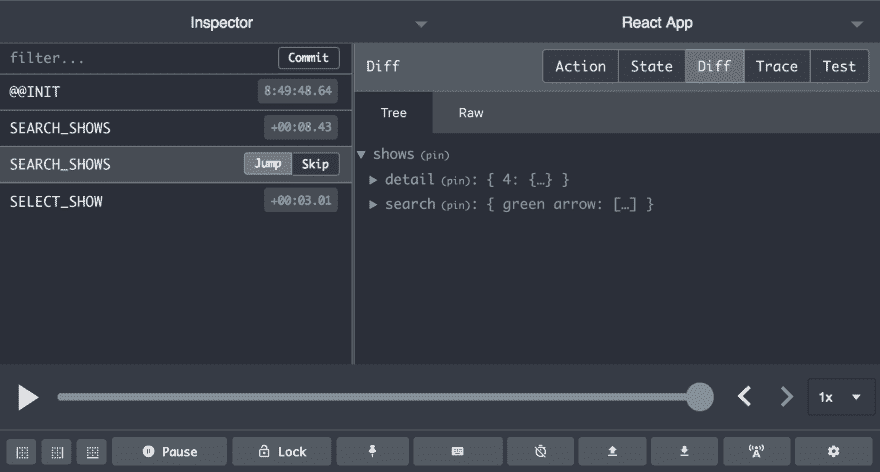
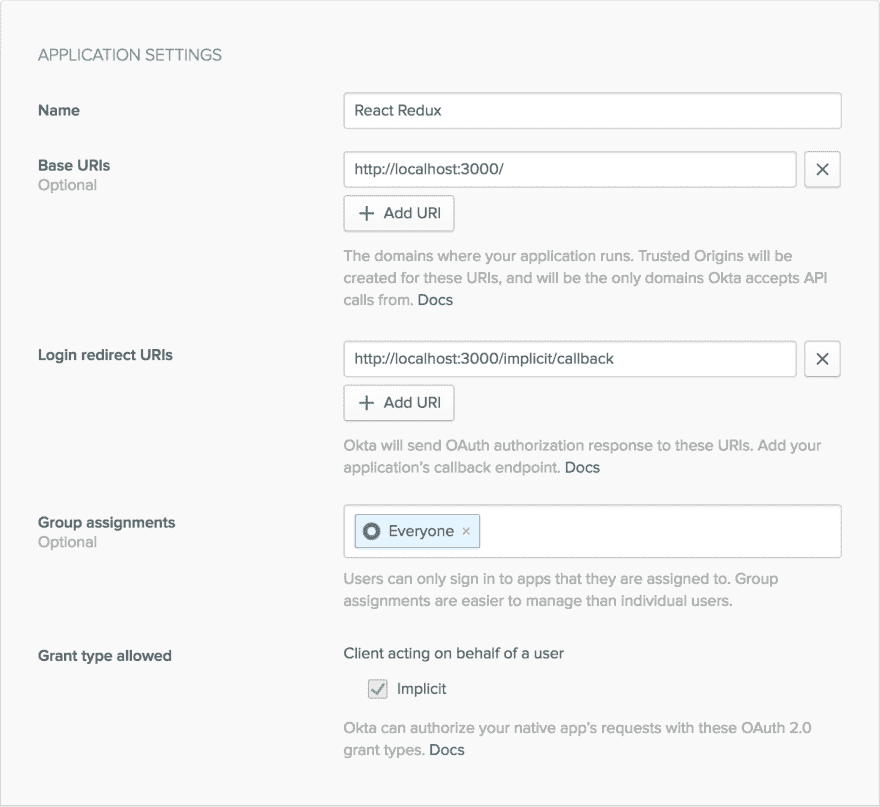
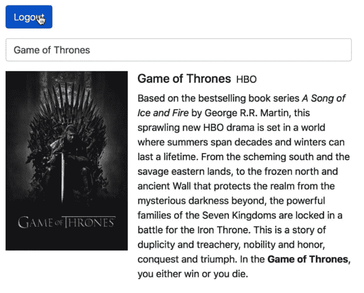

# Redux 初学者指南

> 原文：<https://dev.to/oktadev/a-beginner-s-guide-to-redux-21m2>

React 在过去的几年里变得越来越流行，Redux 是一个经常和它结合在一起的术语。虽然从技术上来说是独立的概念，但它们确实可以很好地协同工作。React 是一个基于组件的框架，通常用于创建单页面应用程序(SPA)，但也可以用于向任何网站添加任何数量的独立组件。Redux 是一个状态管理系统，有一套很棒的开发工具，对调试很有用。今天我将向您展示如何使用 React 和 Redux 创建一个简单的应用程序，以及如何使用 [Okta](https://developer.okta.com/) 进行身份验证来保护您的应用程序。

## 何时用 Redux 搭配 React

React 组件可以接受属性并管理自己的状态。Redux 提供了一个全局的应用程序状态，任何组件都可以链接到这个状态。

Redux 不是每个 app 都需要的。虽然它有自己的优势，但也会增加相当多的复杂性。redux 上也有无数的变体试图简化它，并且有无数的方法来构建所需的文件。通常，在没有很好地理解为什么需要 redux 的情况下，不应该将它添加到任何项目中。以下是 React-Redux 相对于普通 React 方法的一些例子:

*   Redux 给你一个全局状态。当您有需要共享相同状态的深度嵌套组件时，这可能会很有帮助。您可以简单地访问 Redux 存储，而不是沿着组件树向下传递不相关的属性。
*   调试可以简单得多。
    *   您可以将数据倒回特定点，以查看任何给定操作之前或之后的应用程序状态。
    *   可以记录用户在特定时刻采取的所有行动(比如应用崩溃)。
    *   如果状态存储在组件本身之外，热重装会更可靠。
*   业务逻辑可以移动到 Redux 动作中，将业务逻辑从组件中分离出来。

## 在 React 中创建搜索 App

这将是一个非常简单的例子，但希望能让您了解在 React 应用程序中使用 Redux 的一些好处。[电视迷宫](https://www.tvmaze.com)提供查询电视节目的开放 API。我将向您展示如何创建一个应用程序，让您搜索电视节目并显示每个节目的详细信息。

假设您的系统上已经安装了[节点](https://nodejs.org)，接下来您需要确保您已经安装了`yarn`和`create-react-app`，以便完成本教程。您可以使用下面的命令行来安装这两者:

```
npm i -g yarn@1.13.0 create-react-app@2.1.3 
```

现在，您可以使用以下命令快速启动一个新的 React 应用程序:

```
create-react-app react-redux 
```

这将创建一个名为`react-redux`的新目录，为一个框架项目添加一些文件，并安装启动和运行所需的所有依赖项。现在，您可以使用以下命令启动应用程序:

```
cd react-redux
yarn start 
```

## 为 React 应用程序设置 Redux

首先，您需要安装您需要的依赖项。使用以下命令:

```
yarn add redux@4.0.1 react-redux@6.0.0 redux-starter-kit@0.4.3 
```

### Redux 动作

Redux 有几个运动部件。您将需要**动作**，您可以分派这些动作来告诉 redux 您想要执行某个动作。每个动作都应该有一个`type`，以及某种有效载荷。创建一个新文件，`src/actions.js`，代码如下:

```
export const SEARCH_SHOWS = 'SEARCH_SHOWS';
export const SELECT_SHOW = 'SELECT_SHOW';

export const searchShows = term => async dispatch => {
  const url = new URL('https://api.tvmaze.com/search/shows');
  url.searchParams.set('q', term);

  const response = await fetch(url);
  const results = await response.json();

  dispatch({ type: SEARCH_SHOWS, results, term });
};

export const selectShow = (id = null) => ({ type: SELECT_SHOW, id }); 
```

您将使用`redux-thunk`，它允许我们异步处理动作。在上面的例子中，`selectShow`是一个简单的同步动作，它使用给定的 ID 选择一个节目。另一方面，`searchShows`是异步的，所以它不返回 JSON 对象，而是返回一个接受`dispatch`函数的函数。当动作完成时，不是返回有效载荷，而是将它传递给`dispatch`函数。

### Redux 还原器

接下来你需要一个**缩减器**来告诉 redux 一个动作应该如何影响数据存储。Reducers 应该是返回新状态对象的纯函数，而不是改变原始状态。创建一个新文件，`src/reducers.js`，代码如下:

```
import { combineReducers } from 'redux';
import { SEARCH_SHOWS, SELECT_SHOW } from './actions';

const initialShowState = {
  detail: {},
  search: {},
  selected: null,
};

const shows = (state = initialShowState, action) => {
  switch (action.type) {
    case SEARCH_SHOWS:
      const detail = { ...state.detail };
      action.results.forEach(({ show }) => {
        detail[show.id] = show;
      });

      return {
        detail,
        search: {
          ...state.search,
          [action.term]: action.results.map(({ show }) => show.id),
        },
      };
    case SELECT_SHOW:
      return {
        ...state,
        selected: action.id,
      };
    default:
      return state;
  }
};

export default combineReducers({
  shows,
}); 
```

在这个例子中，您有一个`shows`减速器，它的状态将存储在`state.shows`中。通常用这种方法将逻辑分成不同的部分，用`combineReducers`将它们组合起来。

减速器采用当前状态对象。如果状态是`undefined`，这在初始化期间将为真，那么您将想要提供一个默认的或初始的状态。然后，您需要查看动作的`type`,以确定您应该如何处理这些数据。

这里有一个`SEARCH_SHOWS`动作，它将为每个对象更新`detail`缓存，并按 ID 存储一个搜索结果列表。电视迷宫返回的数据看起来像:

```
[
  { score: 14.200962, show: { id: 139, name: "Girls", /* ... */ } },
  { score: 13.4214735, show: { id: 23542, name: "Good Girls", /* ... */ } },
  // ...
] 
```

这在 reducer 中得到了简化，所以每个节目的细节都是通过 ID 存储的，搜索结果只是由搜索项存储的 ID 数组。这将减少内存，因为您不需要为每个搜索项单独复制每个显示细节。

对于`SELECT_SHOW`动作，您只需将`selected`设置为节目的 ID。

如果你不能识别这个动作，你应该返回当前的状态。这很重要，这样国家才不会变成`undefined`。

### Redux Store

现在您已经有了自己的减速器，您可以创建**商店**。这通过`redux-starter-kit`变得容易。许多样板文件已经移入其中，使其可定制，但具有一些非常合理的缺省值(例如包括 Redux Thunk 来处理异步操作，并挂钩到 Redux Devtools 以进行更好的调试)。用下面的代码创建一个新文件`src/store.js`:

```
import { configureStore } from 'redux-starter-kit';
import reducer from './reducers';

export default configureStore({ reducer }); 
```

### React Redux

React 和 Redux 其实是两个独立的概念。为了让 Redux 与你的应用程序一起工作，你需要使用`react-redux`来连接这两个部分(严格来说，使用`react-redux`并不是 100%必要的，但它使事情*变得更加简单*)。将`src/App.js`的内容替换为:

```
import React from 'react';

import { Provider } from 'react-redux';
import store from './store';

const App = () => (
  <div>TODO: Build TV search components</div> );

export default () => (
  <Provider store={store}>
    <App />
  </Provider> ); 
```

`Provider`组件可以访问存储，并使用`context`将其传递给子组件。稍后，组件可以访问存储，即使它被深深地嵌套在 React 树中。

## 为 React 应用程序创建搜索和详细信息组件

在您开始构建组件之前，我将让您再安装一些依赖项。

*   为了让 UI 看起来更体面，不需要做很多工作，你可以使用 [Bootstrap](https://getbootstrap.com/)
*   有一个名为 [React Bootstrap Typeahead](https://github.com/ericgio/react-bootstrap-typeahead#readme) 的搜索组件，只需很少的设置就可以工作，看起来也不错
*   来自 TV Maze 的摘要数据包含一些 HTML，但是直接插入是不好的做法，因为它可能包含一些跨站点脚本攻击。要显示它，你需要一个 HTML 解析器，比如 [React HTML 解析器](https://github.com/wrakky/react-html-parser#readme)，它将原始 HTML 转换成安全的 React 组件。

用下面的命令安装它们:

```
yarn add bootstrap@4.2.1 react-bootstrap-typeahead@3.3.4 react-html-parser@2.0.2 
```

然后，在`src/index.js`中，您需要添加所需的 CSS 导入。您也不再需要来自`create-react-app`的默认 CSS。替换这一行:

```
import './index.css'; 
```

用下面两行:

```
import 'bootstrap/dist/css/bootstrap.min.css';
import 'react-bootstrap-typeahead/css/Typeahead.css'; 
```

### 搜索组件

创建一个新文件`src/Search.js`，包含以下内容:

```
import React, { useState } from 'react';
import { connect } from 'react-redux';
import { AsyncTypeahead } from 'react-bootstrap-typeahead';

import { searchShows, selectShow } from './actions';

const Search = ({ shows, fetchShows, selectShow, onChange }) => {
  const [value, setValue] = useState('');
  const options = (shows.search[value] || []).map(id => shows.detail[id]);

  return (
    <AsyncTypeahead
      autoFocus
      labelKey="name"
      filterBy={() => true}
      onSearch={term => {
        fetchShows(term);
        setValue(term);
      }}
      onChange={selectShow}
      placeholder="Search for a TV show..."
      isLoading={Boolean(value) && !shows.search[value]}
      options={options}
    />
  );
};

const mapStateToProps = state => ({
  shows: state.shows,
});

const mapDispatchToProps = dispatch => ({
  fetchShows: value => dispatch(searchShows(value)),
  selectShow: ([show]) => dispatch(selectShow(show && show.id)),
});

export default connect(
  mapStateToProps,
  mapDispatchToProps
)(Search); 
```

React-Redux 的`connect`函数是将组件连接到 Redux 存储的粘合剂。它需要一个`mapStateToProps`函数，将 Redux 状态转换成将传递给组件的属性。在本例中，它正在获取商店的`shows`子集，其中包含您之前设置的`detail`、`search`和`selected`。

`connect`函数还有一个可选的`mapDispatchToProps`函数，它允许组件接收将分派动作的函数属性。这里，您将获得一个函数`fetchShows`来使用您传入的搜索词搜索节目，另一个函数`selectShow`将告诉 redux 您选择了哪个节目。

来自`react-bootstrap-typeahead`的`AsyncTypeahead`组件给了你几个钩子来触发搜索或选择选项。如果用户已经开始输入，但是 redux 存储还没有任何结果(甚至没有空数组)，那么这会向搜索框添加一个加载图标。

### 细部构件

接下来，为了显示所选节目的详细信息，创建一个新文件`src/Detail.js`，包含以下内容:

```
import React from 'react';
import ReactHtmlParser from 'react-html-parser';
import { connect } from 'react-redux';

const Detail = ({ show }) =>
  show ? (
    <div className="media">
      {show.image && (
        
      )}
      <div className="media-body">
        <h5 className="mt-0">
          {show.name}
          {show.network && <small className="ml-2">{show.network.name}</small>}
        </h5>
        {ReactHtmlParser(show.summary)}
      </div>
    </div>
  ) : (
    <div>Select a show to view detail</div>
  );

const mapStateToProps = ({ shows }) => ({
  show: shows.detail[shows.selected],
});

export default connect(mapStateToProps)(Detail); 
```

如果没有选择节目，您将收到一条简单的消息，要求您先选择一个节目。因为它连接到 redux 商店，所以您可以使用`shows.detail[shows.selected]`获得所选节目的详细信息，如果没有选择节目，那么它将是`undefined`。一旦你选择了一个，你将得到作为`show`道具传入的细节。在这种情况下，您可以显示作品、名称、网络和展览摘要。详细信息中包含了更多的信息，所以如果您想进一步研究详细信息页面，可以显示更多的信息。

### 将组件添加到 React 应用程序中

现在您已经创建了搜索和详细信息组件，您可以将它们绑定到您的应用程序中。回到`src/App.js`，将占位符`App`功能组件(包含`TODO`)替换为以下内容:

```
 <div className="m-3">
    <Search />
    <div className="my-3">
      <Detail />
    </div>
  </div> 
```

您还需要确保导入文件顶部的那些组件:

```
import Search from './Search';
import Detail from './Detail'; 
```

作为参考，下面是这些更改后的完整的`src/App.js`文件:

```
import React from 'react';

import { Provider } from 'react-redux';
import store from './store';

import Search from './Search';
import Detail from './Detail';

const App = () => (
  <div className="m-3">
    <Search />
    <div className="my-3">
      <Detail />
    </div>
  </div> );

export default () => (
  <Provider store={store}>
    <App />
  </Provider> ); 
```

### 利润

你现在应该有一个功能齐全的网络应用程序，你可以搜索电视节目并获得一些细节。

[](https://res.cloudinary.com/practicaldev/image/fetch/s--HSJ2Jm0F--/c_limit%2Cf_auto%2Cfl_progressive%2Cq_auto%2Cw_880/https://thepracticaldev.s3.amazonaws.com/i/aq6kvm6l2a7cbtp63u4f.png)

如果你安装了 [Redux DevTools 扩展](https://github.com/zalmoxisus/redux-devtools-extension#readme)，你还可以回放动作，查看商店中的数据，等等。

[](https://res.cloudinary.com/practicaldev/image/fetch/s--Cn3Uw5NG--/c_limit%2Cf_auto%2Cfl_progressive%2Cq_auto%2Cw_880/https://developer.okta.com/assets-jekyll/blog/react-redux/redux-devtools-7160702853b9321e4f8d87afbaad680856d6f37d95d3ed868bcfa5176534bca3.png)

## 向您的 React Redux 应用添加用户认证

Okta 是一种云服务，允许开发人员创建、编辑和安全存储用户帐户和用户帐户数据，并将它们与一个或多个应用程序连接。如果你还没有，那么[注册一个永远免费的开发者账户](https://developer.okta.com/signup/)。[登录](https://login.okta.com/?SAMLRequest=fc%2B7CsJAEAXQXvAflu1NNJUMeZBGELTx1a%2FrYILJTtyZGD%2FfSBRiYzlw77lMnD3rSj3Qc0ku0YtgrhU6S5fSXRN9PKxmS52l00nMpq6iBvJWCrfDe4ss6vStRe9aDzmGIZfo1jsgwyWDMzUyiIV9vt1AH4XGk5ClSvewUgMNa%2BYW%2FVj5jxhm9NLP67QQaSAMu64L6CYmsFSHlnzT4ZlLwTgcL6Sf8%2FeX9AU%3Dhttps://login.okta.com/?SAMLRequest=fc%2B7CsJAEAXQXvAflu1NNJUMeZBGELTx1a%2FrYILJTtyZGD%2FfSBRiYzlw77lMnD3rSj3Qc0ku0YtgrhU6S5fSXRN9PKxmS52l00nMpq6iBvJWCrfDe4ss6vStRe9aDzmGIZfo1jsgwyWDMzUyiIV9vt1AH4XGk5ClSvewUgMNa%2BYW%2FVj5jxhm9NLP67QQaSAMu64L6CYmsFSHlnzT4ZlLwTgcL6Sf8%2FeX9AU%3D)到你的开发者控制台，导航到**应用**，然后点击**添加应用**。选择**单页应用**，然后点击**下一步**。

因为 Create React App 默认运行在端口 3000 上，所以您应该将其添加为基本 URI 和登录重定向 URI。您的设置应该如下所示:

[](https://res.cloudinary.com/practicaldev/image/fetch/s--YjaN04sh--/c_limit%2Cf_auto%2Cfl_progressive%2Cq_auto%2Cw_880/https://developer.okta.com/assets-jekyll/blog/react-redux/create-new-application-settings-1eea5dcf5802e39730833fd38e6b01329d4e50b523c11791780b3fa012a07799.png)

点击**完成**保存你的应用，然后复制你的**客户端 ID** 并作为一个变量粘贴到你的项目根目录下的一个名为`.env.local`的文件中。这将允许您在代码中访问该文件，而无需在源代码管理中存储凭据。您还需要添加您的组织 URL(不带`-admin`后缀)。环境变量(除了`NODE_ENV`之外)需要以`REACT_APP_`开头，以便 Create React App 读取它们，所以文件应该看起来像这样:

```
REACT_APP_OKTA_ORG_URL=https://{yourOktaDomain}
REACT_APP_OKTA_CLIENT_ID={yourClientId} 
```

您可能需要重新启动服务器才能识别这些更改。您可以找到正在运行的实例，然后点击`ctrl-c`关闭它。然后用`yarn start`再运行一次。

向 React 应用添加 Okta 认证的最简单方法是使用 [Okta 的 React SDK](https://github.com/okta/okta-oidc-js/tree/master/packages/okta-react) 。您还需要添加路由，这可以使用 [React 路由器](https://reacttraining.com/react-router/)来完成。继续添加这些依赖项:

```
yarn add @okta/okta-react@1.1.4 react-router-dom@4.3.1 
```

你现在需要对`src/App.js`进行一些更改。这是最终的输出结果，但是我会详细说明它们的区别:

```
import React, { useState, useEffect } from 'react';
import { BrowserRouter as Router, Route } from 'react-router-dom';
import { Security, ImplicitCallback, withAuth } from '@okta/okta-react';

import { Provider } from 'react-redux';
import store from './store';

import Search from './Search';
import Detail from './Detail';

const App = withAuth(({ auth }) => {
  const [authenticated, setAuthenticated] = useState(null);

  useEffect(() => {
    auth.isAuthenticated().then(isAuthenticated => {
      if (isAuthenticated !== authenticated) {
        setAuthenticated(isAuthenticated);
      }
    });
  });

  return (
    <div className="m-3">
      {authenticated ? (
        <>
          <div className="mb-3">
            <button className="btn btn-primary" onClick={() => auth.logout()}>
              Logout
            </button>
          </div>
          <Search />
          <div className="my-3">
            <Detail />
          </div>
        </>
      ) : authenticated === null ? (
        <h4>Loading...</h4>
      ) : (
        <button className="btn btn-primary" onClick={() => auth.login()}>
          Login to search TV Shows
        </button>
      )}
    </div>
  );
});

export default () => (
  <Provider store={store}>
    <Router>
      <Security
        issuer={`${process.env.REACT_APP_OKTA_ORG_URL}/oauth2/default`}
        client_id={process.env.REACT_APP_OKTA_CLIENT_ID}
        redirect_uri={`${window.location.origin}/implicit/callback`}
      >
        <Route path="/" exact component={App} />
        <Route path="/implicit/callback" component={ImplicitCallback} />
      </Security>
    </Router>
  </Provider> ); 
```

主要的`App`功能组件现在使用一个状态来跟踪用户是否被认证。每当组件呈现时，效果会检查身份验证是否已更改。这确保了如果用户登录或退出，组件将正确更新。因为它用 Okta 的`withAuth`包装，所以它现在可以访问`auth`道具来检查认证。

`App`中的`return`语句的主要部分现在呈现与以前相同的内容，但前提是用户已经过身份验证。在这种情况下，它还添加了一个注销按钮。如果`authenticated`是`null`，这意味着 Okta 还没有告诉你你是否被认证，所以它只是显示一个简单的“加载”文本。最后，如果你没有通过认证，它只会显示一个登录按钮，将你重定向到你的 Okta 组织登录。

默认导出现在用 React 路由器和 Okta 以及 Redux 包装应用程序。这现在允许您使用`withAuth`从上下文中提取认证信息。它还使用 Okta 和 React 路由器来决定是渲染`App`还是重定向你登录或退出。

[](https://res.cloudinary.com/practicaldev/image/fetch/s--h7iJTWDp--/c_limit%2Cf_auto%2Cfl_progressive%2Cq_auto%2Cw_880/https://thepracticaldev.s3.amazonaws.com/i/vx4o0mslubkuv4e3euit.png)

重要的是要记住 Redux 是有限制的。Redux[*的作者写了一段简短但甜蜜的话，你可能不需要 Redux*](https://dev.to/devteam/you-might-not-need-redux-1n2n-temp-slug-6127410) 更详细地介绍了你的应用程序是否应该考虑 Redux，并提供了很好的总结。

## 了解 React、Redux 和安全认证的更多信息

我希望在阅读完这篇教程后，你能更多地了解 Redux 是什么，以及它是如何有用的，尤其是在与 React 搭配使用时。虽然对于小型应用程序来说并不总是必要的，但是我希望您可以看到 Redux 对于具有大量移动部件的大型应用程序来说是一个非常强大的工具。如果想看最终的代码样本做参考，可以在 GitHub 上找到[。](https://github.com/oktadeveloper/okta-react-redux-example)

要获得更多使用 Okta 和 React 的例子，请查看其他一些帖子，或者浏览 Okta 开发者博客。

*   [用 Laravel 和 React 构建一个基本的 CRUD 应用](https://dev.to/blog/2018/12/06/crud-app-laravel-react)
*   [用 Node 和 React 构建一个基本的 CRUD 应用](https://dev.to/blog/2018/07/10/build-a-basic-crud-app-with-node-and-react)
*   [用 Node、React 和 Okta 建立用户注册](https://dev.to/blog/2018/02/06/build-user-registration-with-node-react-and-okta)
*   [在 15 分钟内构建带有用户认证的 React 应用](https://dev.to/blog/2017/03/30/react-okta-sign-in-widget)

如果你对这篇文章有任何问题，请在下面添加评论。更多精彩内容，请在 Twitter 上关注 [@oktadev](https://twitter.com/oktadev) ，就像我们在脸书关注[，或者订阅](https://www.facebook.com/oktadevelopers/)[我们的 YouTube 频道](https://www.youtube.com/channel/UC5AMiWqFVFxF1q9Ya1FuZ_Q)。