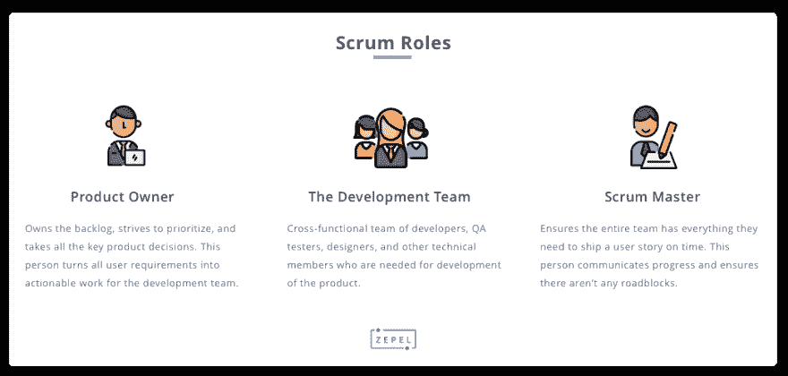
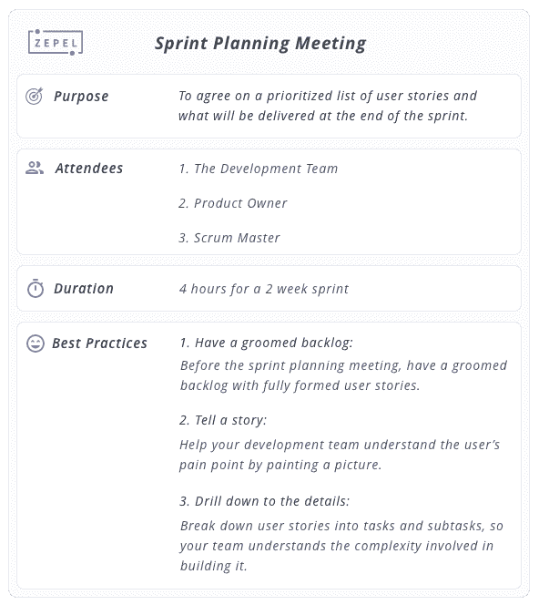
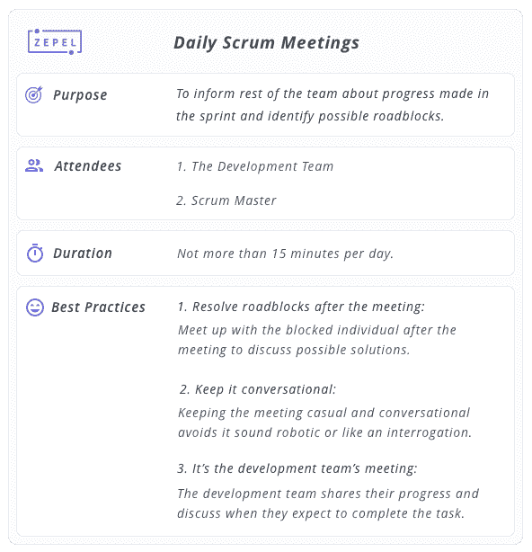
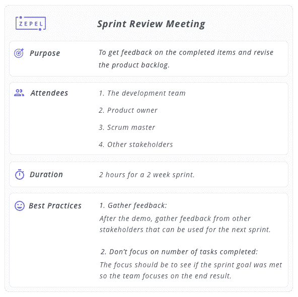
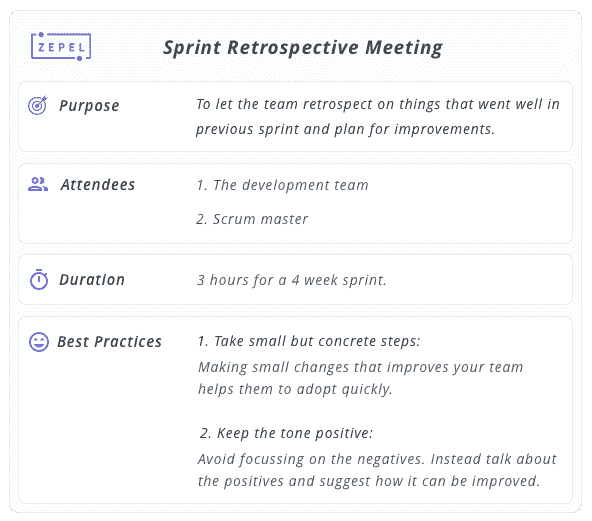

# Scrum 会议的初学者指南以及如何运行它们

> 原文：<https://dev.to/svikashk/a-beginners-guide-to-scrum-meetings-and-how-to-run-them-5cda>

质疑会议的重要性并不新鲜。

有些创意人员——设计师、营销人员和开发人员——一想到参加会议就畏缩不前。此外，还有产品经理、工程主管和高管，他们认为每天参加几次会议是有价值的。

公平地说，两个阵营都有一些相当有说服力的观点。

为了开会而开会，你可能会让你的团队感到沮丧。从计划外的议程到“我为什么要参加这个会议？”以及两者之间的一切，你都听到了...随着生产力开始下降，每次新的会议只会变得更糟。

完全取消会议，当你有重要的[特性优先于](https://blog.zepel.io/prioritize-product-feature-backlog/?utm_source=devto&utm_medium=scrummeetings)时，你将最终拥有一个优化低价值 bug 的团队。

> 如果你有完美的人，而他们完全错位，结果就是零进步。
> 
> ~ Hubspot 创始人 Dharmesh Shah

那么，你如何组织会议，把你的团队聚集在一起，又不会让他们烦得要死呢？

# 介绍 Scrum

十多年来，公司已经采用了 SCRUM 方法及其原则。从那以后，其他公司采用它的兴趣不断增加。

也有很好的理由！

 

<small>随时间争夺利益</small>

Scrum Guide 将 Scrum 定义为一个框架，帮助团队更快更好地交付复杂的产品。Scrum 是轻量级的，易于理解，帮助团队设定期望，有效地合作，并最终推动结果。

说真的，哪个产品经理不希望这样？

如果你发现你周围的人在多个会议上坐着，使用像冲刺、积压和[燃尽图](https://blog.zepel.io/understanding-burndown-charts/?utm_source=devto&utm_medium=scrummeetings)这样的词，你可以肯定他们在团队中遵循 scrum 原则。

“多次会议？会议不是生产力杀手吗？”，我听到你说。

在过去的五年里，会议被认为是扼杀每个人生产力的恶棍。

但事实远非如此。

北卡罗莱纳大学的史蒂文·罗格伯格和他的同事进行的一项研究发现，员工在会议上花费的时间越来越多，并且喜欢抱怨。但私下里，他们将会议视为一种生产力工具——一种公司可以学会更好地使用的工具。

当被问及如何评价会议的效率时，42%的与会者认为会议很好；17%的人认为会议非常好或非常好。

> 成功的组织不会将会议视为必要之恶。相反，他们将它们视为一种战略资源，并寻求最大限度地利用它们的方法。
> 
> ~史蒂文·罗格尔伯格、克里夫·斯科特和约翰·凯洛

但这并不意味着你应该坐着参加持续一整天的会议。当你组织有条理的、有时间限制的、有目的的会议时，他们会是你最好的朋友。

在这篇博文中，我们将会看到什么是 scrum 会议，它们的类型，以及一些最佳实践，这样你就可以从它们中获得最大的价值。

在我们开始之前，让我们先来看看一些你会遇到的常用术语和人员角色。

## 基本的 Scrum 术语

### 1。[产品积压](https://zepel.io/agile/scrum/backlog/)

产品 backlog 是一个列表，列出了构建一个完整产品所需的所有内容，包括特性、增强、用户需求和错误修复。

产品积压从来都不是完整的，它总是随着你和你的团队收集关于用户需求和产品市场的新信息而不断发展。

### 2。[冲刺](https://zepel.io/agile/scrum/sprint/)

sprint 是积压项目的集合，时间限制为一个月(或更短)，目标是发布可用的产品增量版本。

## [Scrum 的基本角色](https://zepel.io/agile/scrum/roles/)

当一家公司决定使用 Scrum 时，首先要理解的事情之一是 Scrum 角色与传统的项目管理角色有什么不同。虽然 Scrum 中只有三个主要角色，但它们不会自动与我们大多数人熟悉的头衔对应起来。

 

<small>三个 scrum 角色</small>

### 1。开发团队

开发团队是由开发人员、QA 测试人员、设计人员和产品实际开发中需要的其他技术成员组成的跨职能团队。

### 2。产品所有者

产品所有者拥有待定项，努力确定优先级，并做出与产品相关的所有关键决策。这个人将所有用户的工作块转移，这样开发团队就可以处理它们了。

### 3。Scrum 大师

scrum master 负责确保整个团队拥有按时构建和交付任务或用户故事所需的一切。这个人经常交流进展，并确保没有任何障碍。

# 那么，scrum 会议有哪些不同的类型？

有四种人渣会议:

1.  [冲刺规划](https://zepel.io/agile/scrum/sprint-planning/)
2.  [每日混战](https://zepel.io/agile/scrum/daily-scrum-standup/)
3.  [冲刺复习](https://zepel.io/agile/scrum/sprint-review/)
4.  [冲刺回顾](https://zepel.io/agile/scrum/sprint-retrospective/)

好消息是，大多数团队已经遵循了这些会议的变体。不幸的是，它们既没有结构，也没有生产力。

互联网上充斥着各种博客帖子，涵盖了从为什么要在会议前发送议程到如何按时结束会议的基本内容。

但是从每次 scrum 会议中获得最大收益的关键不仅仅是在会议前发送议程和遵守时间。

每次 SCRUM 会议都聚焦于实现一个特定的目标，从参加会议的人到最佳实践，一切都会有所不同。

那么，你如何让你的每次 scrum 会议富有成效、有效且高效呢？

让我们跳进去看看。

# 冲刺规划会议

### 什么是冲刺规划会？

sprint 规划会议是团队聚在一起，讨论并同意他们在即将到来的 sprint 中交付什么的会议。

在会议期间，产品负责人解释最高优先级，帮助开发团队理解为什么用户故事是重要的，以及它们将如何影响他们的用户。有了这些知识，开发团队会提出问题以获得更好的理解，并尝试将用户故事分解成可操作的工作片段，并估计构建它需要多长时间。

简而言之，冲刺计划会议的主要目标是带走两件事:

1.  **冲刺目标** -就冲刺结束时要交付的内容达成一致
2.  Sprint backlog -一组优先的用户故事、任务和子任务，将帮助团队在 Sprint 结束时集中精力并交付。

### 谁应该参加冲刺计划会议？

sprint 的所有成员——开发团队、产品负责人和 scrum 主管——都应该参加 sprint 计划会议。

当你在讨论就每个人在冲刺阶段要交付的东西达成一致时，最好是在前进之前听取每个人的意见和观点。毕竟，你不想错过任何边缘案例。

### 一个冲刺规划会议要开多久？

根据 [Scrum 指南](http://www.scrumguides.org/scrum-guide.html)，对于一个月的 sprint，sprint 计划会议的时间限制为 8 小时。如果你的 sprint 短于一个月，那么 sprint 计划会议就按比例减少。

例如，一个两周的冲刺不应该有超过四个小时的冲刺计划会议。

但是这是否意味着你必须花八个小时来计划一个月的冲刺呢？

> 如果会议在规定时间前结束，结束会议并离开！不要试图用其他随意的首要话题来填满时间。
> 
> ~ [对讲机产品副总裁保罗·亚当斯](https://www.intercom.com/blog/towards-better-meetings/)

只要你的团队在即将到来的 sprint 中将交付什么上意见一致，如果你的会议在一个小时后结束也没关系。记住，原则支撑着你的生意。你不应该围着他们转。

### 如何召开有效的冲刺规划会议的最佳实践

**1。准备好待办事项清单:**

在 sprint 计划会议之前，确保待办事项清单中有完整的用户故事和最重要的工作。最好是在 sprint 计划会议前几天，只和产品负责人以及 scrum 主管一起完成。

这允许产品负责人和 scrum master 为可能没有完全成型的用户故事填充细节和上下文，并为 sprint 计划会议做好准备。

**2。讲述一个故事:**

作为一个产品负责人，请记住每一个待办事项都是一个用户故事，而不是一堆功能就能产生巨大的差异，尤其是当你试图向你的开发团队解释它的时候。

向您的开发团队展示用户当前解决方案中的问题发生在哪里，以及为什么这是一个难题，这将帮助他们清楚地了解他们需要做什么。

毕竟，sprint 规划会议是产品负责人说服团队其他成员什么是最高优先级的一种方式。还有什么比讲故事更好的说服人的方法呢？

**3。深入细节:**

当你通过将用户故事分解成任务和子任务，深入到用户故事的细节时，整个团队就知道了构建它的复杂性。此外，将一大块工作分解成小块可操作的工作使得准确评估变得更加容易。

> “当你还没想好要做什么的时候，你就不知道要花多长时间。”
> 
> ~ Stack Overflow 首席执行官乔尔·斯波尔斯基

 

<small>冲刺策划会议总结</small>

# 每日 Scrum 会议

### 什么是每日 scrum 会议？

每日 scrum 会议(或每日站立会议)是大多数团队已经遵循的最常见的会议类型。顾名思义，这个会议每天都在一个冲刺阶段召开。

每日站立会议不是状态会议，而是揭示障碍并给团队一个在为时已晚之前解决它们的机会的会议。

这次会议的主要目标是与团队的其他成员分享朝着 sprint 目标(在 sprint 规划会议上决定的)取得的进展，并确定可能的障碍。

站立会议如何揭示障碍？很高兴你问了。在站立会议期间，开发团队的每个成员轮流回答:

1.  我昨天做了什么帮助开发团队实现了 Sprint 目标？
2.  我今天将做什么来帮助开发团队实现 Sprint 目标？
3.  我是否看到了任何阻碍我或开发团队实现 Sprint 目标的障碍？

回答这些问题有助于团队了解谁在做什么，并揭示某人是否无法在分配给他们的任务上取得进展。

### 谁应该参加每日的 scrum 会议？

每天的 scrum 会议是为开发团队和 scrum 大师准备的。当有需要或依赖时，产品所有者和其他利益相关者可以在场。

### 每日 scrum 会议应该持续多长时间？

与其他 scrum 会议不同，每日 scrum 会议是最短的。这个会议不应该持续超过 15 分钟，scrum master 的角色就是确保它保持这样。

### 如何进行有效的每日 scrum 会议的最佳实践

**1。保持对话:**

每日站立会议的问题是，当你试图回答这三个问题时，它会很快变成机器人。更糟糕的是，如果有人问问题，而你在回答他们，这听起来就像是一种审问。

分享更新，就像你在喝咖啡休息时谈论你发现的一项有趣的技术一样——友好地交谈。

**2。这是开发团队的会议:**

虽然其他成员可以出席会议，但是每日的 scrum 会议是为开发团队准备的。scrum master 在会议中的角色是确保其他成员不会扰乱会议，并保证会议在 15 分钟的时间内进行。

**3。会后解决障碍:**

在会议期间，当你发现问题时，你很容易想先解决它们。但那只会延长你的站立会议。

当你发现可能的障碍时，一定要单独记下来。在会议结束时，与受阻的个人会面，详细讨论手头的问题，以找到解决方案，进行调整或重新规划。

 

<small>每日 Scrum 会议总结</small>

# 冲刺评审会议

### 什么是冲刺回顾会？

在 sprint 评审会议期间，开发团队会集中精力展示 sprint 期间完成的所有工作。该会议为所有其他利益相关者提供了一个查看特性的机会，以便他们可以检查和提问。

把 sprint 回顾会议想象成周五的一次非正式演示，在那里你向人们演示你完成的特性/产品并回答问题。然而，取决于你的公司是如何建立的，这个会议也可以更正式，产品负责人解释在 sprint 中哪些任务已经完成(哪些没有完成),而开发团队展示它们。

sprint 评审会议的目标是获得对已完成项目的反馈，并对产品待办事项列表进行足够的修改，使其成为下一个 sprint 的可能待办事项列表。

### 谁应该参加冲刺评审会议？

产品负责人、scrum master 和开发团队是必须参加 sprint 评审会议的人。但是，其他关键利益相关者，如客户/测试客户、销售团队成员和其他业务主管也可以参加这个会议。

### 一个冲刺评审会议应该开多久？

因为这个会议的目的是展示一个完成的特性并获得反馈，所以对于一周的 sprint 来说，这个会议不应该持续超过一个小时。

这意味着，如果你的 sprint 是四周的，sprint 回顾会议不应该持续超过四个小时。

### 关于如何召开有效的冲刺评审会议的最佳实践

**1。关注目标，而不是任务数量:**

说实话……你的团队在冲刺阶段几乎总会有一些任务没有完成。他们毕竟也是人。

在冲刺评审会议期间，重点应该是看是否达到了总体冲刺目标(在冲刺计划会议期间决定的)，而不是检查了多少任务。

**2。收集反馈:**

给那些对你所构建的内容一无所知(或知之甚少)的人做一个演示，这是获得可行反馈的最简单的方法。

在会议期间，产品负责人应该主动提出问题并收集反馈，以便在未来的 sprints 中使用。

 

<small>冲刺评审会议总结</small>

# 冲刺回顾会

### 什么是冲刺回顾会？

sprint 回顾会议是让开发团队回顾 sprint，检查自己，并计划可以用于未来 sprint 的改进。

这个会议在 sprint 回顾之后，下一次 sprint 计划会议开始之前召开。在 sprint 回顾会议结束时，开发团队应该已经确定了可以在下一次 sprint 中实现的改进。

本次会议的目的是:

1.  检查之前的 sprint 在人员、关系、工具和流程方面进展如何。
2.  找出进展顺利的项目，看看哪里还有改进的空间。
3.  建立一个关于如何改进开发团队工作方式的计划。

这里有 5 个 [sprint 回顾想法](https://zepel.io/agile/scrum/5-sprint-retrospective-ideas-templates/)让你的回顾变得有趣。

### 谁应该参加 sprint 回顾会？

scrum master 和开发团队在这个会议上合作，试图找到可以改进的地方。

产品负责人是可选的与会者，没有其他利益相关者参加此会议。

### 一个 sprint 回顾会应该开多久？

一个月的冲刺回顾会议最多持续三个小时。对于更短的冲刺，这个会议通常会更短。

### 如何召开有效的 sprint 回顾会议的最佳实践

**1。采取小而具体的步骤:**

做出改进需要团队做出改变。改变总是很难，尤其是为了好的事情。

寻找可以被团队快速采用的小的、增量的改进。

**2。保持积极的语气:**

当检查需要改进的领域时，通过关注消极方面和为什么它们不应该首先出现，很容易开始指责。

通过关注前一次冲刺中进展顺利的积极方面，并指出它可以改进，你有助于为整个会议设定积极的基调，避免可能富有成效的会议变成咆哮的会议。

 

<small>冲刺回顾会总结</small>

# 结论

在过去的五年里，几乎每一个和我们交谈过的团队都加入了使用 Slack 这样的工具和他们的团队交流的行列。如果你想向你的队友询问更多关于某项任务的信息或请求一份报告，这是很好的方法。

但是，当涉及到集体决定你的团队在下一次冲刺中要发布什么，或者让他们积极向上以赶上一个重要的截止日期时，沟通工具只是哭泣。

虽然如果会议没有组织好，没有时间限制，对你的团队来说可能是不好的，但是当最佳实践被遵循并根据你的团队的需要进行调整时，会议可能是你最好的朋友。

scrum 会议可以让你做到这一点。

如果你的团队是 scrum、scrum 会议和跑步冲刺的新手，这个指南希望能给你足够的信息，这样你就可以在你的团队里用一个礼物开始一个新的冲刺。

