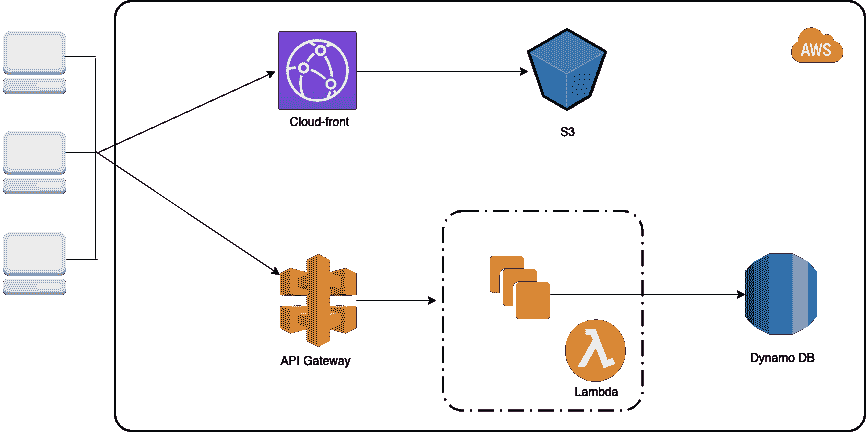
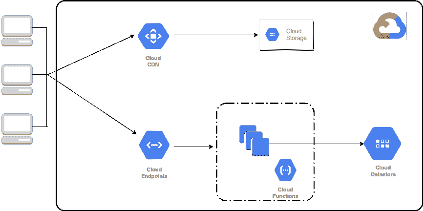

# 无服务器、Faas 和无服务器网络架构初学者指南

> 原文：<https://dev.to/yloganathan/a-beginners-s-guide-to-serverless-faas-and-serverless-web-architecture-1b86>

最近，我们到处都在听说无服务器，这是从整体服务器到微服务再到无服务器的自然发展。

我最喜欢的无服务器的定义来自城市词典

`The name of a fad everyone loves to hate. Where the architectural model is shifted from running processes to running functions with *no control* or need to integrate with the operating system.`

为什么没有控制权会有如此大的争议？正如任何权衡一样，答案是:视情况而定。更少的控制也意味着更少的责任，那么更少的控制总是坏事吗？如果您正在部署简单、无状态、非 CPU 密集型的应用程序，那么无服务器架构有一个巨大的优势:敏捷性。模板化和可重复使用的部分让我们可以非常快速地开发实验性应用，而无需承担管理和修补任何基础设施的责任

## 微服务 vs 无服务器

微服务和无服务器的一个很大区别是它们的执行生命周期。当无服务器功能在需要时激活、执行和终止时，微服务应该总是可用的。

IaaC —基础设施即服务就像是租用土地并在上面停放一辆房车来居住。你拥有房车和里面所有的东西让它适合居住。

PaaC —平台即服务就像是租一栋房子并住在里面。房主负责打理房子及其装修，而租房者则让房子适合居住。

FaaC —功能即服务就像是当您需要一个住宿的地方时就住在酒店房间里。

## 使用无服务器的理由

*   只为它执行的时间付费。
*   我们的服务不需要一直运行。
*   提高开发速度。易于构建和部署。
*   自动缩放。
*   平台无关。只需构建业务逻辑，并将其转移到任何平台提供商。

## 不使用无服务器的理由

*   将应用程序分解成小功能可能并不总是最好的解决方案。
*   如果有一个状态需要在函数之间交换，函数间的通信和一些昂贵的管道是必要的。
*   复杂的错误处理可能很困难。维护数百个功能时会有更多的运营开销。
*   使用本地库很困难，不推荐使用。
*   内存、CPU 和网络受限于所提供的内容。

## 什么时候使用无服务器？

如果我们有一个简单的、无状态的、非 CPU 密集型的应用程序，就非常适合无服务。AWS 建议在以下用例中使用 lambdas

### 数据处理解决方案

*   文件处理
*   流处理

### 后端

*   IOT
*   移动的
*   网

## 无服务器 web app 架构

我搜索了使用无服务器部署简单 web 应用程序的参考架构，找到了下面的架构

### 前端:

*   保存所有网络资产(html、css、js、图片)的存储服务。
*   管理网站缓存和可用性的分发系统。
*   将自定义域映射到云分发系统的 DNS 服务。

### 无服务器后端:

*   公开 API 的 API 网关。
*   执行业务逻辑的无服务器功能。
*   数据库保持状态。—数据库可以是 SQL 或文档/键值数据库。选择取决于您与存储中的数据交互的方式。如果我们检索信息的方式总是相同的，那么像 dynamodb 这样的文档数据库就非常有用。看马丁·福勒在 noSQL 上的演讲就能有所了解。

这种三层架构与提供商无关，可以用于谷歌云平台或 Azure 云服务或 IBM Open Whisk。

## Google 云平台中的无服务器架构

## 选择哪个服务商？

大多数无服务器提供商都有类似的解决方案和功能。最有效的解决方案将取决于您、您的团队和组织对应用程序的了解和需求。如果您没有任何限制，我建议您开始使用 AWS。

|  | 自动气象站λ | 谷歌云功能 | Azure 函数 |
| --- | --- | --- | --- |
| 定价 | 1M/月免费 | 2M/免费月 | 1M/月免费 |
| 语言 | Node.js，Python，Java，。网 | JavaScript(许多处于测试阶段) | Node.js，Python，PHP，C#，F# |
| 扳机 | API，S3，DynamoDB | 任何 GCF 服务(firebase、分析、发布/订阅、存储) | API，Cron，Azure 事件，Azure |
| 最大执行时间 | 15 分钟 | 1 分钟- 9 分钟(升级) | 5 分钟- 10 分钟(升级) |
| 并发 | 1000 次处决 | HTTP 不限。1000 次处决 | 无限的 |

## 如果我们需要更多的开源解决方案，该怎么办

你被盖住了。有许多开源的无服务器解决方案！

*   [铁功能](http://open.iron.io/)
*   [Fn 项目](https://fnproject.io/)
*   [网络任务](https://webtask.io/docs/101)
*   [Nuclio](https://github.com/nuclio/nuclio)
*   [Openfaas](https://github.com/openfaas/faas)

Rohit Akiwatkar 写了一篇关于无服务器[开源解决方案的综合文章。](https://hackernoon.com/serverless-and-open-source-where-do-we-stand-today-dff8aec67026)

## 参考文献

1.  [采用 AWS Lambda 的无服务器架构](https://d1.awsstatic.com/whitepapers/serverless-architectures-with-aws-lambda.pdf)
2.  [AWS 多层架构](https://d0.awsstatic.com/whitepapers/AWS_Serverless_Multi-Tier_Archiectures.pdf)
3.  [比较无服务器提供商](https://www.altexsoft.com/blog/cloud/comparing-serverless-architecture-providers-aws-azure-google-ibm-and-other-faas-vendors/)
4.  [无服务器和开源——我们现在处于什么位置](https://hackernoon.com/serverless-and-open-source-where-do-we-stand-today-dff8aec67026)

接下来:[了解 AWS Lambda](https://dev.to/yloganathan/understanding-aws-lambda-4ia4)