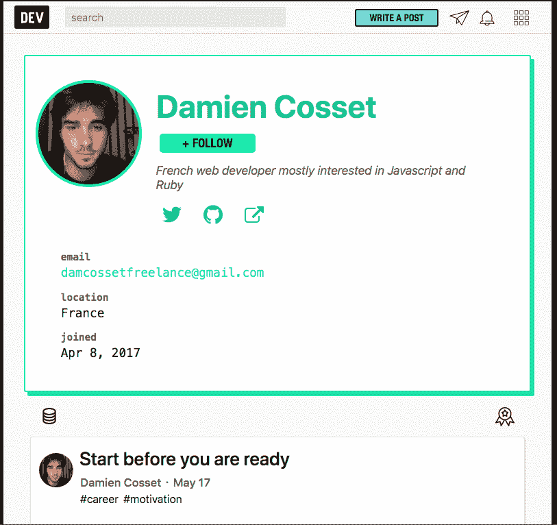
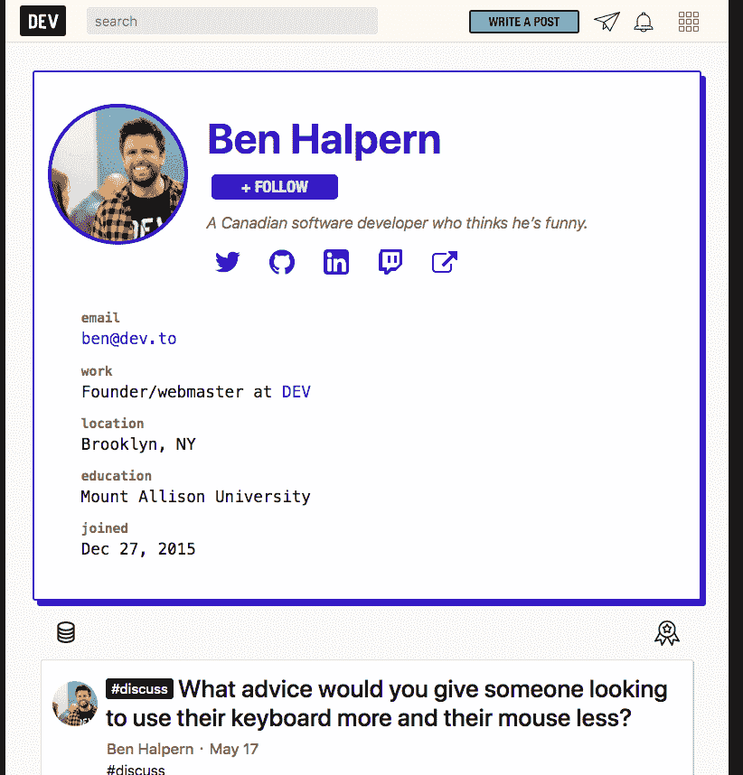

# 一个命令行应用程序:用 puppeteer 抓取 dev.to

> 原文：<https://dev.to/damcosset/a-command-line-application-scraping-dev-to-with-puppeteer-149k>

# 简介

对于我的 InvoiceMaker 应用程序，我使用了[木偶师](https://github.com/GoogleChrome/puppeteer)来生成 PDF。我非常喜欢这个工具的简单性，为了展示您可以使用 Puppeteer 做的许多事情，我想我应该做一个小应用程序。

## 木偶师能做什么？

根据 Github 自述文件，以下是 Puppeteer 可以帮助您的一些事情:

[](https://res.cloudinary.com/practicaldev/image/fetch/s--jknXCzWj--/c_limit%2Cf_auto%2Cfl_progressive%2Cq_auto%2Cw_880/https://thepracticaldev.s3.amazonaws.com/i/jzq910akp878ho6n9a9v.png)

木偶师是一个工具，它使刮网变得更加容易。这是 Chrome 浏览器的一个无头实例(所以 Chrome 浏览器，没有 UI)。网络抓取是指你查阅一个网站并从中提取数据。

## 我们要建造什么

因此，我们将构建一个小的命令行应用程序。这篇文章将确保我们现在可以做两件事:

*   给定一个用户名，生成该用户个人页面的截图。
*   给定一个用户名，检索用户写的最后一篇文章，并将其生成为 PDF。

## 设置

因此，让我们创建一个名为 *cli-scraping* 的文件夹。在它里面，运行 *yarn init* (或者 *npm init* ，但是我在这里将使用 yarn。).接受默认值并创建一个 *index.js* 文件。然后，运行*纱线添加操纵器*。最后，在 *cli 中创建两个文件夹——抓取* : *截图——用户*和*pdf*。让我们开始编码吧。

## 获取命令行参数

我们将使用 *process.argv* 来获取我们提供的参数。它将返回一个至少包含两个元素的数组。让我们试试:

```
console.log(process.argv) 
```

Enter fullscreen mode Exit fullscreen mode

当我运行`node index.js`时，我进入我的控制台:

```
[ '/usr/local/Cellar/node/11.4.0/bin/node',
  '/Users/Damien/Desktop/javascript/scraping/index.js' ] 
```

Enter fullscreen mode Exit fullscreen mode

你会得到不同的结果，但是你会得到 2 个元素。第一个是使用的运行时(这里是节点 v11.4.0)，第二个是脚本的路径。因此，我们给出的每个参数都将从 process.argv[2]开始。如果我运行`node index.js blabla`，process.argv[2]将会是`blabla`。好吗？很好很容易。现在我们知道如何检索参数了。让我们继续木偶戏。

## 生成截图

为了生成屏幕截图，我们将使用下面的代码:

```
 (async () => {
    // Launching an instance of a headless Chrome browser
    const browser = await puppeteer.launch()

    // Create a new page
    const page = await browser.newPage()

    // Move to the specified url
    await page.goto('urlToThePage')

    // Take a screenshot and save it at the specified path
    await page.screenshot({ path: 'screenshot.png' })

    // Close the browser
    await browser.close()
} 
```

Enter fullscreen mode Exit fullscreen mode

好吧，那我们需要做什么？

*   创建一个函数来包装这个功能。
*   从命令行调用该函数
*   为该功能提供适当的数据(页面 url、用户名)

我将在我的应用程序中使用以下约定:第一个参数是函数名，第二个是用户名。因此，代码可能是:

```
const puppeteer = require('puppeteer')

const getScreenshot = async username => {
    const browser = await puppeteer.launch()
    const page = await browser.newPage()
    await page.goto(`https://dev.to/${username}`)
    await page.screenshot({ path: `screenshots-users/${username}.png`, fullPage: true })
    await browser.close()
}

switch (process.argv[2]) {
    case 'getScreen':
        getScreenshot(process.argv[3])
        break
    default:
        console.log('Wrong argument!')
} 
```

Enter fullscreen mode Exit fullscreen mode

首先，我们进口木偶师。然后，我们创建我们的 *getScreenshot* 函数，它将负责生成我们的屏幕截图。函数的框架已经在前面看到了。请注意一些变化:

*   *page.goto* 使用提供的用户名获取正确的开发到 url。
*   *page . snapshot*将 PNG 文件放在截图文件夹中，用户名作为文件名。注意 *fullPage: true* 来获取完整页面。

最后，我们有一个 switch 语句。我使用 *getScreen* 作为参数名来生成截图。

太好了，现在我可以运行`node index.js getScreen damcosset`来获取我的个人资料截图了。而且我可以在截图-用户文件夹里看到截图名为 damcosset.png:

*注意:我是为了节省空间而对截图进行了裁剪，但是截图中有整个页面；)*

[](https://res.cloudinary.com/practicaldev/image/fetch/s--ja5106qi--/c_limit%2Cf_auto%2Cfl_progressive%2Cq_auto%2Cw_880/https://thepracticaldev.s3.amazonaws.com/i/s92z743eo8t6zmzfzx3c.png)

现在让我们运行`node index.js getScreen ben`，我们将在名为 ben.png 的文件夹中获得以下截图:

[](https://res.cloudinary.com/practicaldev/image/fetch/s--Djbq1kDc--/c_limit%2Cf_auto%2Cfl_progressive%2Cq_auto%2Cw_880/https://thepracticaldev.s3.amazonaws.com/i/brahspzgnc7tn7w4ihr1.png)

## 生成 PDF

为此，我们有三个不同的步骤:

1-转到用户个人页面
2-点击她写的最后一篇文章导航到那里
3-检索一个属性以确保我们的 pdf 名称是唯一的(我猜是可选的)
4-生成 PDF

让我们创建一个名为 *getPDF* 的函数。里面的代码应该是这样的:

```
 const getPDF = async username => {
    const browser = await puppeteer.launch()
    const page = await browser.newPage()
    await page.goto(`https://dev.to/${username}`)

    await Promise.all([page.waitForNavigation(), page.click('.single-article')])
    const dataPath = await page.evaluate(() =>
        document.querySelector('.article').getAttribute('data-path')
    )
    await page.pdf({ path: `pdfs/${dataPath.split('/')[2]}.pdf` })

    await browser.close()
} 
```

Enter fullscreen mode Exit fullscreen mode

前三行总是相同的，初始化，新页面，转到...然后，我们有一个*承诺。我们在这里等待两个动作:*

*   点击文章卡片。
*   然后，文章所在的页面需要加载

我们需要在这里探索页面的 HTML 内容。在开发工具中，我可以看到用户个人页面中的每篇文章都有一个名为*单篇文章*的类。这就是我们的目标。为此，我们将使用*页面。单击*功能，并给它那个选择器。

这将针对带有选择器的第一个元素，因为 dev.to 首先呈现您的新文章，所以这正是我要找的。

接下来，当我研究 HTML 结构时，我看到每篇文章都包含在一个带有 *article* 类的 div 中。这个元素有一个*数据路径*属性。通过使用 *page.evaluate* ，我可以得到那个节点，然后检索这个属性。这将确保在保存我们的 pdf 时不会有冲突。

最后，我将调用*page.pdf*，并在选项中给它一个路径。我检索的数据路径给出了类似于`/username/title-article-000`的内容，所以我只是将它分割成最后一部分。

最后，不要忘记在我们的 switch 语句中添加一个案例:

```
switch (process.argv[2]) {
    case 'getScreen':
        getScreenshot(process.argv[3])
        break
    case 'getPDF':
        getPDF(process.argv[3])
        break
    default:
        console.log('Wrong argument!')
} 
```

Enter fullscreen mode Exit fullscreen mode

搞定了。现在，我们可以运行以下命令:

`node index.js getPDF damcosset`
`node index.js getPDF ben`
T2】

因此，这将创建一个 headless Chrome 浏览器的实例，转到我的页面，单击我写的最后一篇文章，转到该页面，并创建一个包含该页面内容的 PDF。杰西也是，本也是。

所以，现在我有 3 个 pdf 在我的*pdf*文件夹中，叫做:

```
start-before-you-are-ready-393e.pdf (Mine)

what-advice-would-you-give-someone-looking-to-use-their-keyboard-more-and-their-mouse-less-1lea.pdf (Ben)

what-was-your-win-this-week-3a9k.pdf (Jess) 
```

Enter fullscreen mode Exit fullscreen mode

Tadaaaaaaaa！

代码可以在[这里](https://github.com/Tagada85/cli_scraping)找到。

# 结论

好了，这是第一部分。木偶师是一个非常有趣的工具，我会回来向你展示更多我们可以用它做的神奇的事情。

玩得开心< 3