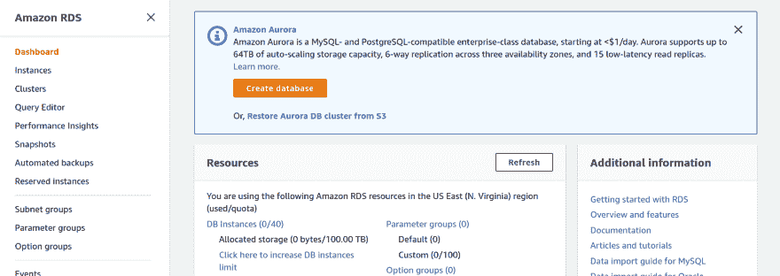
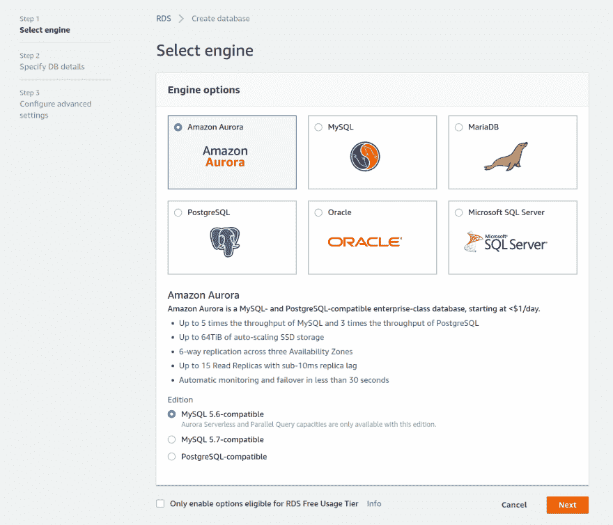
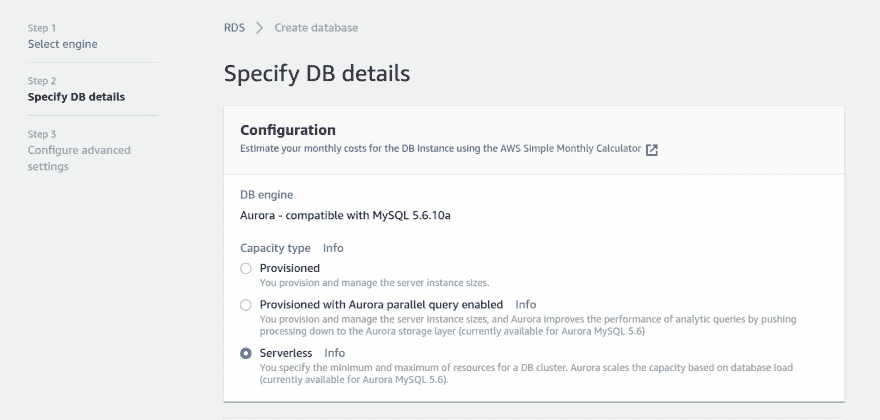
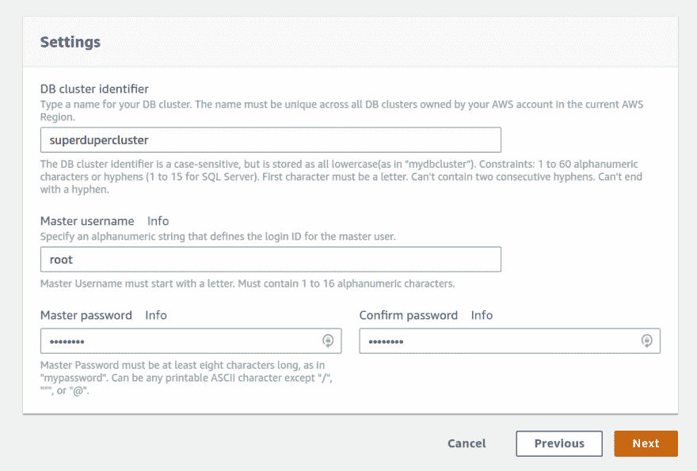
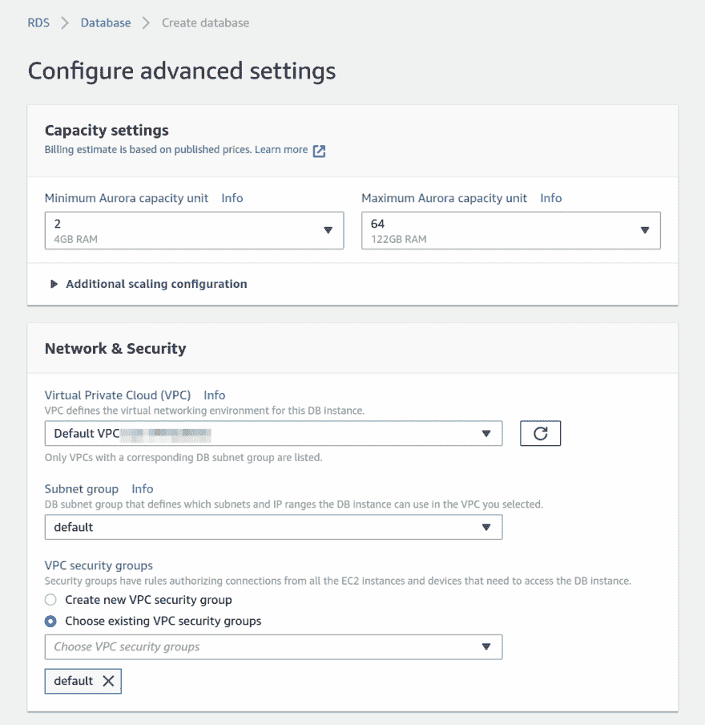
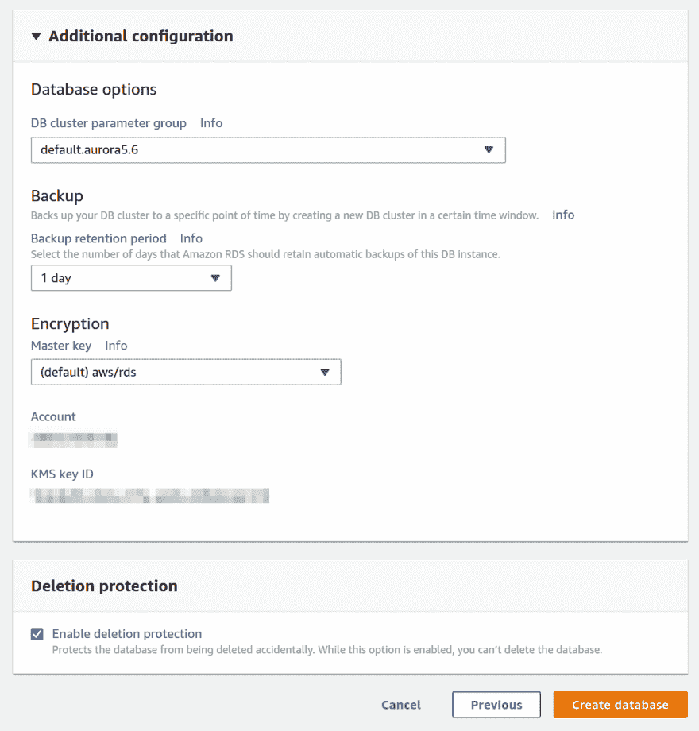
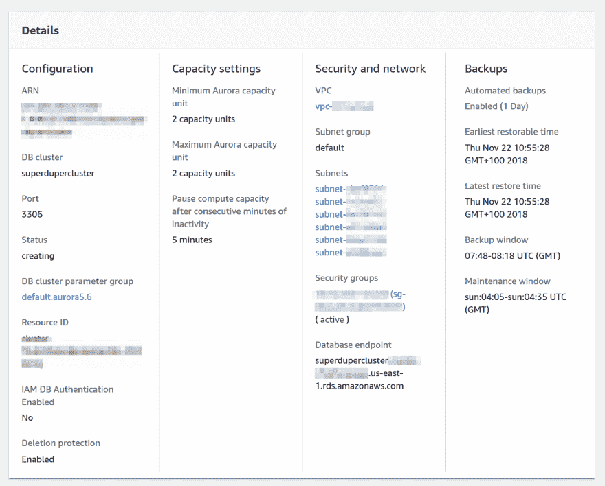
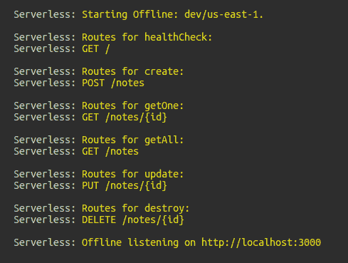
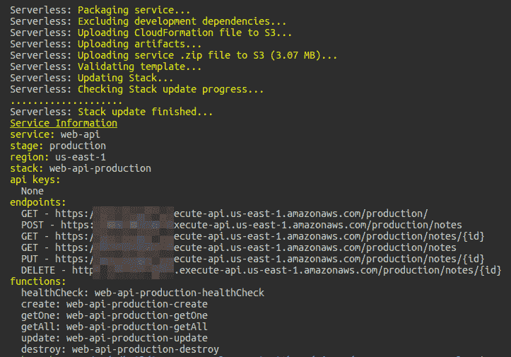

# AWS 无服务器速成班——用 Lambda 和 Aurora 无服务器构建 API

> 原文：<https://dev.to/adnanrahic/a-crash-course-on-serverless-with-aws---building-apis-with-lambda-and-aurora-serverless-3fn3>

自从 AWS 做出了一个无服务器选项 [AWS RDS Aurora 普遍可用](https://aws.amazon.com/blogs/aws/aurora-serverless-ga/)，我就一直坐在座位的边缘，急切地期待着所有各种各样的可能性。这将意味着构建无服务器架构的突破。不再使用 SQL 管理连接池。不再担心可用连接的上限。这使得使用无服务器进行数据库密集型操作变得可行。

我不久前写了一篇文章解释如何用 MongoDB 构建一个无服务器 API。但是，我看到了一个模式。即使数据库实例可以承担负载，系统中较高的吞吐量也会导致连接减少，因为可用连接的数量有限。

### TL；速度三角形定位法(dead reckoning)

我用 MongoDB 重构了这个例子，以使用 SQL。关于您使用哪个数据库提供者是不可知的，但是我将在这里展示的例子是使用 [AWS Aurora 无服务器](https://aws.amazon.com/rds/aurora/serverless/)。在这里查看[的代码](https://github.com/adnanrahic/serverless-docker-image-resize)，或者如果你想继续学习如何自己设置一切，请继续阅读。

## 我们要做什么？

本文将向您展示如何将 MySQL 数据库作为服务连接到无服务器 API。我们将使用 AWS RDS 创建一个数据库集群，并配置 Aurora 无服务器。这个设置最棒的地方在于，你可以根据你使用服务的多少来付费。甚至数据库！这是理想的无服务器场景。

## 如果你是新手，该怎么办？

我们来分解一下基本的。我们将使用 AWS Lambda 作为计算服务。AWS Lambda 函数基本上是一个容器。一旦 Lambda 被调用，容器就开始旋转并运行代码。这是我们想要初始化数据库连接的时候，第一次调用函数，第一次初始化容器。对 lambda 函数的每个后续请求都将使用现有的数据库连接。一旦我把它分解，听起来很简单。让我们跳进来。

## 配置项目

我假设你已经对无服务器框架有了基本的了解。我也希望你有一个 AWS 帐户设置。如果你不知道，[请看看这个](https://hackernoon.com/a-crash-course-on-serverless-with-node-js-632b37d58b44)。

### 1。创建服务

一如既往，我们需要一个新的服务来保存我们所有的代码。

```
$ sls create -t aws-nodejs -p web-api && cd web-api 
```

Enter fullscreen mode Exit fullscreen mode

运行这个命令，您将得到一个很好的样板文件来开始开发您的函数。它将设置基本功能和事件触发器。你也可以看到我们马上进入了`web-api`目录。我们跳转到这个目录来设置所需的依赖项。

### 2。安装模块

总之，我们只需要三个依赖项。MySQL ORM 调用 Sequelize 处理连接和映射关系，调用`serverless-offline`进行本地开发。

确保你在 **web-api** 目录中。首先安装`serverless-offline`，然后安装`mysql2`和`sequelize`。

```
$ npm init -y
$ npm i --save-dev serverless-offline
$ npm i --save mysql2 sequelize 
```

Enter fullscreen mode Exit fullscreen mode

就这样，让我们暂时离开终端，跳到 AWS 来创建一个数据库集群。

### 3。在 AWS RDS 上创建数据库

我一直讨厌通过 web 控制台设置资源，但这是必要的。跟我来，跳到你的 AWS 账户，选择 [RDS](https://aws.amazon.com/rds/) 。你会看到一个和这个类似的页面。

[](https://res.cloudinary.com/practicaldev/image/fetch/s--fnBIZUx7--/c_limit%2Cf_auto%2Cfl_progressive%2Cq_auto%2Cw_880/https://raw.githubusercontent.com/adnanrahic/cdn/master/building-a-serverless-api-with-nodejs-and-aws-aurora-serverless/rds-1.png)

单击橙色的 Create Database 按钮，然后继续操作。

[](https://res.cloudinary.com/practicaldev/image/fetch/s--UAzt1Cv---/c_limit%2Cf_auto%2Cfl_progressive%2Cq_auto%2Cw_880/https://raw.githubusercontent.com/adnanrahic/cdn/master/building-a-serverless-api-with-nodejs-and-aws-aurora-serverless/rds-select-engine.png)

首先，您将选择想要使用的引擎。选择亚马逊极光，点击下一步。

[](https://res.cloudinary.com/practicaldev/image/fetch/s--OP0HsTHA--/c_limit%2Cf_auto%2Cfl_progressive%2Cq_auto%2Cw_880/https://raw.githubusercontent.com/adnanrahic/cdn/master/building-a-serverless-api-with-nodejs-and-aws-aurora-serverless/rds-create-1.png)

一旦您指定了引擎，将 Aurora 配置为**无服务器**，向您的集群添加一个名称，并配置主用户名和密码。

[](https://res.cloudinary.com/practicaldev/image/fetch/s--njJfn0nF--/c_limit%2Cf_auto%2Cfl_progressive%2Cq_auto%2Cw_880/https://raw.githubusercontent.com/adnanrahic/cdn/master/building-a-serverless-api-with-nodejs-and-aws-aurora-serverless/rds-create-2.png)

只需再配置一组高级设置，您就应该设置好了。

[](https://res.cloudinary.com/practicaldev/image/fetch/s--w1omZKUd--/c_limit%2Cf_auto%2Cfl_progressive%2Cq_auto%2Cw_880/https://raw.githubusercontent.com/adnanrahic/cdn/master/building-a-serverless-api-with-nodejs-and-aws-aurora-serverless/rds-advanced-config-1.png)

在这里，您将设置容量和网络。因为 Aurora Serverless 位于 VPC 内，所以您必须配置访问权限。在这里，您选择默认的 VPC。

[](https://res.cloudinary.com/practicaldev/image/fetch/s--dNTSn9Tc--/c_limit%2Cf_auto%2Cfl_progressive%2Cq_auto%2Cw_880/https://raw.githubusercontent.com/adnanrahic/cdn/master/building-a-serverless-api-with-nodejs-and-aws-aurora-serverless/rds-advanced-config-2.png)

有了额外的配置，你就可以随心所欲地设置你的备份了。一旦你对这一切感到满意，按下橙色的**创建数据库**按钮。

最后，它将开始调配群集。您将被重定向并看到如下所示的输出。

[](https://res.cloudinary.com/practicaldev/image/fetch/s--qzBTddC8--/c_limit%2Cf_auto%2Cfl_progressive%2Cq_auto%2Cw_880/https://raw.githubusercontent.com/adnanrahic/cdn/master/building-a-serverless-api-with-nodejs-and-aws-aurora-serverless/rds-cluster-created-1.png)

但是，我们感兴趣的是细节部分。

[](https://res.cloudinary.com/practicaldev/image/fetch/s--ycXTfSVQ--/c_limit%2Cf_auto%2Cfl_progressive%2Cq_auto%2Cw_880/https://raw.githubusercontent.com/adnanrahic/cdn/master/building-a-serverless-api-with-nodejs-and-aws-aurora-serverless/rds-cluster-created-2.png)

在这里，您可以访问安全组和子网。您需要将它们添加到 [AWS Lambda](https://aws.amazon.com/lambda/) 函数中，以便它们能够与数据库通信。下一节将详细介绍这一点。

***注**:如果你想访问 AWS Aurora 无服务器集群，请跟随[本教程](https://www.jeremydaly.com/aurora-serverless-the-good-the-bad-and-the-scalable/)学习如何使用 CLI，或者[本官方教程由 AWS](https://aws.amazon.com/getting-started/tutorials/configure-connect-serverless-mysql-database-aurora/) 通过 [Cloud9](https://aws.amazon.com/cloud9/) 连接。您需要连接到集群并手动创建一个数据库，因为 Sequelize 不能为您创建它们。*

Statsbot 的工程师向我展示了 [AWS RDS](https://aws.amazon.com/rds/) 在处理海量数据时有多棒。传言称他们正在创建一个完全[的无服务器开源分析框架](https://github.com/statsbotco/cubejs-client)，名为 [Cube.js](https://statsbot.co/cubejs/) 。我渴望自己开始使用它。希望 Aurora Serverless 能有所帮助。

## 编写代码

在 AWS 上配置数据库资源总是很困难，尤其是新的无服务器数据库产品。幸运的是，配置部分已经结束了。现在我们需要在 **serverless.yml** 文件中为我们的无服务器资源编写配置，并将实际的 CRUD 方法添加到 **handler.js** 中。

### 4。配置 YAML

无服务器框架对建立初始项目结构有很大帮助。当你开始工作时，它可以提供你需要的几乎所有东西。跳回到创建无服务器项目的目录，并在您喜欢的代码编辑器中打开它。

先打开 **serverless.yml** 文件，喘口气。在这里，您将看到一堆带有示例配置的注释。我喜欢干净的代码，所以让我们把它全部删除，然后贴上这段代码。

```
service: web-api

custom:
  secrets: ${file(secrets.json)}

provider:
  name: aws
  runtime: nodejs8.10
  timeout: 30
  stage: ${self:custom.secrets.NODE_ENV}
  environment: 
    NODE_ENV: ${self:custom.secrets.NODE_ENV}
    DB_NAME: ${self:custom.secrets.DB_NAME}
    DB_USER: ${self:custom.secrets.DB_USER}
    DB_PASSWORD: ${self:custom.secrets.DB_PASSWORD}
    DB_HOST: ${self:custom.secrets.DB_HOST}
    DB_PORT: ${self:custom.secrets.DB_PORT}
  vpc:
    securityGroupIds:
      - ${self:custom.secrets.SECURITY_GROUP_ID}
    subnetIds:
      - ${self:custom.secrets.SUBNET1_ID}
      - ${self:custom.secrets.SUBNET2_ID}
      - ${self:custom.secrets.SUBNET3_ID}
      - ${self:custom.secrets.SUBNET4_ID}

functions:
  healthCheck:
    handler: handler.healthCheck
    events:
      - http:
          path: /
          method: get
          cors: true
  create:
    handler: handler.create
    events:
      - http:
          path: notes
          method: post
          cors: true
  getOne:
    handler: handler.getOne
    events:
      - http:
          path: notes/{id}
          method: get
          cors: true
  getAll:
    handler: handler.getAll
    events:
     - http:
         path: notes
         method: get
         cors: true
  update:
    handler: handler.update
    events:
     - http:
         path: notes/{id}
         method: put
         cors: true
  destroy:
    handler: handler.destroy
    events:
     - http:
         path: notes/{id}
         method: delete
         cors: true

plugins:
  - serverless-offline 
```

Enter fullscreen mode Exit fullscreen mode

让我们一点一点地分解它。`provider`部分包含关于云提供商的所有基本信息。还包括关于运行时、函数超时、环境变量和 VPC 配置的数据。这里需要 VPC 设置，因为 AWS Aurora Serverless 只能在 VPC 后面运行，所以您需要将您的 [AWS Lambda 函数放在同一个 VPC](https://docs.aws.amazon.com/lambda/latest/dg/vpc.html) 中，以便访问数据库。

继续，在顶部有一个`custom`部分，我们在这里加载环境变量，然后将它们传递给`environment`部分。

最后说一下**功能**部分。我们一共增加了 6 个函数: **healthCheck** ， **create** ， **getOne** ， **getAll** ， **update** ，以及 **destroy** 。它们都指向 **handler.js** 文件中同名的导出函数。他们的事件触发器被挂接到 HTTP 事件，这些事件由 [AWS API 网关](https://aws.amazon.com/api-gateway/)处理。也就是说，对指定路径的 HTTP 请求将触发被引用的函数。

差不多就这些了，最后就是增加一个插件部分和 **serverless-offline** 。我们在上面安装了这个模块，在部署到 AWS 之前，我们将用它来测试服务。

### 5。添加秘密

你在 **serverless.yml** 中看到我们引用了一个秘密文件。在继续之前，我们需要创建它，并确保它正确地加载了我们的秘密。

在项目的根目录下创建一个`secrets.json`并将这个片段粘贴进去。

```
{  "DB_NAME":  "test",  "DB_USER":  "root",  "DB_PASSWORD":  "root",  "DB_HOST":  "127.0.0.1",  "DB_PORT":  3306,  "NODE_ENV":  "dev",  "SECURITY_GROUP_ID":  "sg-xx",  "SUBNET1_ID":  "subnet-xx",  "SUBNET2_ID":  "subnet-xx",  "SUBNET3_ID":  "subnet-xx",  "SUBNET4_ID":  "subnet-xx"  } 
```

Enter fullscreen mode Exit fullscreen mode

这种设置非常适合本地开发环境。一旦你想把它部署到 AWS 上，你就必须添加你自己的秘密。AWS Aurora Serverless 将输出如上图所示的所有内容。这里重要的秘密是数据库连接参数、安全组 ID 和子网 ID。

这就是关于 YAML 的一切。接下来我们来玩玩 **handler.js** 吧。最后，一些真正的代码！

### 6。充实功能

首先，我们将定义 6 个函数。它们将描述我们想要的初始布局和行为。一旦完成，我们将使用  移动并创建数据库连接和数据库交互逻辑。

切换到 **handler.js** 文件。您将看到默认的样板文件。你猜怎么着？全部删除，添加下面的代码。

```
module.exports.healthCheck = async () => {
  await connectToDatabase()
  console.log('Connection successful.')
  return {
    statusCode: 200,
    body: JSON.stringify({ message: 'Connection successful.' })
  }
}

module.exports.create = async (event) => {
  try {
    const { Note } = await connectToDatabase()
    const note = await Note.create(JSON.parse(event.body))
    return {
      statusCode: 200,
      body: JSON.stringify(note)
    }
  } catch (err) {
    return {
      statusCode: err.statusCode || 500,
      headers: { 'Content-Type': 'text/plain' },
      body: 'Could not create the note.'
    }
  }
}

module.exports.getOne = async (event) => {
  try {
    const { Note } = await connectToDatabase()
    const note = await Note.findById(event.pathParameters.id)
    if (!note) throw new HTTPError(404, `Note with id: ${event.pathParameters.id} was not found`)
    return {
      statusCode: 200,
      body: JSON.stringify(note)
    }
  } catch (err) {
    return {
      statusCode: err.statusCode || 500,
      headers: { 'Content-Type': 'text/plain' },
      body: err.message || 'Could not fetch the Note.'
    }
  }
}

module.exports.getAll = async () => {
  try {
    const { Note } = await connectToDatabase()
    const notes = await Note.findAll()
    return {
      statusCode: 200,
      body: JSON.stringify(notes)
    }
  } catch (err) {
    return {
      statusCode: err.statusCode || 500,
      headers: { 'Content-Type': 'text/plain' },
      body: 'Could not fetch the notes.'
    }
  }
}

module.exports.update = async (event) => {
  try {
    const input = JSON.parse(event.body)
    const { Note } = await connectToDatabase()
    const note = await Note.findById(event.pathParameters.id)
    if (!note) throw new HTTPError(404, `Note with id: ${event.pathParameters.id} was not found`)
    if (input.title) note.title = input.title
    if (input.description) note.description = input.description
    await note.save()
    return {
      statusCode: 200,
      body: JSON.stringify(note)
    }
  } catch (err) {
    return {
      statusCode: err.statusCode || 500,
      headers: { 'Content-Type': 'text/plain' },
      body: err.message || 'Could not update the Note.'
    }
  }
}

module.exports.destroy = async (event) => {
  try {
    const { Note } = await connectToDatabase()
    const note = await Note.findById(event.pathParameters.id)
    if (!note) throw new HTTPError(404, `Note with id: ${event.pathParameters.id} was not found`)
    await note.destroy()
    return {
      statusCode: 200,
      body: JSON.stringify(note)
    }
  } catch (err) {
    return {
      statusCode: err.statusCode || 500,
      headers: { 'Content-Type': 'text/plain' },
      body: err.message || 'Could destroy fetch the Note.'
    }
  }
} 
```

Enter fullscreen mode Exit fullscreen mode

我可以理解你认为这是一个巨大的片段。别担心。这些只是 6 个基本的`async`功能。`connectToDatabase()`函数解析为包含所有数据库模型的对象。在本教程中，我们将只实现`Note`模型。该函数背后的逻辑将连接到 SQL 数据库，缓存该连接，并确保在现有连接处于活动状态时不再重试连接。

但是等等，我们还没有定义或创建这些。嗯，我是故意这样做的，我首先想让你看到这并不复杂，与用 Node.js 和 Express 创建 API 也没有什么不同。

### 7。添加数据库连接

添加数据库连接是我们的下一步。当 AWS Lambda 函数第一次被调用时，这被称为冷启动，AWS 将启动一个容器来运行代码。这是我们连接到数据库的时候。所有后续请求都将使用现有的数据库连接。从概念上讲，这很容易理解，但是当我们需要在代码中理解它的时候就很难了。这里什么都没有！

在服务的根目录下创建一个新文件，就在 **handler.js** 旁边。给它起一个很有逻辑的名字 **db.js** ，并添加下面的代码。

```
const Sequelize = require('sequelize')
const NoteModel = require('./models/Note')
const sequelize = new Sequelize(
  process.env.DB_NAME,
  process.env.DB_USER,
  process.env.DB_PASSWORD,
  {
    dialect: 'mysql',
    host: process.env.DB_HOST,
    port: process.env.DB_PORT
  }
)
const Note = NoteModel(sequelize, Sequelize)
const Models = { Note }
const connection = {}

module.exports = async () => {
  if (connection.isConnected) {
    console.log('=> Using existing connection.')
    return Models
  }

  await sequelize.sync()
  await sequelize.authenticate()
  connection.isConnected = true
  console.log('=> Created a new connection.')
  return Models
} 
```

Enter fullscreen mode Exit fullscreen mode

在顶部，我们需要`Sequelize`和`NoteModel`。

***注意**:我们还没有创建模型，但是等一下，我们会在这部分之后马上开始。*

然后我们初始化`sequelize`，传入连接变量并建立连接。调用`NoteModel`将初始化模型，然后我们将它传递给一个`Models`常量。任意的`connections`对象只是用作连接的*缓存*。如果没有必要，确保不要同步数据库。使用`.sync()`和`.authenticate()`方法的第二个原因是确保在处理任何业务逻辑之前，在初始函数调用期间建立数据库连接。

随着 **db.js** 文件的创建，让我们在 **handler.js** 中要求它。只需将这段代码添加到处理程序的顶部。

```
const connectToDatabase = require('./db') // initialize connection

// simple Error constructor for handling HTTP error codes
function HTTPError (statusCode, message) {
  const error = new Error(message)
  error.statusCode = statusCode
  return error
} 
```

Enter fullscreen mode Exit fullscreen mode

### 8。添加注释模型

跳回 **handler.js** 。您可以看到我们在函数中调用了`const { Note } = await connectToDatabase()`来检索数据，但是没有定义 Note 模型。好吧，现在正是时候。

在服务根目录下创建一个新文件夹，并将其命名为 **models** 。在其中创建另一个文件，命名为 **Note.js** 。这将只是一个简单的模型定义。

```
module.exports = (sequelize, type) => {
  return sequelize.define('note', {
    id: {
      type: type.INTEGER,
      primaryKey: true,
      autoIncrement: true
    },
    title: type.STRING,
    description: type.STRING
  })
} 
```

Enter fullscreen mode Exit fullscreen mode

就是这样。是时候尝试一下了。

***注意**:一定要把你的`secrets.json`添加到你的`.gitignore`文件中。*

## 来点测试怎么样？

我们准备好测试 API 了。为了确保安全，让我们从本地运行开始。需要考虑的一件小事是，在运行`serverless-offline`时，我们需要添加一个标志。

```
$ sls offline start --skipCacheInvalidation 
```

Enter fullscreen mode Exit fullscreen mode

***注意:**无服务器离线使节点每次运行时都需要缓存，默认情况下，我们添加这个标志来禁用它。在 Node.js 中，当您`require()`一个模块时，它存储该模块的一个缓存版本，这样所有对`require()`的后续调用都不必从文件系统重新加载该模块。*

一旦您在终端中运行了该命令，您应该会看到类似这样的内容。

[](https://res.cloudinary.com/practicaldev/image/fetch/s---OLkzLKH--/c_limit%2Cf_auto%2Cfl_progressive%2Cq_auto%2Cw_880/https://raw.githubusercontent.com/adnanrahic/cdn/master/building-a-serverless-api-with-nodejs-and-aws-aurora-serverless/sls-offline-start.png)

我们所有的路线都正常运行。使用[失眠症](https://insomnia.rest/)，我用 JSON 主体创建了一个 POST 请求给`http://localhost:3000/notes`。

[](https://res.cloudinary.com/practicaldev/image/fetch/s--nAq0ayfN--/c_limit%2Cf_auto%2Cfl_progressive%2Cq_auto%2Cw_880/https://raw.githubusercontent.com/adnanrahic/cdn/master/building-a-serverless-api-with-nodejs-and-aws-aurora-serverless/insom-1.png)

检查终端，您可以看到`=> using new database connection`被记录，这意味着初始数据库连接已经建立。发送另一个 POST 请求，你会看到`=> using existing database connection`被记录。

太棒了，添加一个新笔记很有效。让我们使用 **getAll** 方法检索我们刚刚添加的所有注释。

[](https://res.cloudinary.com/practicaldev/image/fetch/s--E5Fv_geH--/c_limit%2Cf_auto%2Cfl_progressive%2Cq_auto%2Cw_880/https://raw.githubusercontent.com/adnanrahic/cdn/master/building-a-serverless-api-with-nodejs-and-aws-aurora-serverless/insom-2.png)

自己尝试其他端点。你玩完了就回来。

## 部署到 AWS

现在到了棘手的部分。确保记下您将在 AWS Aurora 无服务器控制台中获得的所有数据库参数，当然还有安全组 ID 和子网 ID。通常，您有一个安全组和三个子网。但是，它可能会有所不同，所以不要担心。获得值后，将它们添加到您的`secrets.json`中。就是这样！你已经准备好部署了。

无服务器框架使部署变得快速而轻松。你需要做的就是运行一个命令。

```
$ sls deploy 
```

Enter fullscreen mode Exit fullscreen mode

它将自动在 AWS 上提供资源，打包并将所有代码推送到 S3，然后从那里发送到 Lambdas。终端应该显示类似如下的输出。

[](https://res.cloudinary.com/practicaldev/image/fetch/s--yp2RWaFj--/c_limit%2Cf_auto%2Cfl_progressive%2Cq_auto%2Cw_880/https://raw.githubusercontent.com/adnanrahic/cdn/master/building-a-serverless-api-with-nodejs-and-aws-aurora-serverless/sls-deploy.png)

***注意**:您可以使用提供的端点从上面重复测试过程。但是，对冷启动时间要有耐心。AWS Aurora 无服务器大约需要 10 秒钟才能启动。类似的问题也出现在 VPC 的 AWS Lambda 上。*

这就是部署流程的全部内容。简单对吗？这就是我如此热爱无服务器框架的原因。

## 包装完毕

这是一个不断发展的架构。随着无服务器关系数据库的兴起，创建完全无服务器基础设施的可能性是无限的。我已经尽力解释了创建一个合适的 API 的过程。希望你已经学到了很多。享受深入挖掘无服务器架构的可能性以及随之而来的一切吧！

当然，[这里是回购](https://github.com/adnanrahic/building-a-serverless-api-with-nodejs-and-aws-aurora-serverless)再一次，如果你想让更多人在 GitHub 上看到它，给它一颗星。如果你想阅读我以前的一些无服务器思考，请前往[我的简介](https://dev.to/adnanrahic)或[加入我的无服务器时事通讯！](https://upscri.be/b6f3d5/)

我在 AWS Aurora Serverless 上玩得很开心。希望你们喜欢读它，就像我喜欢写它一样。如果你喜欢它，拍一下那个小独角兽，这样 dev.to 上会有更多的人看到这篇文章。如果你需要一个[无服务器 SQL 分析框架](https://statsbot.co/)，不要忘记给 Cube.js 的读者一些爱！直到下次，保持好奇，玩得开心。

* * *

[](https://bit.ly/adnan-zeet)

免责声明: [Zeet](https://bit.ly/adnan-zeet) 将在下个月赞助这篇博客。前几天我试过了。这就像无服务器，但运行整个后端。你可以自动托管和扩展应用。相当整洁。

* * *