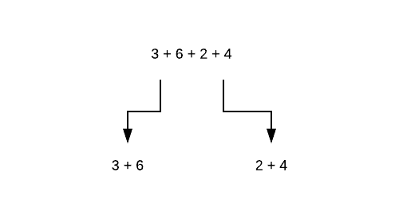
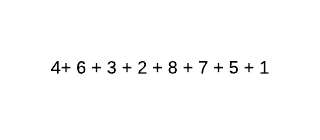
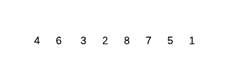
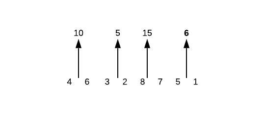
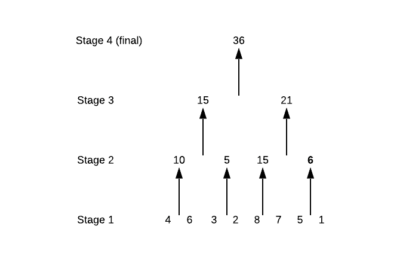
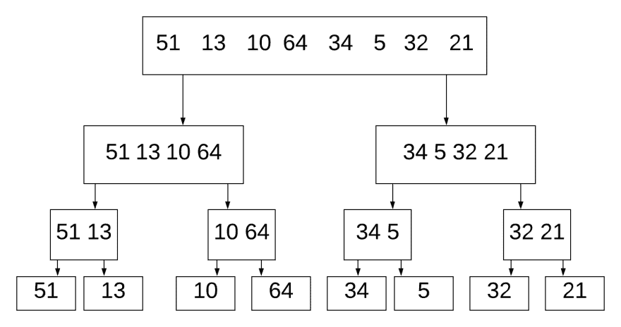
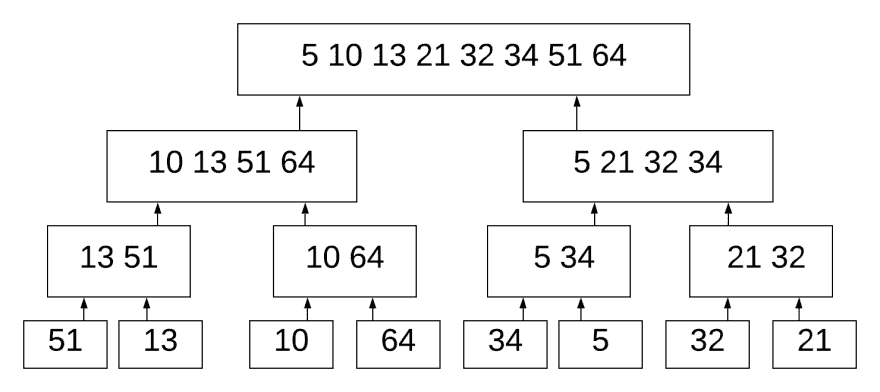
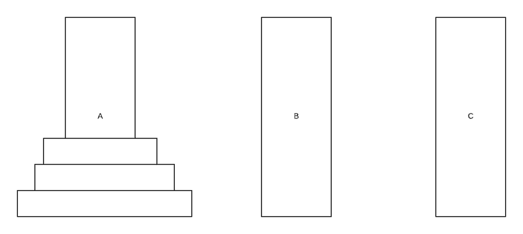
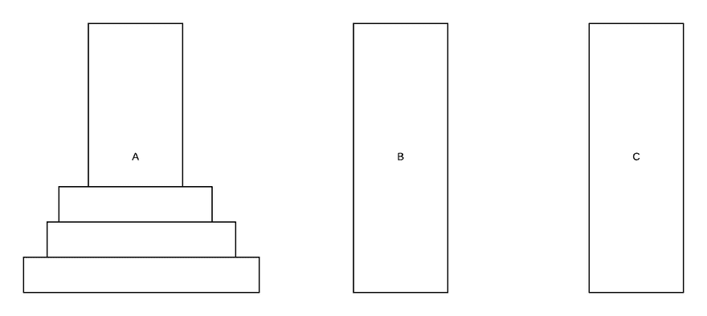
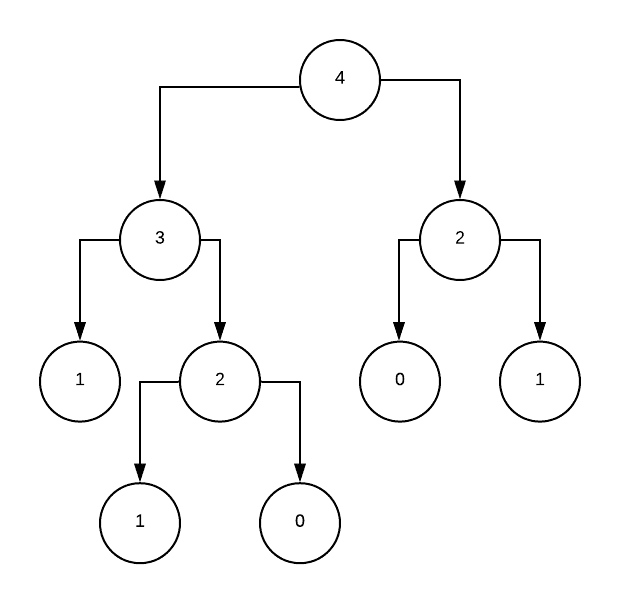

# 分治算法的简明介绍

> 原文：<https://dev.to/brandonskerritt/a-gentle-introduction-to-divide-and-conquer-algorithms-1ga>

分而治之算法在编程教科书中并没有真正教授，但这是每个程序员都应该知道的。分治算法是并发和多线程的基础。

我经常听说如何优化 for 循环以使其更快，或者 switch 语句比 if 语句稍快。大多数计算机都有不止一个内核，能够支持多线程。在担心优化 for 循环或 if 语句试图从不同的角度攻击您的问题之前。

分而治之是从不同角度解决问题的方法之一。在整篇文章中，我将讨论如何创建分而治之的解决方案以及它是什么。如果你对这个话题毫无经验或知识，也不要担心。这篇文章是为没有多少编程知识的人设计的。

我将用三个例子来解释这一点。首先是简单的解释。第二个是一些代码。期末考试将进入分而治之技术的数学核心。(别担心，我也讨厌数学)。

没有时间看这个？ [登录](https://pages.convertkit.com/f01a7359c0/8d197d69e0)到我的电子邮件列表获取 PDF 格式的文件。你还会得到一些本帖中没有的额外内容✨ [在这里注册。](https://pages.convertkit.com/f01a7359c0/8d197d69e0)

## 什么是分而治之？🌎

分而治之就是把一个大问题分成许多更小的、更容易解决的问题。下面这个相当小的例子说明了这一点。

[](https://res.cloudinary.com/practicaldev/image/fetch/s--SH7zC_ey--/c_limit%2Cf_auto%2Cfl_progressive%2Cq_auto%2Cw_880/https://skerritt.blog/conteimg/2019/03/Blank-Diagram-14-.png)

我们采用等式“3 + 6 + 2 + 4”，并将其缩减为最小可能的等式集，即[3 + 6，2 + 4]。也可以是[2 + 3，4 + 6]。顺序并不重要，只要我们把这个长方程变成许多更小的方程。

假设我们有 8 个数字:

[](https://res.cloudinary.com/practicaldev/image/fetch/s--HukMCSn5--/c_limit%2Cf_auto%2Cfl_progressive%2Cq_auto%2Cw_880/https://skerritt.blog/conteimg/2019/03/Blank-Diagram-43-.png)

我们想把它们加在一起。我们首先把问题分成 8 个相等的子问题。我们通过将加法分解成单个的数字来实现这一点。

[](https://res.cloudinary.com/practicaldev/image/fetch/s--VaDyiTvZ--/c_limit%2Cf_auto%2Cfl_progressive%2Cq_auto%2Cw_880/https://skerritt.blog/conteimg/2019/03/image-33.png)

然后我们开始一次加两个数。

[](https://res.cloudinary.com/practicaldev/image/fetch/s--b_DZemFo--/c_limit%2Cf_auto%2Cfl_progressive%2Cq_auto%2Cw_880/https://skerritt.blog/conteimg/2019/03/image-34.png)

然后 4 个数字变成 8 个数字，这就是我们的结果。

[](https://res.cloudinary.com/practicaldev/image/fetch/s--JMbxW5kY--/c_limit%2Cf_auto%2Cfl_progressive%2Cq_auto%2Cw_880/https://skerritt.blog/conteimg/2019/03/image-35.png)

为什么我们在第一阶段把它分解成单个的数字？为什么我们不从第二阶段开始呢？因为当这个数字列表是偶数时，即使这个列表是奇数，你也需要把它分解成单独的数字，以便更好地处理它。

分而治之算法试图将一个问题分解成尽可能多的小块，因为小块更容易解决。它通常通过递归来实现。

从形式上来说，这种技术是，如科尔曼、莱瑟森、里维斯特和斯坦著名的[算法简介](https://www.amazon.co.uk/Introduction-Algorithms-Thomas-H-Cormen/dp/0262033844/ref=as_li_ss_tl?keywords=Introduction+to+Algorithms&qid=1551954553&s=gateway&sr=8-1&linkCode=ll1&tag=brandon0fe-21&linkId=72a63dce0d8099988383cc3767340d40&language=en_GB)中所定义的:

1.  划分

如果问题小，那就直接解决。否则，将问题分成同一问题的更小的子集。

1.  征服

通过递归解决小问题来征服它们。如果子问题足够小，就不需要递归，可以直接求解。

递归是函数调用自己。如果你以前从未听说过，这是一个很难理解的概念。这个页面提供了很好的解释。简而言之，递归函数是这样的:

```
n = 6

def recur_factorial(n):
   if n == 1:
       return n
   else:
       return n * recur_factorial(n-1)

print(recur_factorial(n)) 
```

Enter fullscreen mode Exit fullscreen mode

我将在一秒钟内全面解释代码。

1.  结合

将子问题的解决方案合并成原问题的解决方案。

使用上面的代码，需要注意一些重要的事情。除法部分也是递归部分。我们在`return n * recur_factorial(n-1)`分了这个问题。

具体来说，`recur_factorial(n-1)`部分是我们划分问题的地方。

征服部分也是递归部分，但也是 if 语句。如果问题足够小，我们直接求解(通过返回 n)。否则，我们执行`return n * recur_factorial(n-1)`。

结合。我们用乘法符号来做这个。最终，我们返回数字的阶乘。如果我们没有这个符号，它就是`return recur_factorial(n-1)`,它就不会组合，也不会输出任何与阶乘相似的东西。(对于感兴趣的人，它将输出 1)。

我们将探索分治法在一些著名的算法中是如何工作的，合并排序和汉诺塔的解决方案。

* * *

### 合并排序🤖

合并排序是一种排序算法。该算法的工作原理如下:

*   将 n 个数字的序列分成两半
*   递归排序两半
*   将排序后的两半合并成一个排序后的序列

[](https://res.cloudinary.com/practicaldev/image/fetch/s--ebQel3-r--/c_limit%2Cf_auto%2Cfl_progressive%2Cq_auto%2Cw_880/https://skerritt.blog/conteimg/2019/03/Blank-Diagram-48-.png)

在这张图片中，我们将 8 个数字分解成独立的数字。就像我们之前做的一样。一旦我们做到了这一点，我们就可以开始排序过程。

它比较了 51 和 13。因为 13 比较小，所以放在左手边。它对(10，64)，(34，5)，(32，21)执行此操作。

[](https://res.cloudinary.com/practicaldev/image/fetch/s--dwqa-jgM--/c_limit%2Cf_auto%2Cfl_progressive%2Cq_auto%2Cw_880/https://skerritt.blog/conteimg/2019/03/Blank-Diagram-49-.png)

然后它将(13，51)与(10，64)合并。它知道 13 是第一个列表中最小的，10 是右边列表中最小的。10 比 13 小，所以我们不需要比较 13 和 64。我们正在比较并合并两个**排序的**列表。

[](https://res.cloudinary.com/practicaldev/image/fetch/s--32VJqd_U--/c_limit%2Cf_auto%2Cfl_progressive%2Cq_auto%2Cw_880/https://skerritt.blog/conteimg/2019/03/Blank-Diagram-50-.png)

在递归中，我们使用术语*基本情况*来指代我们可以处理的绝对最小值。对于合并排序，基本情况是 1。这意味着我们要拆分列表，直到得到长度为 1 的子列表。这也是为什么我们一直下降到 1 而不是 2。如果基础案例是 2，我们将在 2 个数字处停止。

如果列表的长度(n)大于 1，那么我们将列表和每个子列表除以 2，直到得到大小为 1 的子列表。如果 n = 1，列表已经排序，所以我们什么也不做。

合并排序是分治算法的一个例子。让我们再看一个算法来真正理解分治的工作原理。

* * *

### 河内之塔🗼

汉诺塔是一个数学问题，由 3 个木桩和 3 个圆盘组成。这个问题主要用于讲授递归，但在现实世界中也有一些用途。

[](https://res.cloudinary.com/practicaldev/image/fetch/s--BppyaM4D--/c_limit%2Cf_auto%2Cfl_progressive%2Cq_auto%2Cw_880/https://skerritt.blog/conteimg/2019/03/Blank-Diagram-57-.png)

每个光盘都有不同的大小。我们希望将所有磁盘移动到 peg C，这样最大的在底部，第二大的在最大的上面，第三大的(最小的)在所有的上面。这个游戏有一些规则:

1.  我们一次只能移动一张光盘。
2.  一张光盘不能放在比它小的其他光盘上面。

我们希望使用尽可能少的移动。如果我们有一个光盘，我们只需要移动它一次。如果我们有 2 个光盘，我们需要移动它 3 次。

移动的次数是 2 的负 1 次方。如果我们有 4 个圆盘，我们计算最小移动次数为 2^4 = 16 - 1 = 15。

为了解决上面的例子，我们希望将最小的盘存储在缓冲 peg 中(1 次移动)。请看下面的 gif 图，用 3 个钉子和 3 个圆盘解决汉诺塔问题。

[](https://res.cloudinary.com/practicaldev/image/fetch/s--bTrXyhPE--/c_limit%2Cf_auto%2Cfl_progressive%2Cq_66%2Cw_880/https://skerritt.blog/conteimg/2019/03/gify-1.gif)

请注意，我们需要一个缓冲区来存储光盘。

我们可以概括这个问题。如果我们有 n 个圆盘:从 A 到 B 递归移动 n-1 个，从 A 到 C 移动最大的，从 B 到 C 递归移动 n-1 个。

如果有偶数个棋子，第一步总是走到中间。如果有奇数个棋子，第一步总是移动到另一端。

让我们开始用伪代码编写 ToH 的算法。

```
function MoveTower(disk, source, dest, spare):
    if disk == 0, then:
        move disk from source to dest 
```

Enter fullscreen mode Exit fullscreen mode

我们从基础案例`disk == 0`开始。`source`是你开始的钉住点。`dest`是盯住的最终目的地。`spare`是备用钉。

```
FUNCTION MoveTower(disk, source, dest, spare):
IF disk == 0, THEN:
    move disk from source to dest
ELSE:
    MoveTower(disk - 1, source, spare, dest) // Step 1
    move disk from source to dest // Step 2
    MoveTower(disk - 1, spare, dest, source) // Step 3
END IF 
```

Enter fullscreen mode Exit fullscreen mode

注意，在步骤 1 中，我们切换了`dest`和`source`。对于步骤 3，我们不这样做。

使用递归，我们可以确定两件事:

1.  它总是有一个基例(如果没有，算法怎么知道结束？)
2.  该函数调用自身。

该算法与步骤 1 和 3 有些混淆。它们都调用同一个函数。这就是多线程的用武之地。您可以在不同的线程上同时运行步骤 1 和 3。

由于 2 大于 1，我们再次将其向下移动一级。到目前为止，您已经看到了什么是分治技术。你应该明白它是如何工作的，代码是什么样子的。接下来，让我们学习如何使用分治法正式定义一个问题的算法。这部分在我看来是最重要的。一旦你知道了这一点，创建分而治之的算法就容易多了。

* * *

### 斐波那契数列🐰

斐波那契数列可以在自然界中找到。兔子产生 T1 的方式类似于斐波那契数列。你有 2 只兔子等于 3，3 只兔子等于 5，5 只兔子等于 9，以此类推。

数字从 1 开始，下一个数字是当前数字+前一个数字。这里是 1 + 0 = 1。那么 1 + 1 = 2。2 + 1 = 3 等等。

我们可以用递归来描述这种关系。递归是一个用较小的输入来定义函数的等式。递归和递归听起来很像，也很相似。

对于斐波那契数，如果 n = 0 或 1，则结果为 1。否则，递归地加上 f(n-1) + f(n -2)，直到你到达基本情况。让我们从创建一个非递归斐波那契数计算器开始。

我们知道，如果 n = 0 或 1，返回 1。

```
def f(n):
    if n == 0 or n == 1:
        return 1 
```

Enter fullscreen mode Exit fullscreen mode

斐波那契数列是最后两个相加的数字。

```
def f(n):
    if n == 0 or n == 1:
        return 1
    else:
    fibo = 1
    fibroPrev = 1
    for i in range (2, n):
        temp = fibo
        fibo = fibo + fiboPrev
        fiboPrev = temp
        return fibo 
```

Enter fullscreen mode Exit fullscreen mode

现在我们已经看到了这一点，让我们用递归把它变成递归。

[](https://res.cloudinary.com/practicaldev/image/fetch/s--Hpgfm7ym--/c_limit%2Cf_auto%2Cfl_progressive%2Cq_auto%2Cw_880/https://skerritt.blog/conteimg/2019/03/image-36.png)

创建循环时，我们总是从基础案例开始。这里的基本情况是，如果 n == 0 或 1，返回 n。

如果我们不返回 n，而是返回 1，这会导致一个 bug。例如，F(0)将导致 1。实际上，结果应该是 0。

接下来，我们有了公式。如果 n 不是 0 或 1，我们该怎么办？我们计算 F(n - 1) + F(n - 2)。最后，我们希望将所有的数字合并在一起，以获得我们的最终结果。我们用加法来做这个。

[](https://res.cloudinary.com/practicaldev/image/fetch/s--tNN5wOvP--/c_limit%2Cf_auto%2Cfl_progressive%2Cq_auto%2Cw_880/https://skerritt.blog/conteimg/2019/03/image-37.png)

这是斐波那契数列的正式定义。通常，递归用于讨论分治算法的运行时间。我的算法教授和我认为这实际上是一个创建分而治之算法的好工具。

```
def F(n):
  if n == 0 or n == 1:
    return n
  else:
    return F(n-1)+F(n-2) 
```

Enter fullscreen mode Exit fullscreen mode

有了分而治之的知识，上面的代码更干净，更容易阅读。

我们经常使用执行树来计算循环的结果。电脑霸主🤖不需要这样做，但是让人类看看你的分而治之算法是如何工作的是很有用的。对于 F(4)，这看起来像:

[](https://res.cloudinary.com/practicaldev/image/fetch/s--2KgjERRY--/c_limit%2Cf_auto%2Cfl_progressive%2Cq_auto%2Cw_880/https://skerritt.blog/conteimg/2019/03/Blank-Diagram-30-.png)

n 为 4，n 大于 0 或 1。所以我们做 f(n-1) + f(n-2)。我们现在忽略这个加法。这产生了两个新节点，3 和 2。3 大于 0 或 1，所以我们做同样的事情。2 号也一样。我们一直这样做，直到我们得到一堆不是 0 就是 1 的节点。然后，我们将所有节点加在一起。1 + 1 + 0 + 0 + 1 = 3，这是正确答案。

* * *

## 结论📕

一旦你确定了如何将一个问题分解成许多更小的部分，你就可以使用并发编程来同时执行这些部分(在不同的[线程](https://www.wikiwand.com/en/Thread_(computing))上)，从而加速整个算法。

分治算法是提高算法速度的最快也可能是最简单的方法之一，在日常编程中非常有用。以下是我们在本文中涉及的最重要的主题:

*   什么是分而治之？
*   递归
*   合并分类
*   河内之塔
*   编码分治算法
*   重现
*   斐波那契数

下一步是探索多线程。选择你喜欢的编程语言，比如谷歌的“Python 多线程”。弄清楚它是如何工作的，看看你是否能从这个新的角度解决你自己代码中的任何问题。

你还可以学习如何求解递归(找出一个递归的渐近运行时间)，这是我要写的下一篇文章。如果你不想错过它，或者你喜欢这篇文章，请考虑订阅我的邮件列表😁✨

[订阅此处](https://pages.convertkit.com/f01a7359c0/8d197d69e0)