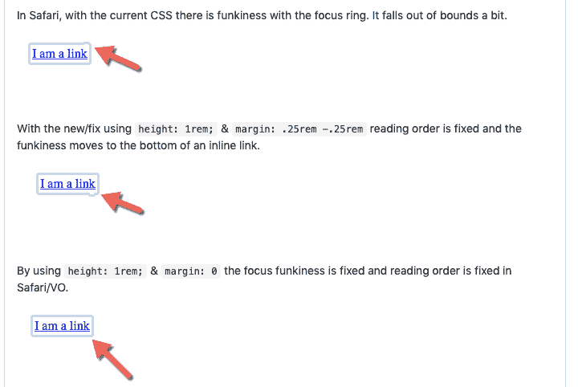

# 一种新的(简单的)隐藏内容的方式

> 原文：<https://dev.to/zellwk/a-new-and-easy-way-to-hide-content-accessibly-4njo>

当我想容易地隐藏内容时，我总是求助于乔纳森·史努克的片段。

```
.element-invisible {
  position: absolute !important;
  height: 1px; width: 1px;
  overflow: hidden;
  clip: rect(1px 1px 1px 1px); /* IE6, IE7 */
  clip: rect(1px, 1px, 1px, 1px);
} 
```

但是昨天，我碰巧看到了斯科特·奥哈拉关于隐藏内容的文章。Scott 说我们只想在三种不同的上下文中隐藏内容:

1.  完全隐藏起来
2.  视觉上隐藏它
3.  对屏幕阅读器隐藏它

当我们说以可访问的方式隐藏内容时，我们实际上指的是选项#2(在视觉上隐藏内容，但不对屏幕阅读器和键盘用户隐藏)。

## 后来我有了主意

如果我们只想在视觉上隐藏元素，为什么不用`opacity: 0`？不透明度是用来隐藏元素的。屏幕阅读器仍然可以访问使用`opacity: 0`隐藏的内容。

```
.hide-accessibly {
  opacity: 0;
} 
```

我把它提升了一个档次，增加了`position: absolute`。这会将元素从文档流中移除；并允许我们设计其他元素的样式，就好像隐藏的内容不存在一样。

```
.hide-accessibly {
  position: absolute !important;
  opacity: 0;
} 
```

我觉得这感觉足够好了，我问了乔纳森这件事。

以下是他的回应:

> Snook@ Snook ca[@ zellwk](https://twitter.com/zellwk)当它从流中抽出时，它可以遮挡可点击的项目。您可以添加“指针事件:无；“去吧。我不知道关闭指针事件后屏幕阅读器会有什么反应；我没测试过。
> 2019 年 4 月 23 日 22:01 点[](https://twitter.com/intent/tweet?in_reply_to=1120809900878307328)[](https://twitter.com/intent/retweet?tweet_id=1120809900878307328)0[](https://twitter.com/intent/like?tweet_id=1120809900878307328)1

他还想知道`pointer-events: none`是否会阻止键盘触发的点击事件(这对屏幕阅读器和键盘用户来说是绝对必要的)。

> 刘哲🤗[@ zellwk](https://dev.to/zellwk)[@ snook ca](https://twitter.com/snookca)如果我们说的是遮挡可点击的项目，a -999 z-index 不也很好吗？
> 
> 指针事件仍然会遮挡项目。00:13AM-2019 年 4 月 24 日[](https://twitter.com/intent/tweet?in_reply_to=1120843242252070912)[](https://twitter.com/intent/retweet?tweet_id=1120843242252070912)0[](https://twitter.com/intent/like?tweet_id=1120843242252070912)0

> Snook@ Snook ca[@ zellwk](https://twitter.com/zellwk)指针事件不应该因为任何点击/触摸事件的通过而变得模糊。虽然，实际上，不确定这是否会破坏键盘触发的时钟事件。🤔00:18AM-2019 年 4 月 24 日[](https://twitter.com/intent/tweet?in_reply_to=1120844382754754562)[](https://twitter.com/intent/retweet?tweet_id=1120844382754754562)0[](https://twitter.com/intent/like?tweet_id=1120844382754754562)0

我很好奇，所以我测试了`pointer-events: none`,发现它可以处理键盘生成的点击、屏幕阅读器生成的点击和 JavaScript 生成的点击。

这是我在测试中使用的代码笔:

[https://codepen.io/zellwk/embed/mgzPXa?height=600&default-tab=result&embed-version=2](https://codepen.io/zellwk/embed/mgzPXa?height=600&default-tab=result&embed-version=2)

我向乔纳森汇报了我的发现，他说我们可能会有一个赢家！

> 斯努克@斯努克卡[@泽尔沃克](https://twitter.com/zellwk)听起来我们可能会有一个赢家！01:32am-2019 年 4 月 24 日[](https://twitter.com/intent/tweet?in_reply_to=1120862948866633728)[](https://twitter.com/intent/retweet?tweet_id=1120862948866633728)0[](https://twitter.com/intent/like?tweet_id=1120862948866633728)1

## 片段

如果您想使用这种方法，下面是代码片段。

```
.hide-accessibly {
  position: absolute !important;
  opacity: 0;
  pointer-events: none;
} 
```

**免责声明:**这种方法仍然是令人难以置信的新。我只在最新版本的 Firefox、Safari 和 Chrome 上测试过。我还不能在 Edge 和其他浏览器上运行测试。

如果你是一个可访问性顾问，如果你能帮我把这个片段拿出来，我会非常感激。

至于其他:我还不建议在生产中使用这个代码片段。(直到我得到可访问性专家的确认)。

许多开发者在 Twitter 上表达了他们的观点、担忧和实验。我想和你们分享我巩固和学到的东西。

开始时，所有三个属性都进行了辩论。

先说一下`opacity`。

## 不透明的问题？

Patrick 和 Vadim 担心`opacity`，因为它似乎打破了浏览器/屏幕阅读器的某种组合。

> 瓦迪姆·马克耶夫@ pepelsbey _[@ zellwk](https://twitter.com/zellwk)[@ snook ca](https://twitter.com/snookca)屏幕阅读器不透明度 0 不是有问题吗？[@ Patrick _ h _ lauke](https://twitter.com/patrick_h_lauke)07:17am-2019 年 4 月 24 日[](https://twitter.com/intent/tweet?in_reply_to=1120949919391604737)[](https://twitter.com/intent/retweet?tweet_id=1120949919391604737)0[](https://twitter.com/intent/like?tweet_id=1120949919391604737)0

> 建议坚持使用久经考验(尽管看起来有点冗长)的 sr 专用款式2019 年 4 月 24 日上午 07:38[](https://twitter.com/intent/tweet?in_reply_to=1120955137491705856)[](https://twitter.com/intent/retweet?tweet_id=1120955137491705856)0[](https://twitter.com/intent/like?tweet_id=1120955137491705856)0

但是乔纳森发现一些研究表明`opacity`是可以的。Patrick 进一步做了一些测试，同意`opacity`没问题。

> Snook@ Snook ca[@ patrick _ h _ lauke](https://twitter.com/patrick_h_lauke)[@ pepelsbey _](https://twitter.com/pepelsbey_)[@ zellwk](https://twitter.com/zellwk)有趣的是从你这里发现一个线程，Patrick，从 2016 年你说的类似。你认为这是个问题，但是你没有测试套件。在进一步的研究中，我发现 webaim.org/blog/screen-re…表明不透明度应该没问题。2019 年 4 月 24 日上午 10:17[](https://twitter.com/intent/tweet?in_reply_to=1120995225063895040)[](https://twitter.com/intent/retweet?tweet_id=1120995225063895040)0[](https://twitter.com/intent/like?tweet_id=1120995225063895040)0

> 帕特里克·h·劳克@帕特里克 _ h _ 劳克[@ snook ca](https://twitter.com/snookca)[@ pepelsbey _](https://twitter.com/pepelsbey_)[@ zellwk](https://twitter.com/zellwk)令人尴尬，但我站着更正。看起来，关于不透明性不起作用这个被遗忘的事实，本质上是相反的情况(使用它的网站认为它对 AT 隐藏了它，但它没有这样做)。
> 
> 只是不透明度本身似乎被 AT 1/2019 年 4 月 24 日上午 10:37[](https://twitter.com/intent/tweet?in_reply_to=1121000192080273409)[](https://twitter.com/intent/retweet?tweet_id=1121000192080273409)0[](https://twitter.com/intent/like?tweet_id=1121000192080273409)0

斯科特·奥哈拉也在最初的问题上加入了`opacity`

> 斯科特奥哈拉[@ scotto hara](https://dev.to/scottohara)[@ Patrick _ h _ lauke](https://twitter.com/patrick_h_lauke)[@ snook ca](https://twitter.com/snookca)[@ pepelsbey _](https://twitter.com/pepelsbey_)[@ zellwk](https://twitter.com/zellwk)chrome vox 习惯完全忽略不透明度:0；基本上把它当成了展示:没有。
> 
> 那是几年前的浏览器扩展版本。需要一个实际的 chromebook 来测试这是否仍然是现代版本的一个问题。2019 年 4 月 24 日下午 13:39[](https://twitter.com/intent/tweet?in_reply_to=1121045899982012416)[](https://twitter.com/intent/retweet?tweet_id=1121045899982012416)0[](https://twitter.com/intent/like?tweet_id=1121045899982012416)1

此时的结论是:

1.  不透明度似乎是屏幕阅读器友好的！
2.  但它现在可能无法在 ChromeVox 上工作。需要更多的测试来验证这一点。

接下来，我们来谈谈`pointer-events`，因为它是第二麻烦的事情。

## 指针-事件

斯科特·奥哈拉指出，如果一个元素有`pointer-events: none`，iOS Voiceover 用户将无法触发点击。我检验了斯科特所说的话，发现它是真的。

> 斯科特奥哈拉[@ scotto hara](https://dev.to/scottohara)[@ zellwk](https://twitter.com/zellwk)绝对是一个上下文合适的隐藏静态文本内容的解决方案。但是应该注意的是，不建议在视觉上隐藏交互元素。例如，IOS VoiceOver 将无法激活指针事件无按钮。2019 年 4 月 24 日上午 04:37[](https://twitter.com/intent/tweet?in_reply_to=1120909503585767424)[](https://twitter.com/intent/retweet?tweet_id=1120909503585767424)0[](https://twitter.com/intent/like?tweet_id=1120909503585767424)7

这意味着我们不能在所有元素上通用地使用`pointer-events`。

我的下一个问题是:如果我们不能使用`pointer-events`，如果我们设置`z-index`为`-999`会怎么样？这将防止隐藏的元素遮挡可点击的元素。

```
.hide-accessibly {
  position: absolute !important;
  opacity: 0;
  z-index: -999;
} 
```

嗯，斯科特说我们也不应该在按钮上使用`z-index: -999`，因为视觉上隐藏的按钮在 iOS Voiceover 上无法正常工作。

> 斯科特奥哈拉[@ scotto hara](https://dev.to/scottohara)[@ zellwk](https://twitter.com/zellwk)它不应该用在按钮上，因为视觉上隐藏的按钮在 iOS VO 上也无法正常工作。它也有可能触发桌面 VoiceOver 的无序阅读，正如 [@letrastudio](https://twitter.com/letrastudio) 提到的，取决于它在2019 年 4 月 24 日上午 11:44[](https://twitter.com/intent/tweet?in_reply_to=1121016947251064832)[](https://twitter.com/intent/retweet?tweet_id=1121016947251064832)0[](https://twitter.com/intent/like?tweet_id=1121016947251064832)2中使用的交互元素的真实世界样式

我实话实说。我不明白为什么`z-index: -999`不能与 iOS Voiceover 一起正常工作，所以我在这里没有一个合适的结论。我没有测试它。

## MacOS Voiceover 不按源顺序阅读内容

Scott 和 joo be leza Freire(上面提到的@letrastudio)指出了一个值得注意的错误，即 macOS Voiceover 不按源代码顺序读取内容。

> 斯科特奥哈拉[@ scotto hara](https://dev.to/scottohara)[@ zellwk](https://twitter.com/zellwk)绝对是一个上下文合适的隐藏静态文本内容的解决方案。但是应该注意的是，不建议在视觉上隐藏交互元素。例如，IOS VoiceOver 将无法激活指针事件无按钮。2019 年 4 月 24 日上午 04:37[](https://twitter.com/intent/tweet?in_reply_to=1120909503585767424)[](https://twitter.com/intent/retweet?tweet_id=1120909503585767424)0[](https://twitter.com/intent/like?tweet_id=1120909503585767424)7

> Letra Studio@ letrastudio[@ scotto hara](https://twitter.com/scottohara)[@ zellwk](https://twitter.com/zellwk)即使是静态文本，VoiceOver 有时也可以乱序读取隐藏内容(它试图遵循视觉顺序而不是源顺序)。遗憾的是，这种解决方案并不能解决这个问题。下面是一个测试:[codepen.io/letrastudio/pe…](https://t.co/sRfZNcmE7r)08:37AM-2019 年 4 月 24 日[](https://twitter.com/intent/tweet?in_reply_to=1120970115628130304)[](https://twitter.com/intent/retweet?tweet_id=1120970115628130304)0[](https://twitter.com/intent/like?tweet_id=1120970115628130304)1

我自己对此进行了测试，但 Joao 报告的错误似乎不会在我的电脑上发生，尽管我们使用了相同的设备！

> Letra 工作室@ letrastudio[@ zellwk](https://twitter.com/zellwk)嗯，真是奇怪。我又做了一些测试，macOS 10.14.4:
> 
> -最新的 Safari 和 Chrome 行为相同:失败例 1，正确对 2
> - Firefox 读取 1 正确对 2 失败！
> - Safari Tech 预览正确读取两者
> 
> 这就是我所说的*挑剔*2019 年 4 月 09 日上午 09:19[](https://twitter.com/intent/tweet?in_reply_to=1120980475307274240)[](https://twitter.com/intent/retweet?tweet_id=1120980475307274240)0[](https://twitter.com/intent/like?tweet_id=1120980475307274240)0

Scott O'Hara 分享了更多关于该错误何时发生的信息:

> 斯科特奥哈拉[@ scotto hara](https://dev.to/scottohara)[@ letrastudio](https://twitter.com/letrastudio)[@ zellwk](https://twitter.com/zellwk)这肯定还是个 bug，就像 Letra 提到的。
> 
> 只有在可聚焦元素中放置位置绝对内容(视觉上隐藏)时才会发生。乔报告说，T21 花了太长时间试图解决这个问题。他的最后一个变通方法最终成为最好的。2019 年 4 月 24 日上午 10:58[](https://twitter.com/intent/tweet?in_reply_to=1121005390412562432)0[](https://twitter.com/intent/like?tweet_id=1121005390412562432)1

事实证明，自 2017 年以来，一群专家(包括斯科特)已经就这个 macOS Voiceover bug 进行了反复讨论。关于这个问题，通读整个[问题线程](https://github.com/h5bp/main.css/issues/12)是值得的。

据我所知，问题似乎发生在使用`position: absolute`的时候。当你使用`position: absolute`并且弄乱 CSS 位置时，它弄乱了 Voiceover 聚焦环的位置，从而改变了阅读顺序。

[](https://res.cloudinary.com/practicaldev/image/fetch/s--1mmWJdaz--/c_limit%2Cf_auto%2Cfl_progressive%2Cq_auto%2Cw_880/https://zellwk.cimg/2019/hide-content-accessibly/focus-ring.png)

这意味着任何解决方案都有可能被 macOS Voiceover 破坏。

😱

这整个问题只和画外音有关。我们还没有考虑到`position: absolute`会如何让其他屏幕阅读器感到奇怪。

> 斯科特奥哈拉[@斯科托哈拉](https://dev.to/scottohara)[@泽尔沃克](https://twitter.com/zellwk)[@帕特里克 _ h _ 劳克](https://twitter.com/patrick_h_lauke)[@斯努克卡](https://twitter.com/snookca)[@佩佩尔斯贝 _](https://twitter.com/pepelsbey_) 以上都是画外音相关。没有任何关于 position: absolute 在与 PC 屏幕阅读器交互的元素中使用时会导致尴尬的声明...所有这一切的寓意是，目前在这里找不到什么灵丹妙药。2019 年 4 月 24 日下午 14:09[](https://twitter.com/intent/tweet?in_reply_to=1121053472105934849)[](https://twitter.com/intent/retweet?tweet_id=1121053472105934849)0[](https://twitter.com/intent/like?tweet_id=1121053472105934849)0

## HTML 样板文件中的解决方案

一些人建议他们使用 HTML5 样板文件中的`sr-only`片段。他们觉得这是最好的方法，因为许多专家一起创造了这个。

```
.sr-only {
  border: 0;
  clip: rect(0, 0, 0, 0);
  height: 1px;
  margin: -1px;
  overflow: hidden;
  padding: 0;
  position: absolute;
  white-space: nowrap;
  width: 1px;
  /* 1 */
} 
```

然而，这是触发我上面提到的[问题线程](https://github.com/h5bp/main.css/issues/12)的同一个解决方案！斯科特·奥哈拉(Scott O'Hara)等专家自 2017 年以来一直在研究这个问题，迄今为止似乎没有解决方案。

迄今为止最好的解决方案是由 Joe Watkin 提出的

```
.visuallyhidden {
    border: 0;
    clip: rect(0 0 0 0);
    height: auto; /* new - was 1px */
    margin: 0; /* new - was -1px */
    overflow: hidden;
    padding: 0;
    position: absolute;
    width: 1px;
    white-space: nowrap; /* 1 */
} 
```

在撰写本文时，这个解决方案还没有正式集成到 HTML5 样板文件中。一定要记下来。

同样，如果你对这一领域不感兴趣，那就有必要浏览一下问题主题中的[对话。它是无价的。(作为题外话，我了解到`aria-label`是被谷歌和微软的翻译](https://github.com/h5bp/main.css/issues/12)忽略的[！😱).](https://github.com/h5bp/main.css/issues/12#issuecomment-392156112)

## 结束语

虽然 Joe Watkin 的解决方案似乎是目前为止最好的，但真正的答案是视情况而定。我们在 [Jonathan 的文章](https://snook.ca/archives/html_and_css/hiding-content-for-accessibility)以及互联网上的其他地方讨论的每一种方法都有其优缺点。

就像 Scott 提到的，这几乎就像是你可以在 grid vs flex vs 其他布局方法之间进行选择的情况。你必须根据具体情况(以及你对古怪行为的了解)选择最佳方法。

> 斯科特奥哈拉[@ scotto hara](https://dev.to/scottohara)[@ snook ca](https://twitter.com/snookca)[@ zellwk](https://twitter.com/zellwk)[@ Patrick _ h _ lauke](https://twitter.com/patrick_h_lauke)[@ pepelsbey _](https://twitter.com/pepelsbey_)我把它看做是 float vs inline-block vs column-count vs flexbox vs grid vs positioning 为了布局目的，
> 
> 或显示无、可见性隐藏、惰性、aria-hidden=true、role=presentation、用于完全隐藏内容的隐藏属性
> 
> 它们都是上下文适当的2019 年 4 月 14:19 日下午 14:14[](https://twitter.com/intent/tweet?in_reply_to=1121056096356007937)[](https://twitter.com/intent/retweet?tweet_id=1121056096356007937)0[](https://twitter.com/intent/like?tweet_id=1121056096356007937)1

我们可以做一件事来进一步澄清事情。这就是我们目前所知的每个解决方案的优缺点。

> Snook@ Snook ca[@ scotto hara](https://twitter.com/scottohara)[@ zellwk](https://twitter.com/zellwk)[@ Patrick _ h _ lauke](https://twitter.com/patrick_h_lauke)[@ pepelsbey _](https://twitter.com/pepelsbey_)对，我就是这个意思。我希望(或希望有人)详细介绍不同的方法，并描述它们适用于什么环境。2019 年 4 月 24 日下午 14:29[](https://twitter.com/intent/tweet?in_reply_to=1121058550539747329)[](https://twitter.com/intent/retweet?tweet_id=1121058550539747329)0[](https://twitter.com/intent/like?tweet_id=1121058550539747329)0

> 斯科特奥哈拉[@ scotto hara](https://dev.to/scottohara)[@ snook ca](https://twitter.com/snookca)[@ zellwk](https://twitter.com/zellwk)[@ Patrick _ h _ lauke](https://twitter.com/patrick_h_lauke)[@ pepelsbey _](https://twitter.com/pepelsbey_)这是我在关于这个问题的帖子中试图在高层次上做的，同时省略了很多我知道有问题的技术。尽管如此，似乎有必要更深入地讨论各种利弊。2019 年 4 月 24 日下午 15:04[](https://twitter.com/intent/tweet?in_reply_to=1121067322477817856)[](https://twitter.com/intent/retweet?tweet_id=1121067322477817856)0[](https://twitter.com/intent/like?tweet_id=1121067322477817856)2

不幸的是，这已经超出了我的能力范围。如果你愿意站出来参与谈话，我相信乔纳森、斯科特和许多其他人都很乐意聊天！

* * *

感谢阅读。这篇文章最初发表在我的博客上。如果你想要更多的文章来帮助你成为一个更好的前端开发者，请注册[我的时事通讯](https://zellwk.com)。