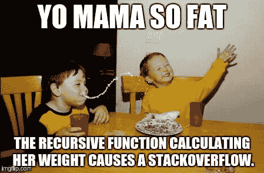

# 新手对 JavaScript 递归的理解…(清洗、漂洗和重复)

> 原文：<https://dev.to/enigmaiam/a-newbies-understanding-of-recursion-in-javascript-wash-rinse-and-repeat-2kb1>

所以我在过去的一个月里一直在学习用 Javascript 编码，Codecademy 的课程是开始这个过程的一个很好的方式，所以如果你想开始学习 JS，我相信 Codecademy 是你的地方。在 Codecademy 课程之后，我决定更进一步；我开始阅读 Marijn Haverbeke 的书《雄辩的 JavaScript 》,我必须说这是一本非常好的书。但是在阅读它的时候，我无意中发现了第一个让我有点头疼的概念*递归*，这就是这篇博客的内容，所以让我们开始吧。

[](https://i.giphy.com/media/3ov9jQX2Ow4bM5xxuM/200w_d.gif)

简单来说，递归就是函数调用自己，任何这样做的函数都被称为递归函数。您可能使用递归函数的主要原因是，当您想要一次又一次地重复一个过程，直到满足某个条件。现在你可能会问“为什么不使用简单的 for 循环或 while 循环？”事实是，使用 for 循环或 while 循环实际上比编写递归函数更好；我的意思是循环比递归函数快三倍，递归函数唯一的好处是它更容易被人理解。根据 Marijn Haverbeke 的说法，速度与优雅之间存在两难的选择。如果你的函数很容易理解，请继续使用常规的循环，但是一些用循环编写的复杂函数可能会变得相当烦人和难以理解，我建议你只使用递归函数，只要它在这个过程中不会溢出堆栈。说得够多了，让我们举些例子，好吗？。

[](https://res.cloudinary.com/practicaldev/image/fetch/s--YCMUjsDK--/c_limit%2Cf_auto%2Cfl_progressive%2Cq_auto%2Cw_880/https://thepracticaldev.s3.amazonaws.com/i/ynveb0qk2jz7r3d8zv4m.png)

我将使用互联网上最流行的例子之一。我们将通过一个函数来寻找一个给定数字的阶乘。

# 阶乘函数

我假设我们都知道一个数的阶乘是什么，对于我们这些不知道的人(我自己在发现之前)，一个数的阶乘就是这个数乘以它自己减去 1，直到你得到这个数 1。

例如:数字 5 的阶乘是 5*4*3*2*1，也等于 120。

我在这个话题上写的很多东西都受到了这篇博客文章的影响。

```
let factorial = (n)=>{

if(n<0){
    return;
  }else if(n === 0){
    return 1;
  }else{
    return n * factorial(n - 1);
  }
}

console.log(factorial(3));
// 6 
```

这是在 Javascript 中寻找给定数字的阶乘的典型递归函数的样子。让我们过一遍。当调用该函数时，需要检查一些条件，

```
/*
The first condition in the block of code within the function being this.
   ***Termination condition aka WASH***
*/

if(n < 0){
    return;
  } 
```

这个块检查传入函数的参数“n”是否小于 0，如果是，它将返回 nothing，原因是我们找不到负数的阶乘(我认为我们找不到)。这种情况称为终止条件，也称为“清洗”

```
/*The next condition in block of code
   ***Base condition aka RINSE***
*/

else if(n === 0){
    return 1;
  } 
```

终止条件之后的下一个条件检查整数“n”是否等于 0，如果是，这意味着我们已经达到了递归函数的目标，它返回 1(寻找阶乘时要停止的值)。这种情况被称为基础条件，又名“冲洗”。

条件语句的最后一部分是奇迹发生的地方。

```
// magic!!... where the function calls itself
else{
   //***The recursion aka REPEAT***
   return n * factorial(n - 1);
  } 
```

现在这里发生的是，如果前两个条件为假，这将默认运行。奇怪的是我们的函数调用了自己，但是参数 1 比初始值 n 小。这条线使得整个函数是递归的。这一行是递归条件，又名“重复”。

让我们看看这里发生了什么。

# 工作原理

我们调用函数并传入值 4。

```
factorial(4); 
```

函数中的两个 if 语句失败，因为 4 显然不小于 0 或等于 0。所以默认条件是运行。这将返回整数 4 乘以**阶乘(4–1)**。

```
return 4 * factorial(3); 
```

接下来发生的是函数在这一行中重复自己，新的参数为 3(这是 4–1 的结果)，阶乘函数再次检查 3 是否小于 0 或等于 0，该检查再次返回 false，但这次它返回 3 *阶乘(3-1)；

```
return 3 * factorial(2); 
```

同样的过程再次发生。factorial 函数检查 2 是否小于 0 或等于 0，由于这些条件再次返回 false，我们直接进入递归部分，它给出**return 2 * factorial(2–1)**

```
return 2 * factorial(1); 
```

这个过程不断重复，1 显然不小于 0 或等于 0，所以我们再次深入递归部分，它给出了**return 1 * factorial(1–1)**

```
return 1 * factorial(0); 
```

现在，再次检查阶乘函数中的条件，我们发现，对于第一个条件，0 不小于 0，但是对于第二个条件，0 肯定等于 0，这里发生的是函数返回 1

```
else if(n === 0){
    return 1;
  } 
```

现在你想想应该有一个 **return 0 *阶乘(0)** 对吧？嗯，有但是由于**阶乘(0)** 返回 **1 乘以 0 (1 x 0)** 等于 0 这个部分就从来没有运行过。还记得我说过函数会一直运行到满足某个条件吗？嗯，我们设置为基本条件(又名冲洗)的条件是函数预计停止运行并计算值的条件。

所以每当函数被传递一个大于 0 的参数时，这一行就会出现 return**n * factorial(n-1)**。而‘n’是函数返回值的倍数，为了把这些放在一起更有意义，我们反过来读**(从阶乘(0)开始)**

```
factorial(0) returns 1,
factorial(1) returns 1 * factorial(0) === 1*1,
factorial(2) returns 2 * factorial(1) === 2*1*1,
factorial(3) returns 3 * factorial(2) === 3*2*1*1,
factorial(4) returns 4 * factorial(3) === 4*3*2*1*1, 
```

在它的结尾，我们有这个函数返回。 **4*3*2*1*1 等于 24**

# 结束

我真的希望我的第一篇博文能帮助你理解这个概念，如果没有，我很抱歉我是一个蹩脚的博客，但好的一面是，我在 DevRant 上发现了这个很好的递归 yo mama 笑话(我不想冒犯任何人)。如果你走到了这一步，你应该开怀大笑

[](https://res.cloudinary.com/practicaldev/image/fetch/s--Y23jTRds--/c_limit%2Cf_auto%2Cfl_progressive%2Cq_auto%2Cw_880/https://thepracticaldev.s3.amazonaws.com/i/oqi4x0790zed8vwd9dr0.jpg)

非常感谢[托比](https://twitter.com/T0bey_)、[一路平安](https://twitter.com/Sage_Godspeed)和[奎托斯](https://twitter.com/OnuohaOfficial)帮助我更好地理解这一点并写下这篇博文