# 使用 Svrf SDK 的 3D 人脸滤镜快速入门指南

> 原文：<https://dev.to/svrf/a-quick-start-guide-for-3d-face-filters-using-the-svrf-sdk-31j1>

## iOS 入门

为了演示搜索和使用 Svrf 面部过滤器，我们将创建一个基本的 iOS 应用程序，它可以搜索面部过滤器并将其应用到您的面部。为了简单起见，我们将专门关注 iPhone X，它允许我们依赖 ARKit 来处理面部检测、面部网格生成和模型变形。我们将涵盖:

*   安装 SvrfSDK 并设置 Svrf API 密钥
*   用 ARSCNView、搜索栏和 UICollectionView 组成一个界面来保存搜索结果
*   创建一个实现`ARSCNViewDelegate`的`VirtualContentUpdater`类
*   设计一个扩展了`SCNNode`的`RemoteFaceFilter`类，可以加载一个`SvrfMedia`的 3D 模型
*   处理搜索栏输入，显示/隐藏键盘等。

### 建筑界面

首先，让我们创建一个名为 FaceFilterDemo 的单视图新 Xcode 项目。

[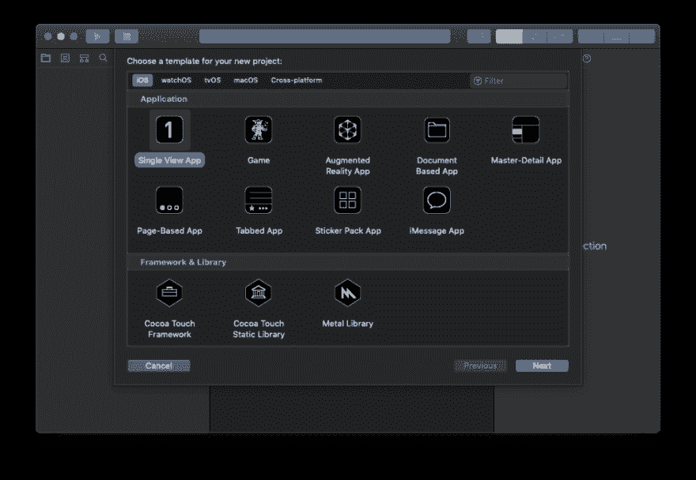](https://res.cloudinary.com/practicaldev/image/fetch/s--u6ABmxzh--/c_limit%2Cf_auto%2Cfl_progressive%2Cq_auto%2Cw_880/https://blog.svrf.com/wp-content/uploads/2019/01/Selecting-Single-View-Project-1024x707.png)

[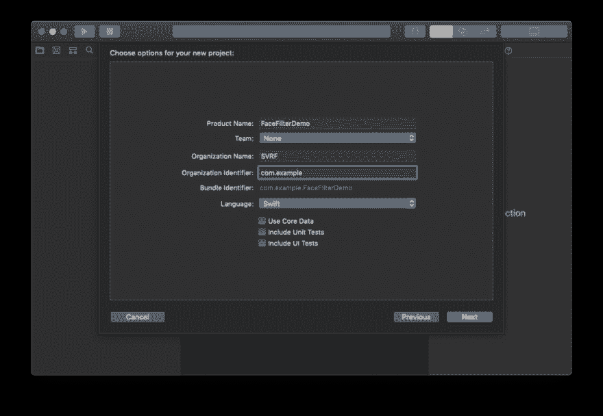](https://res.cloudinary.com/practicaldev/image/fetch/s--xurx-A3P--/c_limit%2Cf_auto%2Cfl_progressive%2Cq_auto%2Cw_880/https://blog.svrf.com/wp-content/uploads/2019/01/Naming-Project-1024x707.png)

现在让我们使用 Interface Builder 为我们的应用程序创建一个基本的布局。我们的应用程序需要一个 ARSCNView 来显示 ARKit 场景，一个文本框来输入搜索，一个集合视图来显示结果。让我们添加这些组件并连接它们:

[](https://res.cloudinary.com/practicaldev/image/fetch/s--Ei61cHgh--/c_limit%2Cf_auto%2Cfl_progressive%2Cq_auto%2Cw_880/https://blog.svrf.com/wp-content/uploads/2019/01/Wiring-Up-Interface-1024x589.png)

确保`ViewController`执行`UISearchBarDelegate`协议，并且`searchBar.delegate`在`viewDidLoad()`上设置为`self`。将搜索结果视图的背景设置为“无色”，将“滚动方向”设置为水平，打开“水平弹跳”。

[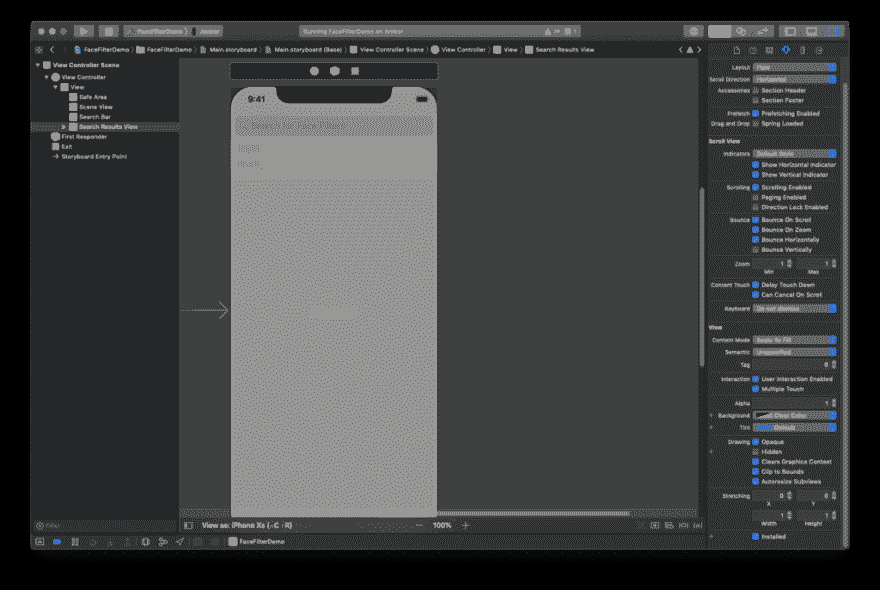](https://res.cloudinary.com/practicaldev/image/fetch/s--P-1S0cDz--/c_limit%2Cf_auto%2Cfl_progressive%2Cq_auto%2Cw_880/https://blog.svrf.com/wp-content/uploads/2019/01/Search-Result-Cell-1024x686.png)

然后，我们可以将搜索栏的“搜索样式”设置为“最小”，使其半透明，看起来像是浮动在 ARSCNView 的顶部。我们还应该给它一个更具描述性的占位符来显示搜索栏的用途。我们就设为“搜索人脸滤镜”吧。

[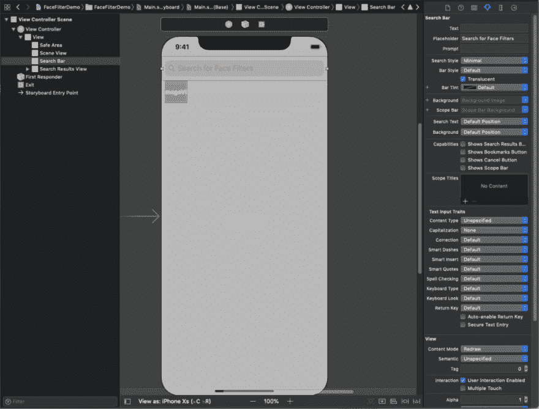](https://res.cloudinary.com/practicaldev/image/fetch/s--puN6xmNw--/c_limit%2Cf_auto%2Cfl_progressive%2Cq_auto%2Cw_880/https://blog.svrf.com/wp-content/uploads/2019/01/Search-Bar-1024x779.png)

### 安装 SvrfSDK Pod

为了查询 Svrf API，我们需要安装来自 [CocoaPods](https://cocoapods.org/) 的 [SvrfSDK](https://github.com/SVRF/svrf-ios-sdk) 。如果你没有安装 CocoaPods，你应该遵循他们网站上的安装指南，或者遵循 [SvrfSDK](https://github.com/SVRF/svrf-ios-sdk) 安装说明将 SDK 直接安装到你的应用中。在`FaceFilterDemo`文件夹的根目录下创建一个名为`Podfile` :
的文件

```
# Podfile
platform :ios, '12.0'

target 'FaceFilterDemo' do
  use_frameworks!

  # Pods for FaceFilterDemo
    pod 'SvrfSDK'
  end 
```

保存完 Podfile 后，关闭 Xcode，打开终端，导航到项目目录的根目录，然后运行`pod install`。这将安装`SvrfSDK` pod 及其依赖项。现在你应该打开项目根目录下的`FaceFilterDemo.xcworkspace`文件，而不是打开 Xcode 项目。如果你在 Xcode 中看到一个“Pods”项目和“FaceFilterDemo”项目，你就知道你做对了。

### 创建和添加 Svrf API 密钥

访问 API 需要一个 API 密钥。您可以通过登录 [Svrf 网站](https://www.svrf.com/)并导航到您的[用户设置](https://www.svrf.com/user/settings)来获得 API 密钥。在底部，您可以命名您的密钥并描述它的用途。

[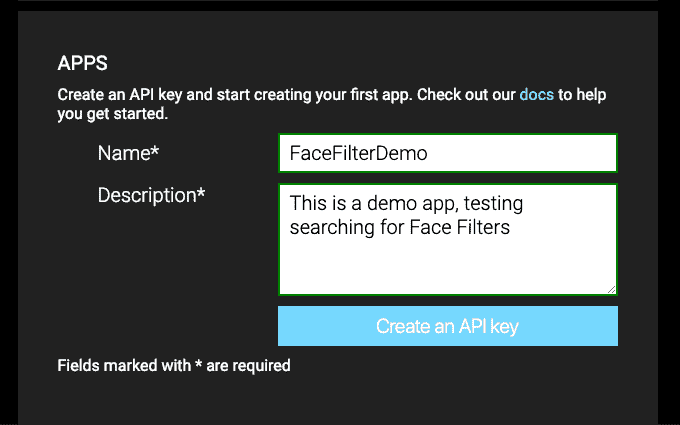](https://res.cloudinary.com/practicaldev/image/fetch/s--qyP2ur5f--/c_limit%2Cf_auto%2Cfl_progressive%2Cq_auto%2Cw_880/https://blog.svrf.com/wp-content/uploads/2019/01/Filling-in-Form-For-Key.png)

注册后，您应该会看到您的 API 密钥:

[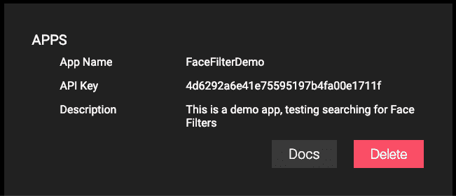](https://res.cloudinary.com/practicaldev/image/fetch/s--9Wevkgez--/c_limit%2Cf_auto%2Cfl_progressive%2Cq_auto%2Cw_880/https://blog.svrf.com/wp-content/uploads/2019/01/Getting-Your-Key.png)

将名为`SVRF_API_KEY`的属性添加到`Info.plist`文件中，其值是您的新 API 键:

[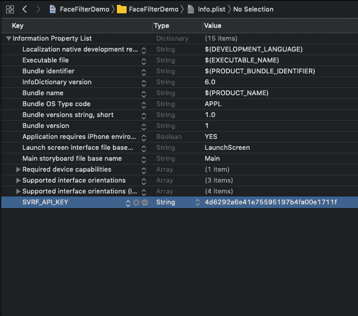](https://res.cloudinary.com/practicaldev/image/fetch/s--UVISWzHV--/c_limit%2Cf_auto%2Cfl_progressive%2Cq_auto%2Cw_880/https://blog.svrf.com/wp-content/uploads/2019/01/Add-Svrf-API-Key.png)

### 使用 Svrf API 进行认证

为了测试密钥是否正常工作，并通过 API 进行身份验证，我们导入了`SvrfSDK`框架并调用了`SvrfSDK.authenticate`方法。认证的一个好地方是我们的应用程序启动时:在我们的`AppDelegate`的`-application:didFinishLaunchingWithOptions:`方法中。

```
// AppDelegate.swift

import UIKit
import SvrfSDK

@UIApplicationMain
class AppDelegate: UIResponder, UIApplicationDelegate {
  var window: UIWindow?

  func application(_ application: UIApplication, didFinishLaunchingWithOptions launchOptions: [UIApplication.LaunchOptionsKey: Any]?) -> Bool {

    SvrfSDK.authenticate(onSuccess: {
      print("Successfully authenticated with the Svrf API!")
    }, onFailure: { err in
      print("Could not authenticate with the Svrf API: \(err)")
    })

    return true
  }
} 
```

启动模拟器后，我们应该在日志中看到成功文本。

### 搜索人脸滤镜

现在我们已经通过了服务认证，让我们搜索一些面部过滤器！首先，我们应该将搜索栏和搜索结果视图连接成我们的`ViewController`中的`@IBOutlet`。然后我们指定`ViewController`实现`UISearchBarDelegate`协议，设置`searchBar`的`delegate`为`self`，实现`searchBarSearchButtonClicked(_:)`。然后，我们可以通过调用 SvrfSDK 的`+search(query:options:onSuccess:onFailure)`方法来使用 SvrfSDK 搜索 3D 人脸过滤器:

```
// ViewController.swift

import UIKit
import ARKit
import SvrfSDK

class ViewController: UIViewController {
  @IBOutlet weak var sceneView: ARSCNView!
  @IBOutlet weak var searchBar: UISearchBar!
  @IBOutlet weak var searchResultsView: UICollectionView!

  override func viewDidLoad() {
    super.viewDidLoad()

    searchBar.delegate = self
    }
  }

extension ViewController: UISearchBarDelegate {
  func searchBarSearchButtonClicked(_ searchBar: UISearchBar) {
    guard   let query = searchBar.text else {
      return
    }

    print("Searching for \(query)")

    let searchOptions = SearchOptions(type: [._3d])
    SvrfSDK.search(query: query, options: searchOptions, onSuccess: { (allMedia) in
      print("got \(allMedia.count) results")
    }, onFailure: { (err) in
      print("Could not search for FaceFilters: \(err.title): \(err.description ?? "")")
    })
  }
} 
```

搜索“电影”面部过滤器应该会显示该查询返回了多少结果，以及这些过滤器的名称和规范 URL:

[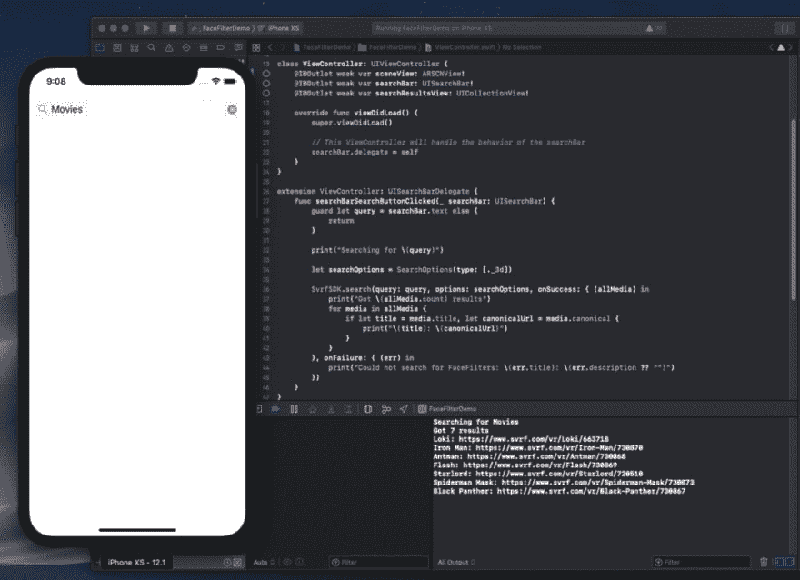](https://res.cloudinary.com/practicaldev/image/fetch/s--GNwrJDof--/c_limit%2Cf_auto%2Cfl_progressive%2Cq_auto%2Cw_880/https://blog.svrf.com/wp-content/uploads/2019/01/Movies-Search-Result-1024x742.png)T3】

```
Searching for Movies
Got 7 results
Lego Batman: https://www.svrf.com/vr/Lego-Batman/730872
Iron Man: https://www.svrf.com/vr/Iron-Man/730870
Loki: https://www.svrf.com/vr/Loki/663718
Flash: https://www.svrf.com/vr/Flash/730869
Starlord: https://www.svrf.com/vr/Starlord/720510
Spiderman Mask: https://www.svrf.com/vr/Spiderman-Mask/730873
Black Panther: https://www.svrf.com/vr/Black-Panther/730867 
```

要搜索的其他有趣的面部过滤器:

*   早餐
*   动物
*   表情包
*   漂亮的
*   连环漫画册

这是最基本的 API 用法，但是 [SvrfSDK](https://github.com/SVRF/svrf-ios-sdk) 提供了更多。你可以获取[趋势面部过滤器](https://github.com/SVRF/svrf-ios-sdk#trending-endpoint)，按特定类别过滤，还可以搜索数千张 360 照片和视频。你可以通过浏览 [Svrf 网站](https://www.svrf.com/)来感受我们策划的内容。请继续阅读，了解如何在 ARKit 会话中使用这些面部过滤器，您可以在搜索结果中尝试超级英雄面具！

## 显示搜索结果

### 搜索结果界面

现在我们知道我们可以搜索面部过滤器，让我们在集合视图中向用户展示它们，并让他们试穿。首先，我们将向用户展示面部过滤器的预览。由`SvrfSDK.search`方法返回的每个`SvrfMedia`在`media.files.images`下有一个渲染图像的集合，我们将使用它来显示面部过滤器的预览。您可以在 [Svrf API 文档](https://developers.svrf.com/docs#operation/getById)中看到`Media`的附加属性。`UICollectionView`需要扩展`UICollectionViewCell`的元素，所以我们将创建一个名为`SearchCollectionViewCell`的类。这将管理`SvrfMedia`的预览图像视图。我们的`SearchCollectionViewCell`类将包含一个名为`setupWith(media:)`的方法。该方法将采用一个`SvrfMedia`，在`media.files?.images?._720x720`从 URL 获取一个图像，并将获取的图像设置为单元格正在显示的图像。

```
 // SearchCollectionViewCell.swift

    import UIKit
    import SvrfSDK

    class SearchCollectionViewCell: UICollectionViewCell {
      @IBOutlet weak var imageView: UIImageView!

      func setupWith(media: SvrfMedia) {
        imageView.image = nil

        guard let previewImage = media.files?.images?._720x720,
          let imageUrl = URL(string: previewImage) else {

          print("Could not fetch 720x720 image")
          return
        }

        URLSession.shared.dataTask(with: imageUrl,
          completionHandler: { (data, _, error) in
            if error != nil {
              print("Could not fetch image: \(error!)")
              return
            }

            DispatchQueue.main.async {
              if let data = data, let remoteImage = UIImage(data: data) {
                self.imageView.image = remoteImage
              }
          }
        }).resume()
      }
    } 
```

在界面构建器视图中，将一个图像视图拖放到搜索结果单元格视图中，按住 ctrl 键并将该图像视图作为名为`imageView`的`@IBOutlet`拖动到`SearchCollectionViewCell`类中。另外指定`SearchResultCell`的职业是`SearchCollectionViewCell`。

[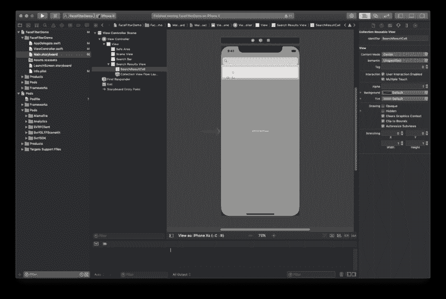](https://res.cloudinary.com/practicaldev/image/fetch/s--oX3XNhtz--/c_limit%2Cf_auto%2Cfl_progressive%2Cq_auto%2Cw_880/https://blog.svrf.com/wp-content/uploads/2019/01/Search-Result-Cell-Identifier-1024x687.png)

[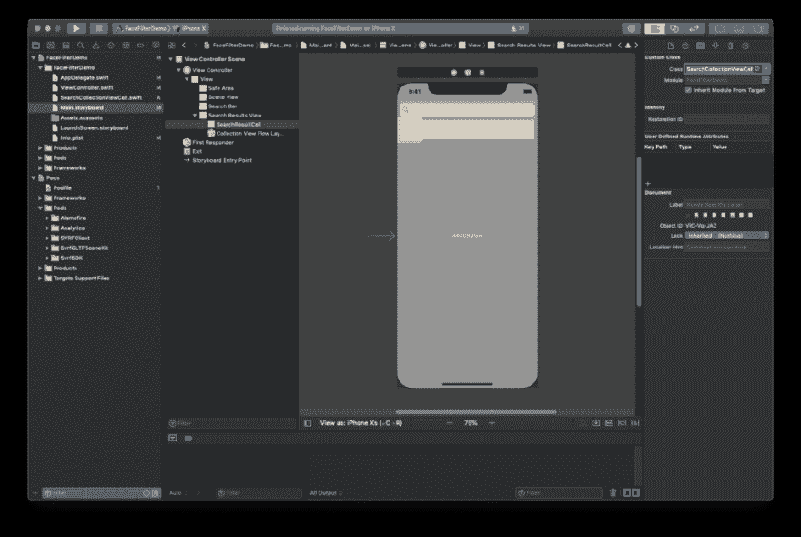](https://res.cloudinary.com/practicaldev/image/fetch/s--dS0tslCo--/c_limit%2Cf_auto%2Cfl_progressive%2Cq_auto%2Cw_880/https://blog.svrf.com/wp-content/uploads/2019/01/Setting-Search-Collection-View-on-Cell-1024x687.png)

### 显示所有搜索结果

为了显示我们搜索的所有结果，我们需要在我们的`ViewController`中实现`UICollectionViewDataSource`和`UICollectionViewDelegate`所需的所有方法。

```
 // ViewController.swift

    extension ViewController: UICollectionViewDataSource, UICollectionViewDelegate {
      func collectionView(_ collectionView: UICollectionView, numberOfItemsInSection section: Int) -> Int {
        return searchResults.count
      }

      func collectionView(_ collectionView: UICollectionView, cellForItemAt indexPath: IndexPath) -> UICollectionViewCell {

        guard let cell = searchResultsView.dequeueReusableCell(withReuseIdentifier: "SearchResultCell", for: indexPath) as? SearchCollectionViewCell else {
          return UICollectionViewCell()
        }

        cell.setupWith(media: searchResults[indexPath.row])

        return cell
      }

      func collectionView(_ collectionView: UICollectionView, didSelectItemAt indexPath: IndexPath) {
        let media = searchResults[indexPath.row]

        // Result selected
        // Do something with the resulting media when it's selected
      }
    } 
```

现在将`searchResultsView`的`delegate`和`dataSource`设置为`self`，这样`searchResultsView`就知道从哪里获取数据以及如何绘制代表数据的单元格。

```
 // ViewController.swift

    class ViewController: UIViewController {
      // ...

      override func viewDidLoad() {
        // ...

        // This ViewController will tell the UICollectionView how to render its
        // results, and will also be the data source for the collection view
        searchResultsView.delegate = self
        searchResultsView.dataSource = self
      } 
```

现在让我们启动应用程序，搜索“电影”。当你的搜索完成后，你应该会看到几个超级英雄面部过滤器。恭喜，您正在使用 Svrf API！

[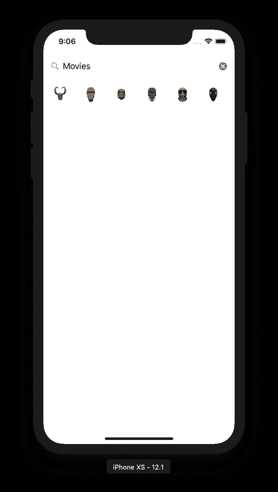](https://res.cloudinary.com/practicaldev/image/fetch/s--QJmL_xtE--/c_limit%2Cf_auto%2Cfl_progressive%2Cq_auto%2Cw_880/https://blog.svrf.com/wp-content/uploads/2019/01/Movies-Search-Result-Preview.png)

## 使用 ARKit 并试戴面部滤镜

在我们指南的最后一部分，我们将允许用户选择面部过滤器并试戴。这一步更复杂，因为它需要设置 ARKit 会话，创建类来管理面部过滤器的 3D 模型，与 ARSCNView 交互，并将 ARKit 检测到的混合形状应用到正在显示的模型。

### 允许访问前置摄像头

首先，我们需要给我们的`Info.plist`添加一个`NSCameraUsageDescription`键，它的值将描述我们的应用程序将使用相机做什么。

[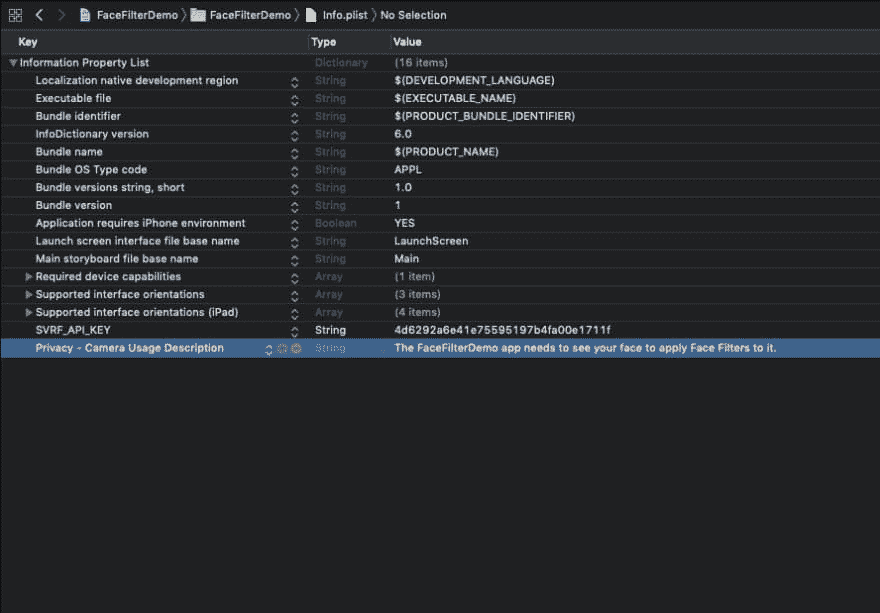](https://res.cloudinary.com/practicaldev/image/fetch/s--a4DvfSVu--/c_limit%2Cf_auto%2Cfl_progressive%2Cq_auto%2Cw_880/https://blog.svrf.com/wp-content/uploads/2019/01/Adding-Privacy-Notice.png)

### 首发`ARSession`

当`ViewController`视图出现时，我们需要启动`sceneView`的会话，告诉它我们想用 [`ARFaceTrackingConfiguration`](https://developer.apple.com/documentation/arkit/arfacetrackingconfiguration) 进行面部跟踪。当视图消失时，我们应该暂停会话以减少 CPU 的使用。

```
 // ViewController.swift

    class ViewController: UIViewController {
      // ...
      override func viewWillAppear(_ animated: Bool) {
        super.viewWillAppear(animated)

        // Run the ARSCNView session
        let configuration = ARFaceTrackingConfiguration()
        sceneView.session.run(configuration, options: ARSession.RunOptions())

        // Keep the screen on
        UIApplication.shared.isIdleTimerDisabled = true
      }

      override func viewWillDisappear(_ animated: Bool) {
        super.viewWillDisappear(animated)

        // Pause the ARSCNView session
        sceneView.session.pause()

        // Let the screen sleep
        UIApplication.shared.isIdleTimerDisabled = false
      } 
```

### 代表一个人脸滤镜作为一个`SCNNode`

为了在`ARSCNView`会话中使用我们的面部过滤器，我们需要能够将其表示为 [`SCNNode`](https://developer.apple.com/documentation/scenekit/scnnode) 。我们的人脸过滤器有多种 3D 模型格式，但我们总是有 glTF 模型。为了方便起见，`SvrfSDK`包含了一个名为`+getFaceFilter`的方法，该方法将获取、解析人脸过滤器的 glTF 模型，并将其转换为一个`SCNNode`层次结构。如果原始的 glTF 模型为其定义了权重，那么`SCNNodes`还附加了 blendshape 数据。

```
 // RemoteFaceFilter.swift
    import Foundation
    import SceneKit
    import ARKit
    import SvrfSDK

    class RemoteFaceFilter: SCNNode {
      // Root node which will have the Face Filter as its child
      private var faceFilter: SCNNode?

      // BlendShapeAnimation
      var blendShapes: [ARFaceAnchor.BlendShapeLocation: NSNumber] = [:] {
        didSet {

          // Each child node may have blend shape targets so we enumerate over all of them to make sure
          // that each blend target is expressed completely
          faceFilter?.enumerateHierarchy({ (node, _) in
            if node.morpher?.targets != nil {
              SvrfSDK.setBlendShapes(blendShapes: blendShapes, for: node)
            }
          })
        }
      }

      func loadFaceFilter(media: SvrfMedia) -> Void {

        // Generate a Face Filter SCNNode from a Media in a background thread
        DispatchQueue.global(qos: .background).async { [unowned self] in
          SvrfSDK.getFaceFilter(with: media, onSuccess: { faceFilter in
            // Remove any existing Face Filter from the SCNScene
            self.resetFaceFilter()
            // Set new Face Filter
            self.faceFilter = faceFilter
          }, onFailure: { error in
            print("\(error.title). \(error.description ?? "")")
          })

          // Add the Face Filter as a child node
          if let head = self.faceFilter {
            self.addChildNode(head)
          }
        }
      }

      // Deletes all childNodes from the self.faceFilter
      func resetFaceFilter() {
        if let head = self.faceFilter {
          for child in head.childNodes {
            child.removeFromParentNode()
          }
        }
      }
    } 
```

### 给`ARSCNView`一个委托

我们管理多个人脸过滤器的首选方法是创建一个`VirtualContentUpdater`类，它将管理一个虚拟人脸节点(代表你的脸)。`VirtualContentUpdater`还将实现`ARSCNViewDelegate`，并将对 [ARFaceAnchor](https://developer.apple.com/documentation/arkit/arfaceanchor) (定义你的面部的虚拟网格的类)的更改传递给虚拟面部节点。这样，我们可以将资源管理卸载到另一个类(`RemoteFaceFilter`)，该类将负责从`SvrfMedia`获取和加载 3D 模型数据。值得仔细阅读 ARFaceAnchor 的文档，因为它很好地概述了它能给你什么样的数据以及你应该如何使用它。下面的`VirtualContentUpdater`包含它自己的根节点(`faceNode`)和一个`RemoteFaceFilter`，当用户移动他们的脸时，它会更新它的混合形状。

```
 // VirtualContentUpdater.swift

    // An `ARSCNViewDelegate` which adds and updates the virtual face content in response to the ARFaceTracking session.
    import SceneKit
    import ARKit

    class VirtualContentUpdater: NSObject {

        // The virtual content that should be displayed and updated.
        var remoteFaceFilter: RemoteFaceFilter? {
            didSet {
                setupFaceNodeContent()
            }
        }

        // A reference to the node that was added by ARKit in `renderer(_:didAdd:for:)`.
        private var faceNode: SCNNode?

        // The queue reference
        private let serialQueue = DispatchQueue(label: "com.example.FaceFilterDemo.serialSceneKitQueue")

        //MARK: private functions
        private func setupFaceNodeContent() {
            guard let node = faceNode else {
                return
            }

            resetFaceNode()

            if let content = remoteFaceFilter {
                node.addChildNode(content)
            }
        }

        private func resetFaceNode() {
            guard let node = faceNode else {
                return
            }

            // Remove all childNodes from the faceNode
            for child in node.childNodes {
                child.removeFromParentNode()
            }
        }
    }

    // Extension that realises ARSCNViewDelegate protocol's functions
    extension VirtualContentUpdater: ARSCNViewDelegate {

        // ARNodeTracking
        func renderer(_ renderer: SCNSceneRenderer, didAdd node: SCNNode, for anchor: ARAnchor) {

            // Hold onto the `faceNode` so that the session does not need to be restarted when switching Face Filters.
            faceNode = node

            // Setup face node content in async thread
            serialQueue.async {
                self.setupFaceNodeContent()
            }
        }

        // ARFaceGeometryUpdate
        func renderer(_ renderer: SCNSceneRenderer, didUpdate node: SCNNode, for anchor: ARAnchor) {

            // FaceAnchor unwrapping
            guard let faceAnchor = anchor as? ARFaceAnchor else { return }

            // Update virtualFaceNode's blendshapes with FaceAnchor's blendshapes
            remoteFaceFilter?.blendShapes = faceAnchor.blendShapes
        }
    } 
```

### 点睛之笔

这个过程的最后一步是将所有的新行为连接到我们的`ViewController`中，这样用户就可以实际试穿他们正在寻找的超级英雄面具。我们将创建一个名为`contentUpdater`的新`VirtualContentUpdater`，一个新的`RemoteFaceFilter`，将`sceneView`的`delegate`分配给`contentUpdater`，并让`contentUpdater`跟踪`remoteFaceFilter`。

```
 class ViewController: UIViewController {
      @IBOutlet weak var sceneView: ARSCNView!
      @IBOutlet weak var searchBar: UISearchBar!
      @IBOutlet weak var searchResultsView: UICollectionView!

      var searchResults: [SvrfMedia] = []
      let contentUpdater = VirtualContentUpdater()
      let remoteFaceFilter = RemoteFaceFilter()

      override func viewDidLoad() {
        super.viewDidLoad()

        // ContentUpdater will tell the ARSCNView what to draw
        sceneView.delegate = contentUpdater

        // ContentUpdater's virtual face node will dictate what Face Filter to render
        contentUpdater.remoteFaceFilter = remoteFaceFilter

        // This ViewController will handle the behavior of the searchBar
        searchBar.delegate = self

        // This ViewController will tell the UICollectionView how to render its results, and will also be the
        // data source for the collection view
        searchResultsView.delegate = self
        searchResultsView.dataSource = self
      }
    }

So now we can tell the `remoteFaceFilter` to load a new Face Filter from a tapped search result:

    // ViewController.swift

    // ...
    extension ViewController: UICollectionViewDataSource, UICollectionViewDelegate {
      // ...
      func collectionView(_ collectionView: UICollectionView, didSelectItemAt indexPath: IndexPath) {
        let media = searchResults[indexPath.row]

        // Result selected, load a new Face Filter
        remoteFaceFilter.loadFaceFilter(media: media)
      }
    }

And finally lets clean up the methods called by the search bar when a user searches or taps "cancel" so that they close the keyboard:

    extension ViewController: UISearchBarDelegate {
        func searchBarCancelButtonClicked(_ searchBar: UISearchBar) {
            // Hide searchCollectionView
            searchResultsView.isHidden = true

            // Reset text in searchBar
            searchBar.text = ""

            // Hide cancel button in searchBar
            searchBar.showsCancelButton = false

            // Hide keyboard
            searchBar.resignFirstResponder()
        }

        func searchBarSearchButtonClicked(_ searchBar: UISearchBar) {
            // Hide keyboard
            searchBar.resignFirstResponder()

            // Show the searchResultsView
            searchResultsView.isHidden = false

            guard let query = searchBar.text else {
                return
            }

            print("Searching for \(query)")

            let searchOptions = SearchOptions(type: [._3d])

            SvrfSDK.search(query: query, options: searchOptions, onSuccess: { (allMedia) in
                print("Got \(allMedia.count) results")
                self.searchResults = allMedia
                self.searchResultsView.reloadData()
            }, onFailure: { (err) in
                print("Could not search for FaceFilters: \(err.title): \(err.description ?? "")")
            })
        }
    } 
```

现在让我们试试那些超级英雄面部滤镜吧！

[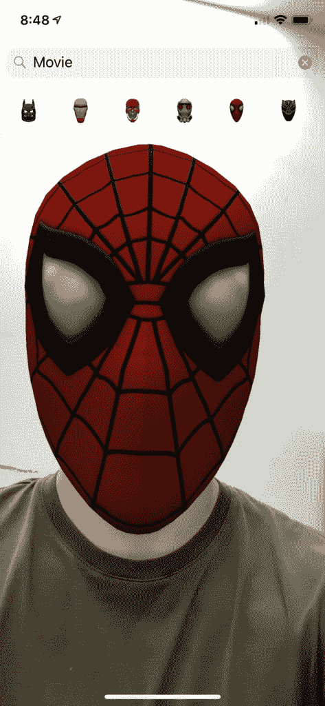](https://res.cloudinary.com/practicaldev/image/fetch/s--0g2CwP1G--/c_limit%2Cf_auto%2Cfl_progressive%2Cq_auto%2Cw_880/https://blog.svrf.com/wp-content/uploads/2019/01/IMG_2465-473x1024.png)

## 更进一步

我们已经触及了用 Svrf API 和 Svrf SDK for iOS 可以创建的东西的表面。前往 [Svrf 开发者网站](https://developers.svrf.com)探索各种语言的 API 客户端，并看看通过 Svrf API 还能发现什么内容。要查看带有错误处理、加载微调器和重置按钮的更完整的演示应用程序，请查看[https://github . com/SVRF/svrf-API/tree/master/examples/ARKitFaceFilterDemo](https://github.com/SVRF/svrf-api/tree/master/examples/ARKitFaceFilterDemo)。

*   在 https://developers.svrf.com 了解更多信息
*   [Svrf iOS SDK](https://github.com/SVRF/svrf-ios-sdk)
*   [其他 Svrf API 示例](https://github.com/SVRF/svrf-api/tree/master/examples)
*   [Svrf 网站](https://www.svrf.com/)
*   我们的 glTF 加载程序 SvrfGLTFSceneKit

*Artem Titoulenko 于 2019 年 1 月 17 日在[blog.svrf.com](https://blog.svrf.com/svrf-api-quick-start-guide-for-3d-face-filters/)发表。*