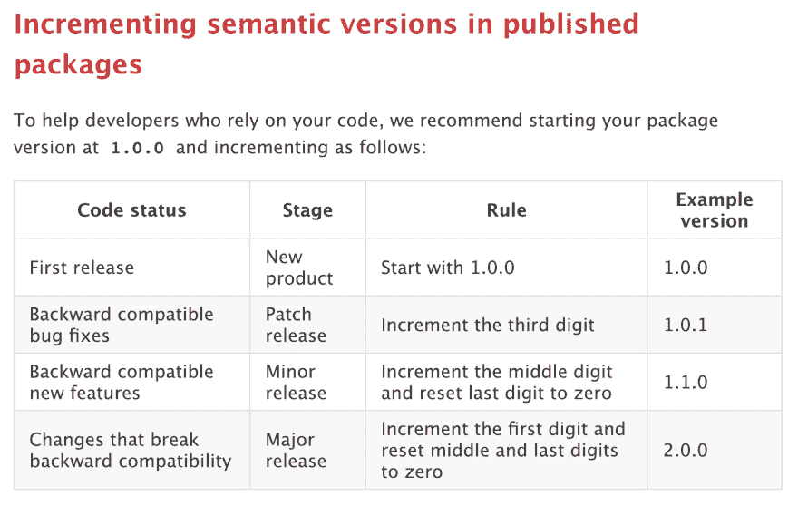
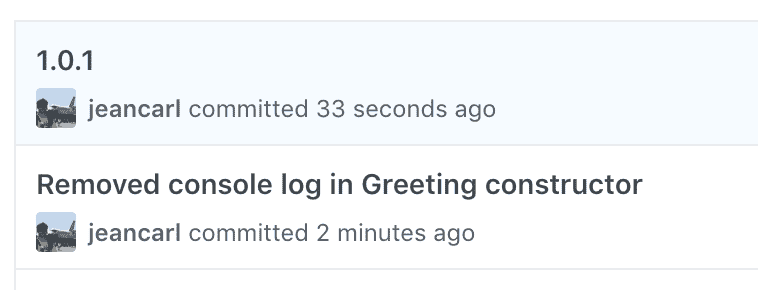
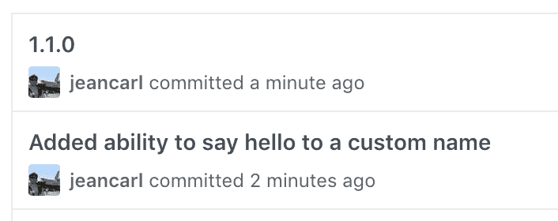

# 基于 npm 版本的语义版本化研究综述

> 原文：<https://dev.to/jeancarl/a-review-of-semantic-versioning-using-npm-version-2d2m>

在过去的一周里，我在看一个 Twitch 流，碰巧看到开发者在使用`npm version`命令。我以前没有遇到过这个命令，但是看了之后...从现在开始将会使用它。因为我已经在玩它了，我想我应该在这里重述一下，让其他人学习(通过一个理论上的故事)，当然也让我未来的自己参考。

在我们开始使用来自 [npm 文档](https://docs.npmjs.com/about-semantic-versioning)的命令之前，这里有一个关于语义版本化的初级读本。

[](https://res.cloudinary.com/practicaldev/image/fetch/s--IYb4jOsy--/c_limit%2Cf_auto%2Cfl_progressive%2Cq_auto%2Cw_880/https://thepracticaldev.s3.amazonaws.com/i/a0309rymjmiseewarjfx.png)

# 去背包设置

我在 GitHub 上创建了一个私有回购，并在本地克隆:

```
$ git clone https://github.com/jeancarl/greeting.git
Cloning into 'greeting'...
warning: You appear to have cloned an empty repository.
$ 
```

# 问候包

为了保持简单，我创建了这个模块来构造一个问候并将其输出到控制台:

```
// index.js

class Greeting {
    constructor() {
        console.log('Greeting constructor called');
    }

    hello() {
        return 'hello world';
    }
}

module.exports = Greeting; 
```

下面是我使用新模块的测试应用程序:

```
// test.js

const Greeting = require('.');

const greeting = new Greeting();
console.log(greeting.hello());             // outputs hello world 
```

# npm 初始化

我需要创建一个 package.json 文件。我调用了`npm init`实用程序来运行向导以收集必要的信息:

```
$ npm init
This utility will walk you through creating a package.json file.
It only covers the most common items, and tries to guess sensible defaults.

See `npm help json` for definitive documentation on these fields
and exactly what they do.

Use `npm install <pkg>` afterwards to install a package and
save it as a dependency in the package.json file.

Press ^C at any time to quit.
package name: (greeting)
version: (1.0.0)
description:
entry point: (index.js)
test command:
git repository: (https://github.com/jeancarl/greeting.git)
keywords:
license: (ISC)
About to write to /greeting/package.json:

{
  "name": "greeting",
  "version": "1.0.0",
  "description": "",
  "main": "index.js",
  "scripts": {
    "test": "echo \"Error: no test specified\" && exit 1"
  },
  "repository": {
    "type": "git",
    "url": "git+https://github.com/jeancarl/greeting.git"
  },
  "author": "JeanCarl Bisson <---> (http://jeancarlbisson.com)",
  "license": "ISC",
  "bugs": {
    "url": "https://github.com/jeancarl/greeting/issues"
  },
  "homepage": "https://github.com/jeancarl/greeting#readme"
}

Is this OK? (yes)
$ 
```

# 快速测试

我运行`node test.js`来检查一切是否正常:

```
$ node test.js
Greeting constructor called
hello world
$ 
```

我将这些文件提交给了 git repo:

```
$ git add index.js package.json test.js
$ git commit -m "init"
[master (root-commit) 9e14a36] init
 3 files changed, 38 insertions(+)
 create mode 100644 index.js
 create mode 100644 package.json
 create mode 100644 test.js
$ git push
Counting objects: 5, done.
Delta compression using up to 8 threads.
Compressing objects: 100% (5/5), done.
Writing objects: 100% (5/5), 762 bytes | 762.00 KiB/s, done.
Total 5 (delta 0), reused 0 (delta 0)
To https://github.com/jeancarl/greeting.git
 * [new branch]      master -> master
$ 
```

我本可以对这个非常酷的模块感到兴奋，但这只是一个例子，还需要更多关于如何使用它的文档。

# 一个 Bug！

在我匆忙发布这个模块的时候，我(理论上)留下了一个小 bug，当创建一个问候对象时，这个 bug 会写到控制台(可能是调试执行了什么代码时的一个常见工件)。是的，更好的测试可以在第一时间阻止这个愚蠢的错误...但是那样的话我就不会有这么容易修复的 bug 了！我删除了构造函数中的行:

```
// index.js

class Greeting {
    constructor() {

    }

    hello() {
        return 'hello world';
    }
}

module.exports = Greeting; 
```

再次测试，一切正常:

```
$ node test.js
hello world
$ 
```

我提交了此更改:

```
$ git add index.js
$ git commit -m "Removed console log in Greeting constructor"
[master 17ea869] Removed console log in Greeting constructor
 1 file changed, 1 insertion(+), 1 deletion(-)
$ 
```

我现在需要更新 npm 版本。我可以进入 package.json 文件并手动更新版本。相反，我使用了`npm version patch`命令:

```
$ npm version patch
v1.0.1
$ 
```

这个命令完成了两件事。它在 package.json 文件中插入补丁版本，并使用版本号作为提交消息进行第二次提交。我推了这两个改动:

```
$ git push
Counting objects: 6, done.
Delta compression using up to 8 threads.
Compressing objects: 100% (6/6), done.
Writing objects: 100% (6/6), 668 bytes | 668.00 KiB/s, done.
Total 6 (delta 2), reused 0 (delta 0)
remote: Resolving deltas: 100% (2/2), completed with 2 local objects.
To https://github.com/jeancarl/greeting.git
   9e14a36..4de7b41  master -> master
$ 
```

以下是两个提交:

[](https://res.cloudinary.com/practicaldev/image/fetch/s--EhMV0dUe--/c_limit%2Cf_auto%2Cfl_progressive%2Cq_auto%2Cw_880/https://thepracticaldev.s3.amazonaws.com/i/gp40gn5oy9hvhriiwofg.png)

# 一个次要的新功能！

随着我的模块越来越受欢迎，有人(理论上)建议我们应该向一个特定的名称问好，而不仅仅是这个世界。

我用一个可选参数修改了 hello 方法:

```
// index.js

class Greeting {
    constructor() {

    }

    hello(name = 'world') {
        return 'hello '+name;
    }
}

module.exports = Greeting; 
```

我添加了另一个例子，将我的名字传递给修改后的方法:

```
// test.js

const Greeting = require('.');

const greeting = new Greeting();
console.log(greeting.hello());             // outputs hello world
console.log(greeting.hello('JeanCarl'));   // outputs hello JeanCarl 
```

再次测试，一切正常:

```
$ node test.js
hello world
hello JeanCarl
$ 
```

我提交了这些更改:

```
$ git add index.js test.js
$ git commit -m "Added ability to say hello to a custom name"
[master 6505ba6] Added ability to say hello to a custom name
 2 files changed, 5 insertions(+), 4 deletions(-)
$ 
```

因为这是一个新特性，并且是向后兼容的，所以我取消了次要版本:

```
$ npm version minor
v1.1.0
$ 
```

我推了这两个改动:

```
$ git push
Counting objects: 7, done.
Delta compression using up to 8 threads.
Compressing objects: 100% (7/7), done.
Writing objects: 100% (7/7), 827 bytes | 827.00 KiB/s, done.
Total 7 (delta 2), reused 0 (delta 0)
remote: Resolving deltas: 100% (2/2), completed with 2 local objects.
To https://github.com/jeancarl/greeting.git
   4de7b41..59fe128  master -> master
$ 
```

以下是两个提交:

[](https://res.cloudinary.com/practicaldev/image/fetch/s--PS6K6yRG--/c_limit%2Cf_auto%2Cfl_progressive%2Cq_auto%2Cw_880/https://thepracticaldev.s3.amazonaws.com/i/shm1c70cgi4trgx1w4v5.png)

# 重大变化

随着时间的推移，这个模块可能会增长和变化。虽然希望避免破坏使用该模块的应用程序，但技术会发生变化，可能会有一些东西不能向后兼容。这是更新主要版本的好时机。

```
$ npm version major
v2.0.0
$ 
```

并推改:

```
$ git push
Counting objects: 3, done.
Delta compression using up to 8 threads.
Compressing objects: 100% (3/3), done.
Writing objects: 100% (3/3), 337 bytes | 337.00 KiB/s, done.
Total 3 (delta 1), reused 0 (delta 0)
remote: Resolving deltas: 100% (1/1), completed with 1 local object.
To https://github.com/jeancarl/greeting.git
   59fe128..a74eaf3  master -> master
$ 
```

对软件进行版本控制并不是最令人兴奋的事情，但是在工具箱中有这个命令会有所帮助。你还使用了哪些令人兴奋的命令？